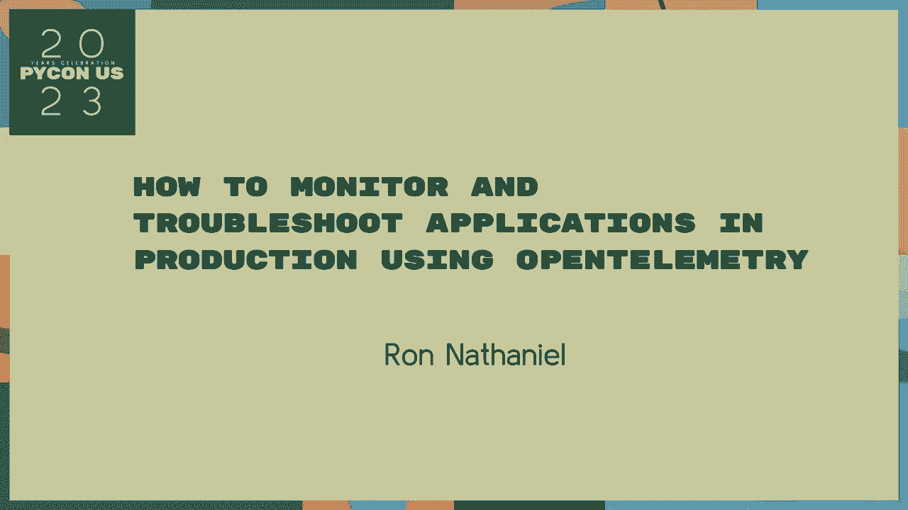
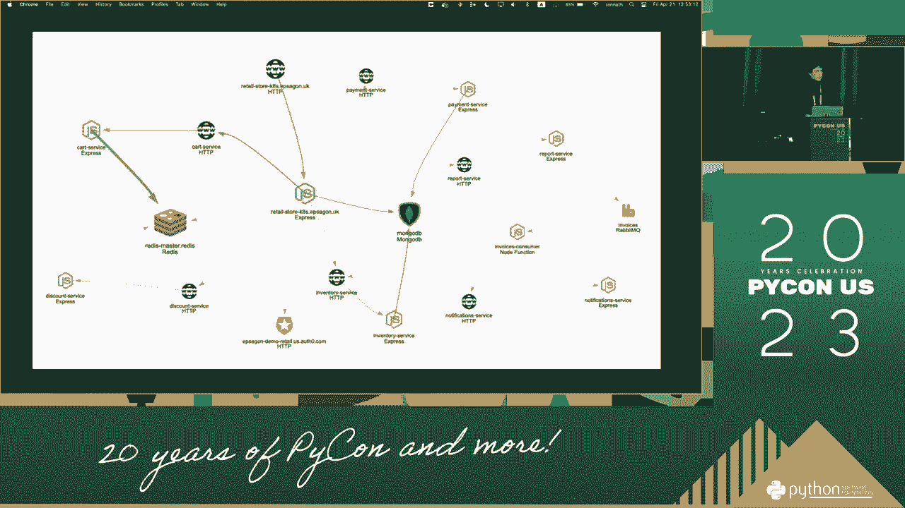

# OpenTelemetry 入门教程：P65：如何使用 OpenTelemetry 监控和故障排除应用程序 🔍



在本节课中，我们将学习如何使用 OpenTelemetry 来监控和排查应用程序中的问题。OpenTelemetry 是一个开源的可观测性框架，它可以帮助我们收集应用程序的追踪、指标和日志数据，从而更好地理解系统的运行状态和性能瓶颈。

## 1：什么是可观测性？ 📊


在深入 OpenTelemetry 之前，我们首先需要理解“可观测性”这个概念。可观测性是指通过系统外部输出的数据（如日志、指标、追踪）来理解其内部状态的能力。它与传统监控的区别在于，监控通常关注已知的问题和预设的指标，而可观测性更侧重于探索未知的问题和复杂的系统行为。

一个具备良好可观测性的系统，其内部状态可以通过三个核心支柱来推断：**日志**、**指标**和**追踪**。

## 2：OpenTelemetry 的核心概念 🧩


上一节我们介绍了可观测性的重要性，本节中我们来看看 OpenTelemetry 是如何实现它的。OpenTelemetry 提供了一套与供应商无关的 API、SDK 和工具，用于生成、收集和导出遥测数据。



以下是 OpenTelemetry 架构中的几个关键组件：

*   **API**：定义了一组接口，供应用程序代码调用以生成遥测数据（如创建 Span）。
*   **SDK**：实现了 API，负责处理数据（如采样、处理）并将其发送到导出器。
*   **导出器**：将处理后的数据发送到不同的后端系统，如 Jaeger、Prometheus 或云服务商的控制台。
*   **收集器**：一个独立的代理，可以接收、处理和导出遥测数据，通常部署在应用侧或作为一个中心化的服务。

其核心数据模型围绕 **Trace** 和 **Span** 构建。一个 **Trace** 代表一个完整的请求链路，而一个 **Span** 则代表该链路中的一个独立操作单元。它们的关系可以表示为：

```
一个 Trace = Span1 -> Span2 -> Span3 ...
```

## 3：如何集成 OpenTelemetry 🛠️

了解了核心概念后，我们来看看如何将 OpenTelemetry 集成到你的应用程序中。集成过程主要分为自动化和手动两种方式。

以下是集成 OpenTelemetry 的基本步骤：

1.  **选择并安装 SDK**：根据你的编程语言（如 Java, Go, Python, JS），安装对应的 OpenTelemetry SDK。
    ```bash
    # 以 Node.js 为例
    npm install @opentelemetry/api
    npm install @opentelemetry/sdk-node
    ```
2.  **配置自动检测（可选）**：对于许多常见框架和库（如 Express, gRPC, HTTP），OpenTelemetry 提供了自动检测工具，可以无侵入式地收集数据。
3.  **手动插桩**：在关键的业务逻辑处手动创建 Span，以记录自定义的操作和属性。
    ```javascript
    const span = tracer.startSpan('my_operation');
    span.setAttribute('user.id', userId);
    // ... 执行操作 ...
    span.end();
    ```
4.  **配置导出器**：设置将数据发送到哪里，例如控制台、Jaeger 或 OTLP 收集器。
5.  **部署收集器（可选）**：如果你需要更复杂的数据处理或路由，可以部署 OpenTelemetry Collector。


## 4：故障排除实战 🐛


现在，我们已经将 OpenTelemetry 集成到了应用中，本节中我们通过一个模拟场景来看看如何利用它进行故障排除。


假设一个用户请求失败，我们通过查看追踪数据来定位问题。在 Jaeger 或类似的可视化界面中，你可以看到完整的请求链路图。一个失败的请求，其链路中通常会有一个标记为错误的 Span。

以下是利用 OpenTelemetry 数据进行故障排查的典型流程：

1.  **发现异常**：通过监控仪表盘或告警，发现错误率上升或延迟增加。
2.  **查询追踪**：根据出错的时间、服务或用户 ID 筛选出相关的 Trace。
3.  **分析链路**：展开出错的 Trace，查看每个 Span 的详细信息，包括开始/结束时间、标签、日志事件以及可能关联的错误堆栈。
4.  **定位根因**：通过对比成功和失败的 Trace，或者分析耗时异常的 Span，定位到出问题的具体服务、数据库查询或外部 API 调用。
5.  **验证修复**：在修复问题后，继续观察相关指标和追踪，确认问题已解决。

## 总结 📝


本节课中我们一起学习了 OpenTelemetry 的基础知识与应用。我们从可观测性的概念出发，了解了 OpenTelemetry 作为统一标准的优势。接着，我们探讨了其核心架构与数据模型，特别是 **Trace** 和 **Span** 的概念。然后，我们一步步介绍了如何将 OpenTelemetry 集成到应用程序中，包括自动检测和手动插桩。最后，我们通过一个实战场景，演示了如何利用收集到的遥测数据快速定位和解决系统故障。掌握 OpenTelemetry 能显著提升你对复杂分布式系统的洞察力和排障效率。