# P68：演讲 - **Sanskar Jethi**、**Robyn** - 一个带有 Rust 运行时的异步 Python 网络框架 - **VikingDen7** - BV1114y1o7c5

[听不清]。

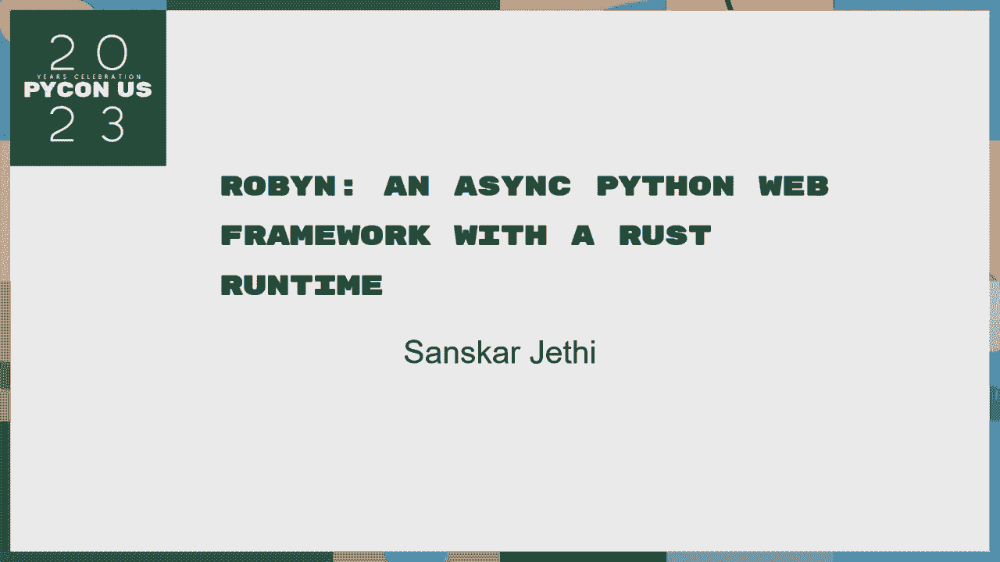

[听不清]， [听不清]。

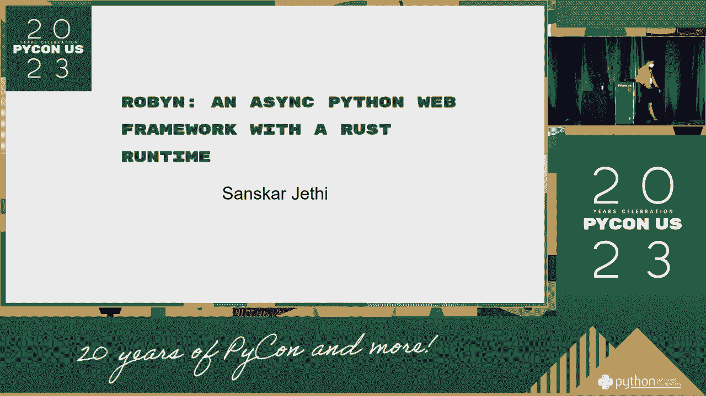

[听不清]， [听不清]， [听不清]， [听不清]， [听不清]。

[听不见]。

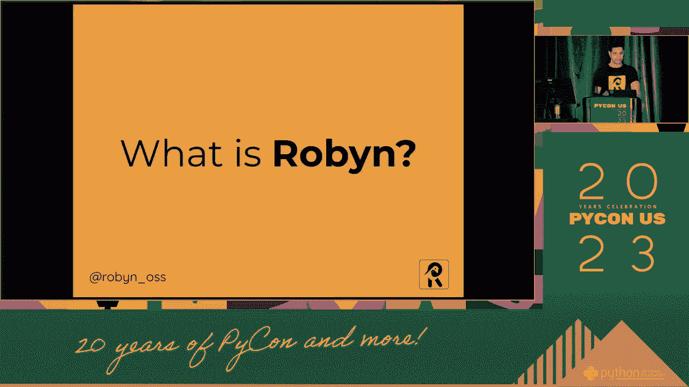

[听不清]， [听不清]， [听不清]， [听不清]， [听不清]， [听不清]。

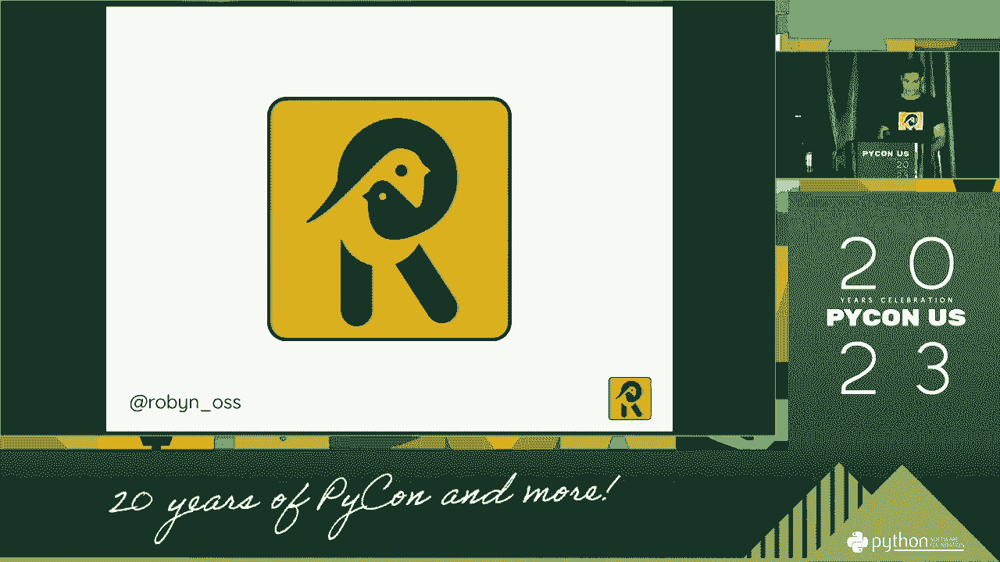

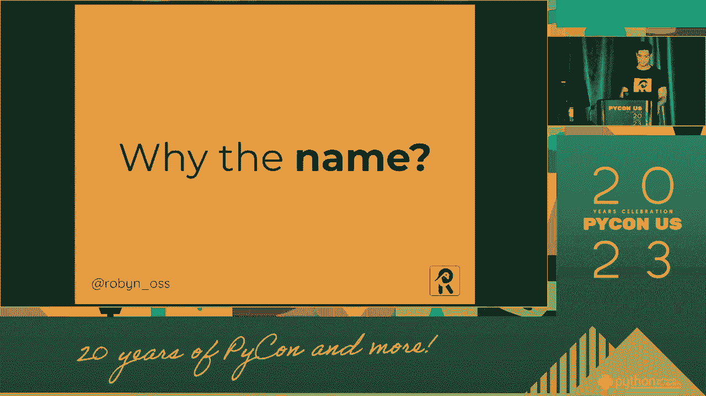

[听不清]， [听不清]， [听不清]， [听不清]。

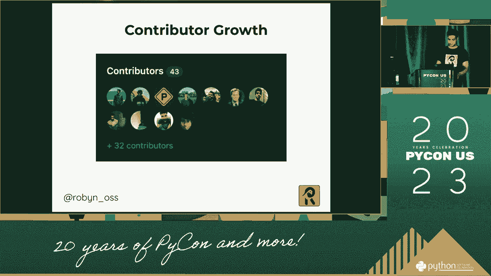

[听不清]。

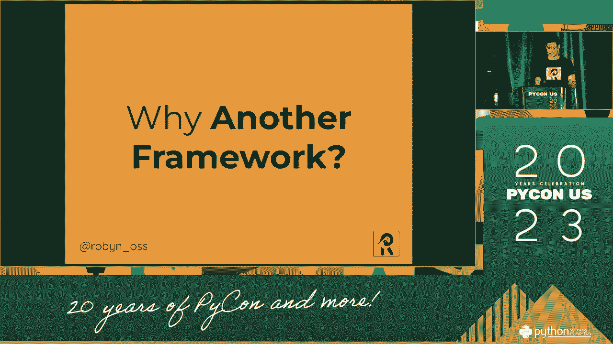

[听不清]， [听不清]， [听不清]， [听不清]， [听不清]， [听不清]， [听不清]。 [听不清]， [听不清]， [听不清]， [听不清]， [听不清]， [听不清]， [听不清]。 [听不清]， [听不清]， [听不清]， [听不清]， [听不清]， [听不清]， [听不清]。 [听不清]， [听不清]。

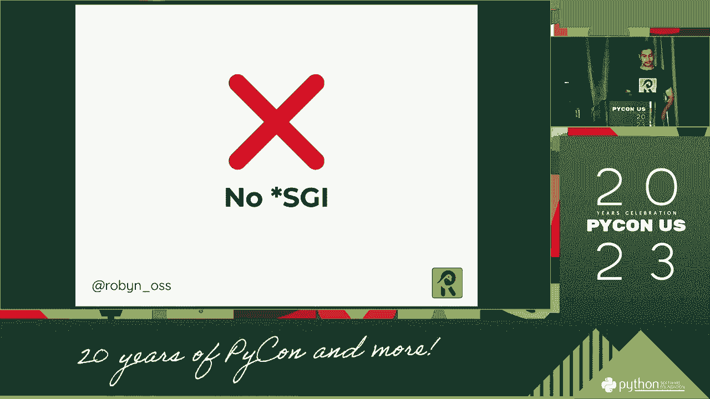

[听不清]。

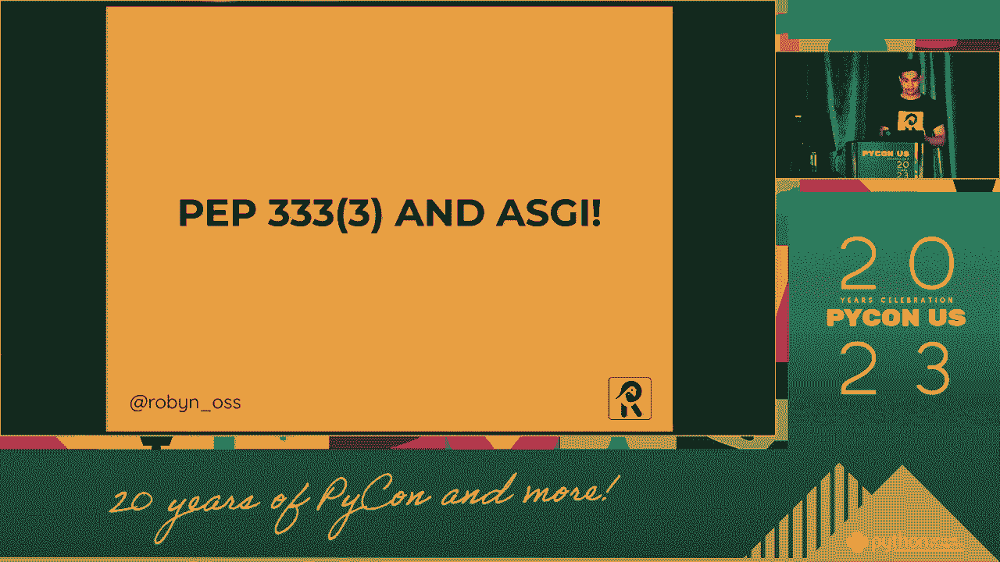

[听不清]， [听不清]， [听不清]， [听不清]， [听不清]， [听不清]， [听不清]。 [听不清]， [听不清]， [听不清]， [听不清]， [听不清]， [听不清]， [听不清]。 [听不清]， [听不清]， [听不清]， [听不清]， [听不清]， [听不清]， [听不清]。 [听不清]， [听不清]， [听不清]， [听不清]， [听不清]， [听不清]， [听不清]。

[听不清]， [听不清]， [听不清]。

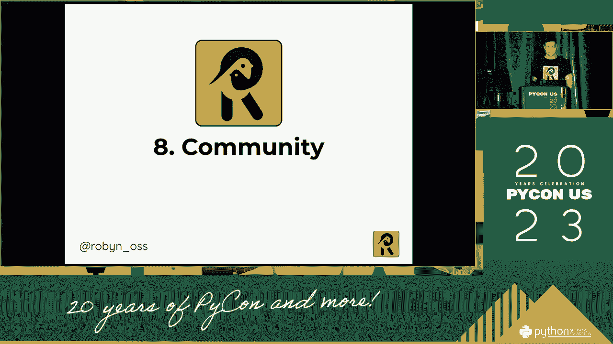

[听不清]。

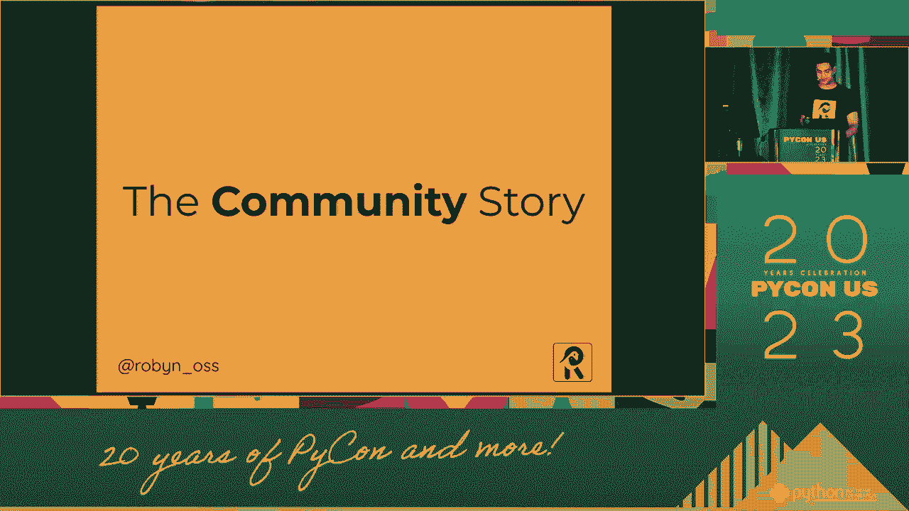

[听不清]， [听不清]， [听不清]， [听不清]， [听不清]， [听不清]， [听不清]。 [听不清]， [听不清]， [听不清]， [听不清]， [听不清]， [听不清]。

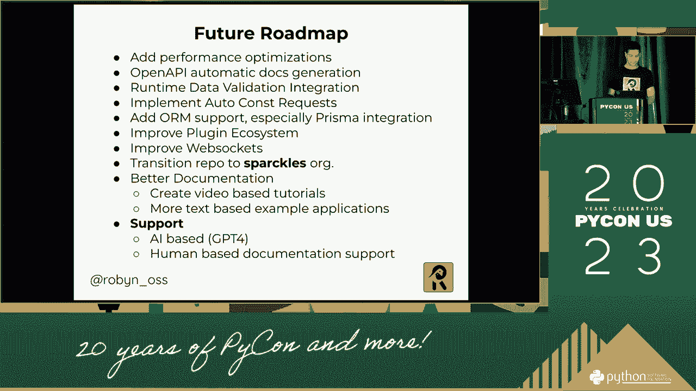

[听不清]。

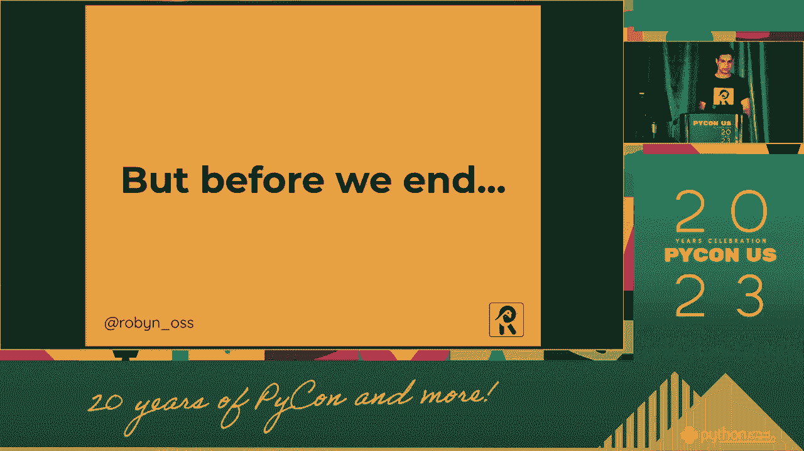

[听不清]， [听不清]， [听不清]， [听不清]， [听不清]， [听不清]， [听不清]。 [听不清]， [听不清]， [听不清]， [听不清]， [听不清]。

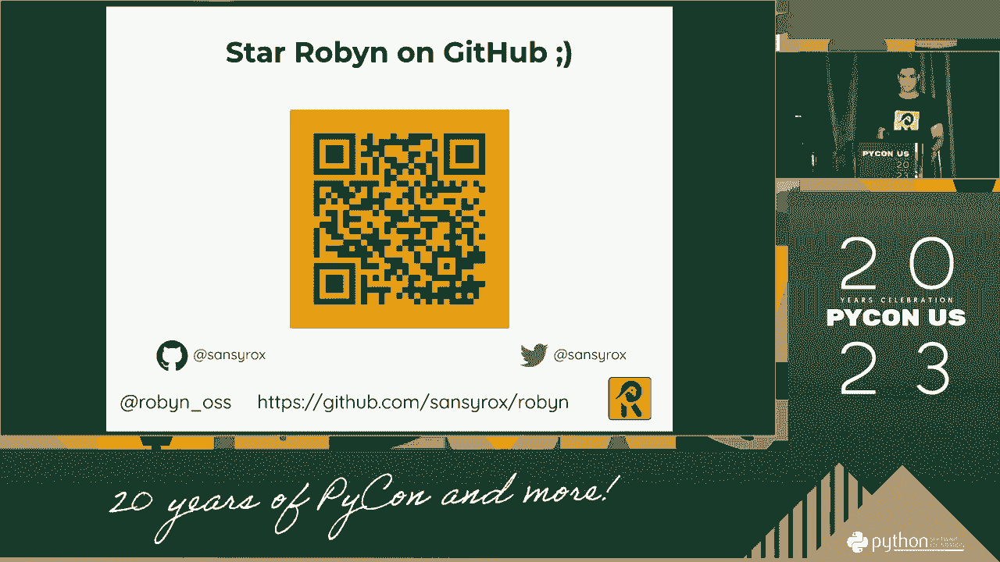

