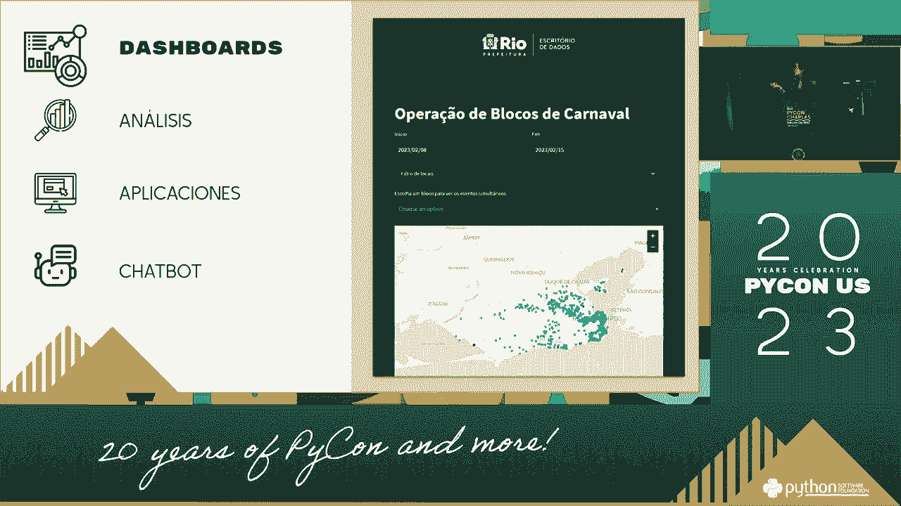

# 002：使用Python监控政府公开信息 📊

在本节课中，我们将学习如何使用Python获取和分析政府公开数据。这是一个实践性很强的主题，我们将从基础概念入手，逐步构建一个简单的数据监控脚本。

上一节我们介绍了Python编程的基础环境。本节中我们来看看如何利用Python访问网络上的公开数据源。

## 概述

政府机构、公共组织和新闻媒体通常会通过官方网站或数据门户发布大量信息，如政策文件、统计数据、招标公告等。这些信息是公开的，但手动跟踪效率低下。使用Python可以自动化数据收集过程，帮助我们高效地监控这些变化。

## 核心概念与工具


在开始编写代码前，需要理解几个核心概念和将要用到的Python库。

**网络请求**：这是从网站获取数据（通常是HTML代码）的第一步。Python的 `requests` 库可以完成这个任务。

```python
import requests
response = requests.get('https://example.gov/data')
```

**HTML解析**：获取到的网页内容是HTML格式，我们需要从中提取有用的文本或数据。`BeautifulSoup` 库能帮助我们解析HTML。

```python
from bs4 import BeautifulSoup
soup = BeautifulSoup(response.content, 'html.parser')
```

**数据存储**：提取到的数据需要保存下来以供分析。我们可以使用简单的文本文件，或者更结构化的 `CSV` 文件。

```python
import csv
with open('data.csv', 'w', newline='', encoding='utf-8') as file:
    writer = csv.writer(file)
    writer.writerow(['标题', '发布日期', '链接']) # 写入表头
```

## 实践步骤：构建一个简单的监控脚本

以下是构建一个基础监控脚本的主要步骤。

### 第一步：确定目标与检查合规性

首先，必须明确监控的数据源。务必只针对完全公开、允许访问的网站和数据接口进行操作。在编写任何爬虫前，应仔细阅读目标网站的 `robots.txt` 文件和服务条款，确保你的行为符合规定。

### 第二步：分析网页结构

使用浏览器的“开发者工具”（通常按F12键打开）查看目标网页的HTML结构。我们需要找到包含目标信息的HTML标签及其属性（如 `class`、`id`）。

例如，新闻标题可能包裹在 `<h2 class="news-title">` 这样的标签里。

### 第三步：编写数据抓取代码



根据分析好的结构，编写Python代码来抓取数据。

以下是抓取一个假设的新闻列表页面的示例代码框架：


```python
import requests
from bs4 import BeautifulSoup
import csv
import time

# 1. 发送网络请求
url = 'https://example.gov/news'
headers = {'User-Agent': 'Your-Bot-Name/1.0'} # 设置一个友好的用户代理
try:
    response = requests.get(url, headers=headers, timeout=10)
    response.raise_for_status() # 检查请求是否成功
except requests.RequestException as e:
    print(f"请求失败: {e}")
    exit()

# 2. 解析HTML内容
soup = BeautifulSoup(response.content, 'html.parser')
news_items = soup.find_all('div', class_='news-item') # 找到所有新闻条目容器

data_to_save = []
for item in news_items:
    # 3. 提取具体信息
    title_tag = item.find('h2', class_='news-title')
    link_tag = item.find('a')
    date_tag = item.find('span', class_='date')

    title = title_tag.get_text(strip=True) if title_tag else 'N/A'
    # 处理相对链接
    link = link_tag['href'] if link_tag and link_tag.has_attr('href') else 'N/A'
    if link and link.startswith('/'):
        link = 'https://example.gov' + link
    date = date_tag.get_text(strip=True) if date_tag else 'N/A'

    data_to_save.append([title, date, link])

# 4. 保存数据到CSV文件
filename = f'gov_news_{time.strftime("%Y%m%d")}.csv'
with open(filename, 'w', newline='', encoding='utf-8-sig') as csvfile:
    writer = csv.writer(csvfile)
    writer.writerow(['标题', '发布日期', '详情链接'])
    writer.writerows(data_to_save)

print(f"数据已保存到 {filename}")
```


### 第四步：实现定时与增量抓取

简单的监控需要定期运行。我们可以使用操作系统的定时任务（如Linux的cron或Windows的任务计划程序）来定时执行脚本。


为了实现只抓取新内容，可以在每次运行后记录已抓取条目的唯一标识（如ID或链接），下次运行时跳过已记录的内容。

```python
# 简易的去重逻辑示例
seen_links = set()
# ... 从文件加载之前已抓取的链接到 seen_links ...
new_data = []
for item in news_items:
    link = extract_link(item) # 提取链接的函数
    if link not in seen_links:
        new_data.append(extract_data(item))
        seen_links.add(link)
# ... 保存新数据并更新已见链接记录文件 ...
```

### 第五步：数据分析与提醒

获取数据后，可以进行简单的分析。例如，使用 `pandas` 库统计特定关键词出现的频率。

```python
import pandas as pd
df = pd.read_csv('gov_news_20231027.csv')
keyword = '环保'
# 筛选标题中包含关键词的新闻
filtered_df = df[df['标题'].str.contains(keyword, na=False)]
print(f"今日包含'{keyword}'的新闻有 {len(filtered_df)} 条。")
```

如果需要紧急提醒，可以集成邮件（`smtplib`库）或即时通讯工具（如钉钉、企业微信的Webhook）的API，在满足特定条件时发送通知。

## 注意事项与最佳实践


在实施过程中，请务必遵守以下原则：

*   **遵守法律法规与网站协议**：这是最重要的前提。不要尝试抓取非公开、需要登录或明确禁止爬虫访问的数据。
*   **设置友好间隔**：在请求间添加延时（如 `time.sleep(2)`），避免对目标服务器造成过大压力。
*   **处理异常**：网络请求可能失败，HTML结构可能变化。代码中应使用 `try...except` 进行异常处理，增强脚本的健壮性。
*   **尊重版权与隐私**：对抓取到的数据的使用，需注意版权和隐私问题，避免滥用。

## 总结


本节课中我们一起学习了使用Python监控政府公开信息的基本流程。我们从理解网络请求和HTML解析开始，逐步构建了一个能够自动抓取、解析和保存网页数据的脚本框架，并探讨了定时运行、增量抓取以及简单分析的方法。

记住，技术是工具，其使用必须建立在合法、合规和道德的基础之上。利用Python进行公开数据监控，目的是提升信息获取效率，促进数据的有效利用。