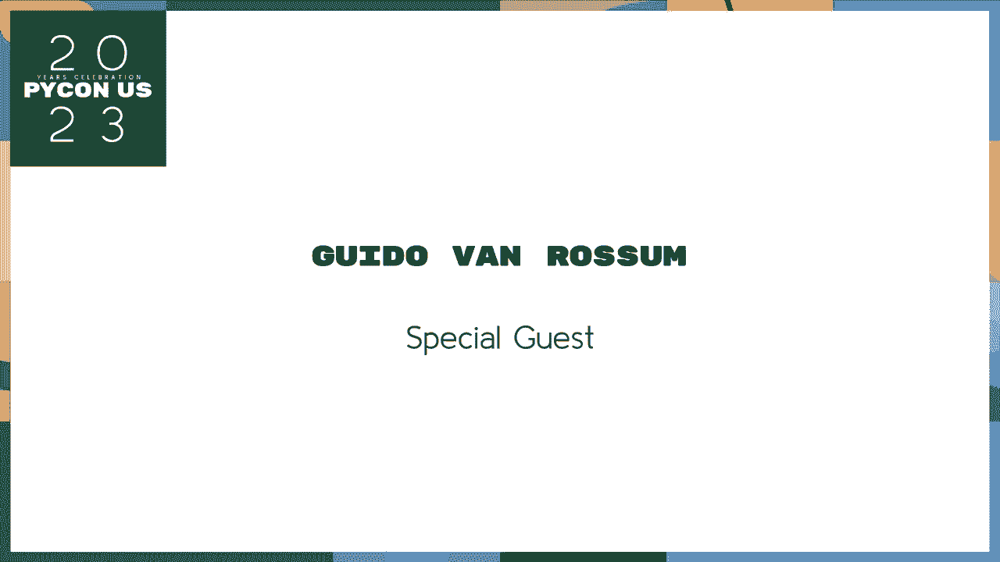
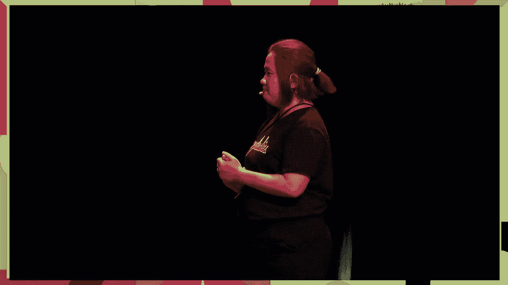
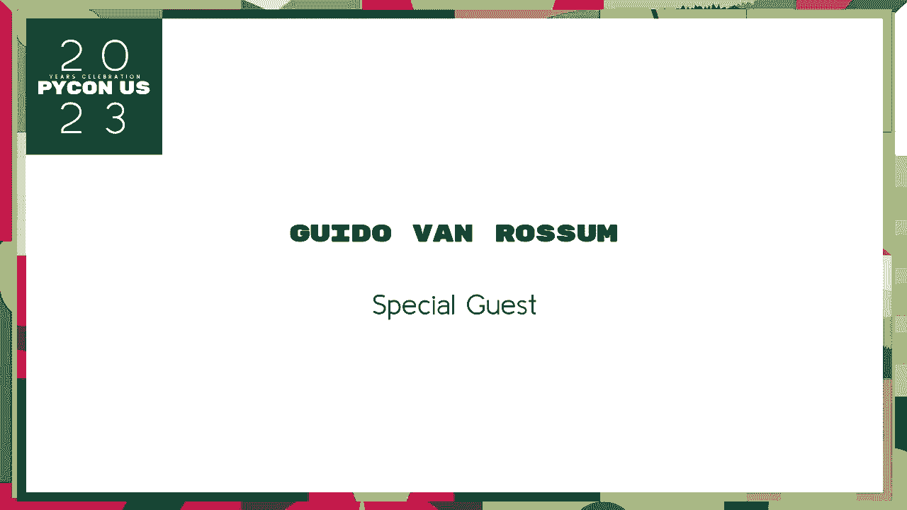
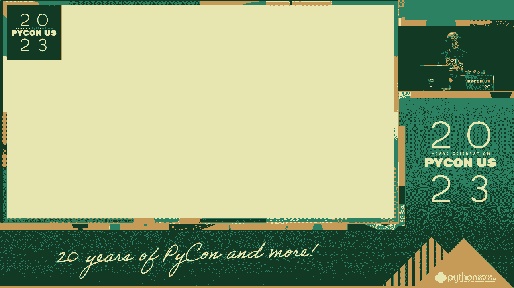
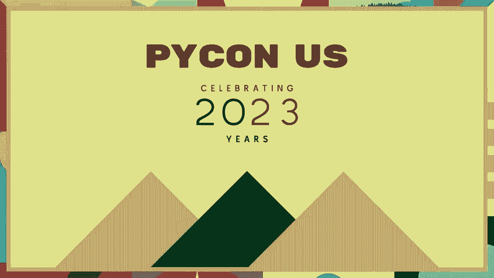

# 005：早期会议与组织的诞生 🐍

在本节课中，我们将跟随Python之父Guido van Rossum的回忆，了解Python社区在诞生初期的故事。我们将看到早期的Python会议是如何从一个小型研讨会起步，以及Python软件基金会（PSF）在成立前经历了哪些尝试与挑战。

---

## 从研讨会到国际会议

上一节我们提到了Python社区的萌芽，本节中我们来看看早期的聚会是如何演变成正式会议的。

1994年，由Mike Praz组织，我们举办了第一次Python研讨会。约有二三十人参加，这是一个非常小的事件，但取得了巨大成功。所有参与者都觉得这是一次宝贵的经历，因此我们希望能举办更多类似的活动。

基于第一次研讨会的成功，我们很快开始筹划后续活动。六个月后，由Jim Fulton在USGS（美国地质调查局）组织了第二次研讨会。我们发现，每六个月组织一次活动，对于那些没有旅行预算的参与者来说是个挑战，因为他们的经理可能从未听说过Python。

以下是早期会议发展的几个关键节点：
*   **1994年**：第一次Python研讨会，约20-30人参加。
*   **1995年**：第二次Python研讨会，由Jim Fulton组织。
*   **1997年**：活动升级为“第四届国际Python会议”，由劳伦斯利弗莫尔国家实验室的Paul Dubois组织。他引入了会前教程和专用酒店等创新形式。

这次会议给我留下了非常私人的记忆，其中一个记忆的标题是“你能不能给兔子喷一下”。要了解具体含义，你得在走廊里找到我来解释。

---

## 组织会议的挑战与尝试

随着会议规模扩大，组织工作变得愈发艰巨。即使是Paul Dubois这样优秀的志愿者也难以独自承担所有工作。

1997年，会议组织工作转移到了一家小型盈利公司Fortex Seminars手中。他们是CNRI（我的雇主，一个非营利研究实验室）的子公司，拥有组织IETF等大型会议的经验。虽然会议设施质量提升了，但据我所知，Fortex在这方面从未真正盈利。

关于早期会议，我还有一个有趣的记忆。有一次在华盛顿特区的Key Bridge Marriott酒店开会，遇上了大雪。我的车被困住了，一位好心的邻居载了我一程。结果我被大雪困在酒店三天，没带够换洗衣物。幸运的是，酒店礼品店有售，而且Python会议从不缺少T恤。

---

## Python软件协会与财团的构想

在会议蓬勃发展的同时，也有人尝试创建更正式的组织。

早在1995年，华盛顿特区的一群人（与早期研讨会组织者有大量重叠）就想创建一个官方的Python非营利组织，并命名为“Python软件协会”。这个名字很好，但他们的进展仅限于创建一个邮件列表来讨论协会章程，讨论始终没有结果。

幸运的是，我的雇主CNRI提供了一条出路。他们愿意托管Python相关的活动，但这并非一个独立的“协会”，最终它只是一个需要缴纳50美元会员费的邮件列表。令人惊讶的是，当时有很多人愿意付费加入，因为找到Python同好并不容易。高峰期我们约有300名成员。

在研究这次演讲时，我发现会员福利包括获得第四届国际Python会议的注册折扣。这或许是我们拥有众多成员的原因。

我们还进行了一次更雄心勃勃的尝试：创建一个Python联盟。CNRI曾成功发起万维网联盟和X窗口系统联盟，我们设想大公司会愿意付费赞助，以在语言设计方面获得发言权。然而在1997年左右，Python还不够重要，我们未能找到足够的赞助商来启动这个联盟。尽管惠普公司曾表示出兴趣，因为他们正在推出一款基于Python的大型产品，但这仍不足以启动联盟。

---

## Python软件基金会的诞生

时间来到2000年左右，我离开了CNRI去创业。这次离开的方式让CNRI继续托管Python相关事务（如Python软件活动）变得有些尴尬。

此时，我们需要一个新的组织方案。幸运的是，核心开发者Greg Stein（他也是Apache软件基金会的董事会成员）提出了一个绝妙的方案：直接采用Apache软件基金会成熟的章程，然后把“Apache”划掉，用蜡笔写上“Python”。这帮助我们避免了再次陷入规章制度的泥潭。

我们在2000年有过一次错误的启动，但最终在2001年正式成立了Python软件基金会（PSF）。到2003年，PSF已经感觉像是一个真实的组织了：我们拥有了银行账户、邮政信箱，甚至一位兼职管理员。

关于2000年那次错误的启动：我们一群创始成员热情高涨，但作为一群程序员，我们缺乏处理法律文件、开设银行账户等实际事务的技能。一位自愿承担这些工作的成功商人，因事务繁忙未能优先处理。最终，是我的新雇主Elemental Security提供了公司律师的帮助，才在2001年将一切落实。

---

## PyCon的诞生与早期挑战

根据我的笔记，最后一次IPC（国际Python会议）是在2002年。Fortex停止了组织工作，而2003年，O‘Reilly公司在其OSCON开源会议上为Python提供了一个专题轨道。但这感觉像是Perl会议的安慰奖，我们并不完全满意。

转机出现在2002年，我接到一个电话。一位Perl社区的组织者有一个预定好的场地，但因故无法使用。他问我Python社区是否有兴趣在同一周使用那个场地举办自己的社区会议。我立刻答应了。

我们为会议想出了“PyCon”这个名字。这个名字并非完全随机，很多人可能都会为Python会议想到它。剩下的，就成了历史。

因为场地是通过我联系的，而我当时是PSF的主席，我最终成为了主要的组织者。这对我这个程序员来说是全新的挑战。例如，我在餐饮上犯了错，连续三天点了完全一样的三明治——我猜那是菜单上最便宜的选择。有人抱怨了，但这让我学会了授权：第二年，我就让他人负责餐饮谈判。

我们在乔治华盛顿大学成功举办了三次PyCon，之后因为规模增长而更换了场地。

组织第一届PyCon时，注册情况让我们压力很大。我们在`python.org`和邮件列表上宣传，并设置了早鸟注册截止日期。截止日期前几天，我们只有几十个注册者，而我们已经为大量三明治付了钱。幸运的是，拖延是人之常情。在截止日期最后时刻和会议开始前几天，注册人数激增，会议最终取得了巨大成功。

---

## 应对危机与个人感悟

快进到2008年，全球金融危机冲击了所有人，包括PyCon。人们担心工作，软件会议纷纷取消。我们面临艰难抉择：是冒着亏损的风险继续举办，还是取消并损失给酒店的大笔押金？最终，我们决定继续。那一年我们确实亏损了，但幸好PSF一直有谨慎的储备金，帮助我们度过了难关。

我个人也有关于PyCon的压力记忆。有一年，我严重拖延了主题演讲的准备，直到会议开始时仍没有幻灯片。我向一位会议组织者坦白，他找到了Steve Holden帮忙。Steve提出了一个简单的解决方案：进行一场“炉边谈话”。我们在舞台上放了两把舒适的椅子，由Steve采访我。我不需要准备，而Steve可能只需要准备第一个问题。这个形式效果非常好，后来我们还重复使用过。

我至今仍然拖延，这就是为什么我今天最后一个发言。组织会议是我所知压力最大的工作之一。我知道有些组织者因此精疲力尽。虽然现在PyCon员工和PSF员工提供了大量支持，但在早期我们都得自己摸索。我非常敬佩像前主席Emily这样的组织者，她曾在疫情期间做出取消PyCon的艰难决定，也感谢现任主席Mario和她的团队。

---

本节课中我们一起学习了Python社区早期的成长历程。我们看到了Python会议如何从一个二十多人的小型研讨会，发展成为今天的PyCon。我们也了解了Python软件基金会（PSF）在成立前经历的多次尝试，以及最终如何借鉴Apache的模式成功建立。这段历史告诉我们，成功并非一蹴而就，坚持不懈的尝试和社区成员的共同努力至关重要。