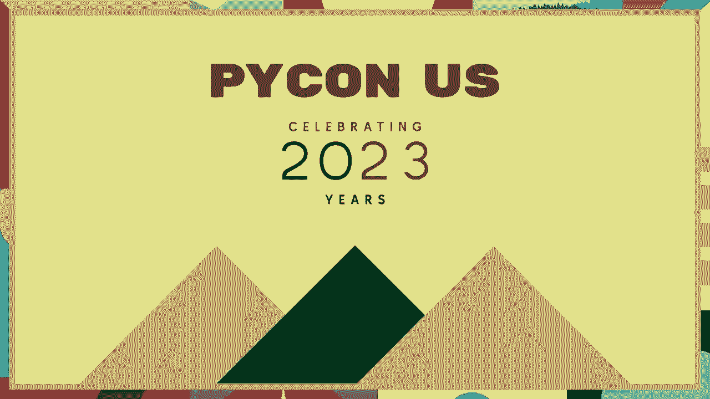
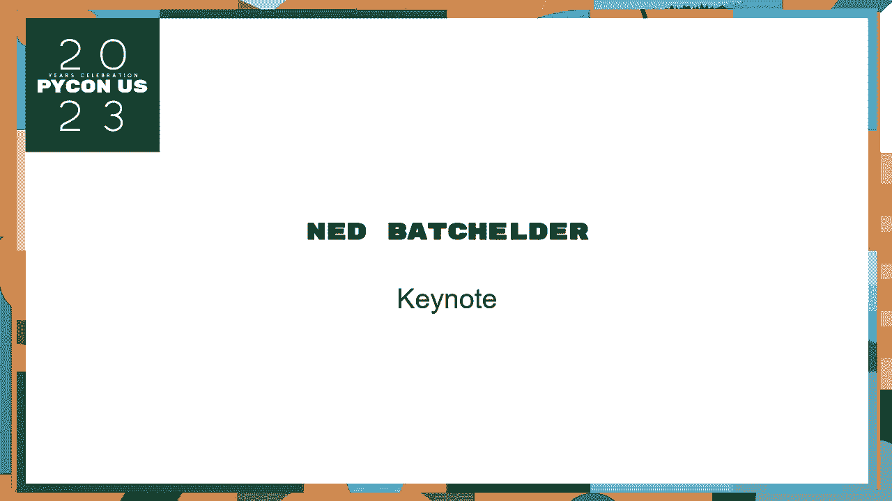
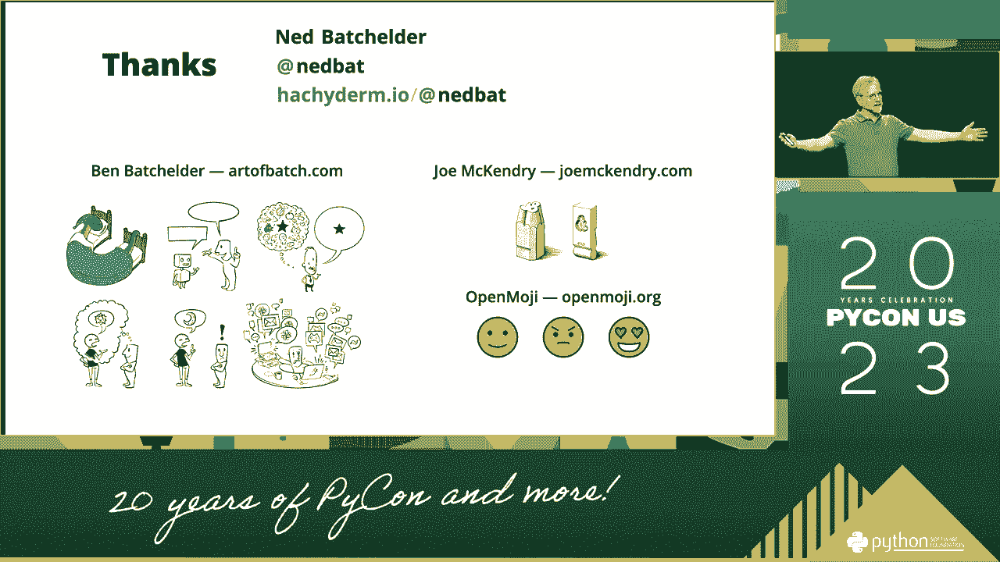

# 006：主题演讲 - 与Ned Batchelder一起探讨人际互动


## 概述

在本节课中，我们将学习如何将工程师的思维应用于人际互动。我们将探讨为什么与人沟通有时会充满挑战，以及如何运用一些简单的原则来改善这些互动，使其更顺畅、更有效。核心在于理解，每一次沟通都包含信息和情感两个层面。




---

## 开场致辞与社区感谢



感谢马里奥塔。欢迎来到Python世界。我是伊玛，一名软件工程师，在Instagram的前平台团队工作。今天来到这里，帮助大家共同进步。

首先，我想表达我们对成为Python软件基金会（PSF）有远见的赞助商感到自豪。我们也很高兴地宣布，我们已扩大对杰出开发者的支持。特别感谢穆克什。我们很荣幸能为Python社区的成长和发展做出贡献。

Python生态系统对我们至关重要。我们依赖CPython、成千上万的开源库和软件包来驱动Instagram、广泛的AI/ML系统以及众多工具和自动化脚本。我们感谢每一位贡献者：开源维护者、核心开发者和CPython贡献者。我们相信开源驱动创新的力量。我们自己也开源了许多库和框架，欢迎大家在GitHub上查看甚至贡献。

感谢大家的参与。我们迫不及待想听听主讲人的发言。


---

## 引入主讲人Ned Batchelder

再次感谢伊玛分享这些信息。

当我被要求选择主题演讲人时，我思考了想邀请谁，想让你们听到谁的声音。我回想起自己刚加入社区时的感受，思考了谁在一直帮助我、我尊敬谁、谁在我的旅程中支持我。我想向你们介绍一位对我影响深远的人。

在我第一次在当地聚会上演讲的前一天，我非常害怕，几乎想取消。我寻求了帮助，所需要的只是一点鼓励。正是那次简单的谈话让我坚持了下来。如果没有那份支持，可能就不会有今天的我。所以，谢谢你。

现在，请大家欢迎Ned Batchelder。


---

## Ned Batchelder的主题演讲：人际互动的“用户指南”

谢谢马里奥塔和PSF的邀请。很荣幸在PyCon诞生20周年之际站在这个舞台上。看到那些老照片，让我想起了PyCon的能量。

在我开始之前，有个问题：大家对PyCon感到兴奋吗？很好。

当我告诉朋友安东尼奥我要做这个演讲时，他提到他参加了2003年的第一届PyCon，并给我发了一张照片。Python最酷的一点是，有些事情二十年来从未改变，但有些事变了。我的第一次PyCon是2007年，当时的主讲人谈论了Python 3.0的计划，他一时忘了“类型注解”这个词，说成了“不是类型的东西，声明”。所以，二十年了，有些事变了，有些没变。

在准备这个演讲时，我思考了自己参与Python社区的多种方式：我的日常工作是在edX，维护着大型开源项目；我维护着`coverage.py`（那条睡眼惺忪的蛇）；我是波士顿Python聚会的组织者；我写博客很久了；我也活跃在IRC、Slack、Discord等在线社区。

所有这些经历有什么共同点？我决定谈谈“复杂系统中的高不确定性成分”。更简单的说法是：**人**。

作为工程师，我们常与人互动，但有时我们会像对待技术组件一样对待人，这可能导致互动不顺利。我们可以利用处理复杂技术问题的技能，来改善人际互动。这些常被称为“软技能”或“情商”。

人们有时觉得软技能不那么重要，因为它显得模糊、主观，没有明确的公式。但与人打交道的困难恰恰在于它的“软”和“黏”。如果我们认真对待并做好，人际互动并不可怕。

---

### 从工程视角看“人”这个组件

让我们看看一些我们看重的工程品质，以及“人”在这些标准上的表现。

1.  **人不标准**：每个人都不一样，没有统一规格。
2.  **没有文档**：认识一个新的人，没有说明书可以参考。
3.  **不可预测**：人们的行为并不总是线性的。
4.  **隐藏状态**：就像Python程序中的可变全局变量，人们脑子里在想什么（比如糟糕的早餐、紧的鞋子、对家人的担心）对你来说是隐藏的。
5.  **非线性反应**：输入一点，可能输出爆炸性的结果。
6.  **糟糕的错误信息**：当事情出错时，人们可能不会提供清晰的反馈。

你可能会想：既然“人”这个组件这么麻烦，我为什么不选树莓派呢？答案是：**你没得选**。无论你多内向，都需要与老板、同事、用户打交道。忽略人际互动的这一面，结果往往很糟。如果将其作为一种技能培养，事情会好得多。

况且，人也很棒：
*   **灵活适应**：人能完成意想不到的创造性工作。
*   **反射能量**：积极的互动能产生正向循环。
*   **是我们做事的原因**：你所做的一切，最终都是为了人。

---

### 人际互动的核心模型：每条消息都有信息和情感

我不是心理学家，我是工程师。我对人际互动的理解基于自己的经验、调试和复盘。

我认为，每次我向你发送一条信息（无论是说话、邮件还是代码评论），这条信息都由两部分组成：
1.  **信息**：事实内容。
2.  **情感**：我对你的感觉。

接收信息的人会不自觉地进行“情感分析”，想知道这条信息是欢迎我（是），还是推开我（否）。这是因为人是社会性、情感性的生物，需要从周围获得反馈来确认自我价值。

如果信息中没有明确的情感，接收者会通过两种方式默认一个：
1.  **历史**：根据你们过去的互动历史来判断。
2.  **相似性**：如果你们有相似之处（比如都在PyCon），就更可能是积极的。

如果既无历史也无相似性，默认情感往往是消极的。此外，接收者自身的“隐藏状态”（心情、担忧）也会给信息染上色彩。

**伪代码描述这一过程：**
```python
def receive_message(sender, message, emotion=None):
    if emotion is None:
        emotion = lookup_history(sender)  # 基于历史判断
    if emotion is None:
        emotion = calculate_similarity(sender)  # 基于相似性判断
    if emotion is None:
        emotion = “否”  # 默认消极
    # 应用接收者自身的隐藏状态（可变全局变量）进行过滤
    emotion = apply_hidden_state(emotion)
    # 记录此次互动，成为未来历史的一部分
    record_history(sender, emotion)
    if emotion == “否”:
        discard_message(message)  # 消极情感下可能忽略信息
    else:
        use_message(message)  # 积极情感下处理信息
```

这是一个双向过程。你也在对别人进行情感分析。

---

### 如何改善沟通：让信息更倾向于“是”

那么，如何提高互动顺利进行的几率呢？以下是五个建议：

上一节我们了解了沟通中的情感维度，本节我们来看看如何主动塑造积极的情感。

**1. 说“是”**
避免直接否定。用肯定的方式传递正确信息。
*   **反面例子**：
    > 新手：如何获取此数组的长度？
    > 助手：这不是数组。
    *（信息正确，但情感为“否”，新手感到被指责）*
*   **正面例子**：
    > 新手：如何获取此数组的长度？
    > 助手：该列表的长度可以用 `len()` 获取。
    *（提供了正确答案，情感为“是”，新手学到了东西）*

**2. 多用词语**
更多的词语可以提供上下文，软化语气。
*   **反面例子**：
    > 我需要帮助。你为什么用 `x`？
    *（听起来像在质疑对方的决定）*
*   **正面例子**：
    > 我在使用 `x` 时遇到了麻烦。我不确定是不是用法不对。如果你能分享更多关于你如何使用它的上下文，也许我们能找到解决办法。
    *（表达了困惑和求助的意愿，情感更积极）*

**3. 注意措辞**
使用不确定或开放性的语言，为对话留出空间。
*   **反面例子**：
    > 我的程序说 1+2=4，这不对。
    *（陈述一个封闭的事实）*
*   **正面例子**：
    > 我的程序说 1+2=4，这听起来不对。
    *（“听起来”增加了不确定性，邀请对方一起探讨）*

**4. 保持谦逊**
以“我”为主语承担责任，而不是指责对方。
*   **反面例子**：
    > 你的问题不清楚。
    *（指责对方）*
*   **正面例子**：
    > 我还没完全理解你的问题。
    *（承担了不理解的责任，鼓励对方进一步解释）*

**5. 明确表达**
使用“三明治反馈法”：正面肯定 + 具体建议 + 正面鼓励。
*   **例子**：
    > 我觉得你的项目想法很棒！这部分代码可能有个小问题，我们可以一起看看。总的来说，基础打得非常好！

这听起来像是幼儿园就学过的道理：与人为善，替他人着想。但随着年龄增长，我们更关注技术，忽略了这些。每个人都需要帮助，我们都是试图理解这个混乱世界的人。

---

### 技术本身的“怪异”如何影响沟通

我们谈了很多情感，现在让我们谈谈信息本身的技术性难点。

古腾堡发明活字印刷术时，面临许多技术挑战，比如确保每个铅字块高度一致。雕刻师会进行“烟雾测试”（smoke test）来快速检查雕刻效果。这个词沿用至今。

排字工人使用“字盘”（case）工作，大写字母放在上盘（upper case），小写字母放在下盘（lower case）。这就是英文“大小写”（case）的由来。小写字盘的布局符合人体工程学，常用字母在中间。而大写字盘按A-Z排列，但J和U在最后。

为什么J和U在最后？因为在英语中，J和U直到17世纪中叶才被视为独立字母。当它们被加入时，为了保持几个世纪的传统，就被放在了末尾。直到今天，许多印刷店仍沿用此布局。

**我想通过这个历史故事让你体验一下作为技术新手的感受**：面对大量陌生信息、奇怪的术语（如“烟雾测试”）、看似不合理的设计（J和U在最后）。技术本身会随着时间积累“怪异”，这干扰了我们清晰沟通的能力。

Python也是如此。Lambda关键字可能不易记忆，打包工具可能令人困惑。Python非常成功，这意味着两位Python专家日常使用的术语可能完全不同。例如，你可能熟悉左栏和中栏的词汇，但右栏的词汇呢？

| 常见Python术语 | 特定领域术语 | 你可能不熟悉的术语 |
| :--- | :--- | :--- |
| List, Dict | ORM, Middleware | PyO3, Mypyc, Pydantic |
| Function, Class | Async, Decorator | ASGI, Uvicorn, Hypothesis |

所有的技术都很“怪异”。我们无法完全消除这种怪异，但需要在沟通中意识到并处理它。

---

### 针对不同场景的沟通策略

**当有人说“Python很难”时**
作为Python爱好者，我们想帮助他。但如果说“不，这很容易”，就是在否定对方的感受。
*   **更好的回应**：“一开始可能确实有些难，但我们可以一起让它变得更容易。你具体在哪个部分遇到了困难？”
*   **关键**：倾听对方真正的意思——“我在挣扎”，而不是“Python很烂”。

**专家也是新手**
无论是刚加入Meta面对庞大代码库的新员工，还是需要学习PEP 669新特性的资深开发者，每个人在陌生领域都是初学者。在波士顿Python，我们说：“**我们都是初学者，只是有些人练习得更多。**”

**在快节奏的线上世界**
我们被通知淹没。请记住，每个通知背后都是一个人。在急于回复时，可以有意使用一些“软化短语”。我个人甚至设置了键盘宏，快速输入“如果你不介意我问的话，”。

**应用“冲刺回顾”到沟通中**
就像敏捷开发中的冲刺回顾一样，可以反思你的沟通：
1.  **目标**：我想通过这次互动实现什么？
2.  **评估**：进行得怎么样？对方反应如何？
3.  **改进**：下次怎样可以做得更好？

例如，如果有人说“我的代码很难测试”，回复“你做错了”只会赶走他。反思一下：我的目标是帮助他，我的方法实现目标了吗？下次也许可以说：“测试有时确实棘手。你愿意分享一下代码，我们一起看看有什么办法吗？”

---

## 总结与呼吁

本节课中，我们一起学习了如何将工程思维应用于人际沟通。我们探讨了沟通中的信息与情感双重维度，理解了技术本身的“怪异”会给交流带来挑战，并学习了一些改善沟通的具体方法：说“是”、多用词、注意措辞、保持谦逊、明确表达。

归根结底，**人很重要**。我们与他人的互动至关重要。你可以写出最棒的程序，但如果不能与同事合作、理解用户需求或与上级有效沟通，这些技术的价值将大打折扣。

我的建议与马里奥塔一致：**与人交谈**。我们来到这里就是为了彼此交流。如果你在走廊看到我，请来和我说话。

最后，分享作家库尔特·冯内古特给儿子的建议。当被问及“我们为什么在这里”时，他的儿子马克回答：“**我们在这里就是为了互相帮助，度过难关，不管那难关是什么。**”

这就是我给大家的建议：互相帮助，彼此交谈，守望相助。

谢谢大家！




