# 013：调和一切 🎤

在本节课中，我们将学习安德鲁·戈德温关于“调和一切”的演讲核心思想。我们将探讨如何通过清晰的结构、有力的论据和有效的表达，将复杂或对立的观点整合成一个连贯、有说服力的整体。

---

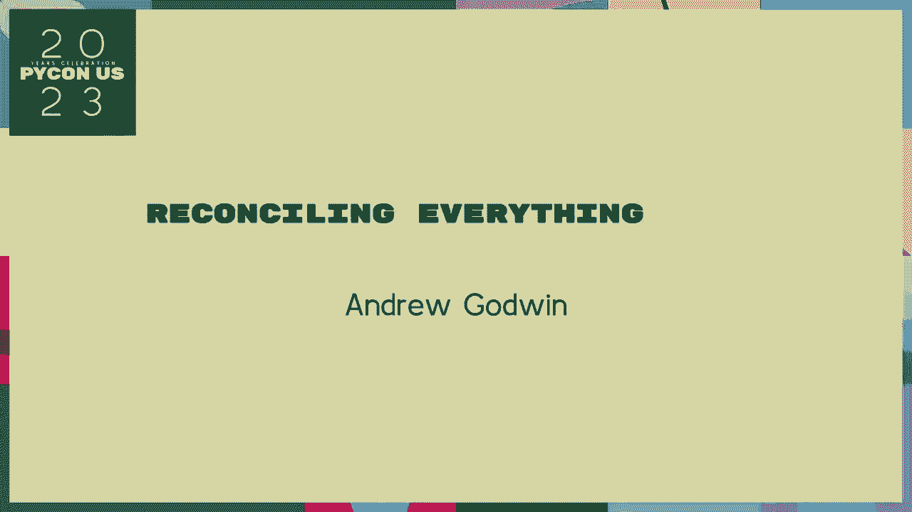

## 演讲技巧：P13：1：演讲的核心目标 🎯

演讲的核心目标是传递信息并说服听众。为了实现这一目标，演讲者需要将各种元素——包括论点、证据、情感和逻辑——和谐地融合在一起。

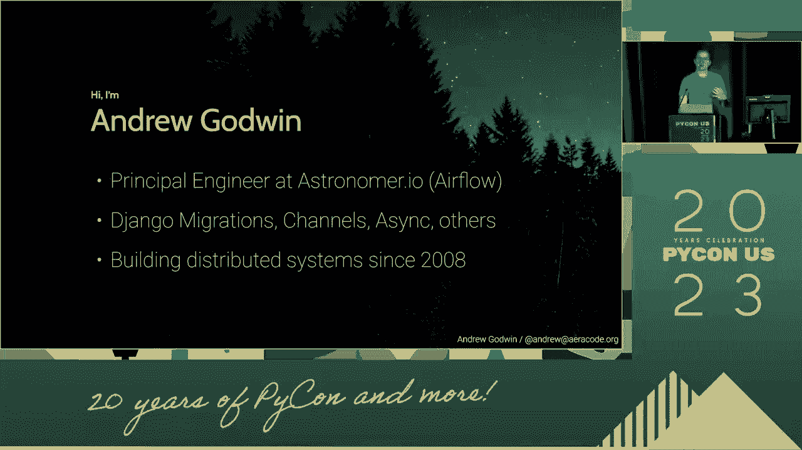

上一节我们明确了演讲的目标，本节中我们来看看实现这一目标的具体方法。

---

## 演讲技巧：P13：2：构建清晰的结构 🏗️

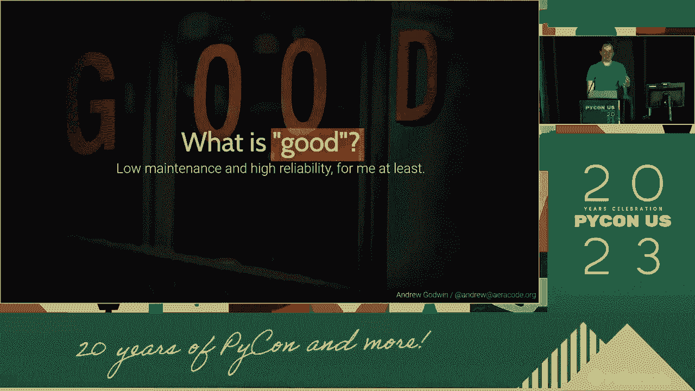

一个清晰的演讲结构是调和所有内容的基础。它像一张地图，引导听众理解你的思路。

以下是构建演讲结构的三个关键步骤：

1.  **开场**：吸引注意力，阐明核心主题。
2.  **主体**：展开核心论点，通常包含2-4个主要分论点，每个分论点由证据和解释支撑。
3.  **结尾**：总结要点，重申核心信息，并给出有力的结束语。

一个经典的结构公式可以表示为：`演讲 = 开场 + (论点1 + 论据1) + (论点2 + 论据2) + ... + 结尾`。

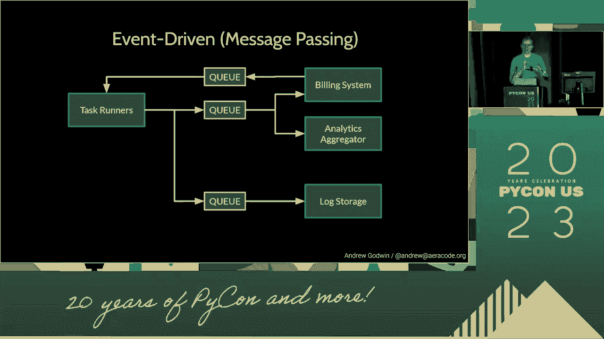

---

## 演讲技巧：P13：3：整合论点与论据 🔗

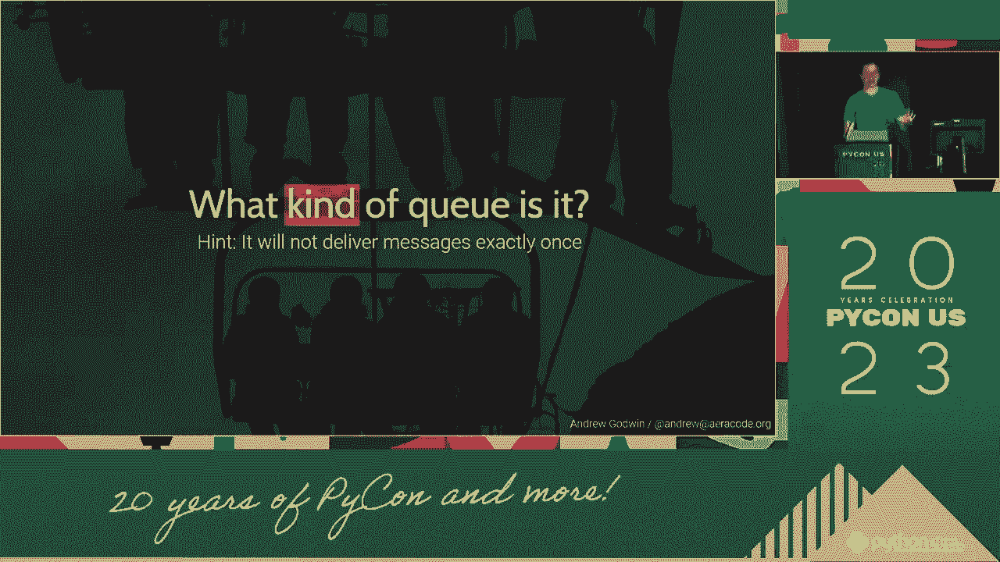

仅仅有结构还不够，你需要用有力的内容来填充它。调和一切意味着让你的论点和论据无缝衔接，共同服务于核心主题。

上一节我们搭建了演讲的骨架，本节中我们来看看如何填充血肉。

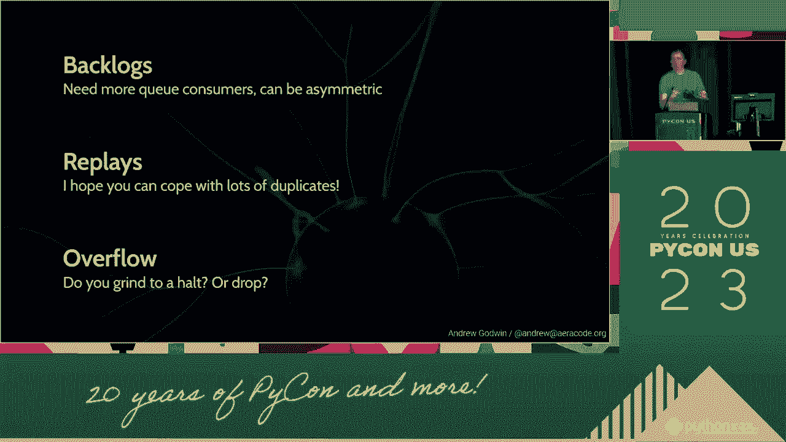

论据的选择至关重要，它们必须直接支持你的论点。常见的论据类型包括：

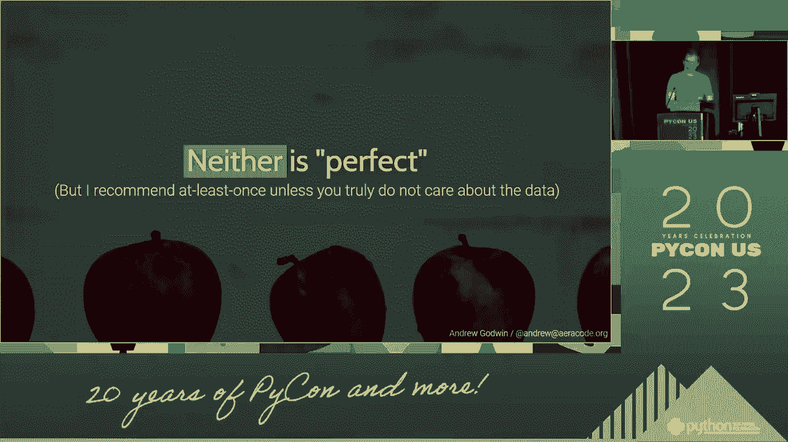

*   **数据与事实**：提供客观依据。
*   **案例与故事**：使内容生动、易于共鸣。
*   **权威引用**：借助专家观点增强说服力。

确保每个论据都像拼图一样，精准地嵌入到对应的论点之中。

---

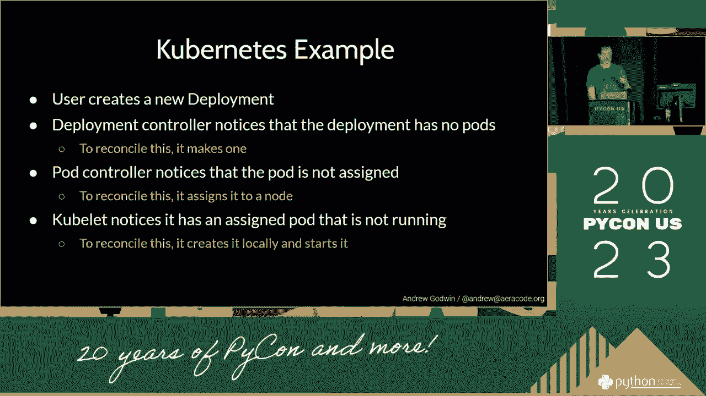

## 演讲技巧：P13：4：运用语言与修辞 ✨

语言是调和一切的工具。通过精心选择的词语和修辞手法，你可以强化逻辑，激发情感，让演讲更具感染力。

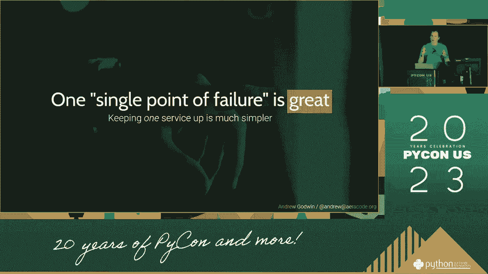

以下是几种有效的语言调和技巧：

*   **使用过渡词**：如“首先”、“然而”、“更重要的是”等，使演讲段落之间流畅连接。
*   **重复核心信息**：通过不同的方式重复关键短语或观点，加深听众印象。
*   **运用比喻和类比**：将复杂概念与熟悉事物比较，帮助听众理解。

例如，在代码中，一个函数调用可以类比为演讲中的一个论点，而传入的参数就是支撑它的论据：`persuade(论点， 论据)`。

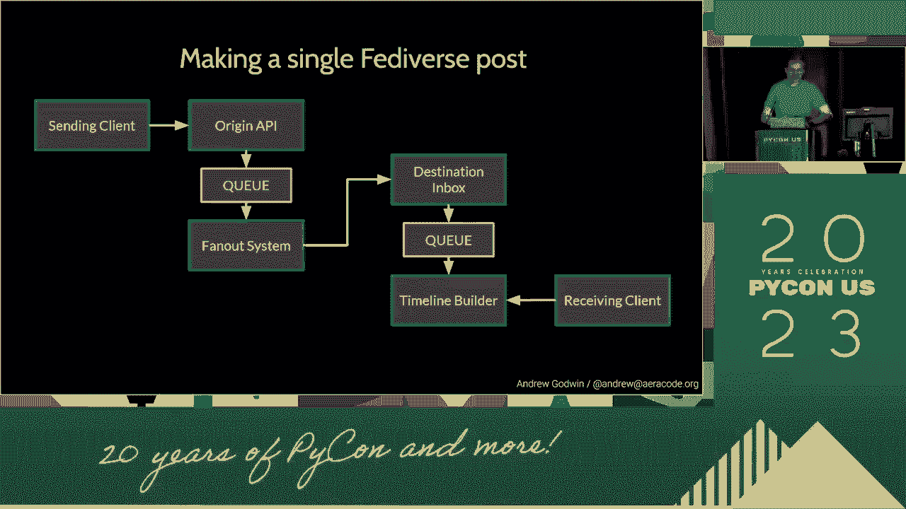

---

## 演讲技巧：P13：5：处理矛盾与对立 ⚖️

高水平的演讲常常需要处理看似矛盾的观点或对立的证据。调和这些元素，而不是回避它们，能极大提升演讲的深度和可信度。

你可以通过以下框架来调和矛盾：

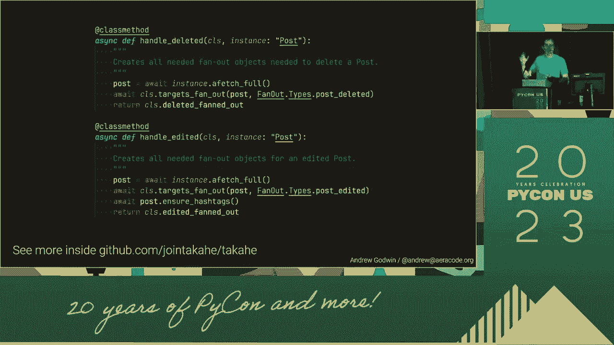

1.  **承认对立面**：表明你了解不同的观点。
2.  **提供你的视角**：解释为什么你的论点在特定上下文或标准下更合理。
3.  **寻求共同基础**：指出不同观点之间可能存在的共识，以此作为你论述的起点。

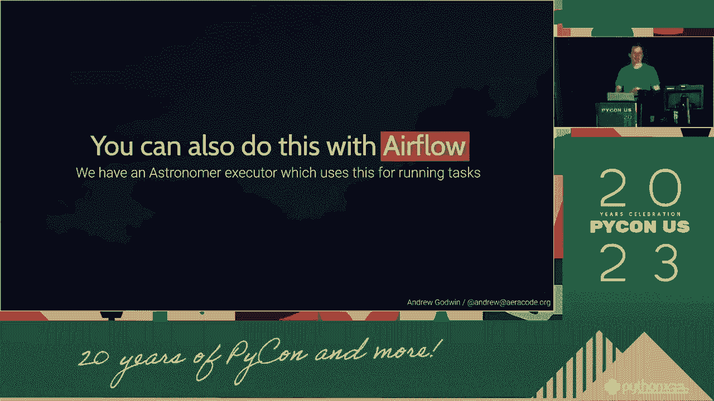

这展示了批判性思维，并使你的最终结论显得更加平衡和深思熟虑。

---

## 演讲技巧：P13：6：练习与交付 🚀

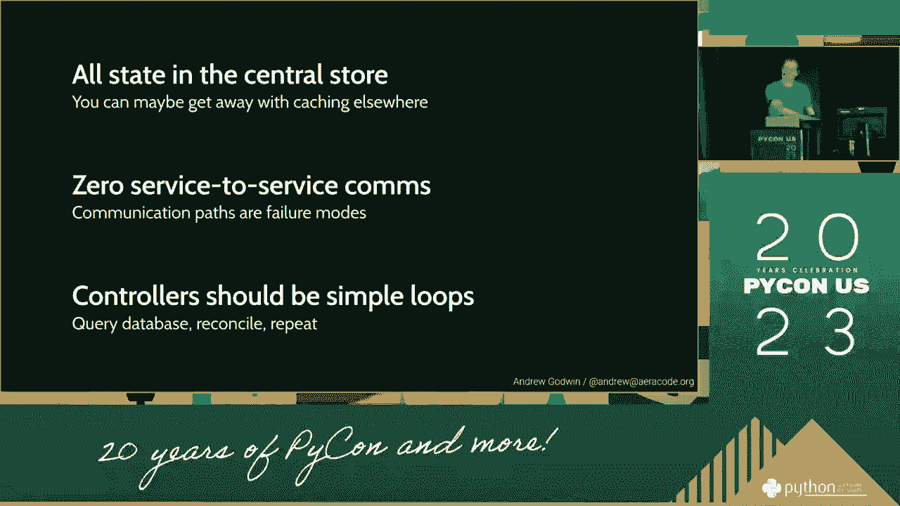

所有的调和最终都要通过现场交付来体现。练习是将纸面上的内容转化为生动演讲的关键。

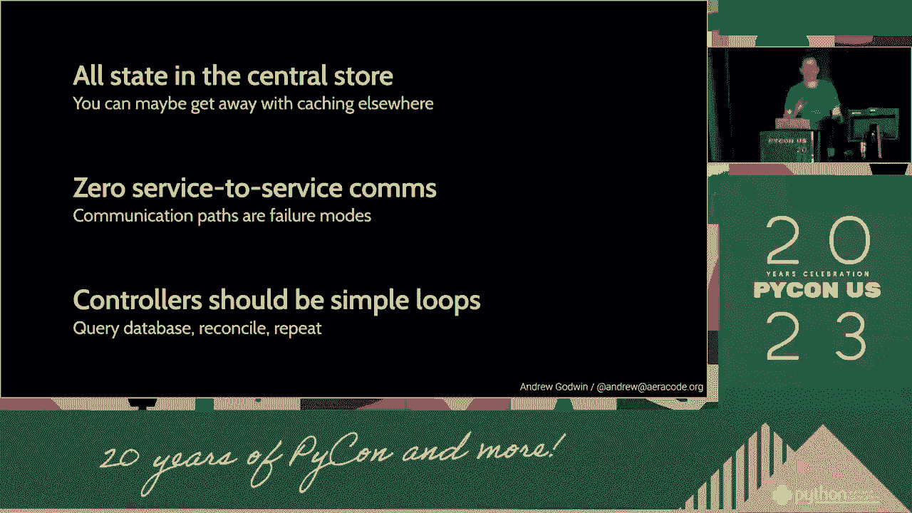

在练习时，请关注以下方面：

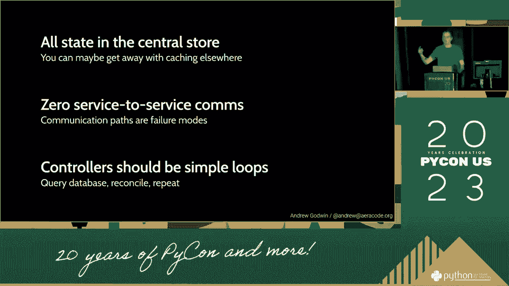

*   **节奏与停顿**：给听众消化信息的时间。
*   **肢体语言**：确保手势、表情与演讲内容一致。
*   **语音语调**：通过音量和语调的变化来强调重点。

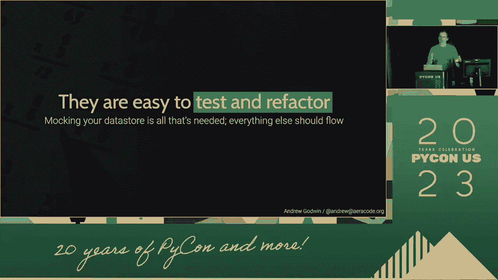

反复练习直到你对内容了如指掌，这样在台上你就能更专注于与听众的交流，而不是回忆讲稿。

---

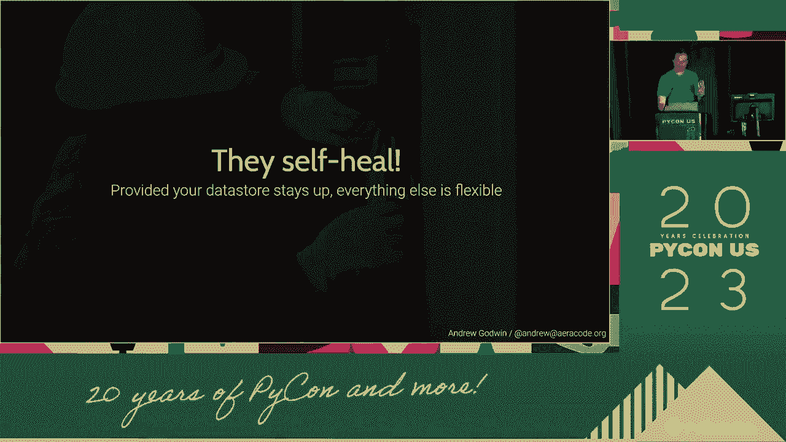

## 演讲技巧：P13：7：总结与回顾 📝

本节课中我们一起学习了“调和一切”的演讲艺术。

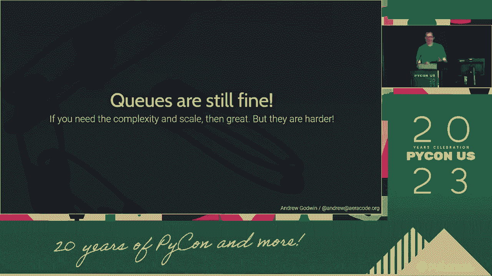

我们首先明确了演讲的核心目标是说服。接着，我们学习了如何通过**清晰的结构**来搭建框架，并用**有力的论点与论据**来填充内容。然后，我们探讨了如何运用**语言与修辞**技巧来增强表达，以及如何高明地**处理矛盾**来提升演讲深度。最后，我们强调了**练习与交付**是将所有元素呈现给听众的最终环节。

记住，一次成功的演讲就像指挥一场交响乐，你需要将各个不同的部分——结构、内容、语言和表达——和谐地统一起来，共同演绎出清晰、有力、令人信服的旋律。