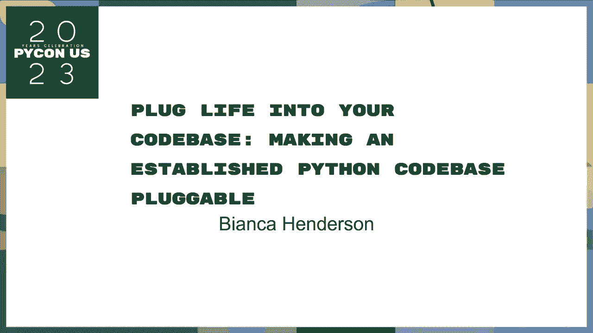
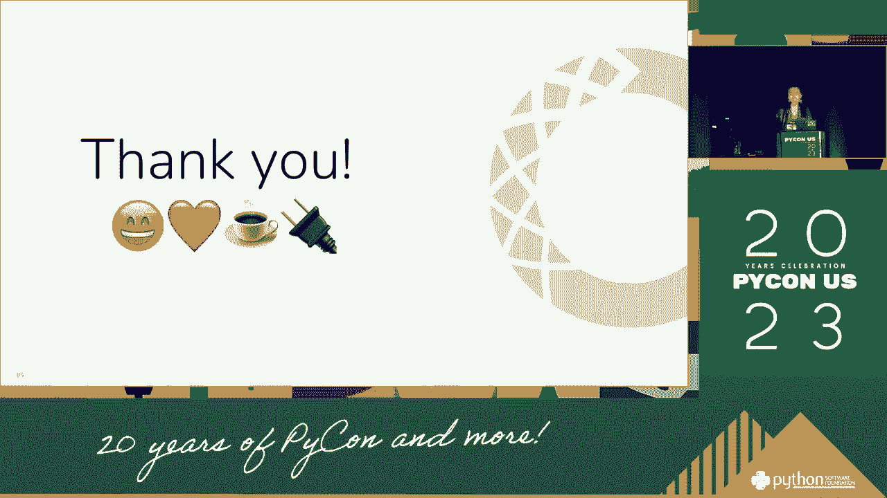

# 017：将生活融入你的代码库 🧩

在本节课中，我们将学习如何通过插件架构来构建灵活、可扩展的Python应用程序。我们将从一个生活化的类比开始，逐步深入到插件的核心概念、工作原理以及如何在实际项目中实现它们。



---

## 概述

软件的现实是，需求会不断变化，用户也会变化。为了应对这种变化，我们需要构建能够灵活适应新功能的系统。插件架构就是一种强大的设计模式，它允许我们在不修改核心代码的情况下，为程序添加新功能。本节课将解释什么是插件，为什么需要它们，并通过一个简单的例子展示如何实现。

---

## 1：程序与插件：一个咖啡店的类比 ☕

在深入技术细节之前，让我们用一个类比来理解程序和插件的关系。

想象一个咖啡店。这个咖啡店的核心是制作咖啡。它拥有电源、水源和咖啡豆。这就像是我们的**主程序**，它提供了基础功能。

现在，假设我们想增加制作冰沙或茶的功能。我们不需要重建整个咖啡店，只需要引入一台新的机器（比如冰沙机或茶壶）。这台新机器可以“插入”到咖啡店现有的电源和水源系统中。这台新机器就是一个**插件**。

*   **咖啡店（主程序）**：提供基础环境（电力、水）和核心服务（制作咖啡）。
*   **冰沙机（插件）**：扩展了咖啡店的功能，使其能制作冰沙。
*   **连接点（插件接口）**：电源插座和水管接口，允许新机器接入系统。

这个类比说明了插件如何让一个程序在不改变其核心结构的情况下，获得新的能力。

---

## 2：理解插件架构的核心概念 ⚙️

上一节我们通过咖啡店了解了插件的概念。本节中，我们来看看插件架构中的几个核心技术概念。

一个插件系统通常包含以下部分：

*   **主机程序**：这是应用程序的核心框架。它定义了插件可以接入的接口和规则。
*   **插件**：独立的代码模块，用于实现特定的扩展功能。
*   **钩子**：主机程序暴露的特定点，插件可以在这些点上“挂接”自己的代码来执行操作。
*   **插件管理器**：负责发现、加载、注册和管理所有插件的组件。

它们的关系可以用一个简单的公式表示：
**主机程序 + 插件管理器 + (插件1 + 插件2 + …) = 可扩展的应用程序**

以下是插件架构的一个工作流程：
1.  主机程序启动，并初始化插件管理器。
2.  插件管理器在指定目录中搜索并发现可用的插件。
3.  插件管理器加载插件，并将插件注册到主机程序的相应钩子上。
4.  当程序运行到某个钩子时，所有注册到该钩子的插件代码都会被依次执行。

---

## 3：如何实现一个简单的Python插件 🔧

现在，我们来看一个具体的Python实现例子。我们将创建一个非常简单的插件系统。

首先，我们需要定义主机程序。它包含一个插件管理器和一个简单的钩子。

```python
# host_program.py
class PluginManager:
    def __init__(self):
        self.hooks = {}  # 存储钩子及其对应的插件函数列表

    def register_hook(self, hook_name, plugin_function):
        """将插件函数注册到指定的钩子上"""
        if hook_name not in self.hooks:
            self.hooks[hook_name] = []
        self.hooks[hook_name].append(plugin_function)

    def execute_hook(self, hook_name, *args, **kwargs):
        """执行某个钩子上的所有插件函数"""
        if hook_name in self.hooks:
            for func in self.hooks[hook_name]:
                func(*args, **kwargs)

# 创建一个全局插件管理器实例
plugin_manager = PluginManager()

# 定义一个名为 `greet` 的钩子
def main_program():
    print("主机程序开始运行...")
    # 执行 `greet` 钩子，所有注册到此的插件都会响应
    plugin_manager.execute_hook('greet', user="开发者")
    print("主机程序运行结束。")

if __name__ == "__main__":
    main_program()
```

接下来，我们创建一个插件。插件就是一个普通的Python模块，它需要在加载时向主机程序注册自己。

```python
# my_plugin.py
from host_program import plugin_manager

def say_hello(user):
    print(f"[插件] 你好，{user}！")

# 当这个模块被导入时，自动将函数注册到 ‘greet’ 钩子
plugin_manager.register_hook('greet', say_hello)
```

最后，我们需要修改主机程序的启动部分，让它自动发现并加载我们的插件。

```python
# 修改后的 host_program.py 顶部
import importlib
import pkgutil
import os

class PluginManager:
    # ... (同上) ...

    def discover_and_load_plugins(self, plugin_directory):
        """发现并加载指定目录下的所有插件模块"""
        for finder, name, ispkg in pkgutil.iter_modules([plugin_directory]):
            # 动态导入插件模块
            full_name = f"plugins.{name}"  # 假设插件在‘plugins’包内
            importlib.import_module(full_name)
            print(f"已加载插件：{name}")

# 在 main_program 函数开始处添加
plugin_manager.discover_and_load_plugins(‘./plugins’)
```

将 `my_plugin.py` 文件放在 `./plugins` 目录下。现在运行 `host_program.py`，你会看到插件被加载并执行。

---

## 4：真实世界的例子与环境管理 🌍

我们刚刚构建了一个简单的插件系统。在现实世界的复杂项目中，插件架构常用于构建开发工具和平台。一个典型的例子是**环境管理工具**（如 `virtualenv`, `conda`, `pipenv`）。

这些工具本身是一个**主机程序**，其核心功能是创建和管理独立的Python环境。而像 `pip`（包安装器）、`flake8`（代码检查器）这样的功能，可以被视为**插件**或与主程序深度集成的工具链。

它们共同工作：
1.  **环境管理器（主机）** 创建了一个隔离的工作空间。
2.  **包管理器（插件/工具）** 在该工作空间中安装依赖。
3.  **代码检查器（插件/工具）** 对该工作空间中的代码进行质量检查。

这种架构允许开发者根据项目需求，灵活组合不同的工具，而不需要环境管理器本身实现所有功能。这正体现了插件“将生活（各种需求）融入代码库”的思想。

---

## 总结

在本节课中，我们一起学习了Python插件开发的核心思想。



1.  **我们从类比开始**，理解了插件如何像咖啡店里的新机器一样扩展程序功能。
2.  **然后我们剖析了核心概念**，包括主机程序、插件、钩子和插件管理器。
3.  **接着我们动手实现**了一个简单的插件系统，看到了代码如何被动态加载和执行。
4.  **最后我们联系实际**，了解了环境管理工具如何利用类似架构提供强大的灵活性。


插件架构通过**解耦核心功能与扩展功能**，使你的代码库更具适应性和可维护性。掌握它，你就能构建出能够随着需求“成长”的成熟应用程序。