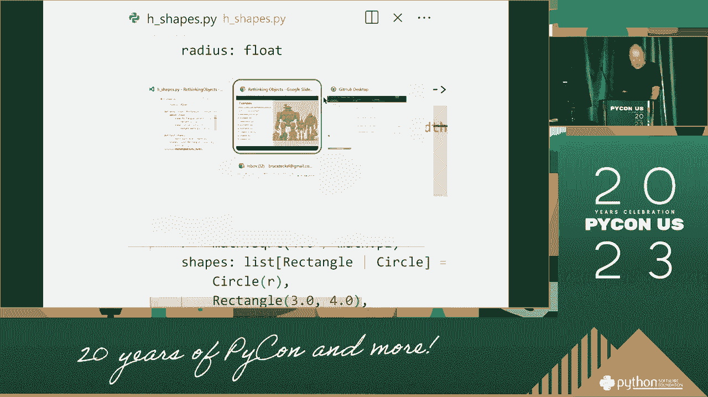
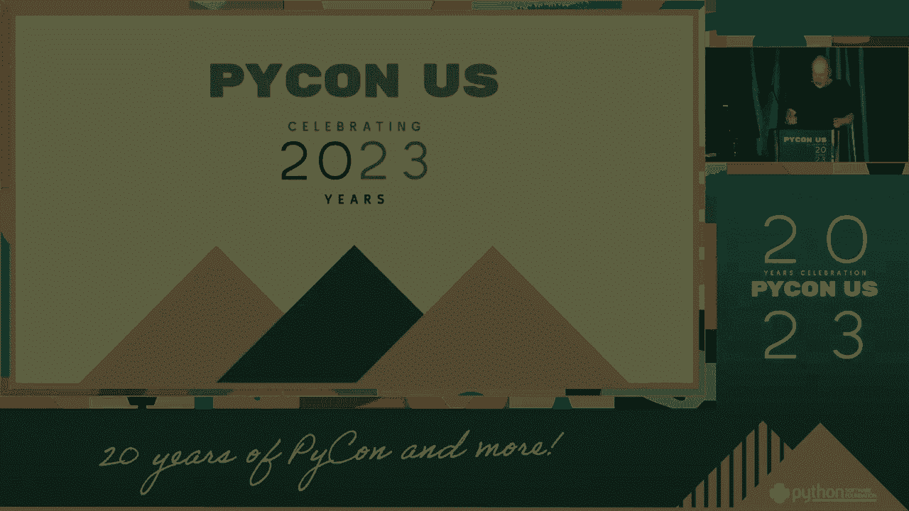

# 022：重新思考对象 🧠

在本节课中，我们将学习布鲁斯·埃克尔关于“重新思考对象”的核心观点。我们将探讨面向对象编程中一些常见的误解，并理解如何更有效地运用对象这一概念来构建灵活、可维护的软件系统。

---

上一节我们介绍了课程的主题，本节中我们来看看布鲁斯·埃克尔对传统对象观念的挑战。

他认为，许多程序员对“对象”的理解过于僵化，将其视为数据和方法的简单捆绑。这种理解限制了设计的灵活性。



---

上一节我们提到了对对象的僵化理解，本节中我们来看看更动态的视角。

一个更强大的视角是将对象视为**服务的提供者**。对象的核心价值不在于它封装了什么数据，而在于它能为你提供什么服务或行为。

这种视角的转变，意味着设计重心从“有什么”（`has-a`）转向了“能做什么”（`can-do`）。

---

理解了对象作为服务提供者的概念后，我们来看看如何实践这一理念。以下是应用这一理念的几个关键原则：

*   **单一职责原则**：一个对象应该只有一个引起它变化的原因。这意味着它只提供一组紧密相关的服务。
*   **接口隔离**：客户端不应被迫依赖它们不使用的接口。应定义多个特定的接口，而不是一个庞大通用的接口。
*   **组合优于继承**：优先使用对象组合（`has-a`）来扩展功能，而非依赖继承（`is-a`）。这能带来更大的灵活性。例如：
    ```java
    // 使用组合
    class Engine {
        public void start() { /* 启动逻辑 */ }
    }
    class Car {
        private Engine engine; // Car 拥有一个 Engine
        public void start() {
            engine.start();
        }
    }
    ```

---

在探讨了核心原则后，我们来看看这种思维转变带来的好处。重新思考对象能带来以下主要优势：


*   **更高的内聚性**：每个对象专注于一项明确的任务。
*   **更低的耦合性**：对象之间通过清晰的接口交互，减少相互依赖。
*   **增强的可测试性**：服务明确的对象更容易被单独测试。
*   **更好的可维护性**：系统更易于理解、修改和扩展。




---

本节课中我们一起学习了如何重新思考面向对象编程中的“对象”。核心在于将对象从“数据容器”的刻板印象中解放出来，转而视其为“服务提供者”。我们探讨了单一职责、接口隔离和组合优于继承等实践原则，并了解了这种思维模式如何带来高内聚、低耦合、易测试和好维护的代码设计。记住，对象的价值在于其行为，而非其属性。