# 023：向 Python 文档的迭代转型 🚀

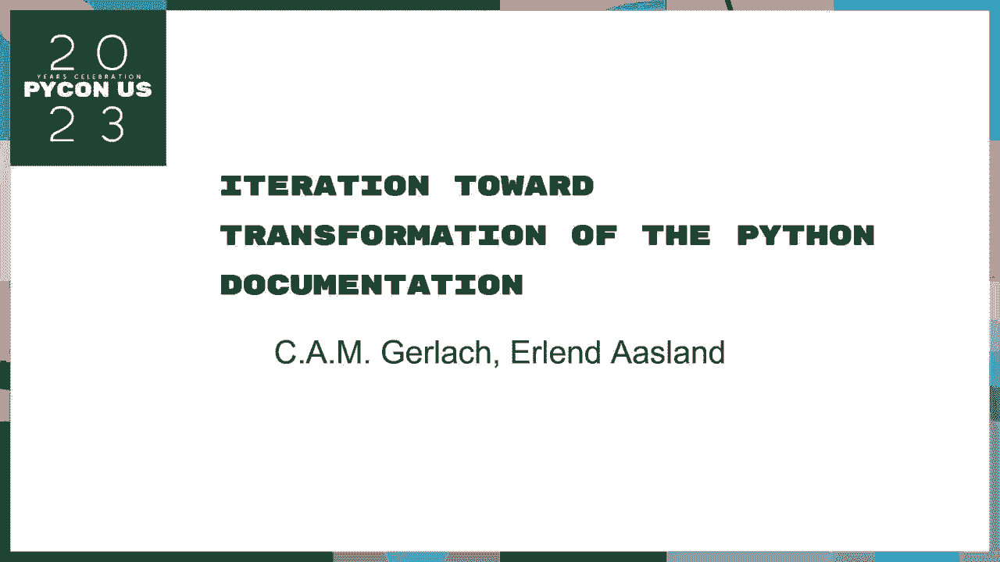

在本节课中，我们将学习 Python 文档团队如何对其文档系统进行迭代转型。我们将了解转型的背景、面临的挑战、具体的改进措施以及社区在其中扮演的角色。无论你是文档贡献者还是普通用户，都能从中了解如何更好地使用和参与 Python 文档的建设。

## 概述

Python 文档是社区的重要资产，但其维护和更新面临诸多挑战。本次演讲由文档团队的成员分享，他们介绍了如何通过一系列迭代改进，使文档系统变得更现代化、更易于维护和协作。核心目标是提升文档的可读性、可维护性和社区参与度。

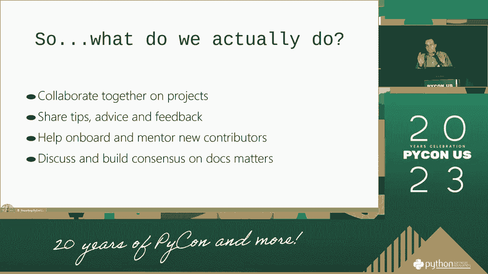

---

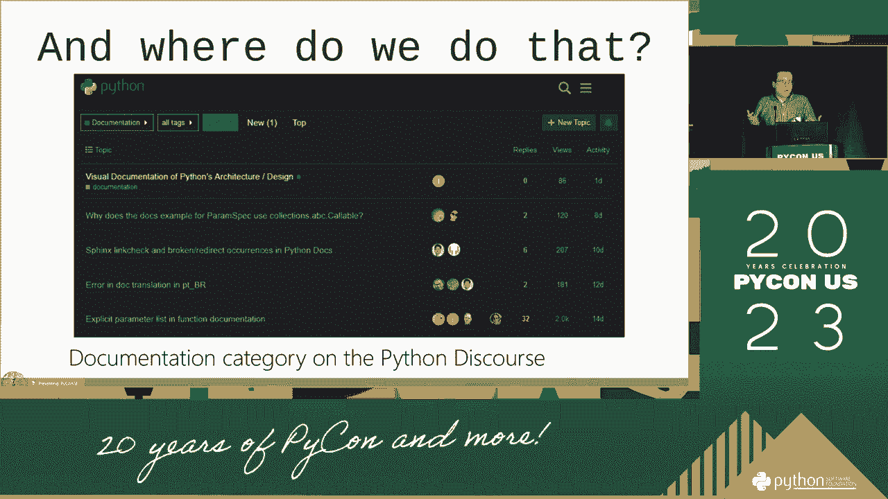

## 演讲者介绍 👥

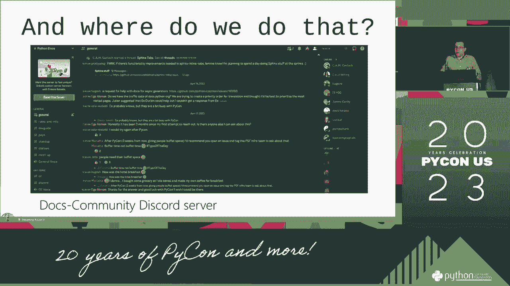

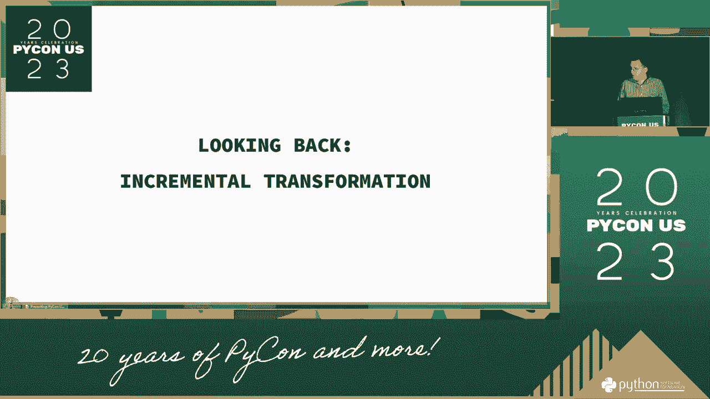

上一节我们概述了课程内容，本节我们来认识一下本次分享的演讲者。

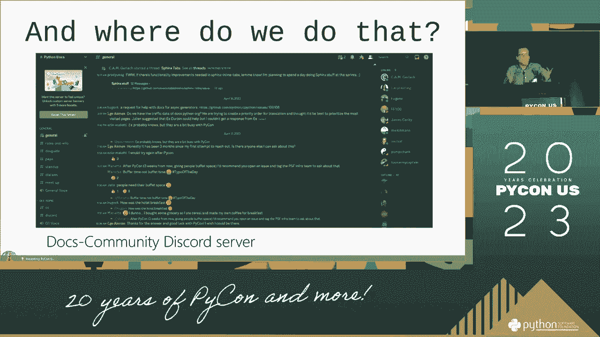

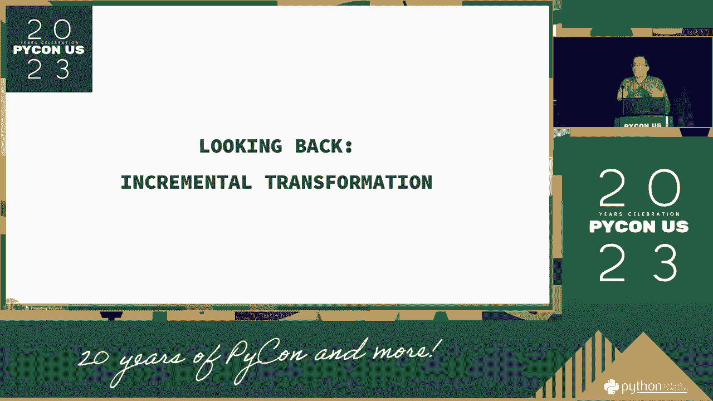

我是本次分享的主讲人之一。我的工作主要围绕 Python 文档团队展开，处理补丁和文档维护事宜。我同时也是一名中级程序员，并积极参与本地及全球的 Python 社区活动。

另一位共同主讲人是金。他同样深度参与文档工作，并带来了从开发者角度的宝贵见解。我们二人都致力于改善 Python 的文档体验。

我们的工作离不开整个 Python 社区的支持，特别是核心贡献者如彼得、SBO、六月等人的辛勤付出。

---

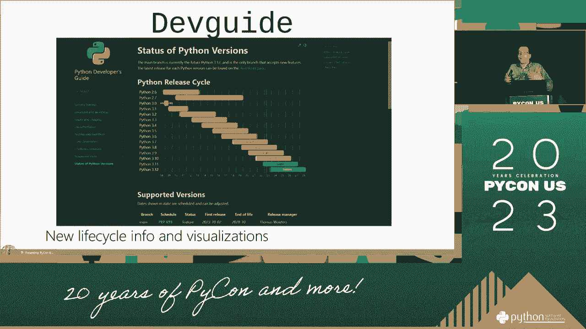

## 转型背景与挑战 ⚙️

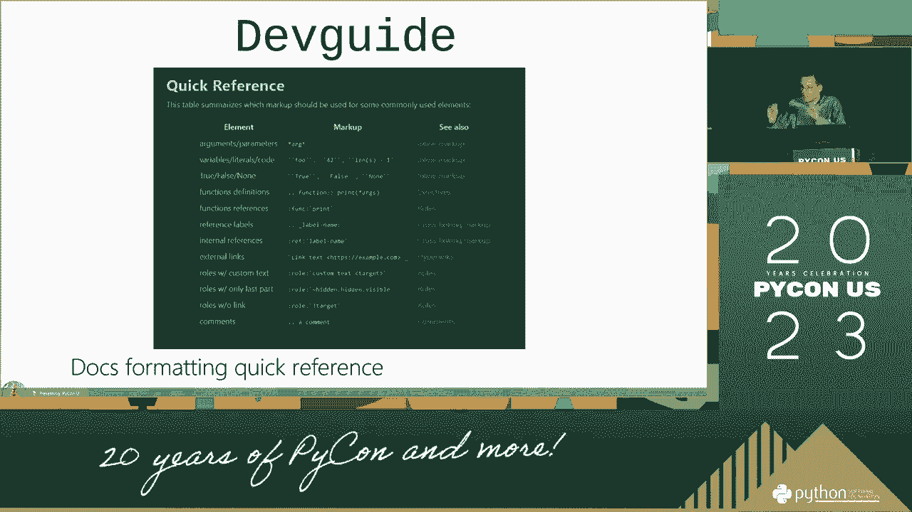

在认识了演讲者之后，我们来看看促使文档转型的背景和主要挑战。

旧的文档系统基于自定义函数构建，虽然功能强大，但维护成本高昂，且难以支持大规模的社区协作。文档的构建流程复杂，从 RST 文件到 HTML 的转换过程不够灵活。

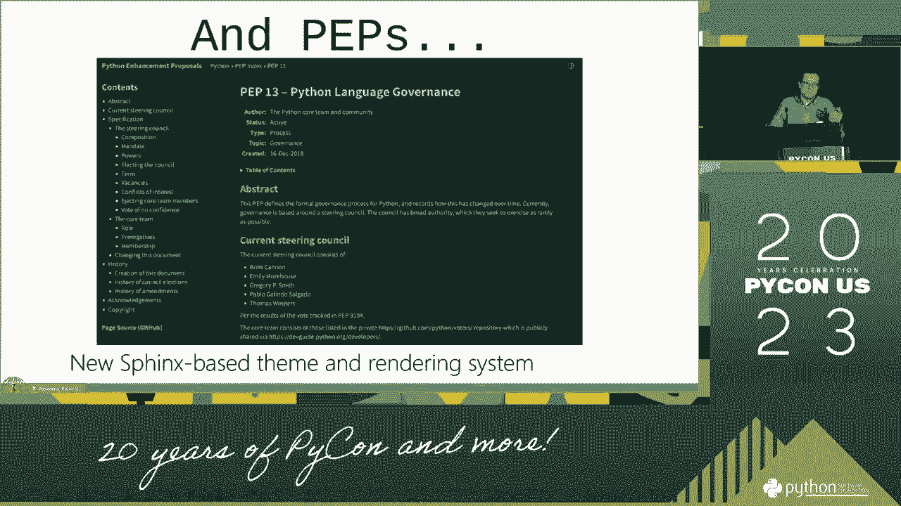

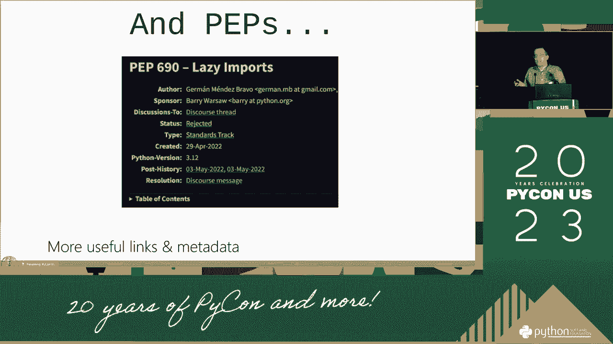

具体而言，我们面临以下核心问题：
*   **维护困难**：旧系统结构复杂，更新和修复需要大量手动操作。
*   **协作不畅**：缺乏高效的协作工具和环境，阻碍了社区贡献。
*   **用户体验不佳**：长篇幅的函数文档难以导航，查找特定信息效率低下。

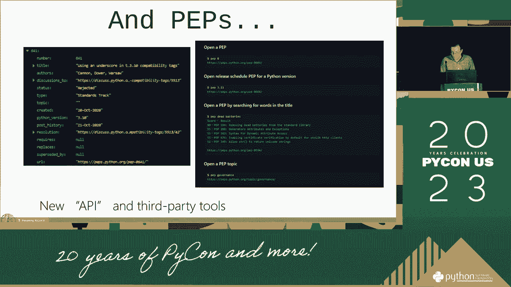

所有问题的核心，都指向一个**自定义函数** `legacy_build_system()` 的问题，它曾是整个文档生成流程的瓶颈。

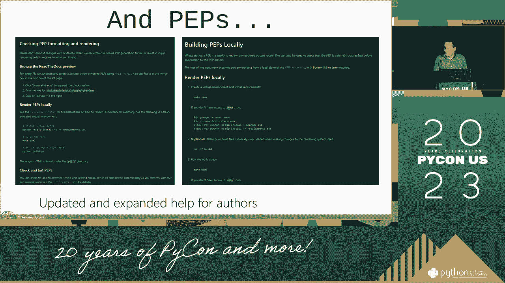

---

## 核心改进措施 ✨

了解了挑战所在，本节我们将深入探讨文档团队实施的一系列具体改进措施。

### 1. 引入新的文档构建系统

我们彻底改造了文档构建路径，放弃了旧有的、笨重的自定义流程。新的系统更加模块化和自动化。

例如，新的构建命令更加清晰：
```bash
# 旧命令（复杂且难以记忆）
make html SPHINXOPTS="-W"

# 新命令（更简洁直观）
python -m sphinx.cmd.build -b html sourcedir builddir
```

### 2. 优化大型函数文档的展示

对于参数众多的大型函数，我们改进了其呈现方式，使其更易于阅读和导航。

改进包括：
*   **参数表格化**：将冗长的参数列表以表格形式展示，清晰列出参数名、类型和说明。
*   **添加快速参考**：在文档侧边栏或顶部增加该函数的语法和核心用法的快速参考。
*   **嵌入示例代码**：在文档中直接嵌入可运行的示例代码块，方便用户理解。

### 3. 建立开放的文档社区与流程

我们创建了更开放的协作空间，鼓励社区参与。以下是关键的社区资源列表：
*   **文档社区网站**：一个集中的平台，用于讨论文档事宜。
*   **月度文档社区会议**：定期举行会议，同步进展并收集反馈。
*   **公开的邮件列表和聊天频道**：如 `docs@python.org` 邮件列表和相关的 Discord/Slack 频道，供日常交流。

任何人都可以通过这些渠道加入讨论、报告问题或提交改进建议。

### 4. 增强搜索与导航功能

新的文档系统提供了更强大的全文搜索和 API 链接跳转功能。用户能更快地找到所需信息，并在相关的类、函数、模块之间轻松跳转。

---

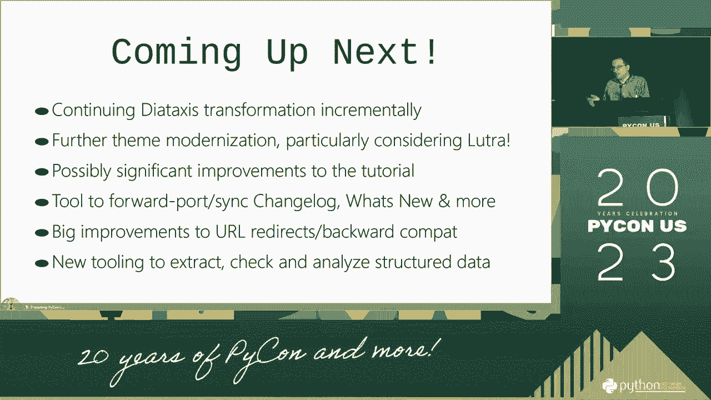

## 总结

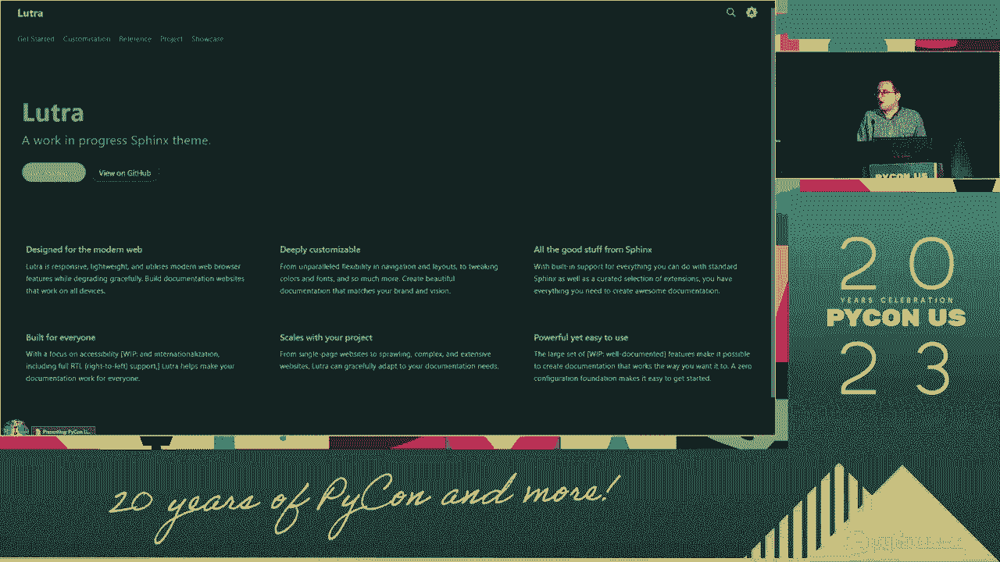

本节课中，我们一起学习了 Python 文档团队的迭代转型之旅。

我们从转型的背景和挑战出发，了解到旧系统在维护和协作上的不足。接着，我们探讨了四项核心改进：**引入现代化的构建系统**、**优化大型函数文档的展示**、**建立开放的社区协作流程**以及**增强搜索与导航功能**。这些改进共同使 Python 文档变得更易于使用、维护和贡献。

最后，我们要感谢全球 Python 社区的每一位成员。正是社区的共同努力和宝贵反馈，驱动着文档系统不断向前发展。如果你对文档工作感兴趣，欢迎通过文中提到的各种渠道加入我们。

---

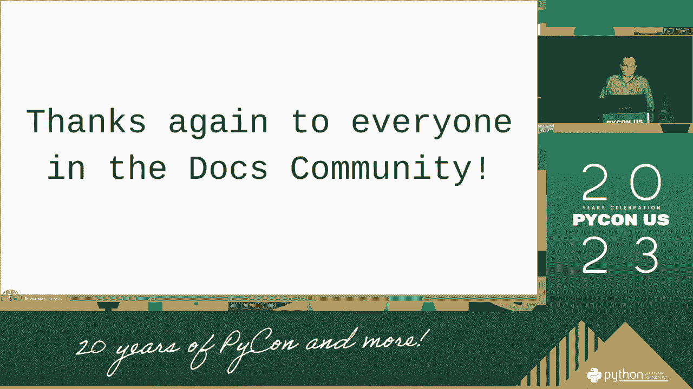

**感谢你的时间。**