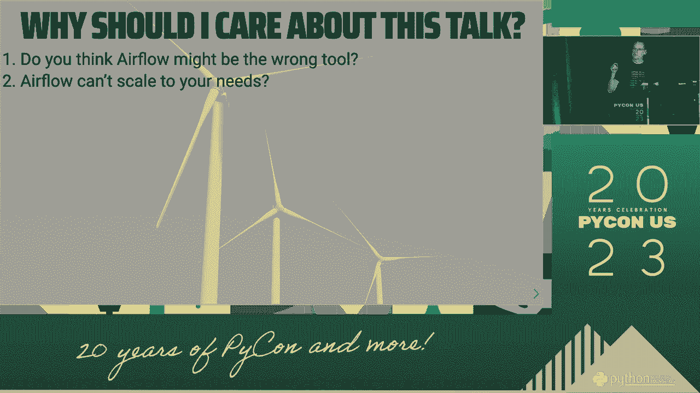
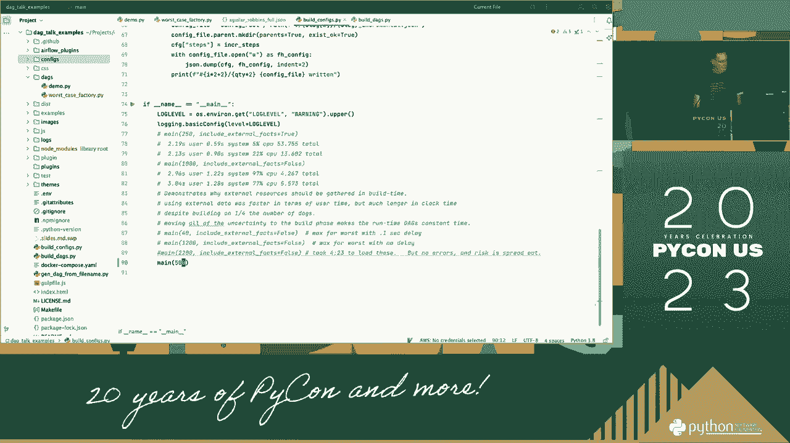
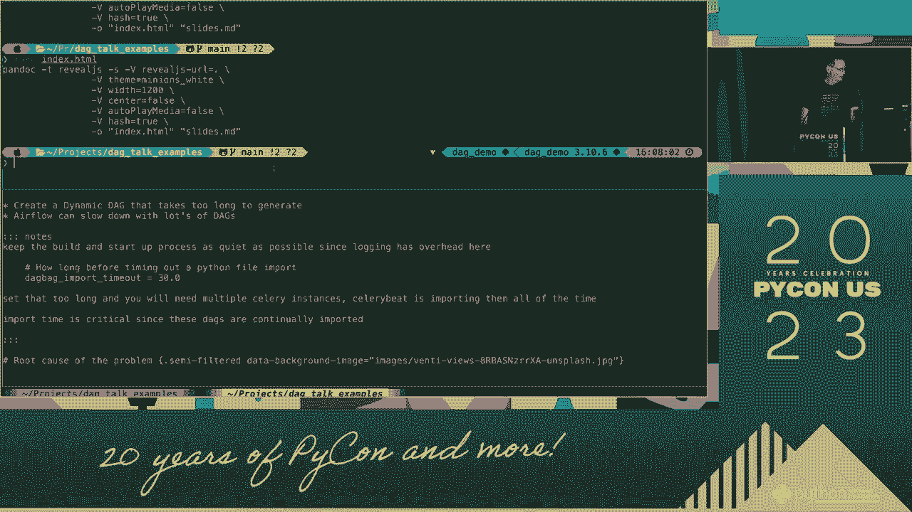
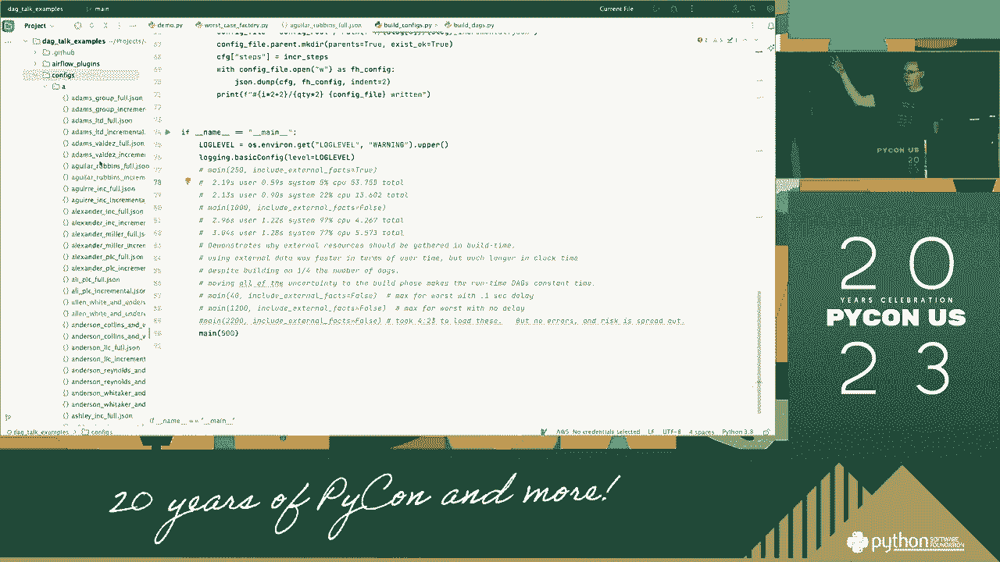
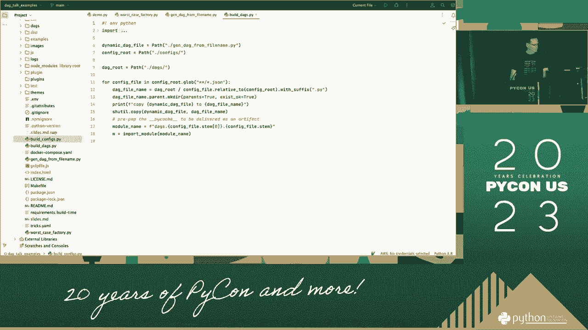
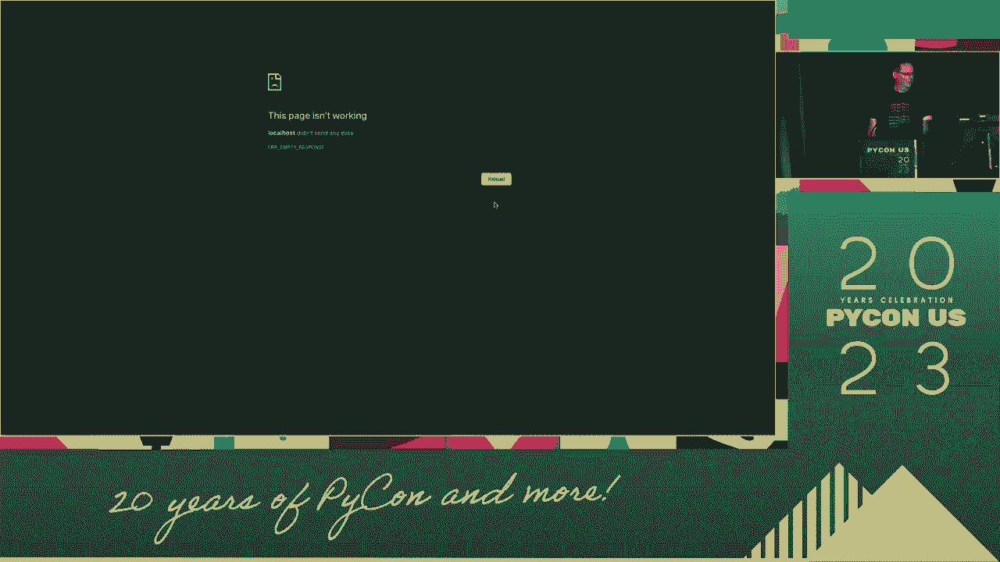
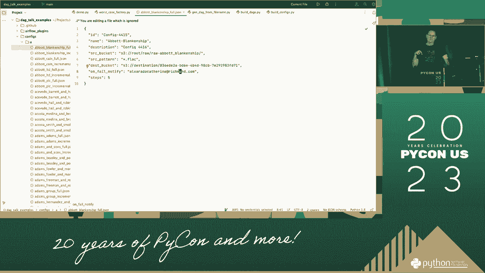

# 024：卡尔文·亨德里克斯-帕克演讲解析 🎤


在本节课中，我们将一起学习如何准备和进行一次有效的演讲。我们将通过分析卡尔文·亨德里克斯-帕克的一次演讲，来了解演讲的核心要素、准备流程以及如何与观众建立联系。课程内容将涵盖从前期准备到现场演示的各个环节，旨在帮助初学者掌握基础的演讲技能。



## 演讲技巧：P24：1：演讲准备与开场 🧭

上一节我们介绍了课程概述，本节中我们来看看演讲的准备工作与开场。

演讲的成功始于充分的准备。你需要规划日程，了解观众，并准备好演示材料。例如，卡尔文提到他会在早上完成准备工作，并与相关人员进行沟通。

以下是演讲准备的关键步骤：

*   **规划日程**：将你的演讲时间与个人日程进行比较，确保有充足的时间准备。
*   **了解观众**：观察并思考你的观众是谁，他们可能关心什么。
*   **准备材料**：确保所有演示材料，如图片、幻灯片等，都已准备就绪。例如，可以拍摄360度全景照片来丰富演示内容。
*   **提前沟通**：与活动组织者或相关团队进行对话，确认细节。


一个有力的开场至关重要。它需要吸引观众注意力，并阐明演讲的核心价值。卡尔文指出，演讲的存在是因为观众在寻找特定的解决方案或工具。

## 演讲技巧：P24：2：演示结构与核心价值 💡

上一节我们探讨了演讲的准备与开场，本节中我们来看看如何构建演示内容并传达核心价值。

演示的结构应该清晰，引导观众从起点走向终点。核心在于向观众展示你所提供的内容能如何解决他们的问题，并带来长远利益。

演示通常遵循一个简单的路径结构，可以用以下伪代码表示：

```python
开始演示()
    展示问题或需求
    呈现解决方案或工具
    阐明核心价值与长远益处
结束演示()
```

在这个结构中，**核心价值**是中心。它可能是为某个特定案例提供解决方案，或是提供一个能持续多年产生影响的工具。例如，卡尔文提到，一个合适的工具可能价值数千美元，但它在长远上对用户有帮助。


流程的最后部分，也是最重要的部分，是保持**诚实**。诚实对待你将要做的事情和你将提供给观众的内容。





## 演讲技巧：P24：3：互动与用户界面应用 🖥️

上一节我们讨论了演示的结构与价值主张，本节中我们来看看如何通过互动和工具应用来增强演讲效果。



演讲不仅是讲述，更是与观众的互动。你可以邀请观众参与某些环节，或者演示如何使用一个用户界面（UI）来完成特定任务。反复强调工具或界面的可用性，可以加深观众的印象。


卡尔文在演讲中多次强调“你也可以使用你的界面”，这突出了工具的实用性和可操作性。

以下是增强演讲互动性的方法：

*   **邀请参与**：设计一些观众可以做的事情，让他们感觉自己是演讲的一部分。
*   **工具演示**：现场展示如何使用一个软件界面或工具来解决实际问题。
*   **重复关键点**：对于核心功能或优势，通过重复来强化观众的记忆。


通过实际演示界面操作，可以让抽象的概念变得具体可见。例如，展示如何在一个系统中输入指令并获得结果。


持续地展示和说明界面操作，能帮助观众理解工作流程。

## 演讲技巧：P24：4：深入操作与细节展示 🔍

上一节我们介绍了互动与界面演示，本节中我们将更深入地探讨具体操作和细节展示。

为了使演讲内容扎实可信，需要深入展示工具或方法的操作细节。这包括展示不同的功能模块、处理步骤以及可能的结果输出。

卡尔文通过不断展示“使用你的接口”和呈现相关图示，来详细说明操作过程。这种细致的展示有助于建立专业性和可信度。

深入操作演示可以遵循以下逻辑：

1.  **功能分解**：将复杂工具分解为多个可管理的功能点。
2.  **步骤演示**：逐步展示每个功能是如何使用的。
3.  **结果验证**：展示操作后产生的具体结果或数据。


例如，在演示一个数据处理接口时，可以依次展示：**输入数据** -> **调用处理函数** -> **查看输出报告**。


对于关键步骤或复杂环节，可以使用图表或示意图进行辅助说明，确保观众能够跟上节奏。



## 演讲技巧：P24：5：总结与闭环 ✅

上一节我们完成了对操作细节的深入探讨，本节中我们将对整场演讲进行总结与闭环。

演讲的结尾需要有力地总结核心观点，并再次强调它能给观众带来的益处。回顾整个演示路径，从发现问题到提供解决方案，最后落脚于它将如何在未来持续发挥作用。

一个有效的总结公式是：



**总结 = 重申核心问题 + 概括解决方案 + 强调长远价值**

卡尔文指出，演讲的结束部分是诚实的，并且关乎你将为人们做的事情。这意味着你的承诺和总结必须真实、可信。


最后，可以留下一个清晰的行动号召或思考点，让观众在离开后有所收获。例如，鼓励他们尝试使用演示过的工具，或者思考如何将演讲中的概念应用到自己的领域。


通过完整的演示和总结，确保你的演讲信息形成一个闭环，给观众留下深刻而完整的印象。

---



本节课中我们一起学习了如何进行一场完整的演讲。我们从**前期准备**和**开场**入手，学习了如何了解观众和准备材料。接着，我们探讨了如何构建清晰的**演示结构**，并传达能解决实际问题的**核心价值**。然后，我们研究了通过**观众互动**和**界面演示**来使演讲更加生动和可信。最后，我们强调了**深入展示操作细节**的重要性，以及如何做一个有力的**总结**来闭环整个演讲。记住，成功的演讲在于充分的准备、清晰的结构、实用的价值以及真诚的沟通。

