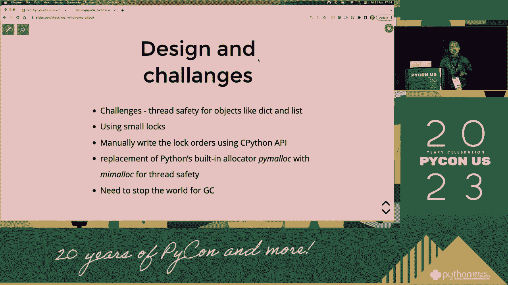
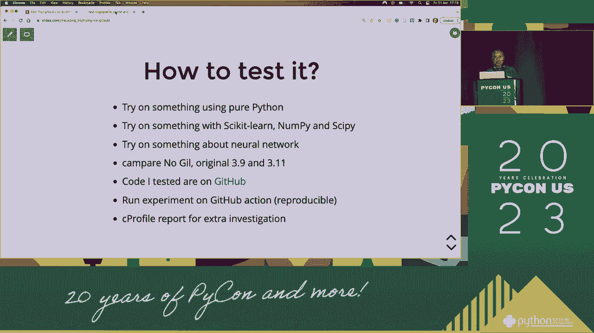

# 025：尝试不使用GIL 🧪


在本节课中，我们将探讨在Python科学编程中尝试绕过全局解释器锁（GIL）的动机、挑战与实践方法。GIL是Python多线程编程中的一个核心概念，它限制了多线程的并行执行能力。我们将学习为何在某些科学计算场景下需要规避GIL，以及如何通过特定的技术和模式来实现。

## 概述：为何关注GIL？ 🤔

上一节我们介绍了课程主题，本节中我们来看看GIL为何成为科学编程中的一个关注点。全局解释器锁（GIL）是CPython解释器中的一个机制，它只允许一个线程在同一时刻执行Python字节码。这对于CPU密集型的科学计算任务来说，可能成为一个性能瓶颈。

**核心公式**：在CPython中，GIL的存在意味着多线程并不总能带来性能提升，尤其是在计算密集型任务中。其影响可以简化为：
`有效并行度 ≈ 1（对于纯Python CPU密集型线程）`

## GIL的工作原理与影响 ⚙️

理解了关注GIL的原因后，我们来深入了解它的工作机制。GIL确保了对Python对象的访问是线程安全的，但它也阻止了多核CPU被多个Python线程充分利用。

以下是GIL带来的主要影响：

*   **限制并行**：多个线程无法同时执行Python代码，即使有多个CPU核心。
*   **I/O密集型优势**：在等待I/O（如文件读写、网络请求）时，线程可以释放GIL，因此多线程对I/O密集型任务仍有好处。
*   **计算密集型瓶颈**：对于纯粹的科学计算，多线程可能无法加速，甚至因锁竞争而变慢。

## 尝试规避GIL的动机 🎯

既然GIL对并行计算有限制，那么科学家和开发者自然希望找到绕过它的方法。本节我们将探讨尝试不使用GIL的核心动机。

我们想要摆脱GIL，主要是为了释放硬件的全部潜力。在科学计算、机器学习和大规模数据处理中，能够进行真正的并行计算至关重要。这可以显著缩短实验和模型训练的时间。

## 规避GIL的实践策略 🛠️




明确了动机，接下来我们看看有哪些实际策略可以尝试。这些方法各有优劣，适用于不同场景。

以下是几种常见的规避GIL的策略：

1.  **使用多进程（`multiprocessing` 模块）**：创建多个独立的Python解释器进程，每个进程有自己的GIL，从而实现真正的并行。这是最直接、最常用的方法。
    ```python
    from multiprocessing import Pool
    def compute(data_chunk):
        # 密集型计算
        return result
    with Pool(processes=4) as pool:
        results = pool.map(compute, large_dataset)
    ```

2.  **使用替代解释器**：如Jython或IronPython，它们没有GIL，但可能不兼容所有C语言扩展。



3.  **将关键代码移至C扩展**：在C扩展中，可以手动释放GIL，从而允许其他线程运行。这需要C语言编程知识。
    ```c
    Py_BEGIN_ALLOW_THREADS
    // 执行不涉及Python API的耗时C代码
    Py_END_ALLOW_THREADS
    ```

4.  **使用专为并行计算设计的库**：例如 `NumPy`、`SciPy` 或 `TensorFlow`/`PyTorch` 的某些操作，其底层实现是用C/C++编写的，并在内部释放了GIL，因此可以在多线程中高效运行。


5.  **探索无GIL的Python分支或未来版本**：社区一直在讨论移除GIL的可能性，可以关注相关PEP（Python增强提案）和实验性分支。

## 案例分析与选择建议 📈

学习了多种策略后，我们通过一个案例来思考如何选择。假设我们有一个计算量巨大的模拟任务。

在这种情况下，使用 `multiprocessing` 模块通常是首选。它避免了GIL限制，且编程模型与多线程相似。然而，进程间通信（IPC）开销比线程大，且内存占用更高。如果任务涉及大量共享状态，则需要使用 `multiprocessing` 提供的 `Queue`、`Pipe` 或 `Manager` 来进行进程间通信。

## 总结与展望 📚

本节课中我们一起学习了Python中全局解释器锁（GIL）在科学编程中的影响以及规避它的方法。

我们了解到，GIL是CPython为简化内存管理而引入的机制，但它限制了多线程的并行计算能力。为了在科学计算中实现真正的并行，我们可以采用多进程、使用特定计算库、或将关键部分移至C扩展等策略。每种方法都需要权衡易用性、性能和开发复杂度。未来，随着Python语言的演进，我们或许能看到GIL被进一步优化或移除的解决方案。


对于初学者而言，从 `multiprocessing` 模块开始实践是理解并行概念和规避GIL限制的良好起点。