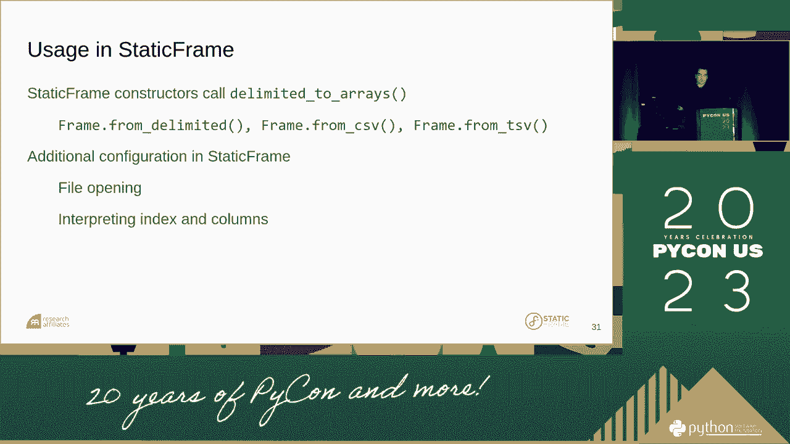
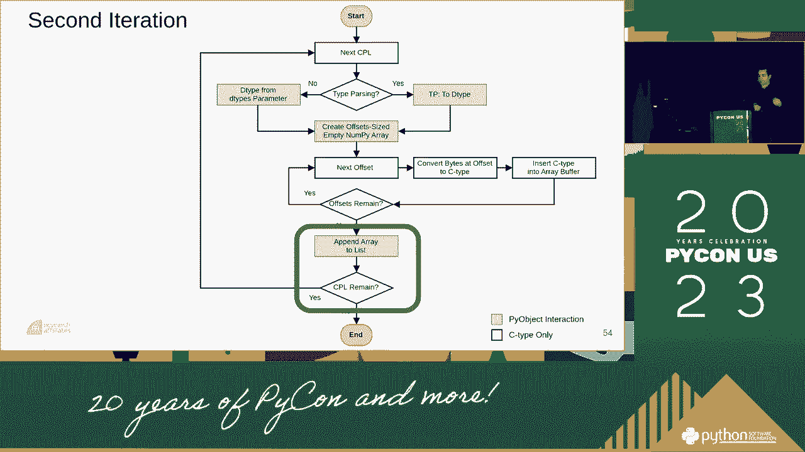
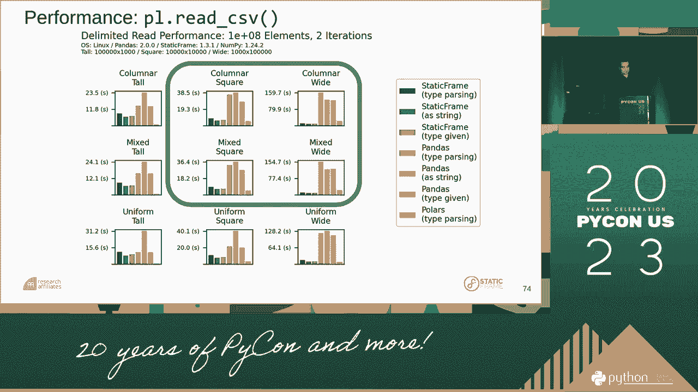

# 026：从 CSV 文件高效构建 NumPy 数组 🚀


在本教程中，我们将学习如何从 CSV 文件高效地构建 NumPy 数组。我们将探讨传统方法（如 Pandas）的局限性，并深入理解一种基于 Python 标准库 `csv` 模块核心解析器的高性能解决方案。课程将涵盖核心概念、实现步骤以及性能对比，旨在让初学者掌握构建快速、灵活的数据读取工具的方法。


## 概述与背景 📖

上一节我们介绍了本课程的目标。本节中，我们来看看演讲者 Christopher 的背景及其项目动机。Christopher 是 RUSCA-CADER 的首席技术官，自 2000 年起使用 Python。他最初用 Python 构建金融系统，并创建了一个基于不可变数据模型的培训网站。本次分享的核心，源于他对 Python 标准库中一个高效但古老的 CSV 解析器 `student-in-`（实为 `csv.reader` 的早期核心）的深入理解和改造。

## 现有工具的挑战 ⚠️

上一节我们了解了项目背景，本节中我们来看看在数据处理中，尤其是从 CSV 读取数据到 NumPy 数组时，常用工具存在哪些挑战。

以下是 Pandas 库在特定场景下的一些局限性：

*   **类型推断开销**：Pandas 会自动推断每列的数据类型，这个过程可能带来性能开销。
*   **对象类型泛滥**：对于无法立即识别的类型（尤其是字符串），Pandas 会使用 Python 对象（`dtype=object`）来存储，这非常消耗内存和计算资源。
*   **缺乏细粒度控制**：用户难以在读取阶段精细控制每列的类型转换和处理逻辑。
*   **大整数支持**：对于超出标准整数范围的数值，支持可能不完善。
*   **非标准类型**：对复杂或非标准数据类型（如特定格式的时间、枚举等）的支持有限。

这些限制在处理大型或特殊格式的 CSV 文件时，可能导致性能瓶颈或功能缺失。

## 核心解决方案：`csv` 模块与类型推断 🧠

上一节我们探讨了现有工具的不足，本节中我们来看看提出的核心解决方案。其灵感来源于 Python 标准库 `csv` 模块中的高效解析器。该解析器的核心是一个状态机，它逐字符处理文本，性能很高且可配置。

关键思路是复用这个稳健的解析器来获取原始的、分好列的字符串数据，然后绕过 Pandas 的对象系统，直接将这些字符串转换为目标 NumPy 数据类型（C 类型）。这样可以避免创建大量 Python 中间对象。


核心流程可以用以下伪代码描述：

```python
# 伪代码：核心两步流程
1. 使用 csv 模块的核心分词器逐行解析 CSV，将结果存储为字符串列表的列表（或更高效的结构）。
2. 遍历这些字符串，根据每列的目标类型（如 int32, float64, `U10` 等），直接将其转换为对应的 C 类型并填充到预分配的 NumPy 数组中。
```

## 实现架构：分词器与缓冲区 🏗️

上一节我们介绍了核心思路，本节中我们来看看具体的实现架构。实现主要分为两个部分：分词器（Tokenizer）和缓冲区管理。

以下是实现中的关键组件：




*   **代码点运行器（Code Point Runner）**：这是对 `csv.reader` 核心状态机的封装。它读取输入（文件或迭代器），按 CSV 方言规则将流分解为一个个字段（字符串）。
*   **代码点网格（Code Point Grid）**：这是一个临时的数据结构，用于在解析过程中按列收集字段。它通常包含两个动态数组：
    *   `缓冲区（Buffer）`：一个连续的字符数组，存储所有字段的原始字符数据。
    *   `偏移量数组（Offset Array）`：记录每个字段在缓冲区中的起始位置和长度。
*   **字段访问**：通过偏移量数组，可以快速定位和提取任何一个字段的字符串内容，而无需创建单独的 Python 字符串对象，直到必要时。

这种设计使得在解析阶段能够高效地组织数据，为后续的类型转换做好准备。

## 从文本到 NumPy 数组：转换过程 🔄

上一节我们了解了数据在内存中如何被组织，本节中我们来看看如何将文本数据最终转换为 NumPy 数组。这是性能提升的关键步骤。

转换过程遵循以下步骤：

1.  **初始化**：确定目标 NumPy 数组的形状（行数、列数）和每列的数据类型。类型可通过自动推断、用户指定或结合两者获得。
2.  **预分配数组**：根据形状和类型，预先分配好最终的 NumPy 数组（一个二维数组或结构数组）。此时数组内容为空。
3.  **逐列填充**：
    *   对于每一列，从“代码点网格”中获取该列所有字段的字符串视图。
    *   使用该列目标数据类型（如 `np.int32`）的转换函数，直接将字符串批量转换为 C 类型数据。
    *   将转换后的数据块直接写入预分配的 NumPy 数组的对应列中。
4.  **完成**：所有列填充完毕后，即得到最终的 NumPy 数组。整个过程最大限度地减少了 Python 对象的创建和复制。

## 性能对比与基准测试 📊

上一节我们描述了高效的转换流程，本节中我们通过基准测试来量化其性能优势。测试通常对比三种场景：



1.  **完全类型推断**：工具自动推断所有列的类型。
2.  **无类型推断（全部作为字符串）**：所有列均作为 Unicode 字符串（`U` 类型）读入。
3.  **用户指定类型**：提前为所有列提供明确的数据类型。


以下是典型的性能发现：

*   在**宽表格**（列数很多）和**完全类型推断**的场景下，该方法的性能通常比 Pandas 的 `read_csv` 快一个数量级或更多。
*   当所有数据都作为**字符串**读入时，由于 NumPy 的 Unicode 字符串类型本身涉及对象开销，性能优势会缩小，但仍可能优于或接近 Pandas。
*   **用户指定类型**时，性能最佳，因为它完全避免了类型推断的开销。
*   性能瓶颈分析显示，在 Pandas 中，将字符串列转换为 Python 对象（`dtype=object`）是主要的耗时操作之一。而本方法直接转换为 C 类型，避免了这一步。

## 高级功能与配置 ⚙️

上一节我们看了性能对比，本节中我们来看看该解决方案提供的一些高级配置选项，使其更加灵活。

用户可以通过参数自定义读取行为：

*   **指定列类型**：可以为特定列提供精确的 NumPy 数据类型。
*   **自定义转换函数**：可以为某一列提供一个函数，该函数接收原始字符串，返回转换后的值。例如，将特定格式的字符串转换为布尔值。
*   **使用自定义分词器**：可以传入符合接口的自定义分词器，以处理非标准 CSV 格式。
*   **跳过类型推断**：如果已知所有类型，可以关闭类型推断以提升速度。

这些功能使得该工具能够适应各种复杂的数据清洗和预处理需求。

## 总结与展望 🎯




本节课中我们一起学习了如何构建一个从 CSV 到 NumPy 数组的高性能读取器。我们回顾了现有工具（如 Pandas）的局限性，深入探讨了基于 Python 标准库 `csv` 模块核心解析器的解决方案架构。我们了解了其通过分词器获取原始文本、使用缓冲区管理数据，并最终高效转换为 C 类型 NumPy 数组的两阶段流程。基准测试表明，该方法在多数场景下，尤其是宽表和数据类型明确时，能带来显著的性能提升。


最后，这种模块化设计也为未来优化打开了大门，例如可以将最终的列转换步骤并行化，以进一步加速处理超大型数据集。通过借鉴并改造历经时间考验的底层代码，我们能够构建出既稳健又高效的现代数据处理工具。