# 027：使用 Pytest 测试航天器 🚀

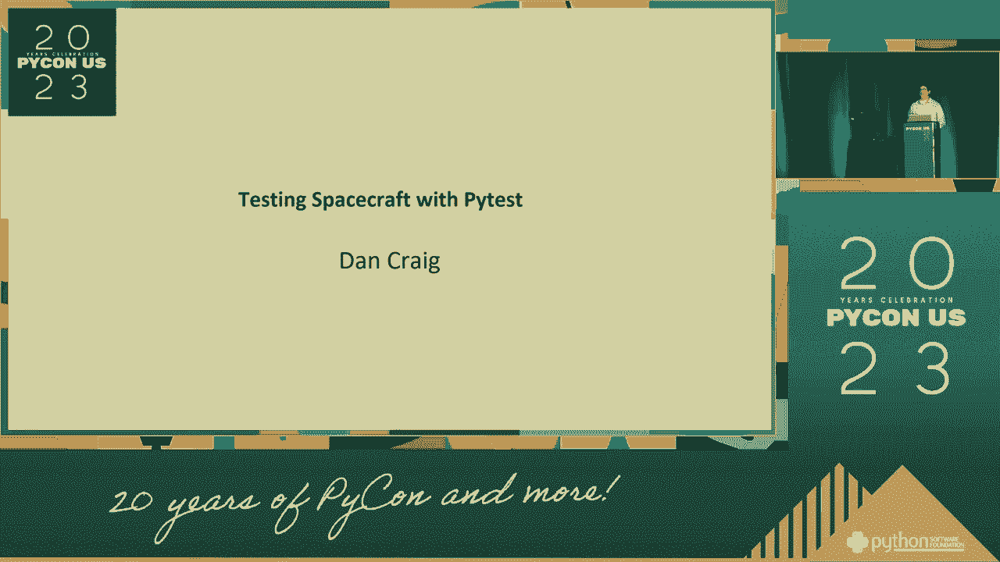


## 概述
在本节课中，我们将探讨在航天器软件开发中，如何使用 Pytest 框架进行有效测试。我们将分析航天软件测试面临的独特挑战，例如高可靠性要求、单次执行特性以及复杂的操作环境，并学习如何构建接近真实生产环境的测试体系来建立信心。

---

## 航天软件测试的独特挑战 🛰️

上一节我们介绍了课程概述，本节中我们来看看航天软件测试面临哪些不同于常规网络服务的挑战。

过去20年，软件测试的讨论大多由网络服务主导。网络服务固然重要，但航天软件需要考虑不同的决策和多样性，并更具可持续性。航天系统通常与博物馆、网络服务器、计算机中心或云计算远程相连，它们在通信上非常快速。其测试与发布流程与现代信息丰富的网站相似。

然而，关键区别在于，航天系统感觉像是一种新型网络。真正的一流系统仅在经过基于特定轨道的连接时，才拥有稳定的网络连接，可能只有几次机会。你通常没有物理访问权限去进行调试，具体取决于任务的时间安排。就像一个卫星，没有人可以进去重新配置。而你仍然真的处于一个测试阶段。最终，单个任务的影响，对航天活动而言是非常不同的。

---

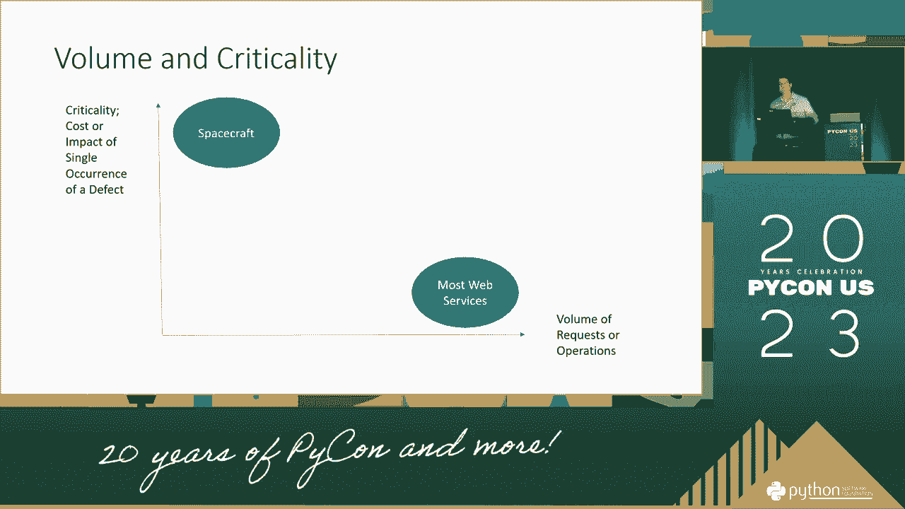

## 请求量与信用质量 📊


关于软件测试，我们需要思考请求量和信用质量这两个概念。

*   **请求量**：指的是你的软件正在执行的操作请求数量。
*   **信用质量**：指的是任何一个请求操作的重要性或关键程度。

大多数网络服务在底部运行，具有**高请求量**和**低信用质量**。例如，一个网络服务计划可能有成千上万的用户发出数百万次请求。如果生产环境中出现漏洞，它开始让你付出成本。但这通常不是致命问题，因为你处于如此高的容量中，大多数用户甚至可能不知道错误曾经发生过。

航天软件则完全相反，它是**低请求量**和**高信用价值**。例如，在一次火箭发射的重入序列中，你只会执行那一次关键操作。这不是日常工作，但在某个时刻它至关重要。

---

## 历史教训：软件缺陷的代价 💸

历史案例提醒我们软件缺陷可能带来的巨大代价。例如，某个航天器使用的软件包含一个小的快速对齐例程。在新一代航天器上，虽然不需要这个功能，但遗留的软件基础设施保留了下来。在这个对齐例程中，存在一个从 `64` 位到 `16` 位的数据转换错误。

旧型号航天器通过一个特定值得以规避此问题。但新型号更大，软件必须设计更保守的区域以便设备能够工作。他们在一个非常重要的部分上有一个代理来处理这个问题。甚至火箭在测试中也看到了异常，但不知道具体原因。

后来，一个测试单位运行了相同的软件，产生了完全相同的错误效应。这个漏洞导致了巨大的成本，因为它是我们软件中的一个大问题。问题在于，该软件是专门为错误配置进行测试的。

---

## 操作环境的重要性 ⚙️

我们可以从案例中带走可用的软件，它就是**操作环境**。你的软件运行的环境与代码本身同样重要。因为如果你的操作环境与测试和分析的环境不同，你可能会带着错误的信心进入生产阶段。

一个具体的例子是，一个在2015-2020年间发布的航天器，旨在部署一个太阳帆。它应该监测太阳风并调整姿态。然而，在轨运行时，一个持续15秒的信号问题，导致飞行计算机错误地消耗了大量推进剂。状态系统看到了异常并做出响应，最终触发了系统重启。我们能够完成那个任务，结果还算合理。

从这个案例我们学到，为什么软件防御可能随着时间的推移花费数百万？没有真正快速的策略。另一个积极的教训是，你如何知道一个潜伏六年的错误可以被部署。制造成功与服务之间的差异？时间线的水平是关键。

---

## 测试策略：跨越“原则”的鸿沟 🧪

我们要从中带走的是，我们可以以一种必须跨越“原则”地方的方式进行测试。这有两个原因：对原则的理解不同，以及原则实施的地点不同。如果没有这样的集成测试，那就是集成在一个仅硬件系统中。

那么对你来说重要的问题是，因为任务是要实现的。你的系统的两分钟表现，但你可能会被测试成可能的原则。如果你做不到，那么你需要进行重叠的集成测试。我在这里非常小心，关于现有系统A和B。同样的测试也必须重叠。否则，你会有一个测试覆盖的缺口。

---

## 建立信心：从“绝对不行”到“几乎肯定行” 📈

最终，你提出的问题，确实是你提问的社区方式。当你在生产环境中运行时，你可以看到它。对此有三个可以接受的答案：`没有`，`也许`，和`可能`。`是`，这不是对这个问题的可接受答案。这不是一个预测，而是一个可证伪的假设。

我们可能知道软件甚至无法编译，所以不可能在生产中运行。但我们永远无法完全确定它如何进入生产，同时仍然保留在生产中。我们剩下的是如何考虑这种情况？我们希望处在一个连续体上，介于“这绝对行不通”和“这几乎肯定行得通”之间。

我们需要获得信心，以便有更多的证据来支持我们的软件。并且更详尽地提供证据。尽管要进行严格的防御，我们在发布之前需要有更多的信心。

---

## 关键问题：需要多少信心？⏱️

所以现在我们必须问，真正需要多少信心？这涉及到成本、努力和时间。如果这真的无关紧要，出错了又何妨？那你为什么要花费努力，确保你能做到99%的正确呢？这个问题要如何成功？

对于航天软件，**在生产中第一次工作有多关键**？这回到我之前所说的个性卷。对于火箭来说，第一次在生产中运行，就是它执行任务的时候。而其他一切都是测试。因此，你需要只做一次。对于网络服务，我们可以采取很多步骤来减少关键性，例如在进入生产前就进行部署。这些技术都很好，它们所讨论的是减少“第一次在操作生产中”的关键性。

两者的成本环境最大程度上有多接近？在地面上模拟微重力、高辐射的真空环境非常困难，且成本高昂。所以我们需要更多的信心来面对，因为我们不知道在那种环境下软件的确切表现。如果我们能频繁地测试，你可以在每次操作中逐渐建立信心。但如果只做一次，而那一次火箭正要发射，我们就需要在发射前建立极高的信心。

---

## 监管与审计要求 📝

记住，监管工作并不是为了帮助你，而是一个问题。监管的职责是保护公共资金的价值。他们通过要求你遵循流程来做到这一点，最终会涉及审查软件、系统和将被存储的数据。因此，他们需要能够看到你所说的事情是否得到了执行。

这也涉及到在每次测试中留下审核和编辑的记录，确保你知道你在宣布什么。那么，我们如何避免错误呢？这就是为什么要建立信心。因此，我们对它们进行了定义，例如定义“等待类”供我们观察。我们有两组负责监督的人员，技术含量更高。我们把输入系统放在硬件和集成测试上。但我们确实有单元测试，这对我们的技术和开发信心很有用。

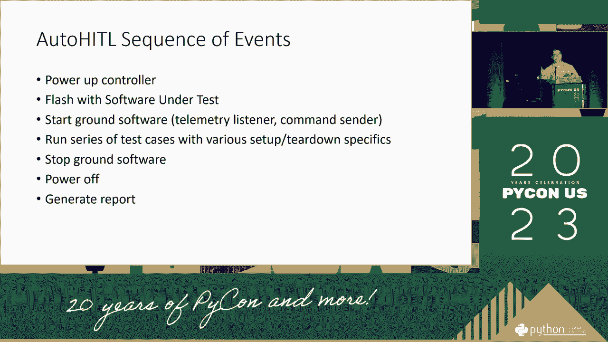

我们定期进行全面的硬件和集成测试。我们尽可能做到这一点。试图辩解不运行测试，因为这会增加报告，是不可取的。我们确实有长期的历史测试覆盖。

---

## 构建测试环境：从桌面到“类飞行” 🖥️->🛰️

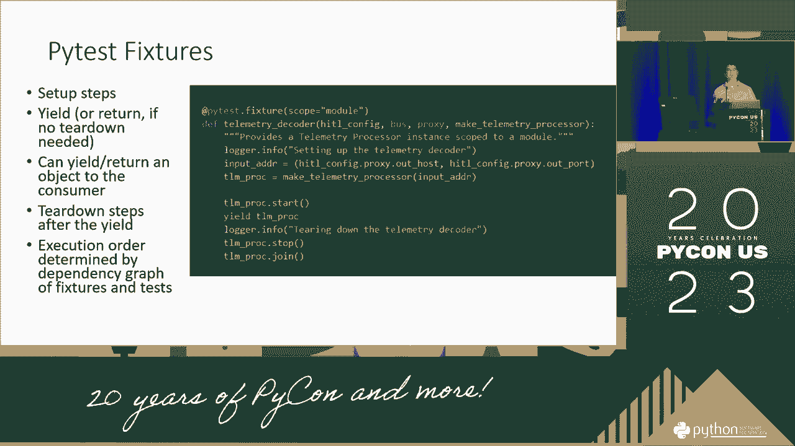

我们如何在测试环境中模拟飞行环境？我们划分硬件，以及测试场的硬件和测试场域。我们从查看实际的组装开始。测试场的后端是社区的数据，另外两台是社区的，测试场域在后端，总线提供电源。数据需要运行，一切都在操作中，但需要自动化。

更好的测试场域是我们所称的“类飞行控制”，这正是我们的重点。例如，在家里就很好。在那两台不同的计算机上运行，几台不同的计算机是某些接入节点。为了产生不同，这两台计算机可以连接起来，针对不同的外设运行。

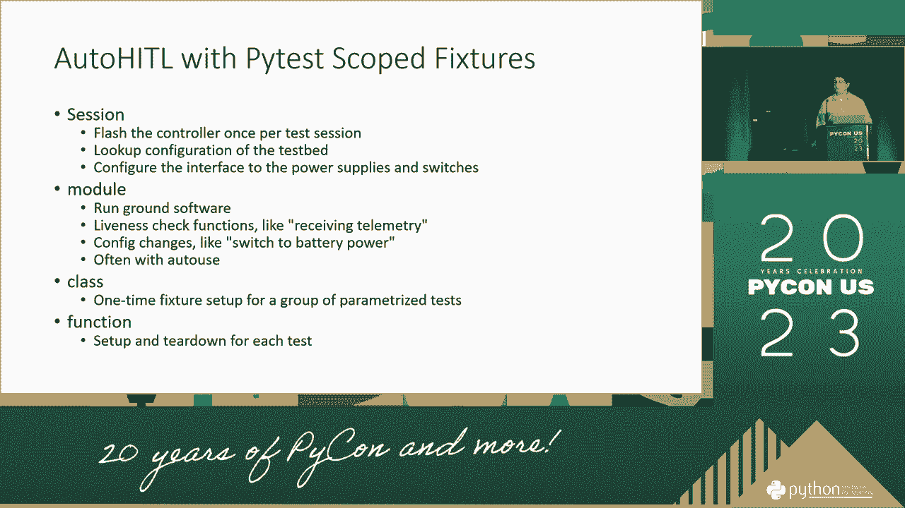

一个简单的测试床，你会把所有组件拿出来，把控制台的组件摆放在桌子上。我们会有控制器、GPS和新设备，也连接了手机和桌子。由于计算机无法直接要求，你可以直接看到电力并去操作它们。这个测试服务器是为了共享所有节点，并控制一些开关。这是一个非常好的恢复测试方式。

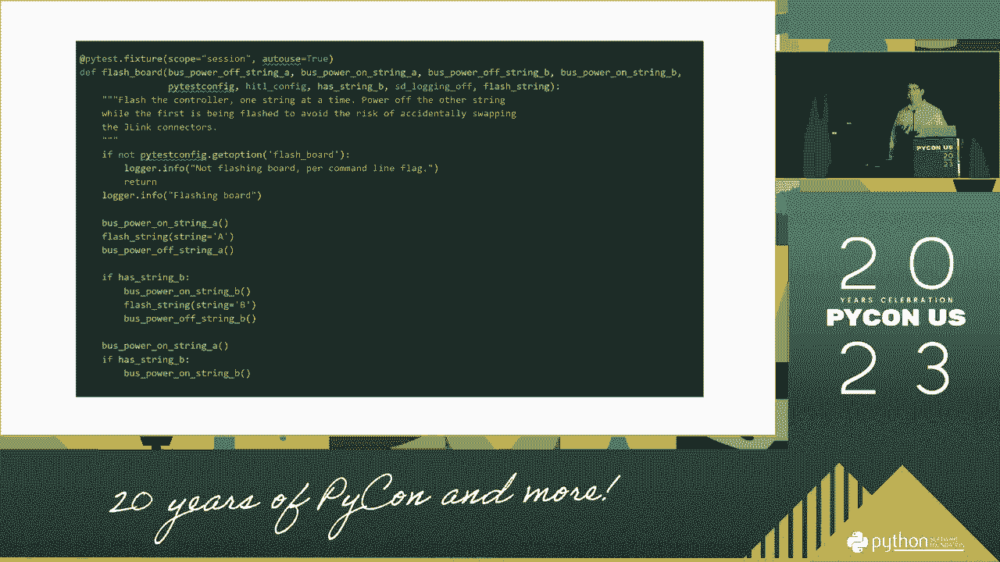

---

## 使用 Pytest 进行自动化测试 🐍

我们进行测试使用 Pytest。我们有许多不同的测试。Pytest 允许我们由测试数据和测试函数定义测试。我们定义一个功能，你可以在某个时刻运行设置步骤，然后执行测试并验证产出。

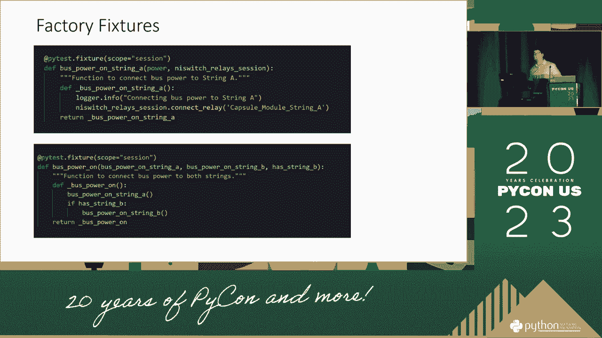

以下是一个简单的 Pytest 测试示例结构：
```python
def test_something():
    # 设置步骤
    setup_data = do_setup()
    # 执行操作
    result = perform_operation(setup_data)
    # 断言验证
    assert result == expected_value
```

测试的另一个重要部分是测试数据的依赖和构建顺序。我们定义了它，我们可以依赖它。测试数据可以依赖其他测试数据。这由依赖图定义，决定了测试的执行效率。

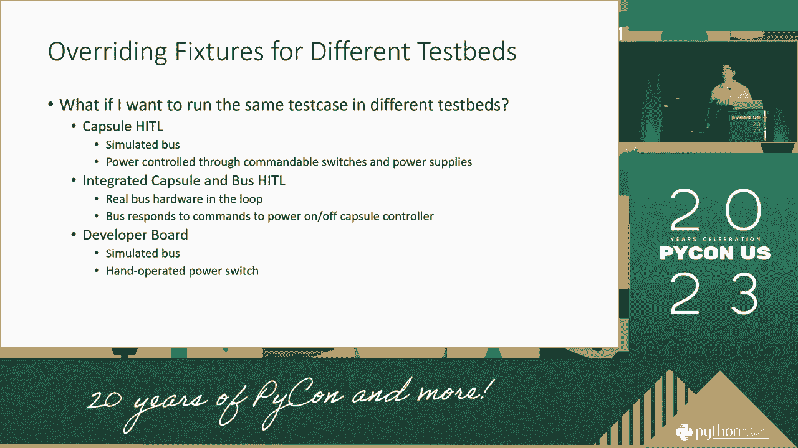

我们可以在模块级别运行测试。就像我们想切换一个配置时，我们可以取出电源。并通过该文件中的测试数据运行它。如果你想做一次性测试数据，那么你想切换这些数据。然后通过参数化测试运行。

---

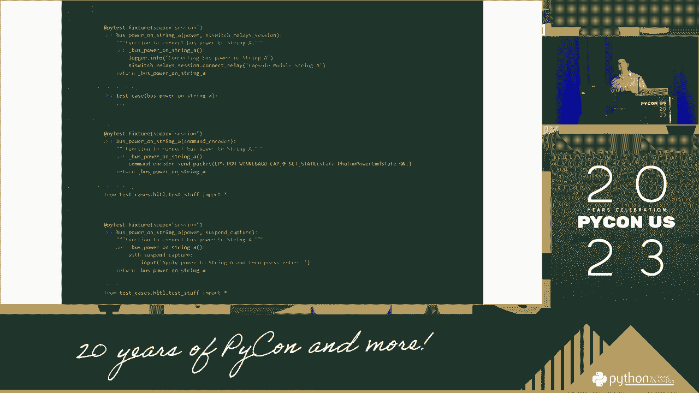

## 参数化测试与模拟 🔄

我们可以通过在我们的测试案例中定义三个不同的文件夹来实现参数化测试。一次是整体，一次是平面侧，我们称之为集成测试导向的数据在这个环境中，而在一个总线文件中，我们可以在其中一个文件夹中定义我们的测试案例，然后只需将其导入到另一个中。

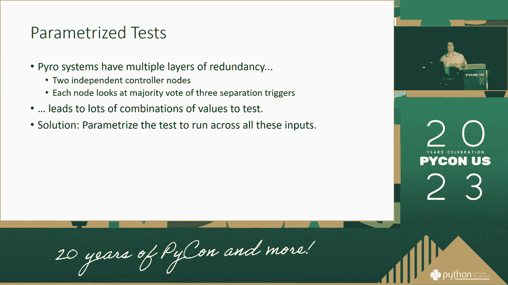

这是逻辑发生的地方，我们定义了相同的测试，在三个不同的环境中运行。例如，一个测试是针对所有硬件，另一个测试是针对模拟环境。我们希望处理一个开关，这样我们就能关闭那个真实的开关。然后，我们总是这样做，然后在环境的两侧整合它。

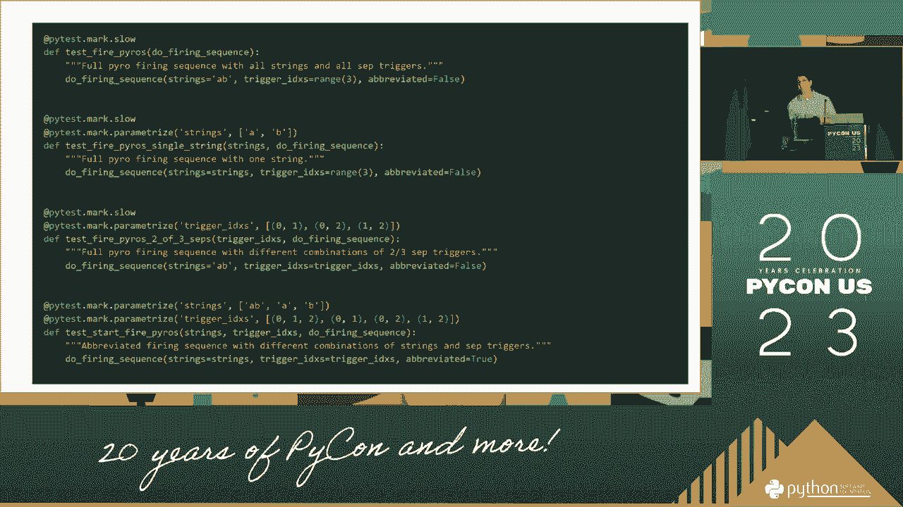

这个过程需要将命令发送到总线。而在底部，我们称之为用户。现在，这个测试变得非常简单。它只需在不同的环境中测试命令。

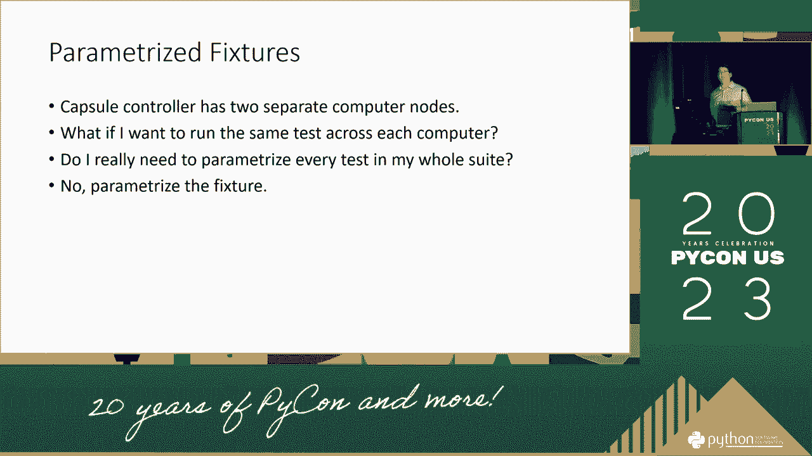

---

## 处理复杂系统：多数投票与参数化 🗳️

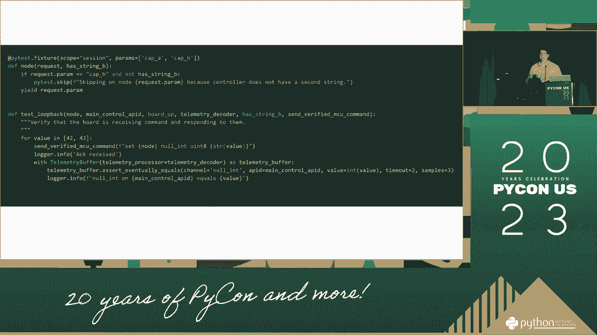

在其他情况下，我们需要优先考虑测试。在这些情况下，我们的飞行系统有很多层次的冗余。例如，我们有两个控制器节点。它们都来自不同的接收器，并且是双冗余的。在相同的时间可以单独在测试中发起。在每个节点中，它也在查看三种不同分离情况的多数投票。

所以，有很多组合方式。解决这个问题的方法是对这些测试进行参数化。因为所有这些都是写好的命令。我们可以有不同的测试来运行完整的组合。我们实现了所有组合的乘法。这里只是有不同的参数组，来进行这些测试。它能很好地减少测试代码的重复。

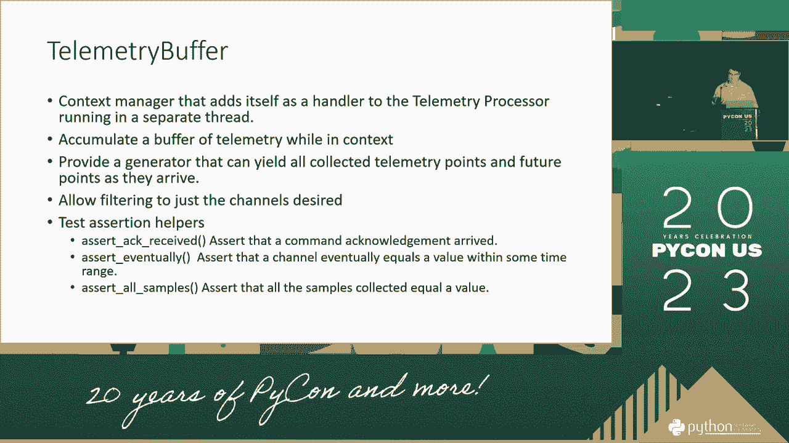

---

## 模拟时间与异步操作 ⏲️

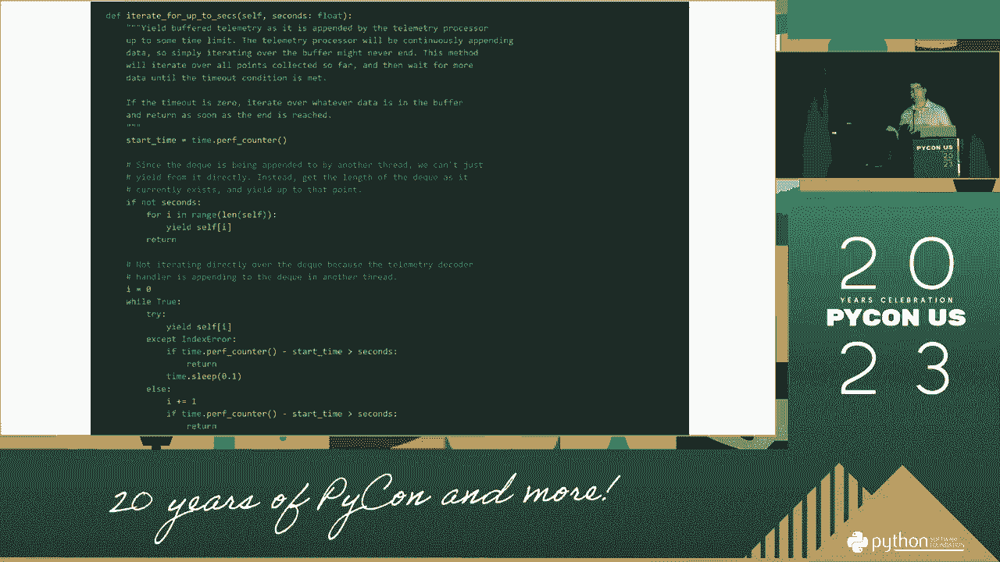

有时候这还不够。有时候，我们需要让测试变得更简单。例如，在测试中模拟时间流逝。一个航天器指令可能只是几个请求，但没有像阻塞等待响应那样的东西。所以，我们将进入，并且我们只需等待直到状态改变。我们不想等到真实50小时的时间。

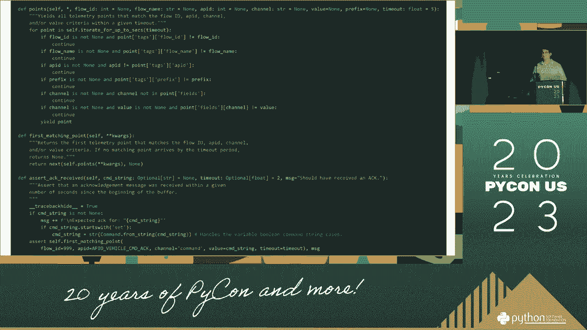

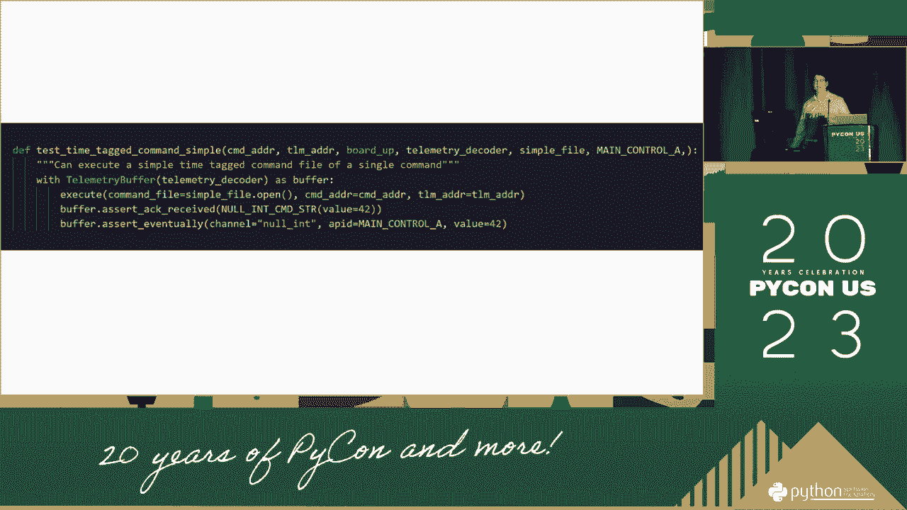

所以，每当有上下文测量时。我们称之为“数量”，然后有上下文，这只是一个模拟器。策略由一位策略引擎收集，运行在一个单独的线程上。现在我们可以提供一个生成器，可以将所有这些问题引导到一个状态函数上。然后，在某些时候，它是非常相关的。我们可以将其包装以便进行处理。

---

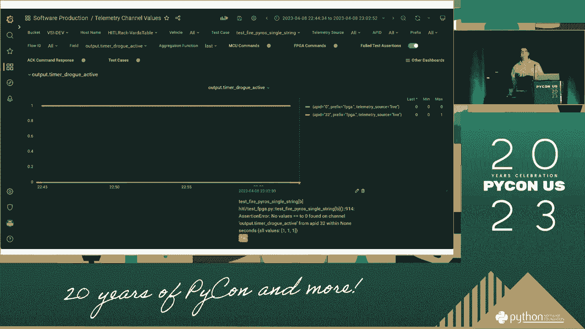

## 总结 🎯

本节课中我们一起学习了使用 Pytest 测试航天器软件的核心要点。

我们首先认识了航天软件**高信用质量、低请求量**的独特挑战，这与常规网络服务截然不同。通过历史案例，我们理解了**操作环境**与生产环境一致的重要性，以及软件缺陷可能带来的巨大代价。

接着，我们探讨了如何通过**跨越“原则”的集成测试**来填补测试缺口，并讨论了在**单次关键任务**背景下，建立足够信心的必要性与成本考量。我们还了解了**监管与审计**对测试流程的要求。

最后，我们深入到了实践环节，学习了如何构建从桌面到“类飞行”的**分层测试环境**，并详细介绍了如何利用 **Pytest 框架**进行自动化测试，包括**测试定义、数据依赖、参数化测试**以覆盖复杂冗余系统，以及**模拟时间和异步操作**等关键技术。

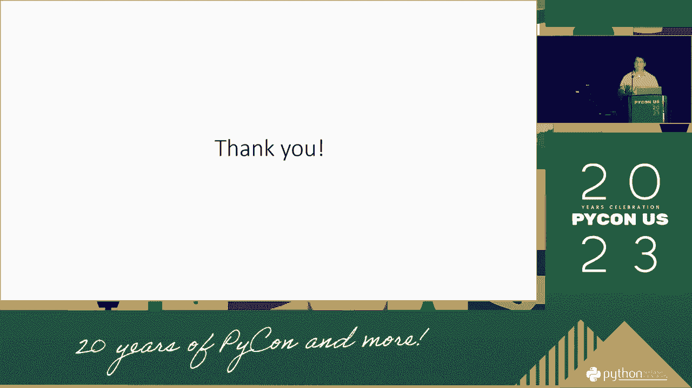

通过本教程，希望你能够理解航天级软件测试的严谨性，并掌握使用现代测试工具来应对这些挑战的基本方法。