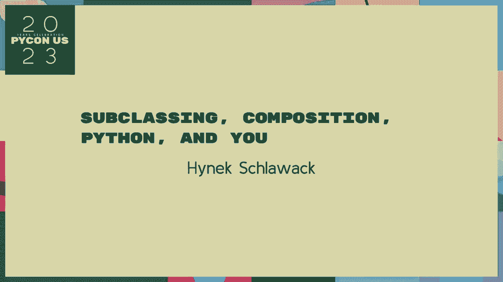
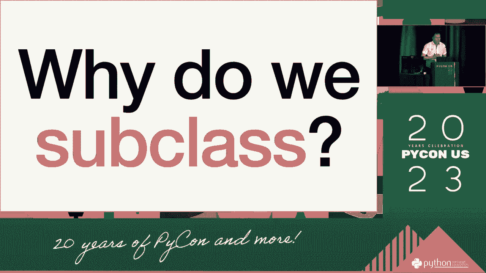
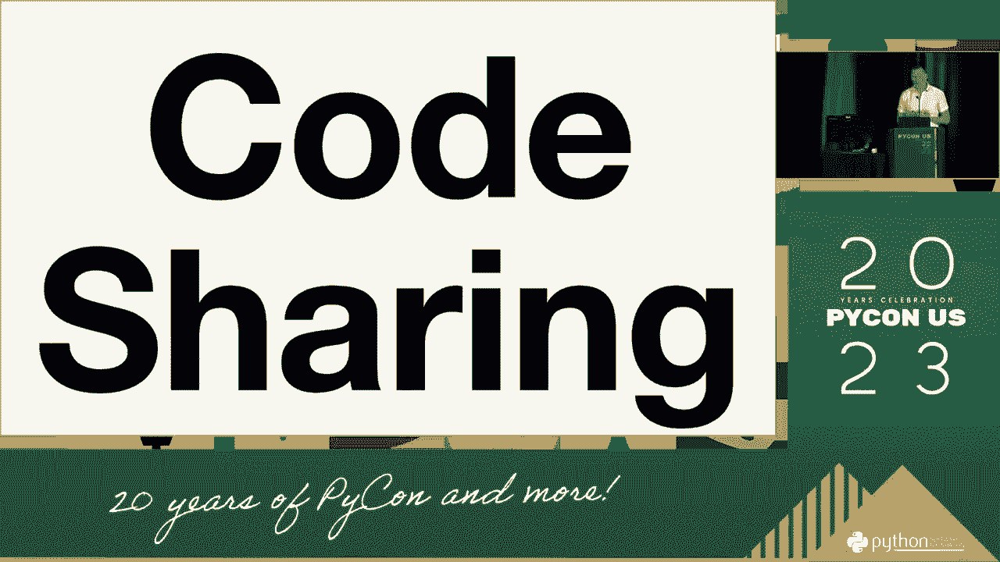
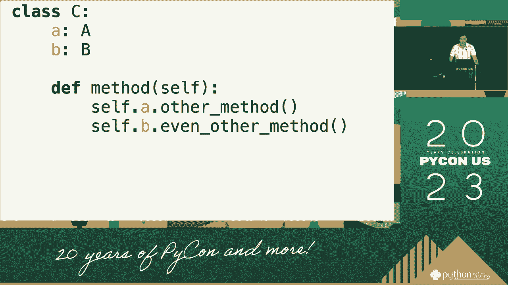
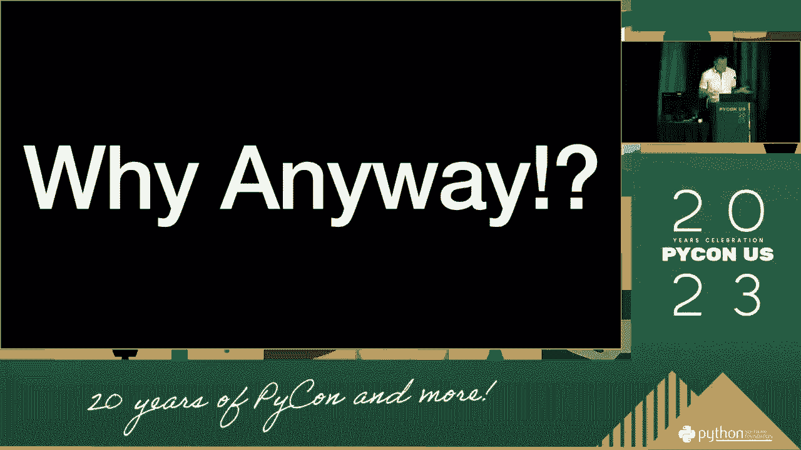
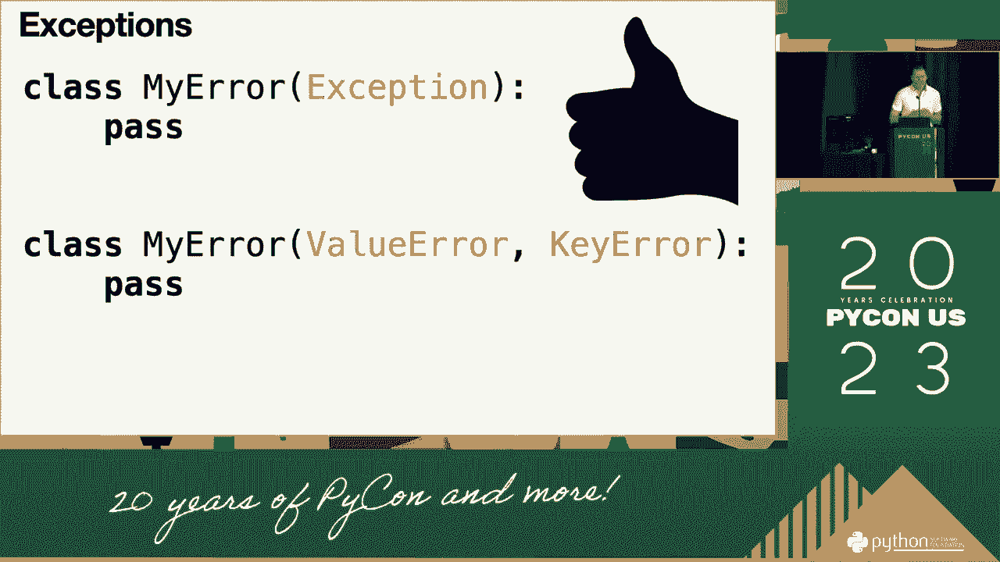
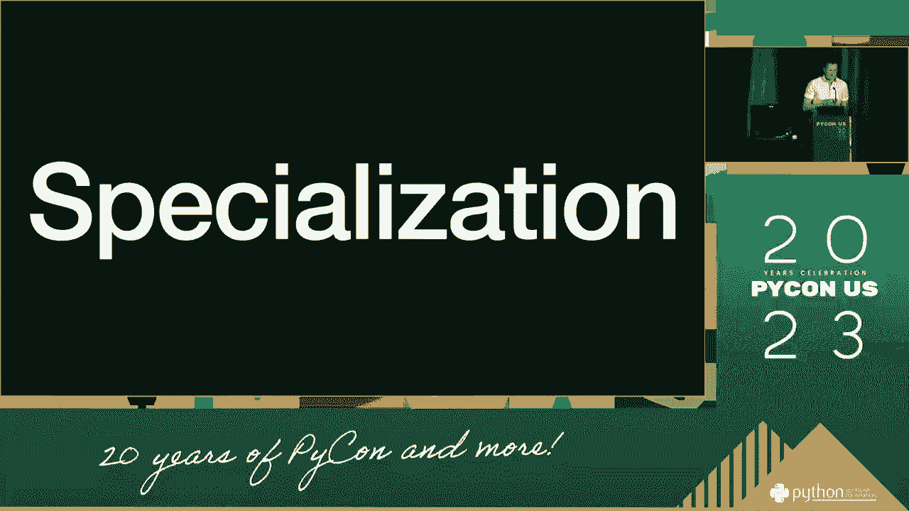
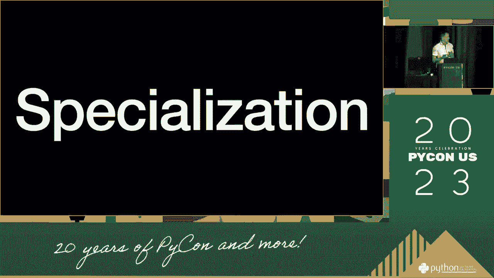
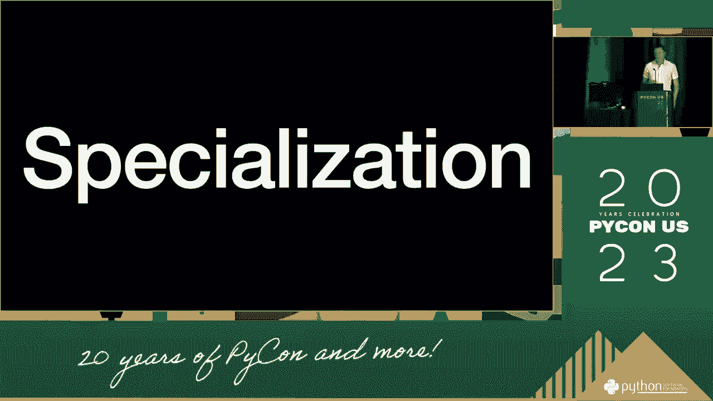
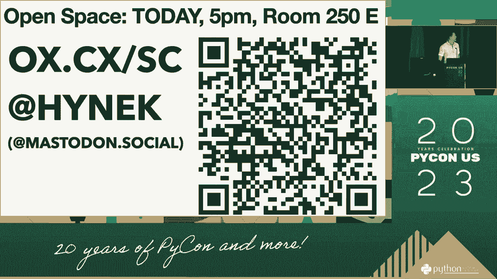

# 037：子类化与组合 🧩

在本节课中，我们将要学习面向对象编程中的两个核心概念：**子类化**和**组合**。我们将探讨它们各自的含义、优缺点，以及如何在Python中做出合适的选择，以构建更灵活、更易维护的代码。



## 概述

面向对象编程提供了多种代码复用和构建复杂系统的方式。其中，**子类化**和**组合**是两种最常用的技术。理解它们的区别和适用场景，对于设计良好的软件架构至关重要。

---

## P37：1：什么是子类化？🔗

子类化是面向对象编程中实现继承的一种方式。它允许我们创建一个新类（子类），从现有类（父类）那里继承属性和方法。

**子类化的核心公式**可以表示为：
`class SubClass(ParentClass):`



这意味着`SubClass`是`ParentClass`的一种特殊形式，它自动获得了父类的所有功能，并可以添加或修改自己的行为。



上一节我们介绍了课程主题，本节中我们来看看子类化的具体含义。

### 子类化的特点

以下是子类化的几个关键特点：

*   **“是一个”关系**：子类与父类之间是“是一个”的关系。例如，“狗”是“动物”，“正方形”是“形状”。
*   **代码复用**：子类可以直接复用父类的代码，无需重写。
*   **方法重写**：子类可以重写父类的方法，以提供特定的实现。
*   **紧密耦合**：子类与父类紧密绑定，父类的改动可能会影响所有子类。

---

## P37：2：什么是组合？🧱

组合是另一种代码复用技术，它通过将其他类的实例作为当前类的属性来构建更复杂的对象。它描述的是“有一个”的关系。

**组合的核心代码**描述如下：
```python
class Engine:
    def start(self):
        print("引擎启动")

class Car:
    def __init__(self):
        self.engine = Engine() # Car 有一个 Engine

    def start(self):
        self.engine.start()
        print("汽车启动")
```

上一节我们了解了子类化，本节中我们来看看它的替代方案——组合。

### 组合的特点

以下是组合的几个关键特点：

*   **“有一个”关系**：组合描述的是对象之间的“有一个”关系。例如，“汽车”有一个“引擎”，“电脑”有一个“CPU”。
*   **灵活性高**：可以动态地更换组成部分。例如，可以轻松地为`Car`更换不同的`Engine`。
*   **接口复用**：复用的是对象的行为（接口），而非实现。
*   **松耦合**：各个组件之间相对独立，修改一个组件对其他部分影响较小。

---

## P37：3：子类化 vs. 组合：如何选择？⚖️

在软件开发中，我们经常面临选择子类化还是组合的决策。这个选择没有绝对的对错，但有一些指导原则可以帮助我们。

上一节我们分别介绍了子类化和组合，本节中我们来比较它们，并学习如何做出选择。



### 选择指南

以下是一些帮助你做决定的关键考量点：



*   **优先使用组合**：这是现代软件设计的一个普遍原则。组合通常能带来更灵活、更松耦合的系统。
*   **检查关系类型**：如果两个类之间的关系是“是一个”，可以考虑子类化（例如`Manager`是`Employee`）。如果是“有一个”，则应该使用组合（例如`Library`有多个`Book`）。
*   **考虑变化频率**：如果父类经常变化，使用子类化可能会导致维护困难，因为所有子类都可能需要调整。组合更能适应变化。
*   **避免深度继承**：过深的继承层次会使代码难以理解和调试。组合可以帮助构建扁平化的结构。

---



## P37：4：在Python中的实践 🐍



Python语言的设计对这两种模式都提供了良好的支持，并且由于其动态特性，在某些方面为组合提供了便利。

上一节我们讨论了选择策略，本节中我们来看看在Python中的具体实践和注意事项。



### Python特有的考量



以下是在Python中使用子类化和组合时需要注意的几点：

*   **多重继承**：Python支持多重继承，这增加了子类化的能力，但也带来了“菱形继承”等复杂性，需要谨慎使用。
*   **Mixin类**：这是一种利用多重继承来实现代码复用的技术，它通常不独立使用，而是为其他类提供额外功能，可以看作是组合思想在继承体系中的一种应用。
*   **`__getattr__`方法**：通过重写此方法，可以实现一种动态的委托模式，这是实现组合和代理的强大工具。
*   **鸭子类型**：Python强调“鸭子类型”（如果它走起来像鸭子，叫起来像鸭子，那么它就是鸭子）。这减少了对显式继承的依赖，鼓励基于接口（方法）的设计，天然倾向于组合的思想。

---

## 总结

本节课中我们一起学习了面向对象设计中子类化与组合的核心概念。



我们了解到，**子类化**通过继承建立“是一个”的关系，适合表达明确的分类层次，但可能导致紧耦合。而**组合**通过包含对象建立“有一个”的关系，提供了更高的灵活性和松耦合性，是现代软件设计更推荐的方式。

在Python中，我们应该优先考虑使用组合，并利用鸭子类型、Mixin等语言特性来构建清晰、可维护的代码结构。记住，没有银弹，最好的设计总是依赖于具体的应用场景。