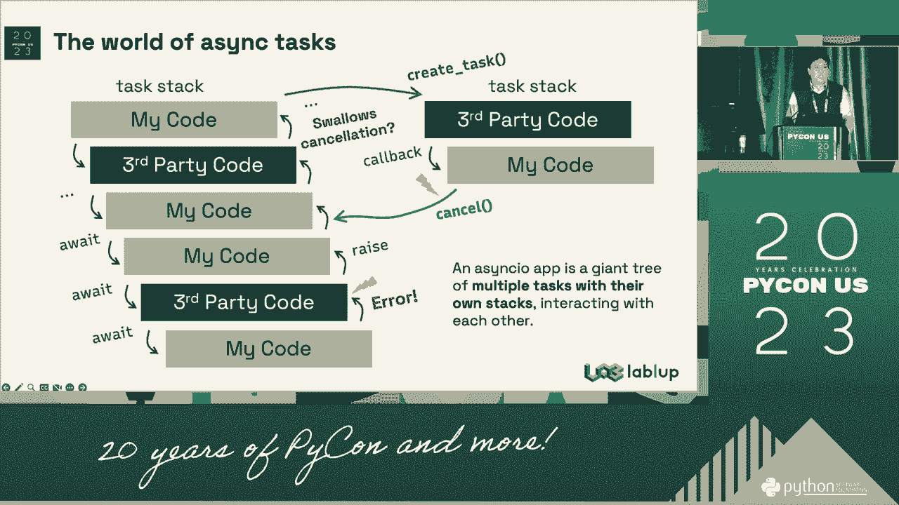
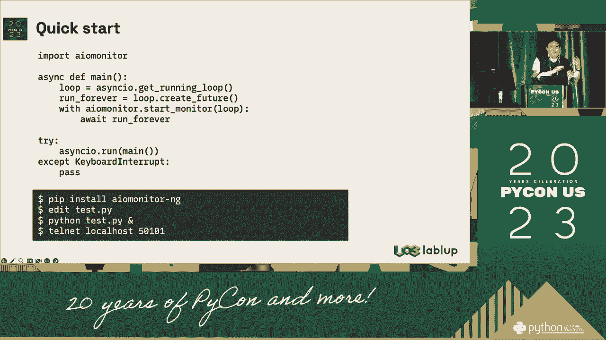
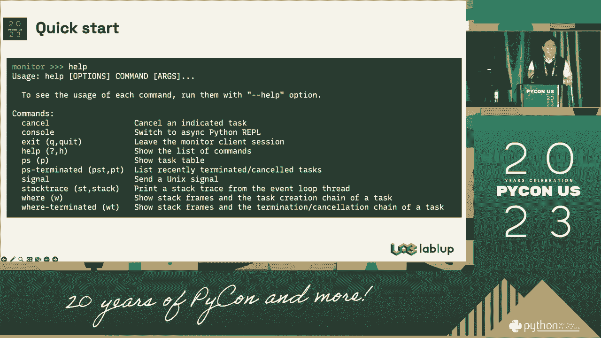
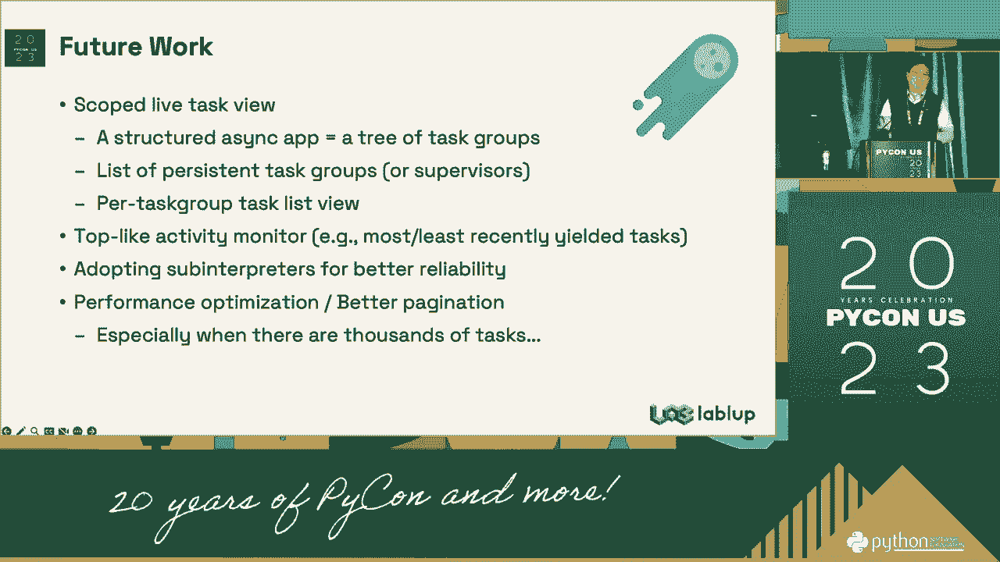

# 042：改进复杂asyncio应用的可调试性 🐛

在本节课中，我们将学习如何改进复杂`asyncio`应用程序的可调试性。调试异步代码通常比同步代码更具挑战性，因为涉及任务、事件循环和并发执行。我们将探讨常见的调试难点，并介绍一些实用的工具和技巧来简化这一过程。


## 异步调试的挑战 🤔

上一节我们介绍了课程的主题，本节中我们来看看调试异步代码时面临的主要挑战。异步编程模型引入了并发执行，这使得传统的调试方法（如单步执行）效果不佳，因为多个任务可能同时运行和切换。


以下是调试异步代码时常见的几个难点：

*   **并发性**：多个任务交错执行，难以追踪特定任务的执行流程。
*   **非确定性**：由于任务切换的时机不确定，错误可能难以稳定复现。
*   **堆栈信息不完整**：当任务在`await`点挂起并稍后恢复时，原始的调用堆栈信息可能丢失，使得追溯错误源头变得困难。
*   **资源竞争与死锁**：并发访问共享资源可能导致难以察觉的竞争条件或死锁。

## 实用的调试工具与技巧 🛠️

了解了挑战之后，我们现在可以探索一些专门用于调试`asyncio`代码的工具和方法。

### 1. 使用 asyncio.run() 与调试模式

对于简单的脚本，确保使用`asyncio.run()`来运行主协程。它可以正确设置和清理事件循环。更重要的是，可以启用调试模式。

```python
import asyncio
import logging

logging.basicConfig(level=logging.DEBUG)



async def main():
    # 你的异步代码
    pass

if __name__ == "__main__":
    # 启用调试模式
    asyncio.run(main(), debug=True)
```
启用`debug=True`后，`asyncio`会执行以下操作：
*   检查未被`await`的协程并记录警告。
*   启用更慢但更安全的默认执行器。
*   当事件循环运行时间过长时记录信息。



### 2. 记录与监控任务状态

主动记录任务的生命周期状态是理解程序行为的关键。



以下是监控任务状态的几种方法：

*   **打印当前所有任务**：使用`asyncio.all_tasks()`来获取事件循环中的所有任务。
    ```python
    tasks = asyncio.all_tasks()
    for task in tasks:
        print(f"Task: {task.get_name()}, State: {task._state}")
    ```
*   **为任务命名**：创建任务时使用`name`参数，使得日志输出更易读。
    ```python
    task = asyncio.create_task(my_coro(), name="MyImportantTask")
    ```
*   **添加回调**：使用`add_done_callback`在任务完成时执行特定操作，如记录结果或异常。

### 3. 结构化日志记录

使用`logging`模块而非`print`语句进行日志记录。为不同的组件设置日志级别，并确保日志中包含时间戳、任务名称等上下文信息。

```python
import logging

logger = logging.getLogger(__name__)

async def fetch_data(url):
    logger.info("开始获取数据: %s", url)
    try:
        # ... 异步操作
        logger.debug("数据获取成功: %s", url)
    except Exception as e:
        logger.error("获取数据失败 %s: %s", url, e, exc_info=True)
```

### 4. 利用专门的调试器

一些IDE和外部工具提供了对`asyncio`的增强调试支持。

*   **Visual Studio Code / PyCharm**：现代IDE的调试器通常支持在`await`语句处挂起，并查看当前所有协程的状态。
*   **aiomonitor**：这是一个第三方库，可以为运行中的`asyncio`应用程序提供一个交互式监控台，允许你查看任务列表、取消任务或执行代码片段。

### 5. 编写可测试的代码

提高可调试性的根本方法是提高代码的可测试性。这将问题隔离在更小、更可控的范围内。



以下是编写可测试异步代码的建议：

*   **依赖注入**：将事件循环或客户端作为参数传递，而不是在函数内部硬编码创建，便于在测试中替换为模拟对象。
*   **分离关注点**：将业务逻辑与异步调度逻辑分离。纯业务逻辑的函数更容易进行单元测试。
*   **使用超时**：为网络调用或任务执行设置超时，防止因某个任务挂起而导致整个程序停滞。
    ```python
    try:
        await asyncio.wait_for(some_async_operation(), timeout=5.0)
    except asyncio.TimeoutError:
        logger.warning("操作超时")
    ```


## 总结 📝

本节课中我们一起学习了如何改进复杂`asyncio`应用的可调试性。我们首先分析了异步调试的固有挑战，如并发性、非确定性和堆栈信息丢失。接着，我们介绍了一系列实用的工具和技巧，包括启用`asyncio`调试模式、有效监控任务状态、实施结构化日志记录、利用IDE或`aiomonitor`等调试工具，以及通过依赖注入和分离关注点来编写可测试的代码。掌握这些方法将帮助你更高效地定位和解决`asyncio`应用程序中的问题。