# 044：使用 MicroPython 创建互动游戏 🎮

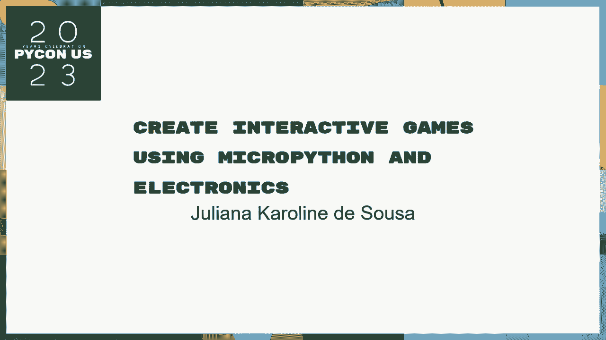

在本教程中，我们将跟随 Juliana Karoline de Sousa 的演讲，学习如何使用 MicroPython 在 Micro:bit 微控制器上创建互动游戏。我们将从了解硬件开始，逐步学习编程方法，并最终实现三个完整的游戏示例。


## 演讲者介绍 👩‍💻

我叫 Juliana Karoline de Sousa，来自巴西圣卡洛斯。我拥有圣卡洛斯联邦大学的计算机科学学士学位。我参与了许多技术社区，是本地 Python 用户组的联合创始人。我的职业是软件工程师，业余时间喜欢玩机器人、乐队和我的猫。

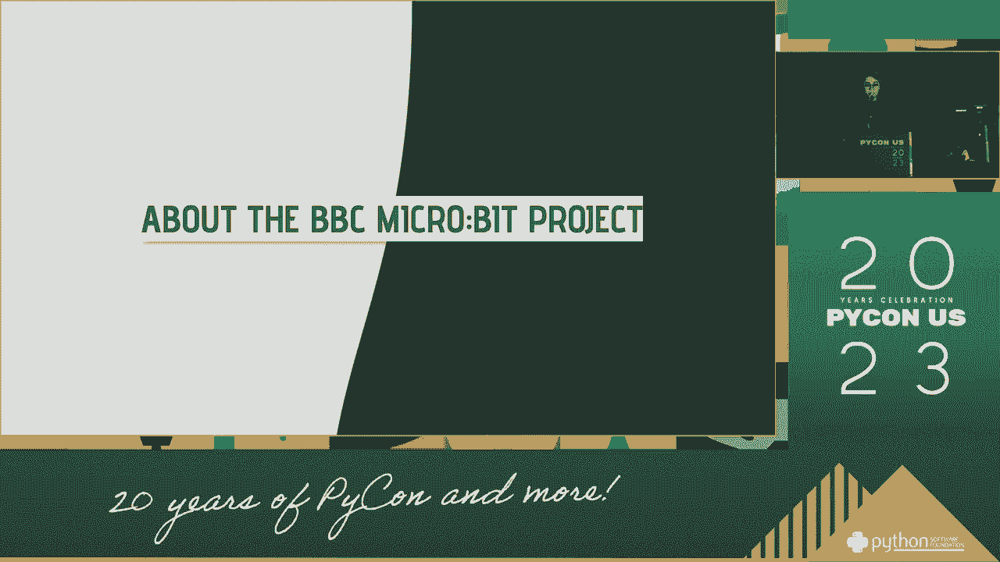

以下是我开发过的一些项目：
*   **智能闹钟**：一个结合天气预报和谷歌日历事件的闹钟。
*   **游戏机器人**：为比赛设计的两个机器人。
*   **避障机器人**和**摄像头机器人**。
*   **最新项目**：一个可以用手机地图控制颜色、转动头部和移动的机器人。

这些项目大多使用了 MicroPython，这也是本次演示的核心。

## 认识 Micro:bit 硬件 🧩

Micro:bit 是一款信用卡大小的微控制器板，由英国 BBC 设计，旨在向学童普及计算机科学和编程。它被免费分发给公立学校的学生。

### 主要规格
*   **微处理器**：控制板载所有组件。
*   **内存**：包含 RAM 和闪存。
*   **5x5 LED 点阵**：用于显示图像和滚动文本。
*   **两个可编程按钮**（A 和 B）。
*   **板载运动传感器**（加速度计和磁力计）。
*   **板载扬声器**和**麦克风**。
*   **边缘连接器**：提供 20 个可编程的 GPIO（通用输入输出）引脚，用于连接外部设备。设计圆润，考虑到了儿童安全。

### GPIO 引脚简介
GPIO 引脚用于与没有标准通信接口（如 I2C、SPI）的设备交互。它们可以处理两种信号：
*   **数字信号**：只关心“开”（1/高电平）或“关”（0/低电平）两种状态。
*   **模拟信号**：关心连续的电压值（例如 0V, 1.5V, 3.3V），用于测量距离、亮度等。

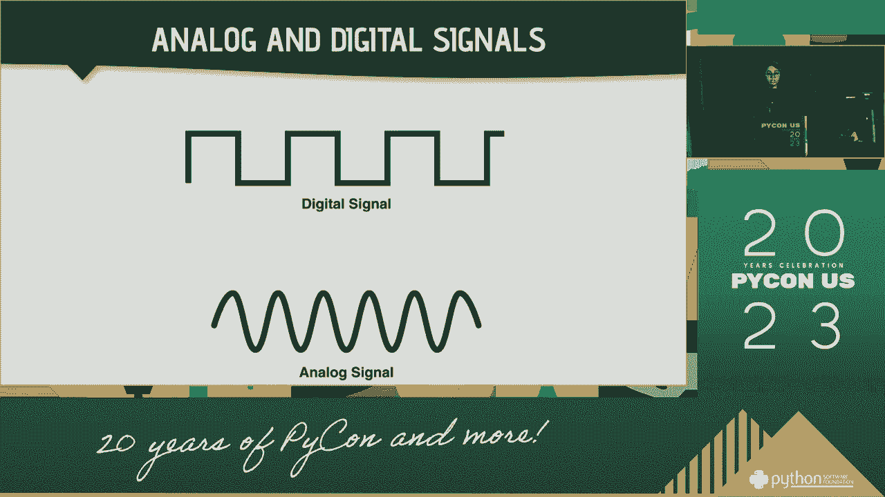

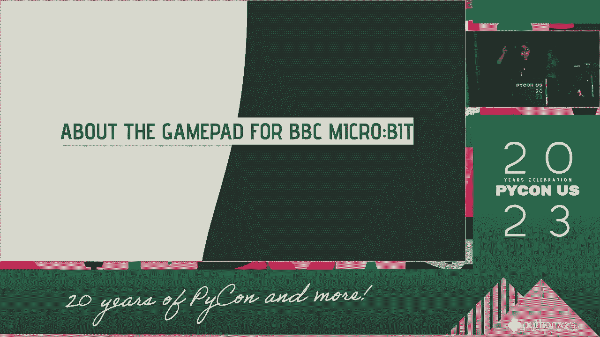

在 MicroPython 中，我们可以使用 `Pin` 类来读写这些引脚的值。

## 游戏手柄扩展板 🕹️

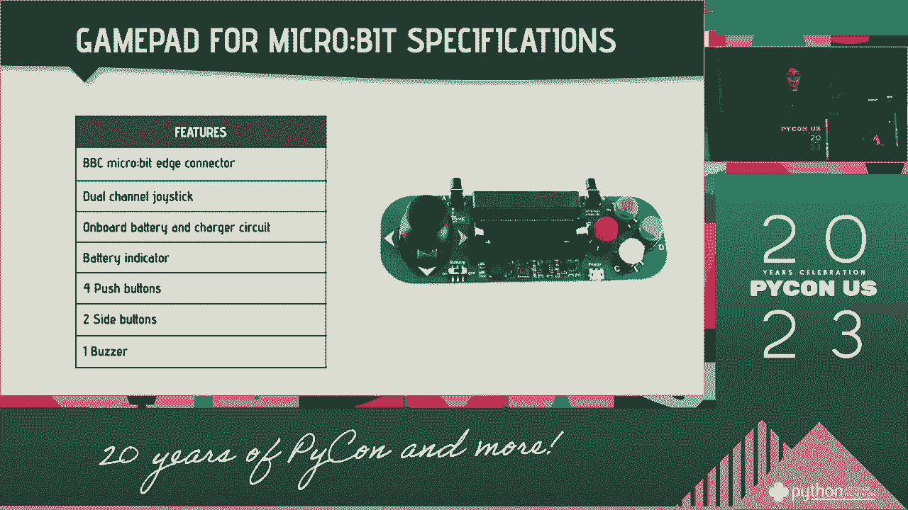

为了创建更丰富的游戏体验，我们可以使用游戏手柄扩展板。它通过边缘连接器与 Micro:bit 连接，无需焊接。

### 游戏手柄功能
*   **方向摇杆**：提供模拟输入。
*   **四个动作按钮**（A, B, C, D）。
*   **两个侧边按钮**：映射到 Micro:bit 板载的 A、B 按钮。
*   **板载蜂鸣器**：用于播放声音。
*   **电池座**：支持独立供电。

### 连接原理
游戏手柄上的每个功能（按钮、摇杆）都连接到 Micro:bit 特定的 GPIO 引脚上。扩展板背面通常有引脚映射表，说明哪个功能对应哪个引脚。例如：
*   **按钮**通常是**数字输入**（按下为 0，释放为 1）。
*   **摇杆**是**模拟输入**，可以读取 X 和 Y 轴上的偏移程度。

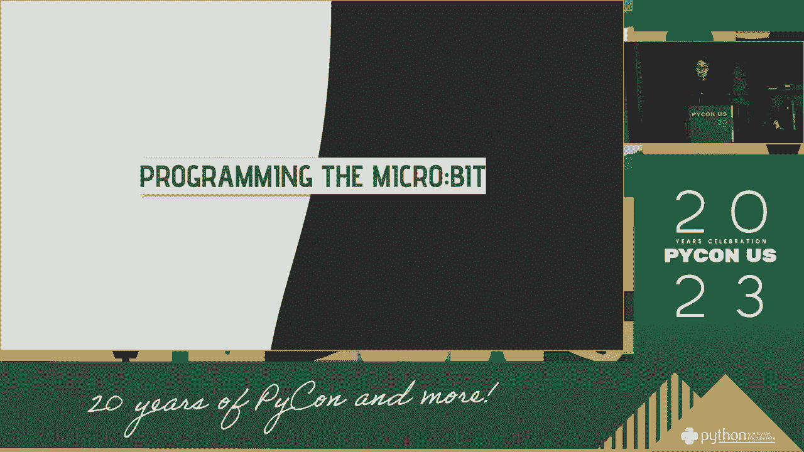

## MicroPython 编程入门 🐍

Micro:bit 原生支持 MicroPython，这是 Python 3 的一个精简版本，专为微控制器设计。

### 编程环境
访问 [microbit.org](https://microbit.org/) 进行编程，有两种主要方式：
1.  **块编辑器**：适合初学者和儿童，通过拖拽积木块编程。
2.  **Python 编辑器**：适合有编程基础的用户，提供代码高亮和自动补全。

编辑器内还集成了**模拟器**，即使没有硬件也可以测试代码。编写完代码后，点击“下载”会得到一个 `.hex` 文件，将其拖入连接到电脑的 Micro:bit（它像一个U盘）即可运行程序。

### 基础编程示例
以下是一些 MicroPython 基础操作的代码片段：

**显示图像与文本**
```python
from microbit import *
# 显示内置表情
display.show(Image.HAPPY)
# 设置特定像素的亮度 (x, y, 亮度值0-9)
display.set_pixel(2, 2, 9)
# 创建自定义图像
my_image = Image(“09090:”
                 “99999:”
                 “09990:”
                 “00900:”
                 “00000”)
display.show(my_image)
# 滚动文本
display.scroll(“Hello!”)
```

**读取按钮输入**
```python
from microbit import *
while True:
    if button_a.is_pressed():
        display.show(Image.SAD)
    if button_b.is_pressed():
        display.show(Image.HAPPY)
```

**使用加速度计**
```python
from microbit import *
# 获取三轴加速度值
x = accelerometer.get_x()
y = accelerometer.get_y()
z = accelerometer.get_z()
# 检测手势
if accelerometer.is_gesture(“shake”):
    display.show(Image.SURPRISED)
```

**使用 GPIO 引脚（以游戏手柄按钮为例）**
```python
from microbit import *
# 初始化引脚（例如，引脚15连接到一个按钮，设置为上拉输入）
button_c = pin15
button_c.set_pull(pin15.PULL_UP) # 默认高电平，按下时拉低

while True:
    # 读取数字输入：按下返回0，释放返回1
    if button_c.read_digital() == 0:
        display.show(“C”)
```
**读取模拟输入（以摇杆为例）**
```python
from microbit import *
# 假设摇杆X轴连接引脚0，Y轴连接引脚1
joystick_x = pin0
joystick_y = pin1

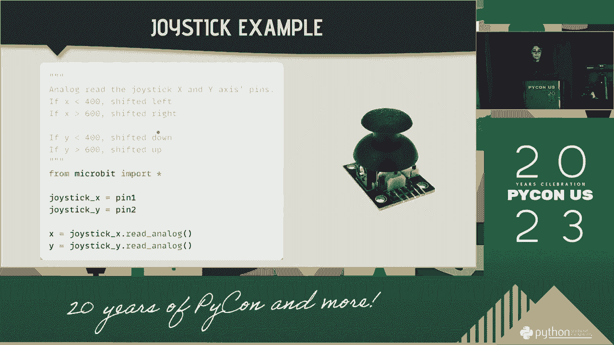

while True:
    # 读取模拟值（范围约0-1023）
    x_value = joystick_x.read_analog()
    y_value = joystick_y.read_analog()
    # 根据值判断方向
    if x_value < 400:
        display.show(Image.ARROW_W)
    elif x_value > 600:
        display.show(Image.ARROW_E)
```

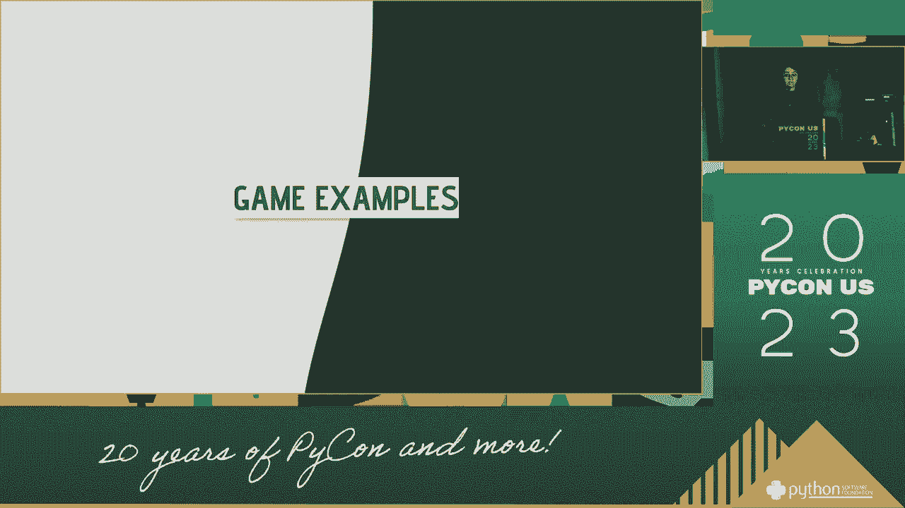

## 游戏开发实战 🎯

上一节我们介绍了 MicroPython 的基础编程。本节中，我们将运用这些知识，来看三个具体的游戏示例，理解其逻辑和代码结构。

### 游戏一：记忆序列游戏（Genius）

这是一个考验记忆力的游戏。计算机会生成一个随机的方向序列（上、下、左、右），并用箭头和声音提示用户。用户需要按照相同顺序重复这个序列。每轮正确后，序列会加长一步。一旦出错，游戏结束。

**核心逻辑流程：**
1.  初始化一个空序列。
2.  生成一个随机方向，添加到序列中。
3.  向用户展示当前整个序列（通过LED和声音）。
4.  等待用户输入，并逐个验证其输入是否与序列匹配。
5.  如果全部正确，回到步骤2，延长序列。
6.  如果某一步出错，播放失败音效，显示最终得分（序列长度-1），然后重启游戏。

**关键代码思路：**
*   使用列表存储方向序列。
*   用 `random.choice()` 从方向列表中随机选取。
*   用循环依次显示序列中的每个方向。
*   用 `while` 循环和 `pin.read_digital()` 读取游戏手柄上的方向按钮输入。
*   设置一个变量跟踪用户当前需要输入的是序列中的第几步。

### 游戏二：追逐光点（Chase the Dot）

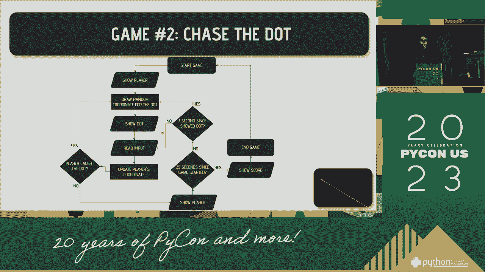

玩家控制一个LED光点在5x5的屏幕上追逐另一个随机出现的光点。使用摇杆控制移动方向。如果在1秒内没有捕获到光点，光点会随机跳转到新位置。游戏限时25秒，目标是在时间内获得尽可能多的分数。

**核心逻辑流程：**
1.  初始化玩家位置（如屏幕中心）和随机生成目标点位置。
2.  开始计时。
3.  循环内：
    *   检查是否已过25秒，若是则结束游戏。
    *   检查目标点是否已存在超过1秒，若是则将其重置到随机新位置。
    *   读取摇杆的模拟输入，转换为移动方向，更新玩家位置。
    *   检查玩家位置是否与目标点位置重合（碰撞检测）。
    *   若重合，则得分加一，播放成功音效，并在随机新位置生成下一个目标点，同时重置目标点计时器。
4.  刷新屏幕显示。

**关键代码思路：**
*   使用 `running_time()` 函数获取游戏运行时间。
*   用变量记录目标点生成的时间。
*   将摇杆的模拟值（0-1023）映射到上下左右和静止几个状态。
*   玩家和目标的坐标用 (x, y) 元组表示。
*   碰撞检测即判断两个坐标是否相等。

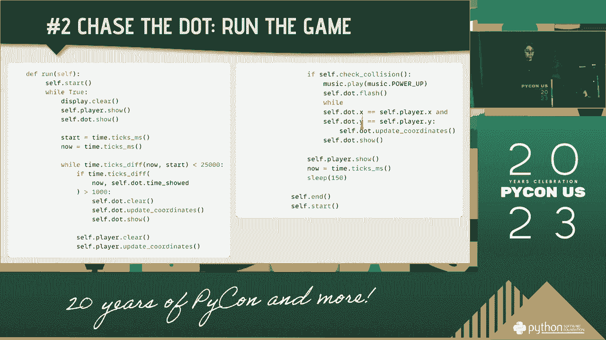

### 游戏三：赛车避障（Car Crash）

这是一个简单的纵向卷轴赛车游戏。玩家的汽车位于屏幕底部，只能左右移动。障碍物从屏幕顶部不断向下移动。玩家需要避开障碍物。随着时间推移，游戏速度会加快。碰撞即游戏结束。

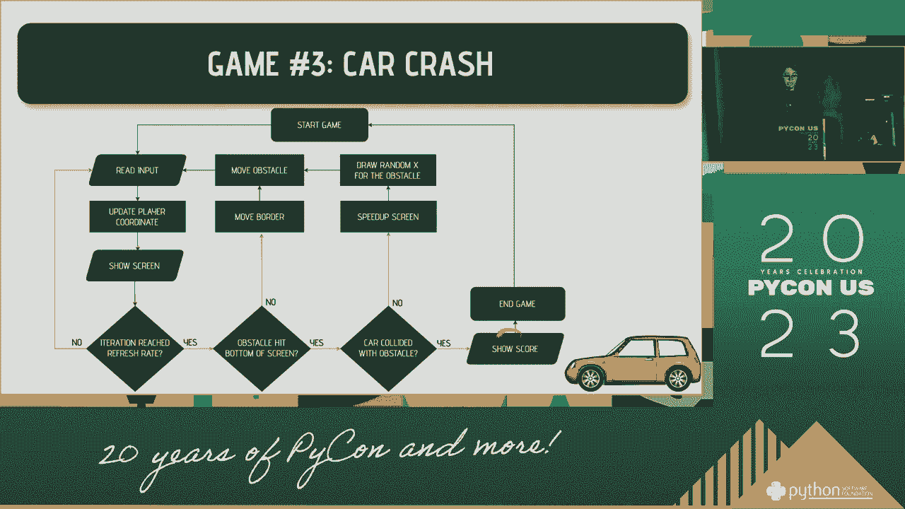

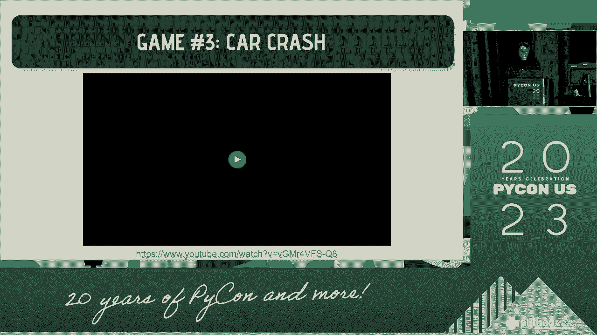

**核心逻辑流程：**
1.  初始化玩家位置、障碍物列表、游戏速度（刷新率）和分数。
2.  游戏主循环：
    *   在一个“刷新周期”内，持续读取玩家输入，并允许玩家快速左右移动。
    *   周期结束后，进入“更新阶段”：
        *   将所有障碍物向下移动一格。
        *   检查是否有障碍物移动到底部，如果有，则检查是否与玩家碰撞。无论是否碰撞，该障碍物都会被移除，并在顶部生成一个新的随机障碍物。
        *   提高游戏速度（缩短刷新周期），增加难度。
    *   使用“缓冲区”方法，将边界、所有障碍物和玩家一次性绘制到LED点阵上，形成完整画面。
3.  如果检测到碰撞，游戏结束，显示最终分数。

**关键代码思路：**
*   **双缓冲渲染**：为了动画流畅，先在内存中创建一个代表整个屏幕的“图像缓冲区”（如一个5x5的亮度值列表），将所有元素（移动的边界、障碍物、玩家）计算好位置填入这个缓冲区，最后用 `display.show()` 一次性显示。这避免了逐个绘制像素时的闪烁。
*   **游戏速度控制**：通过一个 `speed` 变量控制主循环中“输入处理”阶段的迭代次数。迭代次数越少，障碍物下落得越快。
*   **障碍物管理**：使用列表来管理多个障碍物，每个障碍物是一个包含其坐标的对象或元组。

## 总结与资源 📚

本节课中，我们一起学习了如何使用 MicroPython 和 Micro:bit 硬件平台来创建互动游戏。

我们首先认识了 **Micro:bit** 的硬件特性和 **GPIO** 引脚的基本概念。接着，我们介绍了如何通过**游戏手柄扩展板**来获得更丰富的输入方式。然后，我们步入 **MicroPython 编程**，学习了显示控制、输入读取等基础操作。最后，我们深入分析了三个游戏实例——**记忆序列**、**追逐光点**和**赛车避障**的**核心逻辑与代码结构**，涵盖了随机数生成、状态管理、碰撞检测、计时器和双缓冲渲染等关键游戏开发技巧。

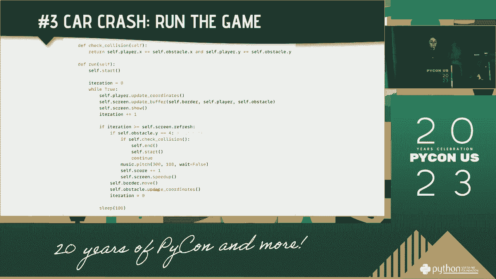

Micro:bit 与 MicroPython 的组合是一个强大且有趣的学习工具，非常适合入门嵌入式编程和互动项目开发。

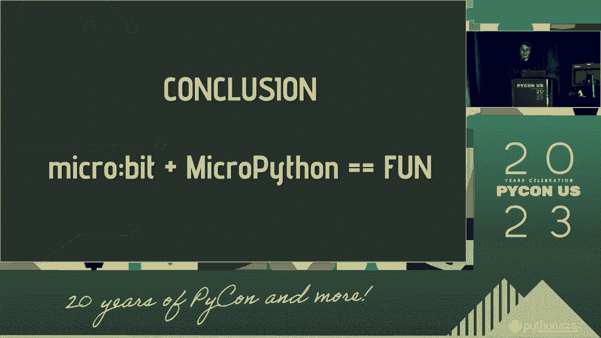

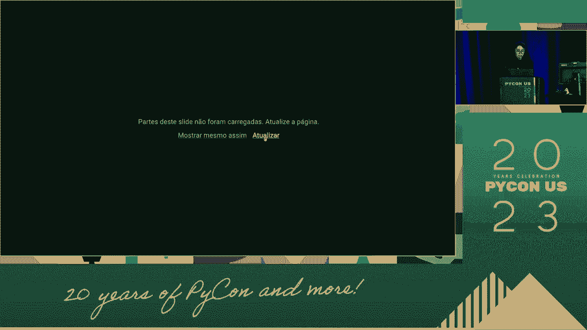

### 资源链接
*   本次演讲中演示的完整游戏代码可在我的 GitHub 主页找到：`https://github.com/[你的GitHub用户名]` （请将 `[你的GitHub用户名]` 替换为演讲者实际的用户名，例如 `julianakaro`）。
*   你可以在 LinkedIn 和 GitHub 上通过我的用户名找到我。
*   MicroPython 官方文档：`https://microbit-micropython.readthedocs.io/`
*   Micro:bit 官方项目网站：`https://microbit.org/`

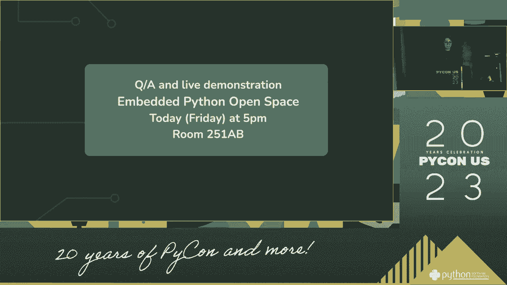

希望本教程能激发你动手创造的灵感，享受编程和硬件结合的乐趣！