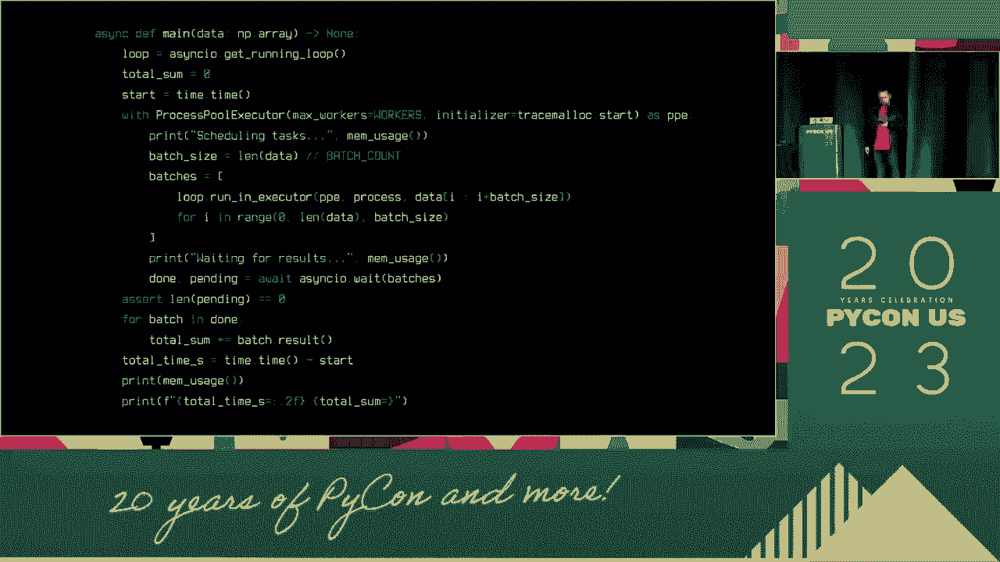
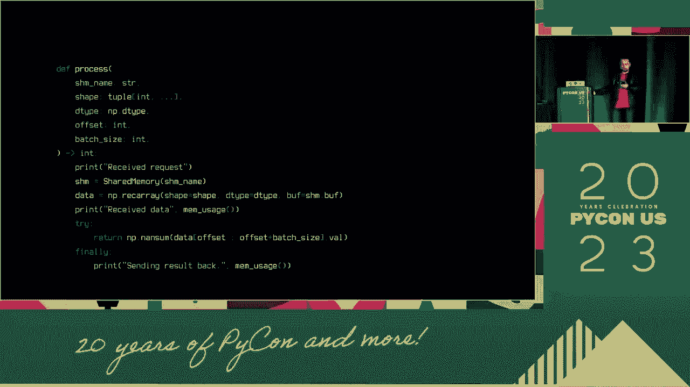
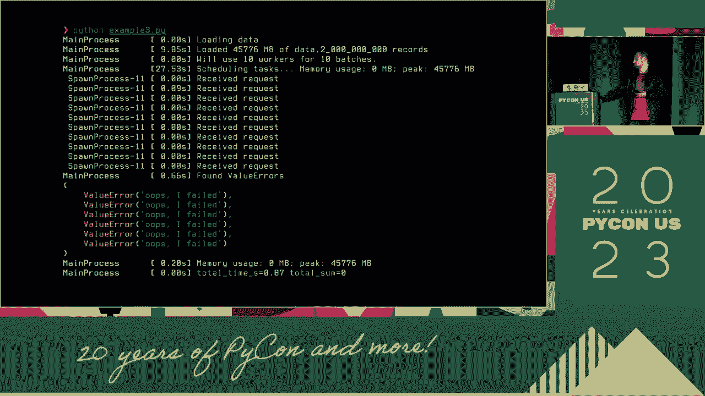

# 047：使用 asyncio 绕过 GIL


## 概述

在本节课中，我们将学习如何利用 Python 的 `asyncio` 库来绕过全局解释器锁的限制，从而高效地处理 I/O 密集型任务和并行计算。我们将从一个简单的串行处理示例开始，逐步引入多进程和共享内存技术，最终实现显著的性能提升。

---

## 全局解释器锁的挑战


上一节我们概述了课程目标，本节中我们来看看 Python 并发编程面临的核心挑战：全局解释器锁。

GIL 是 CPython 解释器中的一个机制，它确保在任何时刻只有一个线程执行 Python 字节码。这意味着即使在多核 CPU 上，多线程 Python 程序也无法实现真正的并行计算。

**核心概念**：GIL 限制了 CPU 密集型任务的并行执行。

虽然 GIL 对单线程程序没有影响，但它使得多线程程序在计算密集型任务上无法有效利用多核优势。因此，社区探索了多种解决方案，例如使用多进程（`multiprocessing`）模块，每个进程拥有独立的 Python 解释器和内存空间，从而绕开 GIL。

---

## 异步编程与 asyncio

上一节我们讨论了 GIL 的限制，本节中我们来看看如何利用异步编程来高效处理 I/O 操作。

`asyncio` 是 Python 用于编写并发代码的库，使用 `async/await` 语法。它特别适合处理 I/O 密集型任务，如网络请求或文件读写。其核心思想是：当一个任务等待 I/O 时，事件循环可以切换到其他就绪的任务，从而最大化单个线程的利用率。


一个好的类比是酒吧里的单个调酒师。他一次只能制作一杯饮料，但他可以同时接受多个订单，并在等待某杯饮料混合或倾倒时处理其他订单。

**核心模式**：事件循环管理多个协程，在它们之间切换以处理并发。

以下是 `asyncio` 处理多个网络请求的基本模式：

```python
import asyncio

async def fetch_data(url):
    # 模拟网络请求
    await asyncio.sleep(1)
    return f"Data from {url}"

async def main():
    tasks = [fetch_data(f"url_{i}") for i in range(3)]
    results = await asyncio.gather(*tasks)
    print(results)


asyncio.run(main())
```

这种方式使得构建高性能的网络服务器（如 Nginx 的工作模式）成为可能。然而，对于纯 CPU 密集型计算，`asyncio` 本身并不能绕过 GIL。

---


## 结合多进程处理 CPU 密集型任务




上一节我们介绍了如何使用 `asyncio` 处理 I/O，本节中我们来看看如何将其与多进程结合来处理 CPU 密集型任务。

当数据量过大，无法由单个进程在合理时间内处理时，我们需要将任务拆分到多个进程中并行执行。基本模式是“分而治之”：将数据分割成块，分配给多个工作进程处理，最后汇总结果。

我们将通过一个处理大型数据集的例子来演示。假设我们有一个函数 `process_data_chunk` 用于处理数据块。


以下是使用 `multiprocessing` 进行并行处理的基本框架：

```python
from multiprocessing import Pool
import numpy as np

def process_data_chunk(chunk):
    # 模拟耗时的 CPU 计算
    return np.sum(chunk ** 2)

def main_serial(data):
    # 串行处理
    results = [process_data_chunk(chunk) for chunk in data]
    return sum(results)

def main_parallel(data, num_workers):
    # 并行处理
    with Pool(num_workers) as pool:
        results = pool.map(process_data_chunk, data)
    return sum(results)

# 假设 `data` 是一个包含多个数据块的列表
```

然而，简单的多进程会遇到数据序列化和内存复制的开销，这可能成为新的瓶颈。


---

## 使用共享内存减少开销

上一节我们遇到了多进程中的数据复制问题，本节中我们来看看如何使用共享内存来优化。

Python 的 `multiprocessing` 模块提供了共享内存对象（如 `Array`, `Value`），允许多个进程直接访问同一块内存区域，而无需复制数据。这对于处理大型数组至关重要。





**核心步骤**：
1.  在主进程中创建共享内存数组。
2.  将数据填充到共享内存中。
3.  将共享内存的引用（以及必要的元数据如偏移量、大小）传递给工作进程。
4.  工作进程直接操作共享内存中的数据。

以下是修改后的并行处理示例：

```python
from multiprocessing import Pool, Array
import numpy as np

def init_worker(shared_data, shape, dtype):
    # 在工作进程中，将共享内存包装为 numpy 数组
    global np_array
    np_array = np.frombuffer(shared_data.get_obj(), dtype=dtype).reshape(shape)

def process_chunk(args):
    start, end = args
    # 直接操作全局的共享 numpy 数组切片
    chunk = np_array[start:end]
    return np.sum(chunk ** 2)

def main_shared_memory(data, num_workers):
    # 1. 创建共享内存并填充数据
    shared_array = Array('d', data.size) # 'd' 代表双精度浮点数
    np_shared = np.frombuffer(shared_array.get_obj(), dtype=data.dtype).reshape(data.shape)
    np.copyto(np_shared, data)

    # 2. 划分任务（传递索引元数据，而非数据本身）
    chunk_size = len(data) // num_workers
    tasks = [(i * chunk_size, (i + 1) * chunk_size) for i in range(num_workers)]

    # 3. 初始化工作进程并执行
    with Pool(processes=num_workers, initializer=init_worker, initargs=(shared_array, data.shape, data.dtype)) as pool:
        results = pool.map(process_chunk, tasks)

    return sum(results)
```


通过这种方式，我们避免了将整个数据集序列化并复制到每个工作进程的巨大开销，从而实现了接近线性的性能提升（例如，从 60 秒缩短到约 12 秒）。

---

## 错误处理与 asyncio 新特性


上一节我们优化了性能，本节中我们来看看如何确保程序的健壮性，并介绍 `asyncio` 的相关新特性。

在并发编程中，妥善处理异常非常重要。在 Python 3.11 及更高版本中，`asyncio` 对任务组（`asyncio.TaskGroup`）提供了更好的支持，它能够更安全、更直观地管理多个并发任务及其异常。

**核心优势**：使用 `asyncio.TaskGroup` 作为上下文管理器，如果组内任何一个任务失败，所有其他任务都会被自动取消，并且异常会被正确传播和聚合。


```python
import asyncio


async def worker(name, fail=False):
    await asyncio.sleep(1)
    if fail:
        raise ValueError(f"{name} failed!")
    print(f"{name} succeeded")
    return name

async def main():
    try:
        async with asyncio.TaskGroup() as tg:
            task1 = tg.create_task(worker("Task 1"))
            task2 = tg.create_task(worker("Task 2", fail=True))
            task3 = tg.create_task(worker("Task 3"))
        # 所有任务完成后才会执行到这里
        print("All tasks completed successfully")
    except* ValueError as eg: # 使用 except* 处理异常组
        for exc in eg.exceptions:
            print(f"Caught exception: {exc}")
    except ExceptionGroup as eg:
        print(f"Other errors: {eg}")

asyncio.run(main())
```


这种结构使得并发代码的错误处理更加清晰和可靠，是构建健壮生产应用的推荐方式。


---


## 总结



本节课中我们一起学习了如何绕过 Python 的 GIL 来提升程序性能。我们从理解 GIL 的限制开始，引入了 `asyncio` 来处理 I/O 密集型任务的并发。接着，为了处理 CPU 密集型任务，我们结合使用了多进程 (`multiprocessing`)。为了克服多进程间数据复制的性能瓶颈，我们深入探讨了共享内存技术，通过让工作进程直接操作主进程创建的内存区域，大幅减少了开销。最后，我们介绍了使用 `asyncio.TaskGroup` 进行健壮的并发错误处理。


关键要点在于：针对 I/O 瓶颈，使用 `asyncio`；针对 CPU 瓶颈，使用多进程配合共享内存；并始终使用现代 `asyncio` 特性（如 `TaskGroup`）来管理并发任务和异常。通过组合这些技术，你可以构建出既能高效处理 I/O 又能充分利用多核 CPU 的高性能 Python 应用。