# 060：演讲 - Pandy Knight_ 我该用什么框架进行网页测试 _ - VikingDen7 - BV1114y1o7c5


在本教程中，我们将学习如何为网页测试选择合适的框架。我们将探讨测试的基本概念、不同类型的测试框架，以及如何根据项目需求做出明智的选择。

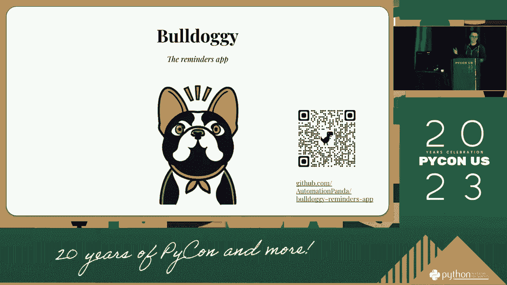

## 网页测试基础：P60：1：什么是网页测试？🧐

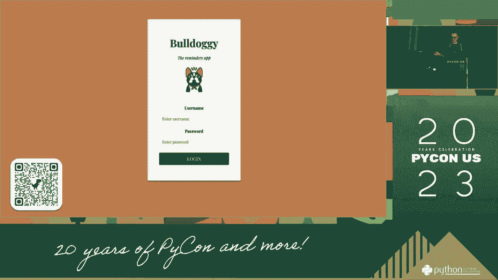

网页测试是确保网站或Web应用按预期工作的过程。它涉及检查功能、性能、兼容性和安全性等方面。

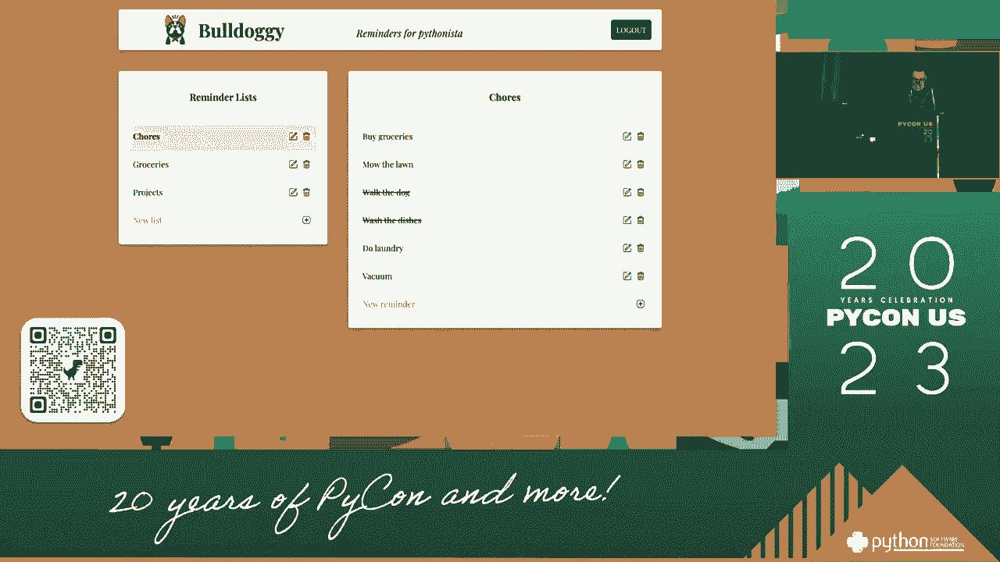

上一节我们介绍了本教程的目标，本节中我们来看看网页测试的基础知识。

网页测试的核心目标是验证软件质量。它帮助开发者发现并修复问题，确保最终用户获得良好的体验。

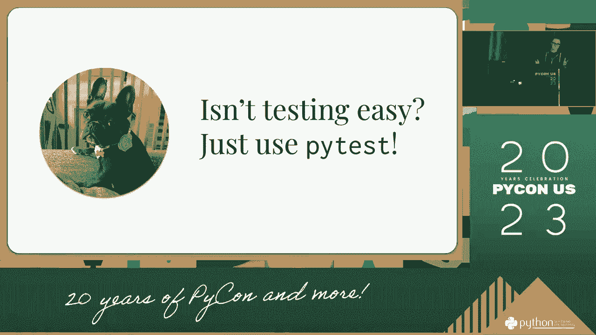

## 测试类型：P60：2：测试有哪些类型？🔍

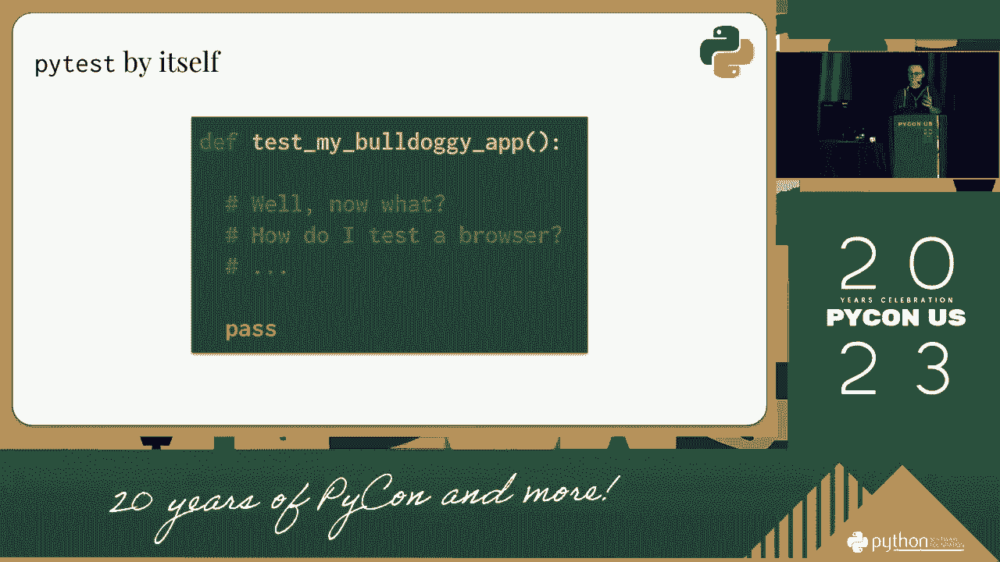

测试可以根据其范围和目的分为不同类型。理解这些类型有助于我们选择正确的工具。

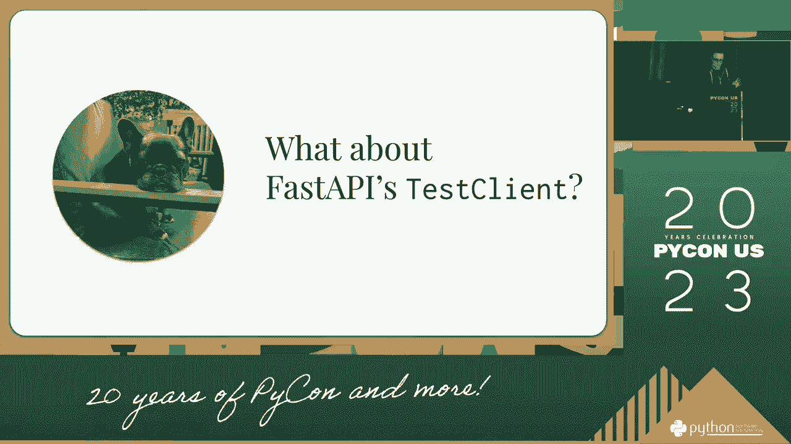

以下是几种主要的网页测试类型：

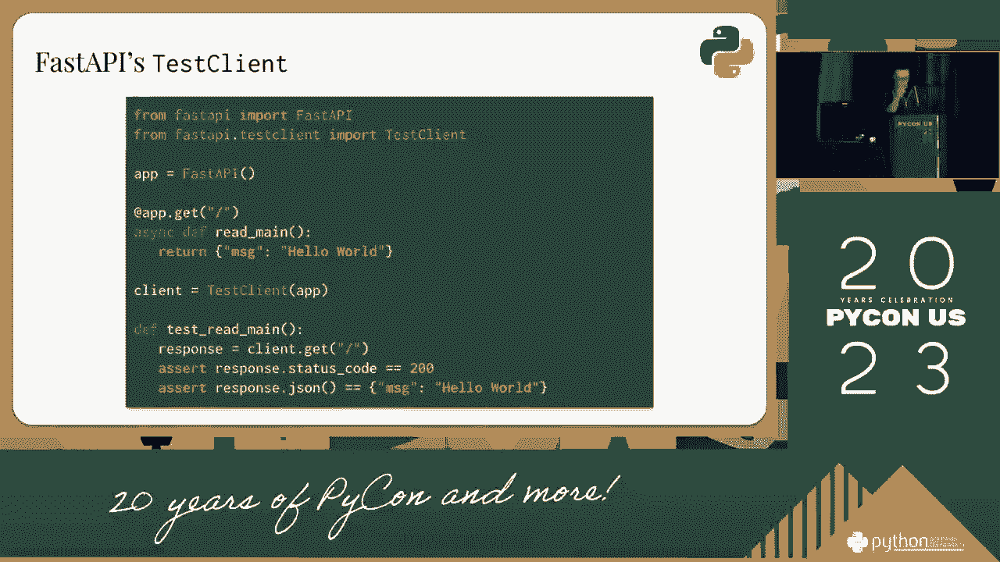

*   **单元测试**：测试最小的代码单元，如单个函数或组件。
*   **集成测试**：测试多个单元或模块如何协同工作。
*   **端到端测试**：模拟真实用户操作，测试整个应用流程。
*   **性能测试**：评估应用在不同负载下的响应速度和稳定性。
*   **兼容性测试**：确保应用在不同浏览器、设备和操作系统上正常工作。

## 测试框架概览：P60：3：有哪些流行的测试框架？📦

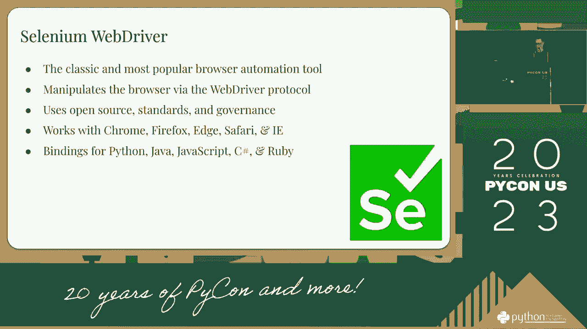

市场上有许多测试框架，各有侧重。了解它们的特点是我们做出选择的第一步。

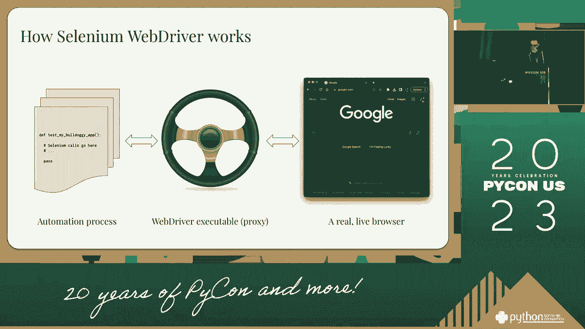

以下是几个广泛使用的网页测试框架：

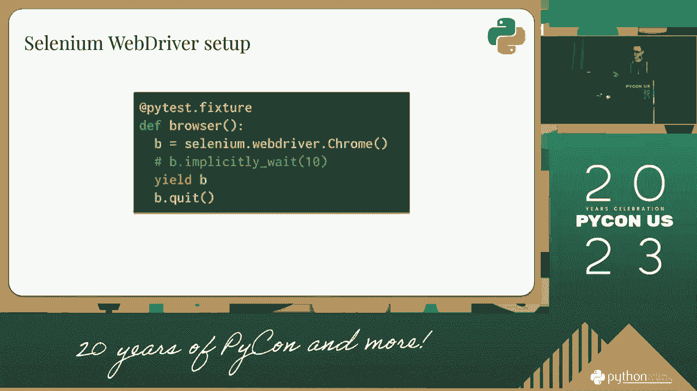

*   **Jest**：一个专注于**单元测试**的JavaScript测试框架，以其简单性和速度著称。它通常与React等库配合使用。
    *   核心概念示例：`expect(sum(1, 2)).toBe(3);`
*   **Cypress**：一个强大的**端到端测试**框架，提供实时的测试运行和调试体验。它直接在浏览器中运行。
*   **Selenium**：一个用于自动化Web浏览器的老牌工具，支持多种编程语言，常用于**端到端测试**和**兼容性测试**。
    *   核心概念示例（Python）：
        ```python
        from selenium import webdriver
        driver = webdriver.Chrome()
        driver.get("http://www.example.com")
        ```
*   **Puppeteer**：一个由Google Chrome团队提供的Node库，用于通过DevTools协议控制Chrome或Chromium，常用于**自动化**和**测试**。
*   **Playwright**：一个较新的测试框架，支持多种浏览器（Chromium, Firefox, WebKit），并提供了强大的自动化能力。

## 如何选择框架：P60：4：我该如何选择？🤔

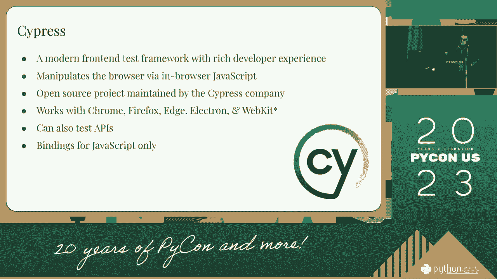

选择框架没有唯一正确答案，但可以遵循一些关键原则来缩小范围。

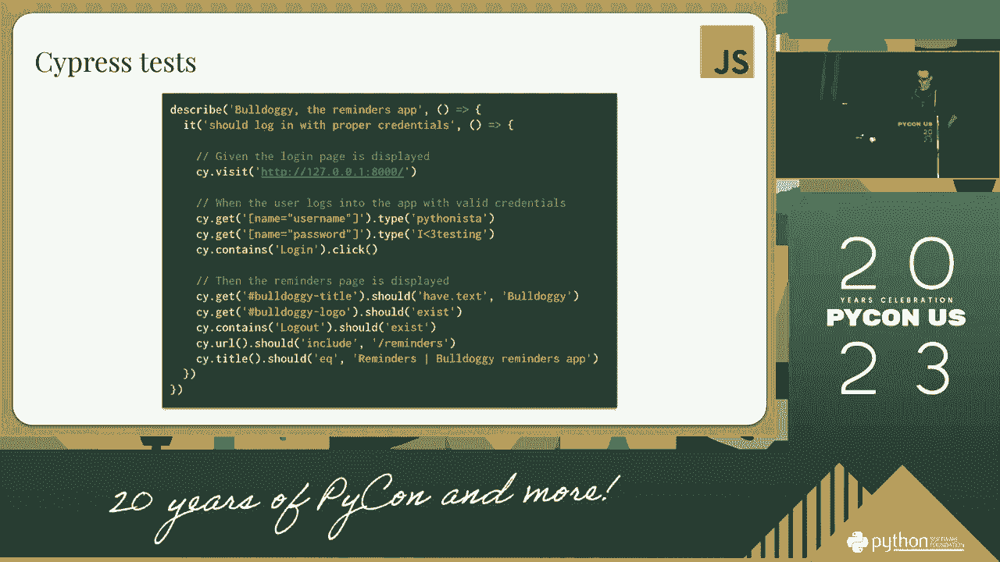

上一节我们介绍了主流框架，本节中我们来看看如何根据实际情况进行选择。

决策应基于你的具体需求。以下是需要考虑的主要因素：

*   **测试类型**：你主要需要进行单元测试、集成测试还是端到端测试？
*   **技术栈**：你的项目使用什么前端框架（React, Vue, Angular）和后端语言？
*   **团队熟悉度**：团队对哪种框架或编程语言更熟悉？
*   **开发体验**：框架是否提供良好的调试工具、报告和文档？
*   **社区与生态**：框架是否活跃，是否有丰富的插件和社区支持？
*   **执行速度**：测试套件的运行速度对开发流程是否关键？

## 总结与建议：P60：5：总结📝

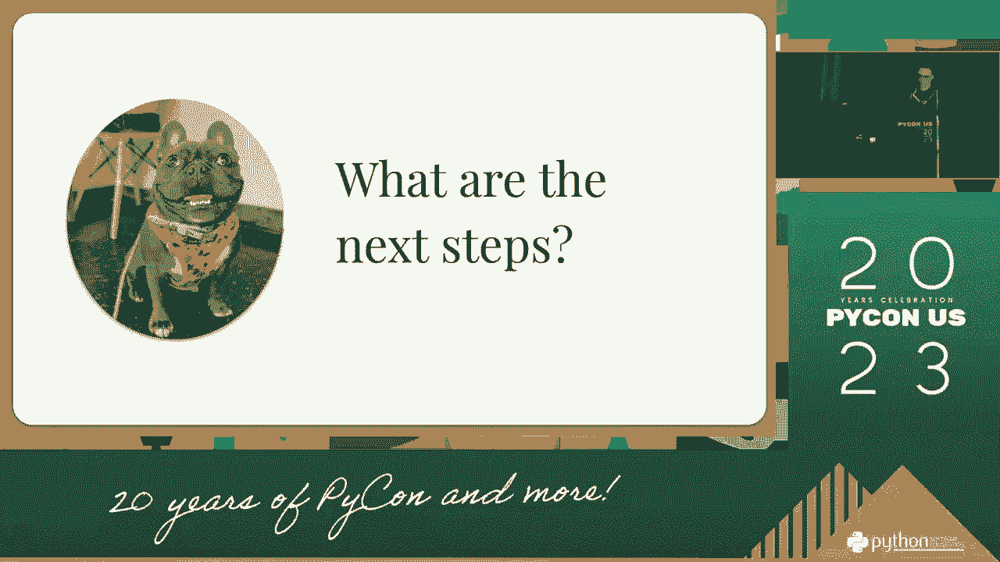

本节课中我们一起学习了网页测试的基础知识、不同类型以及主流框架的特点。


对于初学者或新项目，可以遵循以下路径：


1.  **从单元测试开始**：使用 **Jest** 或类似框架为你的核心函数和组件编写测试。
2.  **引入端到端测试**：当应用流程变得复杂时，引入 **Cypress** 或 **Playwright** 来保障关键用户路径。
3.  **按需扩展**：根据项目需要，考虑加入性能测试（如Lighthouse）或兼容性测试（如BrowserStack）。

记住，最好的框架是那个最适合你当前团队和项目的框架。开始比完美更重要，你可以从一个框架入手，在实践中逐步调整和完善你的测试策略。