# 062：无需运行代码捕获张量形状错误 🔍

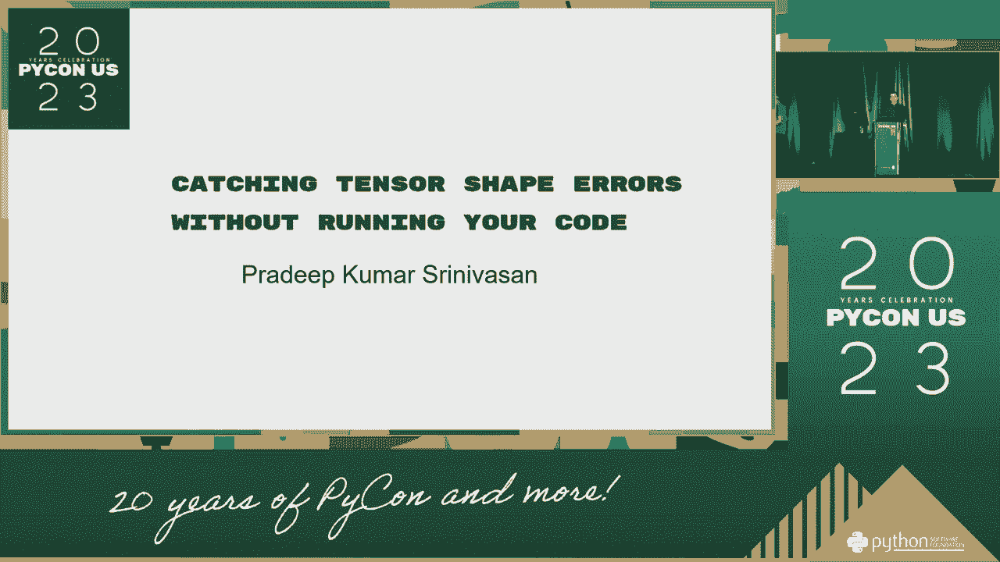

在本节课中，我们将学习一种在深度学习模型开发中至关重要的调试技巧：如何在不实际运行代码的情况下，提前发现并修正张量形状不匹配的错误。这种方法能显著提高开发效率，避免因运行时错误而浪费大量时间。

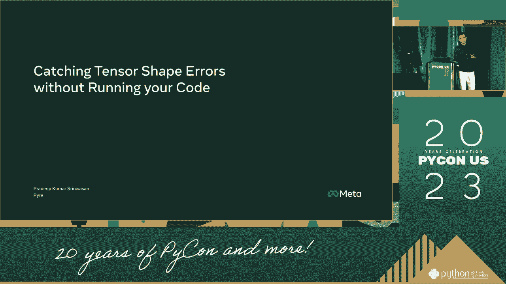

## 张量形状错误概述

在深度学习中，张量是存储和操作数据的基本单元。每个张量都有一个**形状**，它定义了张量在每个维度上的大小。例如，一个形状为 `(batch_size, channels, height, width)` 的图像张量。


当我们在神经网络中进行运算（如矩阵乘法、卷积、拼接等）时，参与运算的张量必须满足特定的形状兼容规则。如果形状不匹配，就会引发运行时错误。例如，试图将一个形状为 `(64, 10)` 的矩阵与一个形状为 `(20, 10)` 的矩阵相乘，由于第一个矩阵的列数（10）与第二个矩阵的行数（20）不相等，操作无法进行。

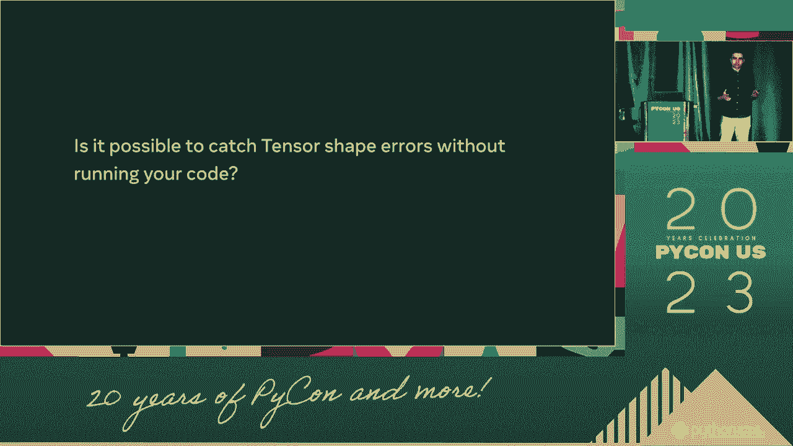

## 静态形状分析原理

上一节我们介绍了张量形状错误的基本概念。本节中我们来看看如何在不运行代码的情况下捕获这些错误，其核心思想是**静态形状分析**。

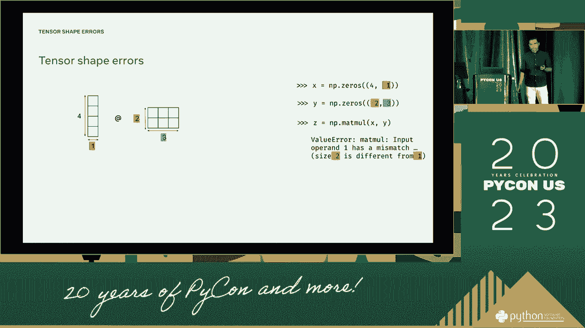

静态形状分析是指在代码执行前，仅通过分析代码逻辑和张量的已知形状信息，来推断和验证所有张量运算的形状兼容性。这类似于在数学中提前检查公式的维度是否匹配。

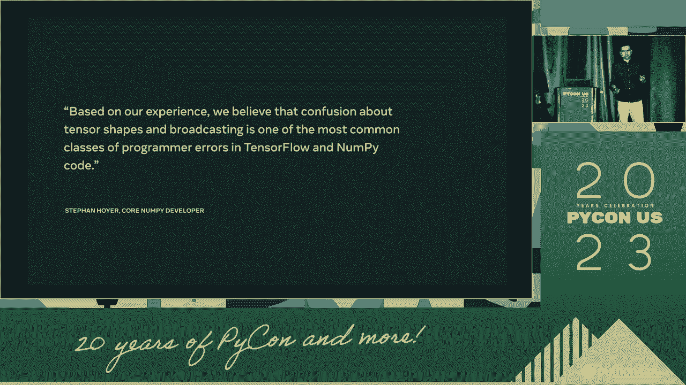

其核心依据是每个张量运算都有明确的形状传播规则。以下是一些常见运算的规则：

*   **矩阵乘法**：对于 `A @ B`，要求 `A.shape[1] == B.shape[0]`。结果的形状为 `(A.shape[0], B.shape[1])`。
    *   公式：`(m, n) @ (n, p) -> (m, p)`
*   **逐元素运算**：如加法、乘法，要求两个张量的形状完全相同。
    *   规则：`shape_A == shape_B`
*   **广播运算**：允许形状在某些维度上不同，但必须满足广播规则（例如，维度大小为1的轴可以扩展）。
*   **卷积运算**：输出形状由输入形状、卷积核大小、步长和填充决定。
    *   公式（简化）：`output_size = (input_size - kernel_size + 2*padding) / stride + 1`

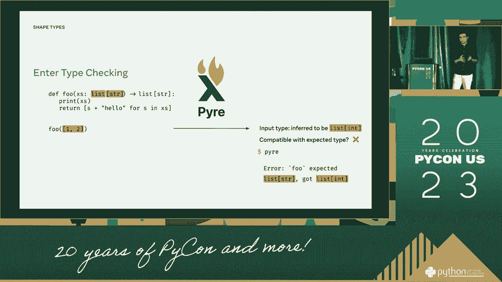

通过手动或借助工具跟踪这些规则，我们可以从已知的输入形状（如数据加载器输出的批次形状）开始，逐步推导出网络中每一层输出的张量形状。

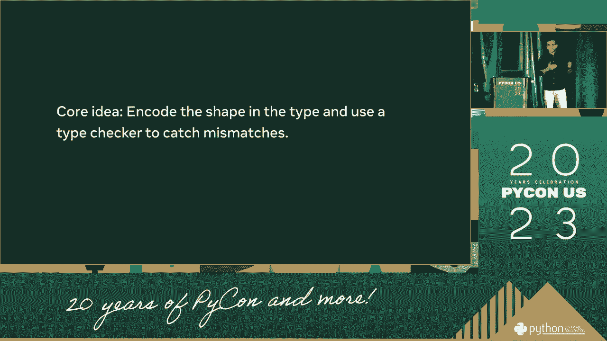

## 手动推导形状的步骤

以下是进行手动静态形状分析的步骤：

1.  **确定输入形状**：明确你的模型输入数据的形状。例如，对于图像分类任务，输入形状可能是 `(batch_size, 3, 224, 224)`。
2.  **逐层推导**：从输入层开始，根据每一层的类型（全连接层、卷积层、池化层等）及其参数（如神经元数量、卷积核大小、步长），应用对应的形状变换规则，计算出该层的输出形状。
3.  **记录与验证**：将每一层的输入和输出形状记录下来。在推导到下一层时，确保上一层的输出形状与当前层期望的输入形状匹配。
4.  **检查最终输出**：确保网络最终的输出形状与你任务要求的形状一致（例如，分类任务中输出层形状应为 `(batch_size, num_classes)`）。

## 实践示例：一个简单网络

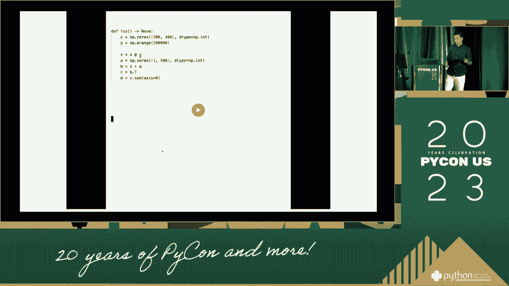

让我们通过一个简单的全连接神经网络示例来实践一下。

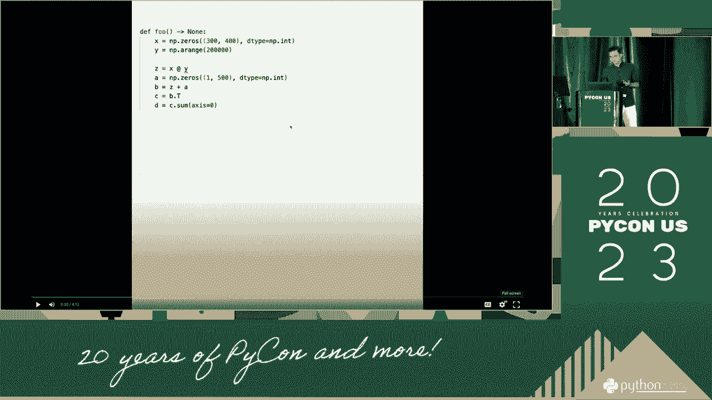

假设我们有一个批次数据，形状为 `(batch_size, 784)`，代表 `batch_size` 张 28x28 的扁平化图像。我们构建一个两层网络：
*   第一层：线性层，输入特征 784，输出特征 256。
*   第二层：线性层，输入特征 256，输出特征 10（对应10个类别）。

现在，我们进行形状推导：

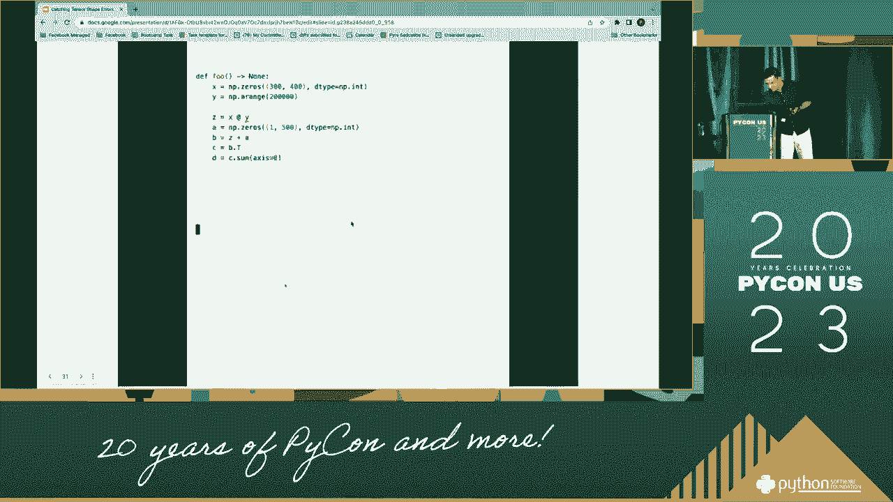

1.  **输入层**：`shape_input = (batch_size, 784)`
2.  **第一层（线性层）**：
    *   权重矩阵形状应为 `(784, 256)`。
    *   进行矩阵乘法：`(batch_size, 784) @ (784, 256)`。根据矩阵乘法规则，中间维度 `784` 匹配，因此输出形状为 `(batch_size, 256)`。
3.  **第二层（线性层）**：
    *   将第一层的输出 `(batch_size, 256)` 作为输入。
    *   第二层权重矩阵形状应为 `(256, 10)`。
    *   进行矩阵乘法：`(batch_size, 256) @ (256, 10)`。中间维度 `256` 匹配，因此最终输出形状为 `(batch_size, 10)`。

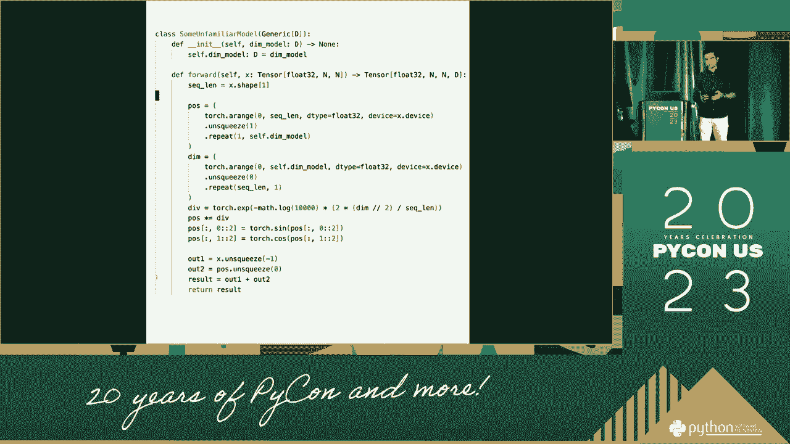

推导完成。整个过程没有运行任何代码，但我们确信只要权重矩阵定义正确，前向传播过程中不会出现形状错误。

## 利用现代框架的特性

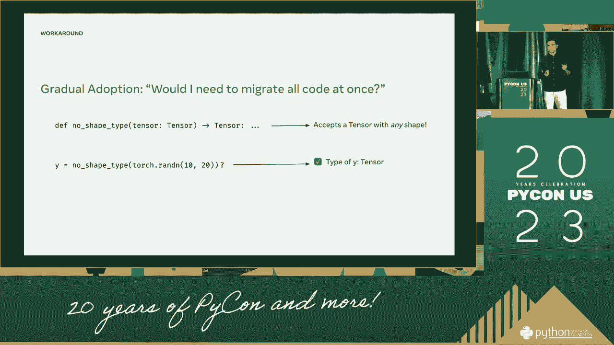

现代深度学习框架（如 PyTorch、TensorFlow）提供了强大的工具来辅助静态形状分析。

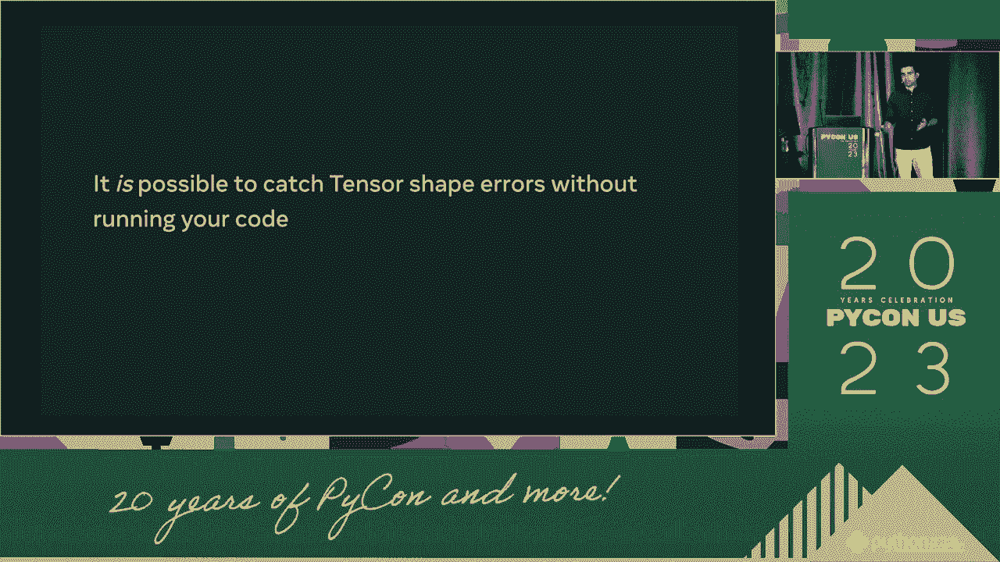

*   **模型摘要**：使用如 `torchsummary` 库或框架内置的 `.summary()` 方法，可以直接打印出模型中每一层的输入/输出形状。
    ```python
    # PyTorch 示例 (使用 torchsummary)
    from torchsummary import summary
    summary(your_model, input_size=(3, 224, 224))
    ```
*   **类型检查与Lint工具**：一些IDE或静态分析工具能对张量运算进行初步的类型（形状）检查，提示可能的不匹配。
*   **单元测试**：为你的模型前向传播函数编写单元测试，使用随机的模拟输入（dummy input）来验证形状是否如预期。
    ```python
    # 单元测试示例
    def test_model_shapes():
        dummy_input = torch.randn(4, 3, 224, 224) # batch_size=4
        model = YourCNNModel()
        output = model(dummy_input)
        assert output.shape == (4, 10), f"Expected shape (4, 10), got {output.shape}"
    ```

## 总结

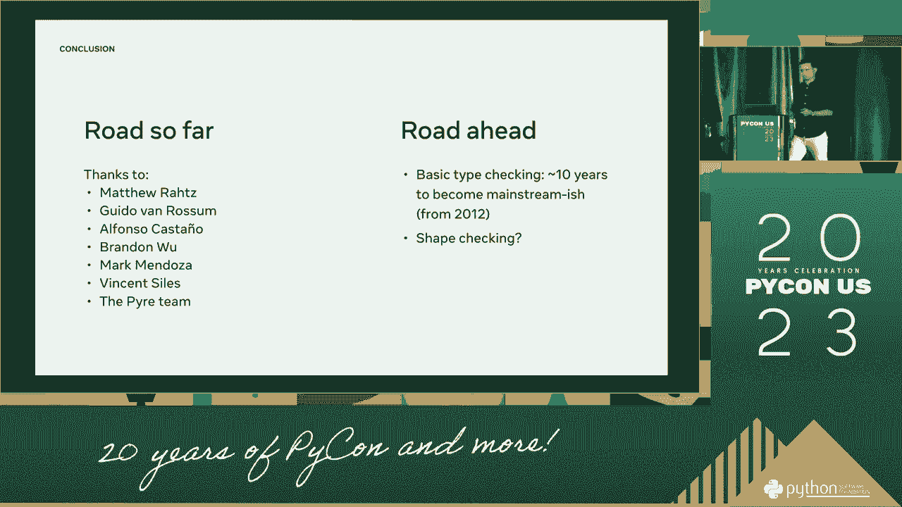

本节课中我们一起学习了如何在不运行代码的情况下捕获张量形状错误。我们首先理解了张量形状错误的本质，然后掌握了**静态形状分析**的核心原理，即跟踪每一层运算的形状传播规则。通过手动推导一个简单网络的示例，我们实践了这一方法。最后，我们了解到可以借助现代深度学习框架提供的模型摘要和单元测试等工具，使这一过程更加高效和可靠。掌握这项技能能让你在构建复杂神经网络时更加自信，并节省大量调试时间。