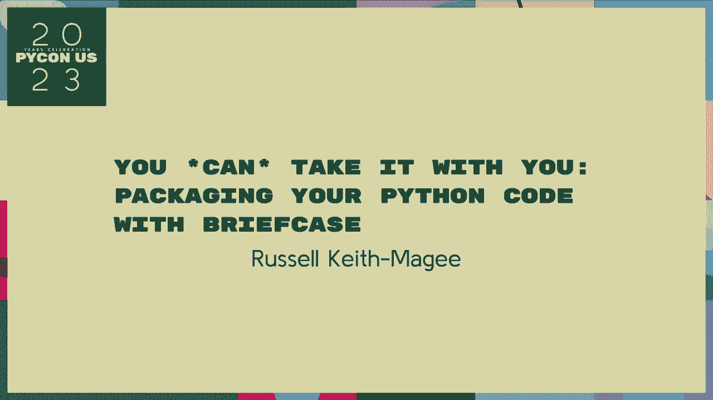
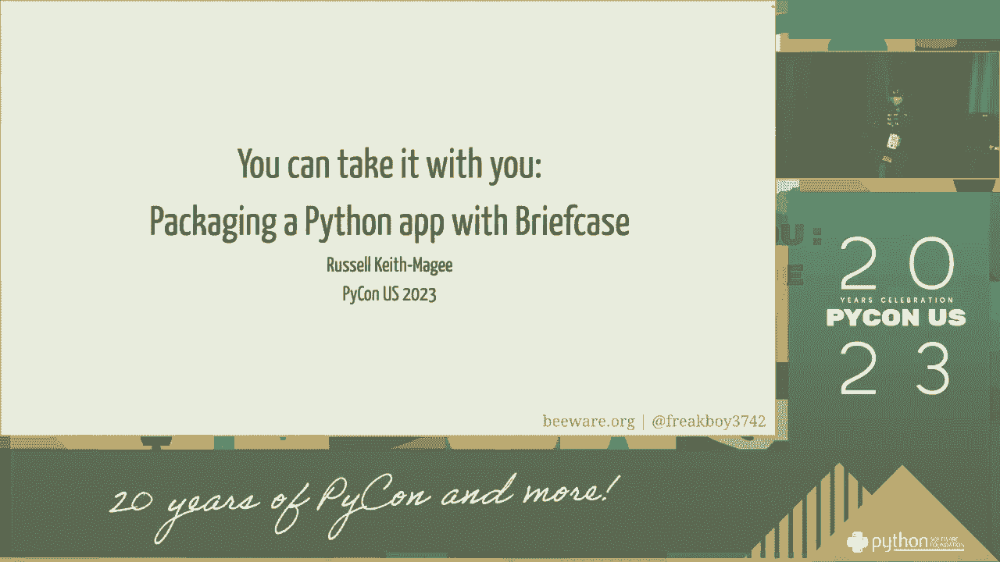
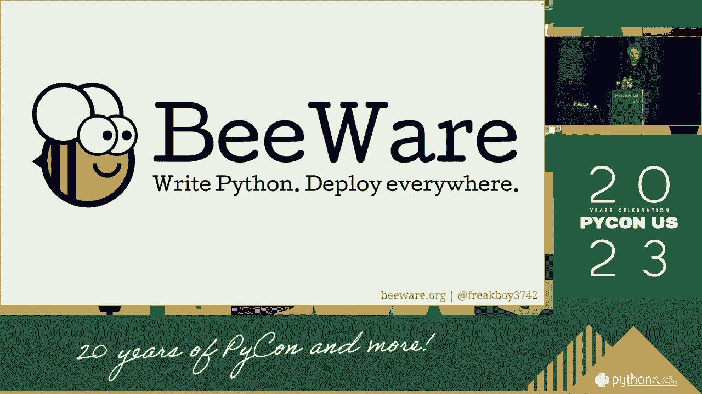
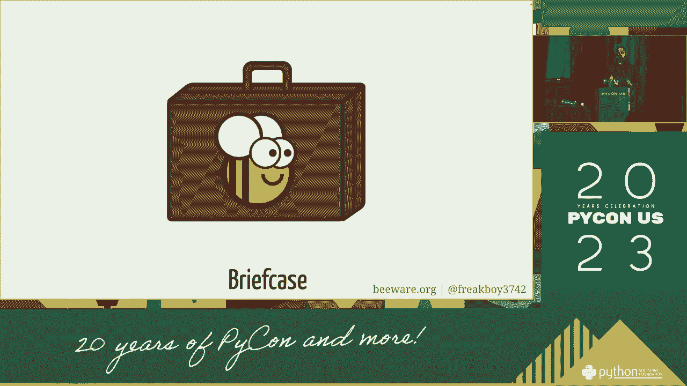
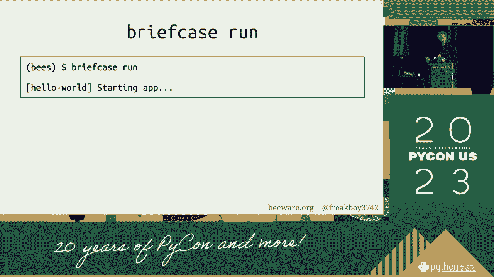
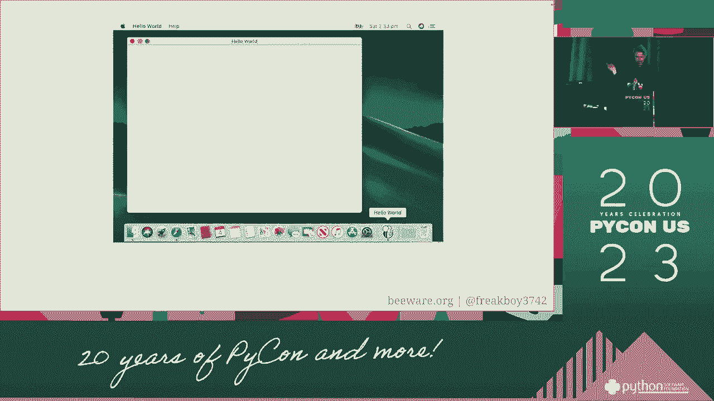
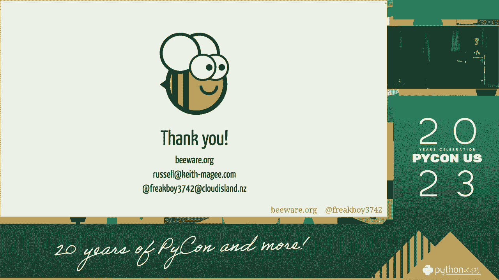

# 066：打包你的Python代码 - 随身携带的艺术 🚀

在本节课中，我们将学习如何将Python代码打包成可分发、可安装的格式。这个过程让你能够轻松地与他人分享你的项目，或者将其部署到不同的环境中。我们将从基础概念开始，逐步介绍打包的核心工具和步骤。

## 打包基础概念 📦



上一节我们介绍了打包的目的，本节中我们来看看打包涉及的核心概念。理解这些概念是成功打包项目的关键。



**包** 是包含Python模块和其他支持文件的目录。一个标准的包目录通常包含一个特殊的 `__init__.py` 文件。

**分发** 是指打包后的存档文件（如 `.tar.gz` 或 `.whl` 文件），它包含了你的包以及元数据，可以被上传到PyPI（Python包索引）供他人安装。

核心的打包元数据通过 `setup.py` 或 `pyproject.toml` 文件来定义。一个最简单的 `setup.py` 文件示例如下：



```python
from setuptools import setup, find_packages

setup(
    name="your_package_name",
    version="0.1.0",
    packages=find_packages(),
)
```



## 项目结构与关键文件 🗂️

了解了基础概念后，我们需要构建一个标准的项目结构。一个组织良好的项目结构是打包成功的前提。

以下是创建一个可打包Python项目的基本文件和目录结构：

*   **`your_package/`**: 这是你的主包目录，里面存放你的Python模块（`.py`文件）。
*   **`setup.py`** 或 **`pyproject.toml`**: 这是打包的配置文件，定义了项目的名称、版本、依赖等元数据。
*   **`README.md`**: 项目的说明文档。
*   **`LICENSE`**: 项目的开源许可证文件。
*   **`tests/`**: 存放测试代码的目录。

## 使用Setuptools进行打包 🔧

上一节我们规划了项目结构，本节中我们来看看如何使用Setuptools这个最常用的工具来执行打包操作。

首先，确保你安装了最新版的setuptools和wheel：
```bash
pip install --upgrade setuptools wheel
```

接下来，在项目根目录下运行打包命令：
```bash
python setup.py sdist bdist_wheel
```

这个命令会生成两种分发格式：
1.  **`sdist`** (Source Distribution): 在 `dist/` 目录下生成一个 `.tar.gz` 源码归档文件。
2.  **`bdist_wheel`** (Built Distribution): 在 `dist/` 目录下生成一个 `.whl` 二进制轮子文件。这是一种更现代的格式，安装速度更快。



## 上传到PyPI 🌐

我们已经成功在本地创建了分发包，本节中我们来看看如何将其分享给全世界——上传到PyPI。



首先，你需要注册PyPI的账户。然后，安装上传工具Twine：
```bash
pip install --upgrade twine
```

使用Twine上传你在 `dist/` 目录下生成的包文件：
```bash
twine upload dist/*
```

系统会提示你输入PyPI的用户名和密码。上传成功后，其他人就可以通过 `pip install your_package_name` 来安装你的包了。

## 现代打包配置：pyproject.toml ⚙️

除了传统的 `setup.py`，现代Python打包更推荐使用 `pyproject.toml` 文件。它提供了更清晰、更标准的配置方式。

以下是一个 `pyproject.toml` 的示例配置：

```toml
[build-system]
requires = ["setuptools>=61.0", "wheel"]
build-backend = "setuptools.build_meta"

[project]
name = "your_package_name"
version = "0.1.0"
authors = [{name = "Your Name", email = "your.email@example.com"}]
description = "A brief description of your package"
readme = "README.md"
license = {text = "MIT"}
classifiers = [
    "Programming Language :: Python :: 3",
    "License :: OSI Approved :: MIT License",
    "Operating System :: OS Independent",
]
dependencies = [
    "requests>=2.25.0",
    "numpy>=1.20.0"
]

[project.optional-dependencies]
dev = ["pytest>=6.0", "black"]

[project.urls]
Homepage = "https://github.com/you/your_package"
```



使用 `pyproject.toml` 时，你可以直接使用 `pip` 来构建和安装项目：
```bash
pip install .
```
或者构建分发包：
```bash
pip install build
python -m build
```

## 总结 📝

本节课中我们一起学习了Python代码打包与分发的完整流程。我们从打包的核心概念和项目结构讲起，详细介绍了如何使用Setuptools和`setup.py`进行传统打包，以及如何用Twine将包上传到PyPI。最后，我们还探讨了更现代的`pyproject.toml`配置方式。掌握这些技能，你就能将自己的Python项目变成可以轻松分享和安装的软件包，真正做到“随身携带”。