# 067：课程概述与准备 🗺️

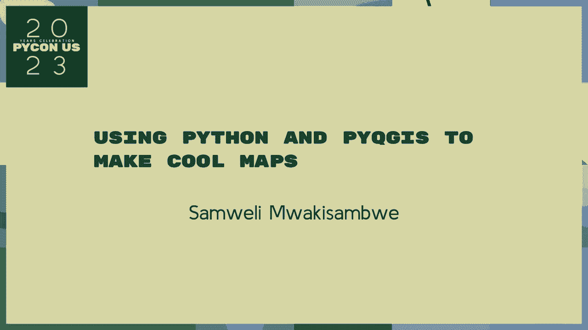

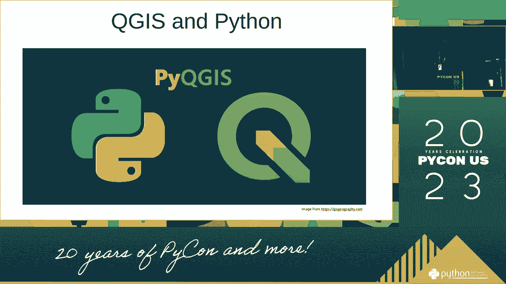

在本节课中，我们将要学习如何使用 Python 和 PyQGIS 来制作专业且美观的地图。PyQGIS 是 QGIS 地理信息系统的 Python 接口，它允许我们通过编写脚本来自动化地图制作流程，实现复杂的地图样式和布局。

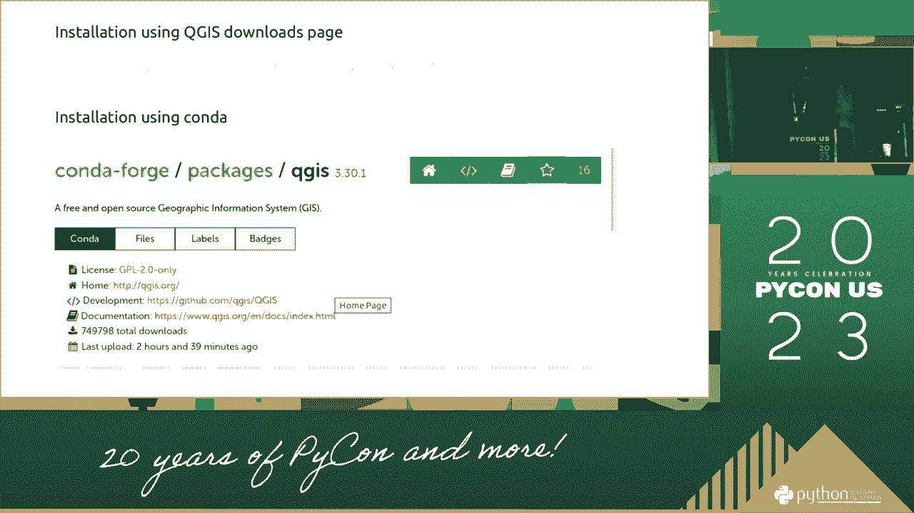

## 课程概述

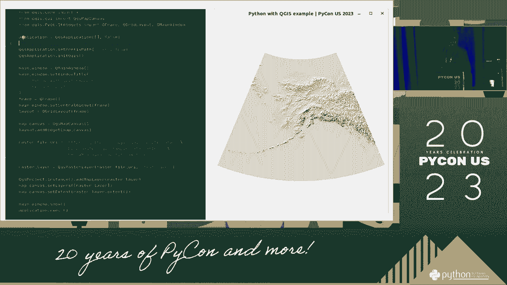

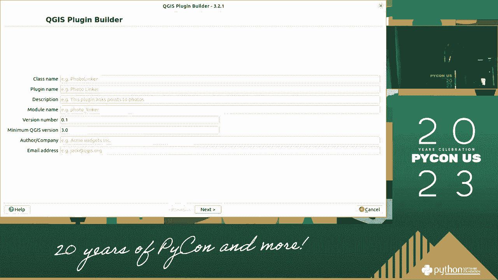

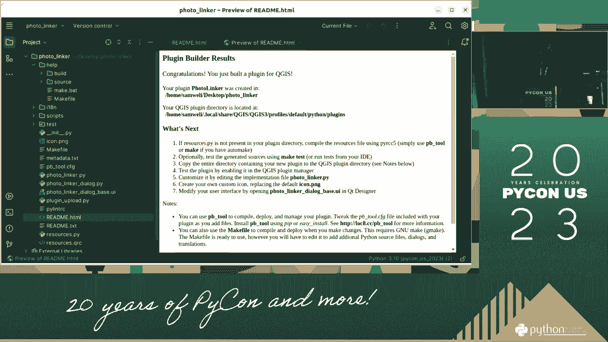

本节课是系列课程的开始，主要目标是介绍课程的整体框架，并指导大家完成学习前的准备工作。我们将确保开发环境配置正确，为后续的实际操作打下基础。

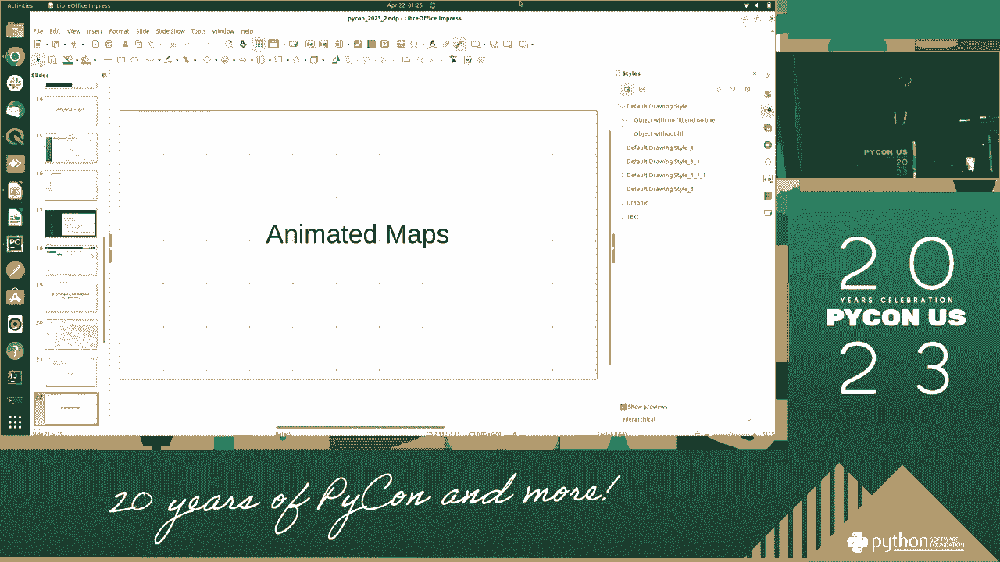

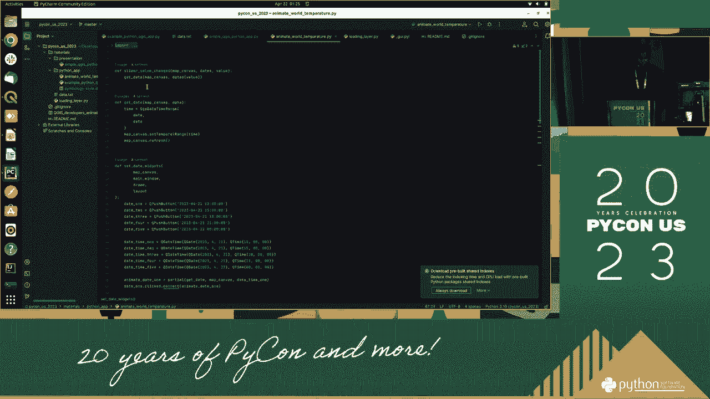

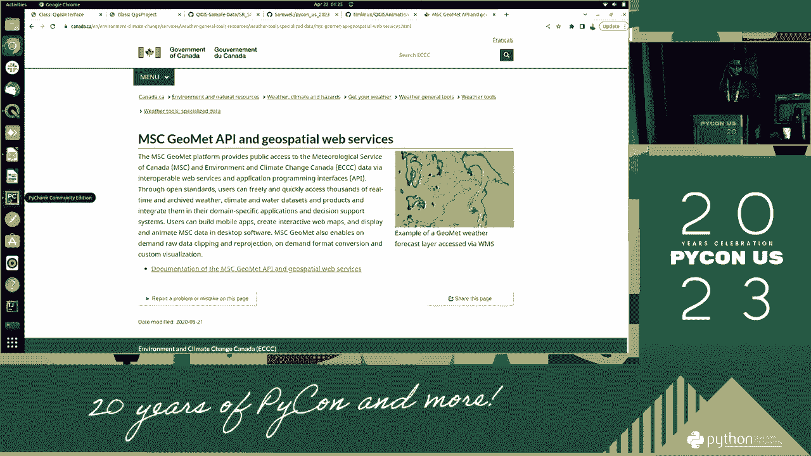

上一节我们介绍了课程的整体目标，本节中我们来看看开始学习前需要做哪些具体准备。

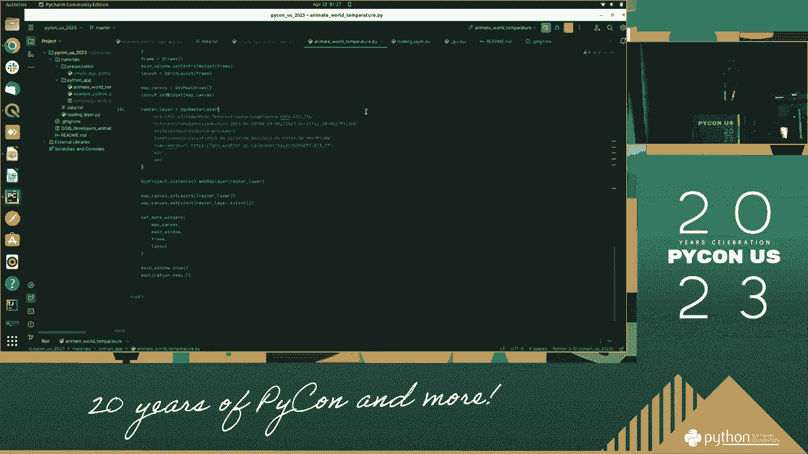

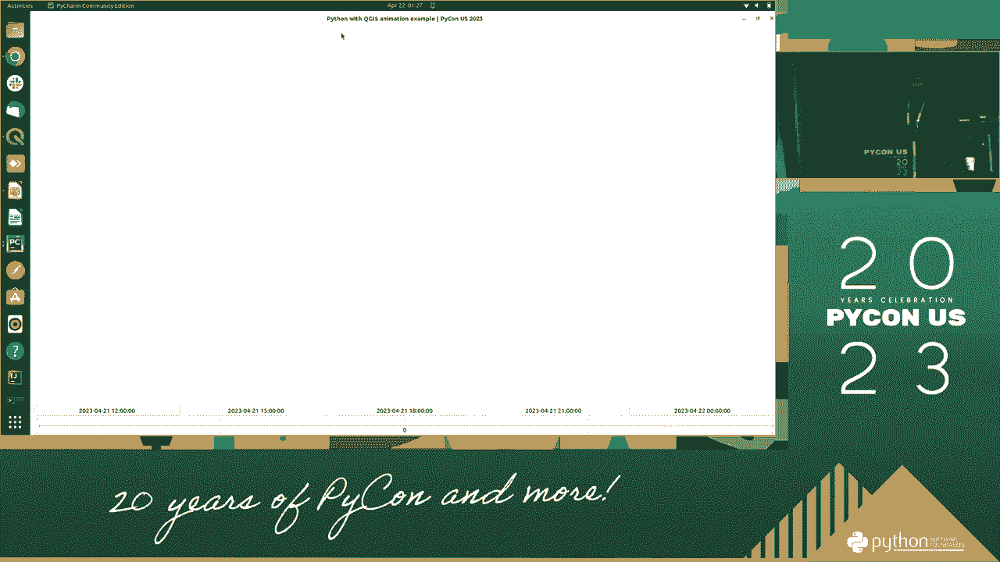

## 准备工作

为了顺利进行后续的编程和地图制作，我们需要提前准备好相应的软件和工具。以下是开始学习前必须完成的几个步骤。

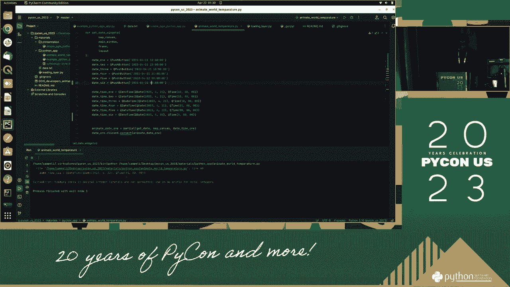

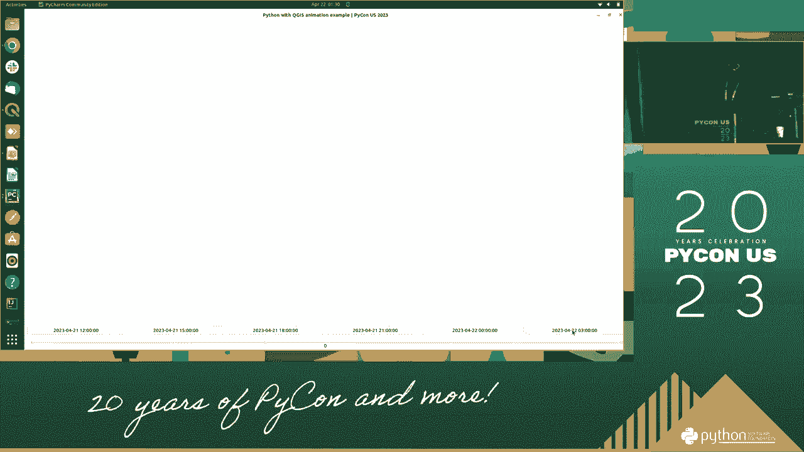

1.  **安装 QGIS**：访问 QGIS 官方网站下载并安装最新稳定版本的 QGIS 软件。
2.  **配置 Python 环境**：确保系统中安装了 Python，并且版本与 PyQGIS 兼容。通常 QGIS 会自带 Python 环境。
3.  **设置代码编辑器**：选择一个你熟悉的代码编辑器或集成开发环境（IDE），例如 VS Code 或 PyCharm，并配置好与 QGIS Python 解释器的连接。
4.  **了解基本概念**：对 GIS（地理信息系统）的基本概念，如矢量数据、栅格数据、坐标系等，有初步了解会更有帮助。

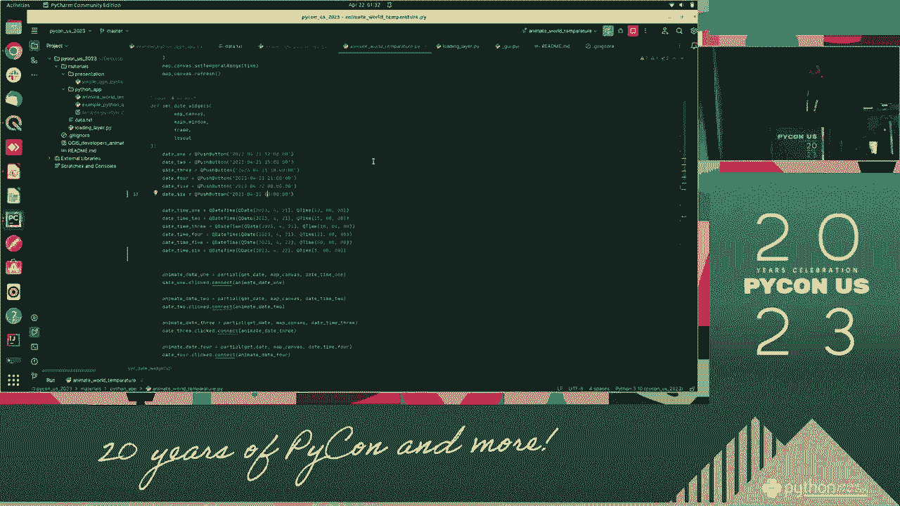

## 核心工具与概念


在 PyQGIS 编程中，最核心的是 `QgsProject` 和 `QgsVectorLayer` 等类。它们是我们操作地图数据和项目的基础。

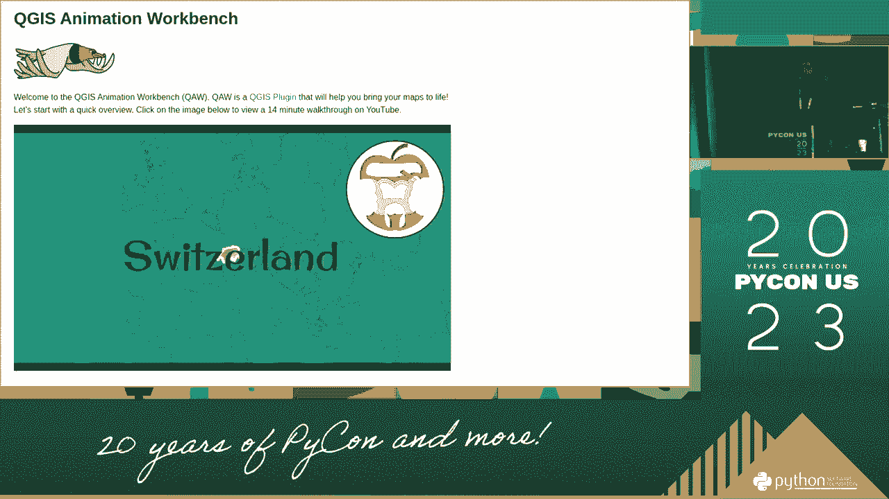

例如，加载一个矢量图层到当前项目的代码如下：
```python
# 定义图层路径
layer_path = “path/to/your/shapefile.shp”
# 创建矢量图层对象
layer = QgsVectorLayer(layer_path, “layer_name”, “ogr”)
# 将图层添加到当前项目
QgsProject.instance().addMapLayer(layer)
```

## 总结

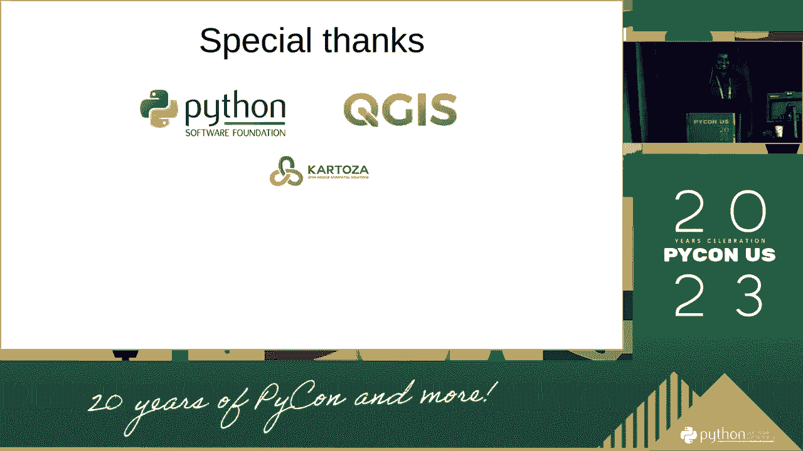

本节课中我们一起学习了本系列课程的目标和开始前的准备工作。我们概述了将使用 Python 和 PyQGIS 来自动化地图制作，并列出了安装软件、配置环境等必要的准备步骤。确保完成这些准备，我们就能在接下来的课程中顺利开始编写代码，创建酷炫的地图。