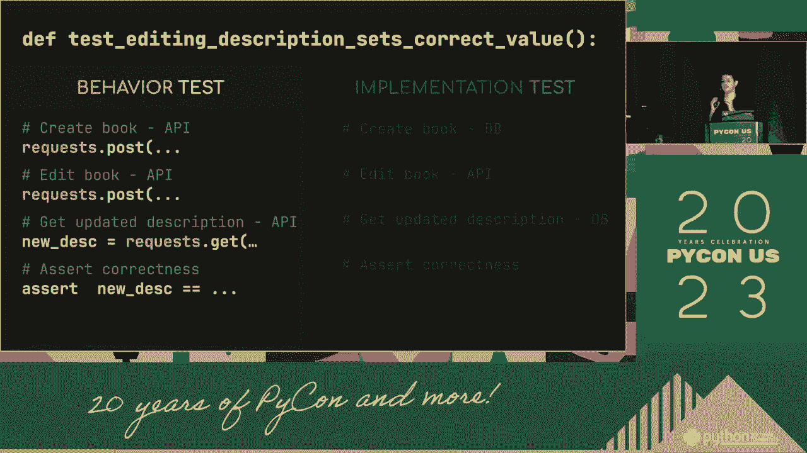
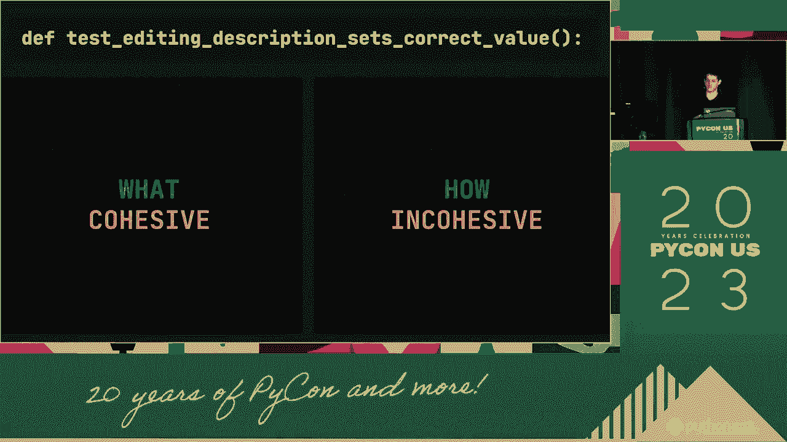
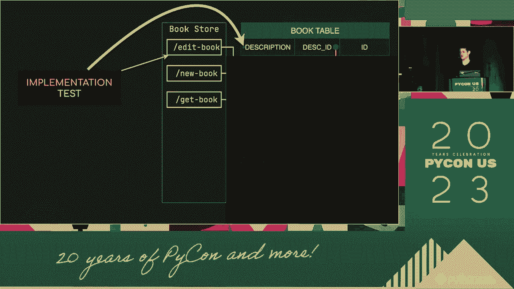
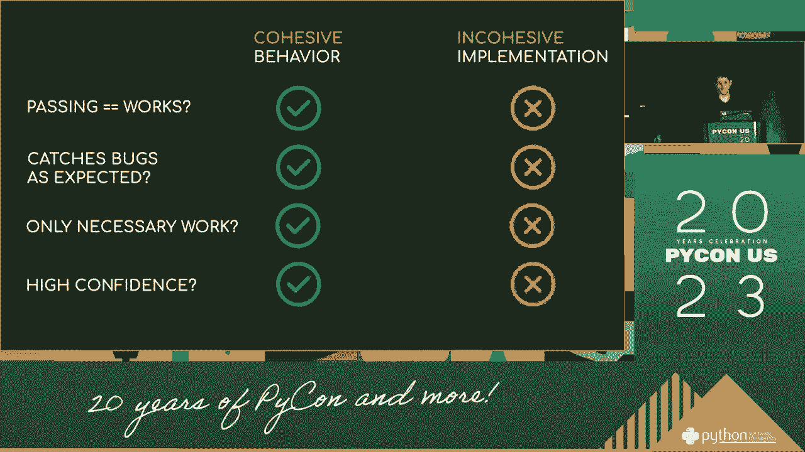
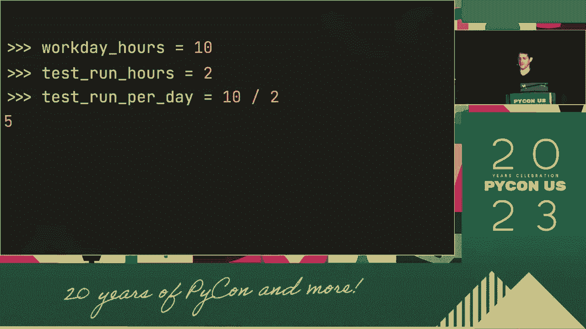

# 069：测试中自毁的10种方式 🧨


在本节课中，我们将学习Shai Geva在演讲中总结的、测试人员在工作中可能无意中“自毁”的10种常见方式。这些行为会降低测试效率、损害团队信任，并最终影响产品质量。我们将逐一分析这些行为，并提供避免它们的建议。

## 概述

有效的软件测试是确保产品质量的关键环节。然而，测试人员自身的一些习惯和行为可能会阻碍测试工作的顺利进行，甚至导致测试失败。本节内容基于Shai Geva的经验，旨在帮助测试人员识别并避免这些“自毁”行为。

---

## P69：1：缺乏明确目标 🎯

从某种意义上说，我们可以生活。从另一个角度来看，感谢你们的到来。今天我将讨论一下决策时代。但是，这与项目的背景有些不符。


所以，潜在的是要让它签署，我将为你带来相同的内容，时间不长。主要是在区域方面，我们将讨论区域的整体右侧。开发者的情况也是如此，根据右侧的情况。因此，那些重要的人以及考虑影响的人，开发者的情况也是相同的。

**核心问题**：测试工作没有清晰、一致的目标，与项目整体目标脱节。

**避免方法**：在测试开始前，与项目团队（特别是开发者）共同明确测试范围和验收标准。确保测试活动始终围绕项目核心目标展开。

---

上一节我们介绍了缺乏明确目标的问题。接下来，我们来看看沟通不畅如何导致测试失效。

## P69：2：沟通不畅与假设 🤐

这有点问题。我马上要谈论这个问题。我以为这是又一次的演讲，因为我必须达到一个非常高的标准。这个工作非常有趣。我将讨论这个地区的背景，因为我认为人们是快乐的。你只需要做出一个更普遍的决定。或者更具体一点。

**核心问题**：测试人员基于个人假设进行测试和报告，而不是基于事实和明确的沟通。



**避免方法**：主动沟通，澄清所有疑问。使用明确的、可验证的语言编写测试用例和报告Bug。公式可以表示为：**有效沟通 = 事实 + 清晰表述**。

---

沟通问题往往源于对信息真实性的忽视。下面，我们将探讨另一个关键问题：忽视事实。



## P69：3：忽视或否认事实 ❌

还有一个原因是这将不是真的。因为这将不是真的。这不是真的，但这将不是真的。这不是真的。这不是真的。这不是真的。这不是真的。这不是真的。这不是真的。这不是真的。这不是真的。

**核心问题**：选择性忽略测试证据，或否认不符合预期的测试结果。

**避免方法**：坚持客观性。所有测试结果，无论是否符合预期，都应被忠实记录和分析。测试报告应基于数据，而非个人愿望。

---

在确认了事实的重要性后，我们需要审视测试人员的专业定位。错误的自我定位是另一种“自毁”方式。

## P69：4：错误的自我定位 👨‍🔬

而且我不是科学家，我认为我像是科学家。我不是科学家。我似乎有很多事情要讨论。我不是一位插图科学家。我不是科学家。但我不是制作人。我是一名监督员。我是一名科学家。我是一名教授。一个教授。我是一个教授，一个教授。我是一个教授，一个教授，一个教授。我是一个护士。一个研究员。我是一个教授，一个学者，一个院长，但我不是一个老师。我是一个学者，一个老师。我需要从中学习。我需要向我的同行学习。并说“最佳”“最佳”“最佳的”“最佳”。然后就是话题视频的结束。



**核心问题**：测试人员对自身角色认知模糊，试图扮演开发者、经理或架构师的角色，而非专注于测试本身。



**避免方法**：明确测试人员的核心职责是**发现风险和信息**。与开发团队协作，但保持测试活动的独立性和客观性。

---

定位清晰后，测试执行过程本身也可能出现问题。例如，测试不彻底或过快。

## P69：5：测试不彻底与过快 🏃


然而它仍然无法回应与你的对话。通常，如果它没有做对，那可能会变得糟糕。其他的反对时，它会说得非常快，但有点不太准确。某一天，它会提出一个界限。因为它没有停下来，这可能会更困难，所以会变得糟糕。然后会给你一点一点更多，这不会花太久。

**核心问题**：为了追求速度而进行肤浅的测试，遗漏深层次的缺陷。

**避免方法**：平衡速度与深度。采用基于风险的测试策略，对核心功能进行深入测试。代码示例：在自动化测试中，除了`happy path`，也要编写`edge case`和`negative test`。

```python
# 示例：一个不彻底的测试（只测了正常情况）
def test_login_success():
    result = login(“valid_user”, “valid_pass”)
    assert result == True


# 改进：更全面的测试
def test_login_failure_invalid_user():
    result = login(“invalid_user”, “valid_pass”)
    assert result == False


def test_login_failure_invalid_pass():
    result = login(“valid_user”, “invalid_pass”)
    assert result == False

def test_login_failure_empty_input():
    result = login(“”, “”)
    assert result == False
```

---

测试的深度也取决于我们设定的目标。模糊或错误的目标会直接导致测试失败。

## P69：6：目标模糊或错误 🎯

所以对于，我所说的。这些我们使用的，任何都取决于怎么说。当然，在我们的互动中，它将会完成。因此，解决方案本身的目标是，首先。我们要特别谈谈这个，在此之前它们并不重要，我之前做过。但这确实是一件特别的事情。而且，尽管有语言的问题，我们希望在结论中语言能更具体。要看到我们所看到的时间示例，我认为它破裂了，然后是一般的。我认为，要理解，我们必须担心我们想去的地方。

**核心问题**：测试目标不具体、不可衡量，或者目标本身就是错误的（例如，追求100%无Bug）。

**避免方法**：设定**SMART**测试目标（具体的、可衡量的、可实现的、相关的、有时限的）。例如，“在本轮测试中，对支付模块的核心流程完成100%的路径覆盖，并将高优先级缺陷的发现率提高20%”。

---

即使目标正确，实现过程也可能因为缺乏计划而变得混乱漫长。

## P69：7：过程混乱且缺乏计划 📝

似乎在我们收集之前需要做一些工作。通常如此，但那种成长从未发生。这是我们想要达到的目标。所以，这非常，非常漫长。这也是更好的。它并不是最具体的。我在其中有一个问题。这比任何人都更具体。非常混乱，我假设，我们对此并不确定。但是无论如何，这都不会是真的。所以，这并不完全准确。然后。那就是目标，那就是目标。



**核心问题**：测试活动没有计划，随机、混乱地进行，导致效率低下和资源浪费。

**避免方法**：制定详细的测试计划，包括测试范围、资源、进度、风险和退出标准。并使用看板或任务列表来跟踪执行情况。


---

清晰的计划需要明确的交付物定义。对测试产出物的错误认知是下一个陷阱。

## P69：8：对产出物的错误认知 📄

这不会是一个事实，或者在任何社区，它不是一本书。这是针对特定语言的建议。这是一种不是语言的语言。这是我们需要实现的目标。这是我们需要实现的目标。这就是我们人们的目标或指南，或者说是我们家庭的目标。例如。我认为我们在使用这个标题，但我们必须转向不同的标题。所以，在课程的开始，我们将放弃我们的标题。然后我们将继续放弃我们的标题。我们必须把这留给你。我是说。无论标题的最佳部分是什么，重要的是要知道它是正确的。我们不会总结并查看它。

**核心问题**：认为测试报告、Bug列表等是最终“产品”，而忘记了测试的真正产出是**质量评估信息和风险洞察**。

**避免方法**：关注报告背后的信息和价值。测试报告应服务于决策（如是否可以发布），而不仅仅是记录活动。

---

测试工作不是在真空中进行的，它受到组织和社会环境的影响。忽视这一点是危险的。

## P69：9：忽视组织与社会背景 🏛️

这非常，非常慢。社会健康，你知道。政府应该做些什么？这是政府形态的一个背景。而这并不是你无法避免的。因此，很多时候你会提起，也许这只是我--。这是一项商业，您认为，好的。政府非常关注。但是法案是地方性的。而且——除非您担心——法案是地方性的。而且——她没有发现——。法案是可判断的。不，不——如果是地方性的，她仍然是斗狗斗狗。而这一点至少在一般情况下是如此，我的意思是，太多人在——。

**核心问题**：忽略项目所处的商业目标、公司文化、法规政策等外部环境，导致测试建议不切实际。

**避免方法**：理解业务。测试应始终围绕商业价值和用户需求展开，并考虑合规性等约束条件。

---

最后，即使意识到所有问题，不采取行动或给出不切实际的建议，也会让测试工作前功尽弃。

## P69：10：不行动与不切实际的建议 🛑

事情发生得太快了。要谈三小时，实际上可能会有五小时。不会有五小时的。所以，我的建议是，尽量试试——我会稍微提出一个想法。我会一个，一个，继续下去。现在我会工作，但仍然——事情仍然存在。这就是问题所在。我们就这样处理——这就是我能做到的。这只是我的责任。只是这样——，只是这样——，你只能下订单，或者四处跑。如果你想跑，你可能会碰到像这样的事情。我想说的就是，我会坚持我之前说过的。别——，就是不要这么做。你是全职的，而你正在进行第 24 天。因为你正在进行第 24 天，因为这不过是个 3-3-3。我是说。你不需要接触我的身体。事情会变得非常，非常、非常糟糕。

**核心问题**：1. 只发现问题而不推动解决。2. 提出在现有时间、资源或技术条件下无法实现的“完美”建议。

**避免方法**：1. 积极跟进，推动缺陷修复和流程改进。2. 提出**渐进式**和**可落地**的改进建议。例如，与其要求“重写整个系统架构”，不如建议“在下个迭代中，为模块X增加单元测试覆盖”。


*（示意图：从混乱到有序的改进过程）*

---

## 总结

在本节课中，我们一起学习了Shai Geva提出的测试人员可能“自毁”的10种方式：

1.  **缺乏明确目标**：测试与项目目标脱节。
2.  **沟通不畅与假设**：基于假设而非事实沟通。
3.  **忽视或否认事实**：不客观对待测试结果。
4.  **错误的自我定位**：角色认知模糊，越俎代庖。
5.  **测试不彻底与过快**：追求速度牺牲深度。
6.  **目标模糊或错误**：设定不切实际或模糊的目标。
7.  **过程混乱且缺乏计划**：测试活动无章法。
8.  **对产出物的错误认知**：把报告当目的，而非手段。
9.  **忽视组织与社会背景**：脱离业务和现实环境。
10. **不行动与不切实际的建议**：只提问题不解决，或建议无法落地。


避免这些陷阱的关键在于保持**专业性、客观性、沟通意识和业务聚焦**。优秀的测试人员不仅是技术的践行者，更是团队协作的促进者和项目风险的清晰报告者。