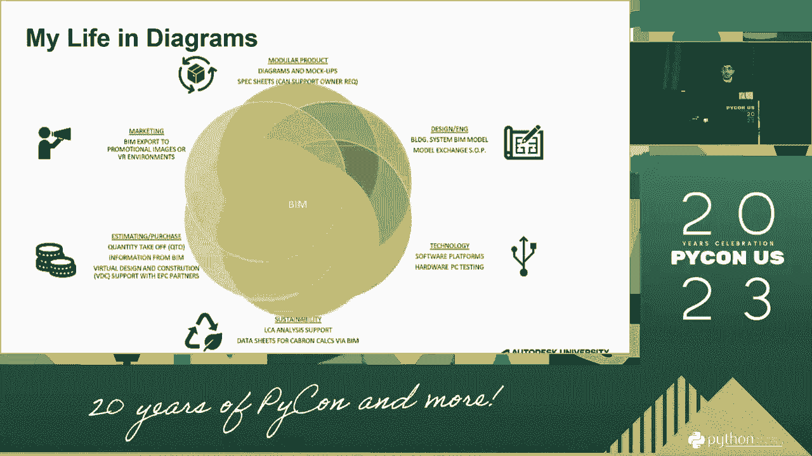
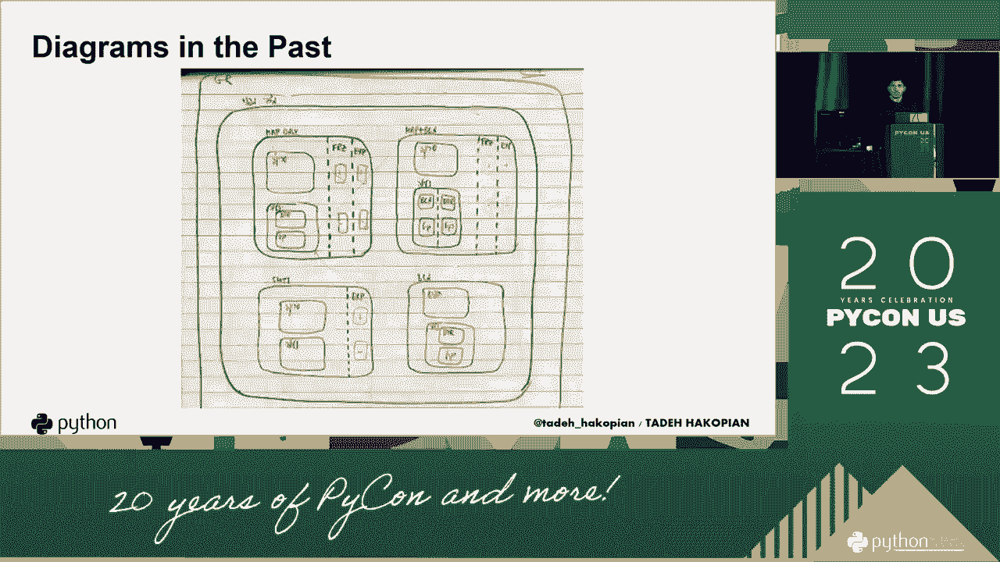
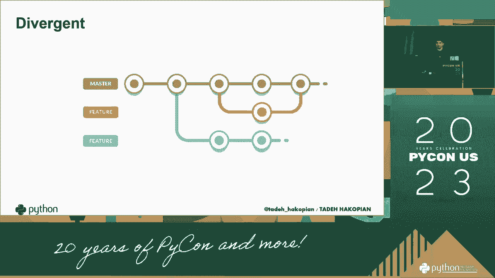
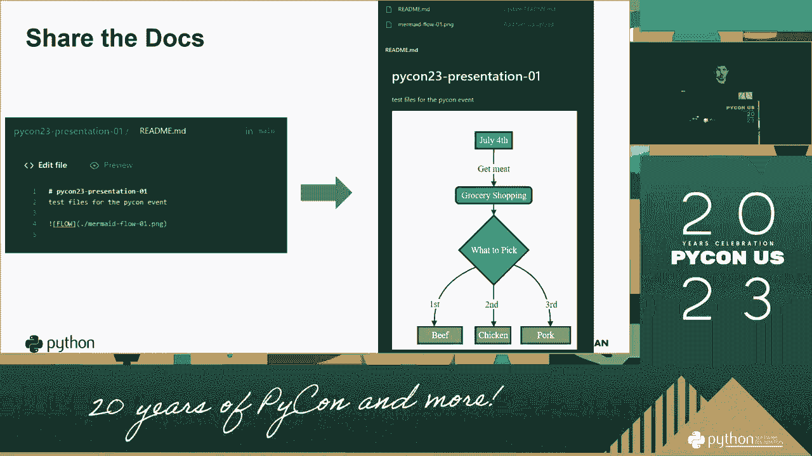
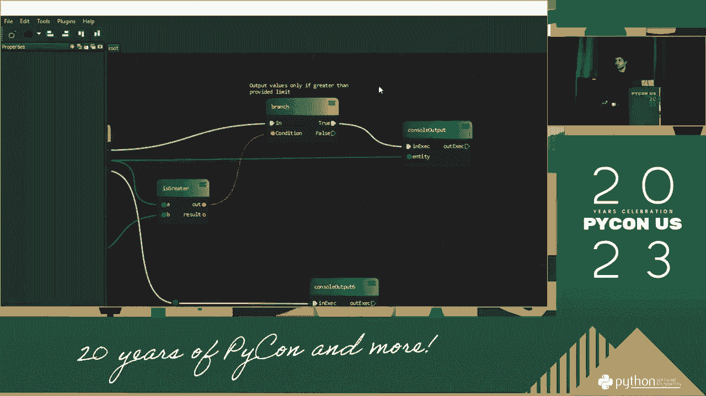
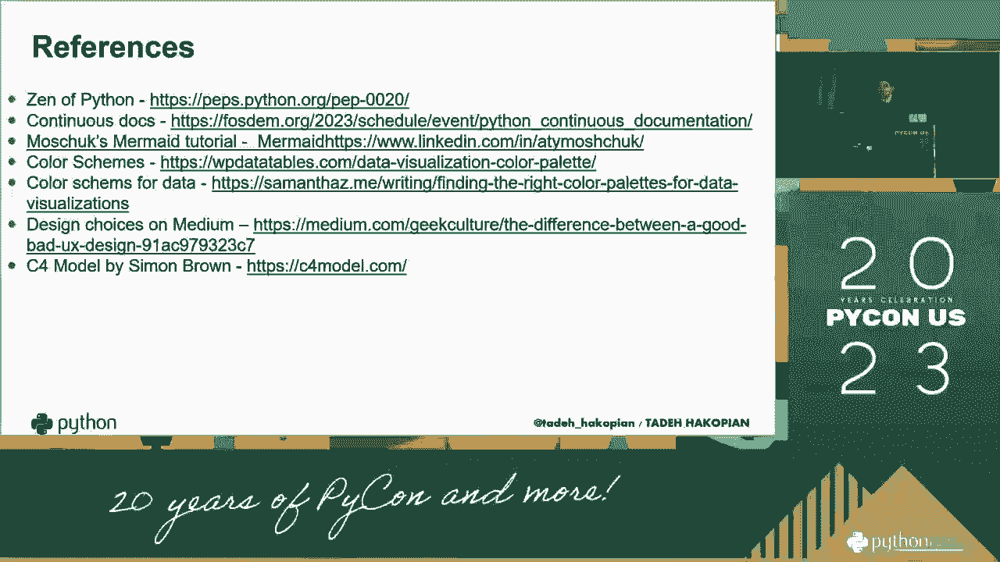

# 071：让复杂想法变得简单 📊

在本节课中，我们将学习一种被称为“失落的图表艺术”的数据可视化方法。这种方法旨在通过巧妙的图表设计，将复杂的数据和想法转化为清晰、直观的视觉呈现，从而帮助观众快速理解核心信息。

## 概述

数据可视化不仅仅是绘制图表，更是一种沟通艺术。传统的图表有时难以有效传达复杂关系或深层洞见。本节课将介绍一系列超越常规的图表类型和设计原则，它们曾一度被忽视，但能极大地提升信息传达的效率和效果。

---

上一节我们概述了图表艺术的目标，本节中我们来看看图表设计的核心挑战与解决思路。

### P71：1：图表设计的核心挑战

现代数据呈现常面临信息过载的问题。图表元素过多或关系复杂时，观众难以快速抓住重点。

解决这一挑战的关键在于**简化与聚焦**。图表设计的首要任务是突出核心数据关系，过滤次要信息。

---

理解了核心挑战后，我们来探讨实现简化与聚焦的具体设计原则。

### P71：2：核心设计原则

以下是实现有效可视化的几个关键原则：

*   **减少认知负荷**：设计应让观众用最少的脑力理解最多的信息。避免使用需要复杂解读的视觉编码。
*   **突出对比**：利用颜色、大小、位置等视觉变量，清晰区分数据的不同类别或重要程度。
*   **讲述故事**：图表应有一个清晰的叙事逻辑，引导观众的视线和思维，而不仅仅是数据的堆砌。
*   **选择合适的图表类型**：不同的数据关系和传达目的，对应不同的最佳图表形式。

---

掌握了设计原则，我们就可以深入了解一些具体且强大的“失落”图表类型了。

### P71：3：强大的“失落”图表类型

上一节我们介绍了通用原则，本节中我们来看看几种特别有效的特定图表。

#### 斜率图

斜率图专注于展示两个时间点或状态之间数据的变化趋势和排名更迭。

**核心价值**：清晰显示**谁在进步、谁在退步**，以及变化的幅度。

例如，比较公司各部门在两个季度的绩效排名变化，斜率图能一目了然地显示哪些部门排名上升（正斜率），哪些下降（负斜率）。

---

#### 哑铃图

哑铃图用于比较同一项目在两个不同组别、时间点或条件下的数值。

**核心价值**：精准对比**两组数据间的差异**。

它由一条线段连接两个数据点构成，线段长度直观代表了差异的大小。常用于展示A/B测试结果、前后测对比等。

---

#### 单元图

单元图将总体划分为若干个小单元（如小方块、圆圈），每个单元代表一个统计单位（如1%的人口，一个病人）。

**核心价值**：将抽象比例**具象化**，增强情感共鸣和直观理解。

当你说“这个治疗方案对30%的患者有效”时，听众可能无感。但展示一个由100个小方块组成、其中30个被涂色的网格，冲击力更强。公式上，它实现了：
`抽象比例 -> 具体可数的单元集合`

---

除了上述类型，还有一种图表能优雅地揭示数据分布与组成。

### P71：4：展示分布与组成

#### 小提琴图

小提琴图是箱形图与密度图的结合。它展示了数据的**完整分布形态**，包括中位数、四分位数以及任意位置的密度。

**核心价值**：揭示数据分布的**多模态、偏态和异常值**，信息量远大于简单的平均值或中位数。

在代码分析中，比较不同算法运行时间的分布时，小提琴图可以清晰显示算法A是否稳定（图形瘦高），而算法B是否偶尔有极端耗时（图形底部有长尾）。

---

最后，我们来学习如何将多个简单图表组合起来，讲述更复杂的数据故事。

### P71：5：组合图表与叙事

复杂的想法往往需要多角度呈现。通过将多个简单的图表（如折线图、条形图、散点图）以逻辑顺序排列在同一视图中，可以构建一个逐步深入的叙事。

**核心方法**：
1.  **设定场景**：用第一个图表展示整体背景或趋势。
2.  **深入细节**：用后续图表分解整体，展示关键组成部分或影响因素。
3.  **揭示关系**：用散点图等展示变量间的相关性。
4.  **总结洞见**：用最简明的图表（如突出关键数字的大字报）重申核心结论。

这种“小 multiples”或“仪表板”式的设计，能引导观众像阅读故事一样理解数据。

---

## 总结

本节课中我们一起学习了“失落的图表艺术”。我们从图表设计的核心挑战出发，探讨了简化与聚焦的原则。接着，我们深入了解了**斜率图**、**哑铃图**、**单元图**和**小提琴图**这几种强大而未被充分利用的图表类型，它们分别擅长展示变化、对比、比例和分布。最后，我们学习了如何通过组合图表来构建数据叙事。记住，优秀的可视化目标是让复杂想法变得简单直观，而不仅仅是制作一个“正确”的图表。掌握这些工具，你将能更有效地用数据沟通和说服。