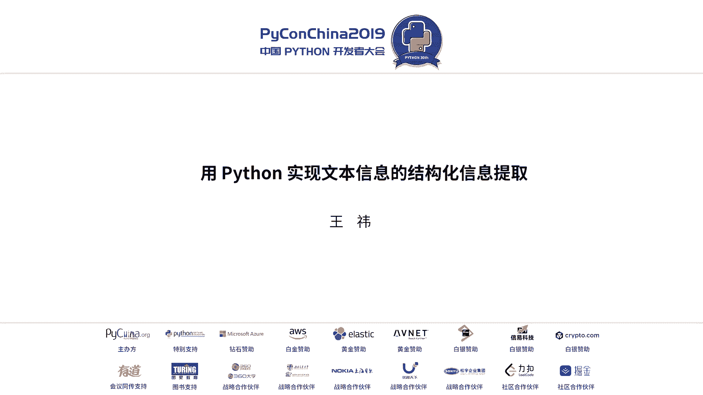
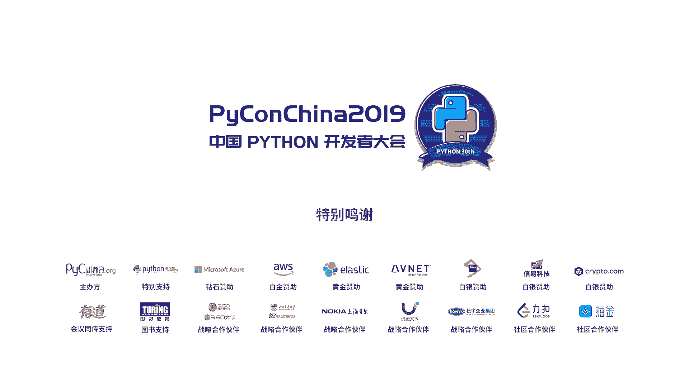

# Python文本信息提取：P3：用Python实现文本信息的结构化信息提取 📝



## 概述

在本节课中，我们将学习如何使用Python从非结构化的文本中提取结构化的信息。我们将从一个具体的业务场景出发，了解结构化信息提取的概念、方法、实现步骤，并最终探讨如何将模型部署为服务，实现持续集成与交付。

---

## 什么是结构化信息提取？ 🤔

结构化信息提取是指从非结构化的文本数据中，抽取出结构化的、机器可读的数据的过程。

例如，一段关于“千岛湖”的介绍文本，经过提取后，可以得到诸如“名称：千岛湖”、“位置：浙江省杭州市”、“面积：573平方公里”等结构化的键值对信息。

对于人类而言，理解一段文本是容易的。但对于机器，它更擅长处理数据库表那样具有明确字段和类型的数据。因此，我们需要将人类的自然语言“翻译”成机器的语言，以便进行自动化处理和信息挖掘。

## 为什么要进行结构化信息提取？ 🎯

结构化信息提取是许多智能应用的基础，主要用途包括：

*   **构建领域知识库**：抽取特定领域的实体和关系，形成结构化的知识网络。
*   **辅助商业决策**：例如，从招标公告中自动提取项目编号、预算、联系方式等关键信息，帮助业务人员快速筛选和跟进。
*   **赋能智能服务**：为信息检索、问答系统、情感分析等上层应用提供高质量的结构化数据输入。

## 如何实现结构化信息提取？ 🛠️

实现文本的结构化信息提取，主要有两大类技术方案：传统方法和深度学习方法。

### 传统方法

1.  **基于规则的方法**：
    *   依赖领域专家构建词典和正则表达式规则。
    *   **优点**：在规则明确、领域固定的场景下准确率高。
    *   **缺点**：成本高、迁移性差、难以维护。

2.  **基于机器学习的方法**：
    *   **无监督学习（如聚类）**：无需标注数据，但准确率通常不高。
    *   **有监督学习**：需要标注数据。其中，**条件随机场（Conditional Random Fields, CRF）** 是处理序列标注（如命名实体识别）任务非常有效且经典的方法，在许多实践中表现优异。

### 深度学习方法

利用深度神经网络（如RNN, LSTM, BERT）自动学习文本特征，并进行端到端的预测。通常的流程是：**文本 -> 词向量表示 -> 神经网络特征抽取 -> 输出预测标签**。

**项目实践建议**：对于多数初学者或数据量不大的项目，**推荐优先尝试CRF模型**。它训练速度快，对序列数据建模能力强，通常能取得与复杂深度学习模型相近的效果，是性价比很高的选择。在拥有充足数据后，可以尝试结合深度学习模型（如BiLSTM+CRF）以追求性能的进一步提升。

## 为什么选择Python？ 🐍

Python是实现文本信息提取任务的绝佳选择，原因如下：

*   **丰富的生态系统**：拥有大量成熟的数据处理（如Pandas）、可视化（如Matplotlib）和机器学习库（如scikit-learn, TensorFlow, PyTorch），方便快速验证想法。
*   **强大的交互式工具**：Jupyter Notebook等工具便于对文本数据进行逐步分析和探索。
*   **简洁优雅的语法**：降低了开发门槛，使开发者能更专注于算法和逻辑本身。

## 结构化信息提取实战步骤 🚀

整个流程可以概括为三个核心阶段：**数据预处理、模型训练、服务化部署**。其中，**数据质量是决定模型效果上限的关键**，务必重视前期的数据清洗和标注工作。

### 第一步：数据获取与预处理

数据通常来源于业务部门提供或通过网络爬虫获取。原始文本质量参差不齐，包含大量噪音。

**文本清洗的目标**是得到干净、连贯的句子。常见的清洗操作包括：

*   去除无意义的乱码和特殊字符。
*   修正错误的换行和空格（例如，将不应断开的词语连接起来）。
*   统一字符格式（如全角转半角）。

以下是一个英文文本清洗的示例流程，可供参考：

```python
# 示例：简单的英文文本清洗步骤（中文场景需调整）
text = "Python is a Popular programming language. It's easy to learn."
# 1. 转换为小写
text = text.lower()
# 2. 纠正拼写 (此处为示意，实际需用库如pyspellchecker)
# text = correct_spelling(text)
# 3. 词干提取 (如将“programming”变为“program”)
from nltk.stem import PorterStemmer
stemmer = PorterStemmer()
words = text.split()
stemmed_words = [stemmer.stem(word) for word in words]
# 4. 去除停用词 (如 “is”, “a”, “the”)
from nltk.corpus import stopwords
filtered_words = [word for word in stemmed_words if word not in stopwords.words('english')]
cleaned_text = ' '.join(filtered_words)
print(cleaned_text) # 输出类似：python popular program language . easy learn .
```

**中文分词**是中文NLP的基础步骤。推荐使用`jieba`等工具，但需要注意，通用分词工具可能对领域专有词（如“千岛湖”）分割不准。此时，需要**构建自定义词典**来提升分词准确性。

**样本增强**：当标注数据不足时，可以通过规则对现有样本进行变换以扩充数据。例如，针对“联系人：张三”这类模式，可以将其中的“联系人”替换为“采购人”、“单位联系人”等同义词，与不同的姓名进行组合，从而生成新的训练样本。

### 第二步：数据标注与模型训练

**数据标注**：我们需要为文本中的每个词或字打上标签。常用的标注体系是`BIOES`：
*   `B-{Tag}`：表示一个实体的开始。
*   `I-{Tag}`：表示一个实体的中间部分。
*   `E-{Tag}`：表示一个实体的结束。
*   `S-{Tag}`：表示一个单独的实体。
*   `O`：表示非实体部分。

例如，“新安江水库”可以被标注为 `B-LOC, I-LOC, E-LOC`。

**文本表示**：计算机无法直接理解文字，需要将文本转化为数值向量。常见方法有：
*   **One-Hot**：简单但维度高、稀疏。
*   **TF-IDF**：反映词语在文档中的重要程度。`TF-IDF(t, d) = TF(t, d) * IDF(t)`，其中`TF`是词频，`IDF`是逆文档频率。
*   **词嵌入（Word Embedding）**：如Word2Vec、GloVe、BERT等，将词语映射到低维稠密向量空间，能捕捉语义信息。

**模型训练**：将标注好的数据（文本转化为特征向量，标签序列）送入CRF等模型进行训练。CRF的优势在于它能考虑整个标签序列的全局最优，而不仅仅是当前词的局部特征。

### 第三步：服务化部署与持续集成

模型训练好后，需要封装成服务供业务部门使用。一个典型的服务架构如下：

1.  **数据输入**：支持两种方式——定时爬取指定网站；提供API接口接收业务部门提交的文本。
2.  **数据处理流水线（Pipeline）**：
    *   对输入文本进行清洗和预处理。
    *   （可选）使用文本分类模型（如SVM、逻辑回归）过滤无关文本。
    *   对相关文本调用信息提取模型，抽取出结构化数据。
    *   将结果存储到数据库（如MySQL, MongoDB）。
3.  **前端展示**：业务人员可以通过前端页面查询数据库中的结果。

**技术栈建议**：
*   **Web框架**：使用轻量级的Flask或FastAPI构建RESTful API。
*   **任务队列**：使用Celery处理异步任务（如爬虫、模型预测）。
*   **消息队列**：使用RabbitMQ或Redis进行服务间通信。
*   **容器化**：使用Docker封装服务，便于部署和环境统一。
*   **缓存**：使用Redis存储临时数据或加速访问。

**持续智能（Continuous Intelligence）**：借鉴软件工程的持续集成/持续交付（CI/CD）理念，将其应用于AI项目。构建一条自动化流水线，当数据、代码或模型更新时，自动触发数据预处理、模型重新训练、评估、测试和部署。这确保了模型能随着新数据的积累而持续迭代优化，形成一个“数据->模型->服务->新数据”的闭环。

---

## 总结

本节课我们一起学习了使用Python进行文本结构化信息提取的全流程：

1.  **概念**：我们了解了结构化信息提取是将非结构化文本转化为机器可读数据的关键步骤。
2.  **价值**：它能够辅助商业决策，并为构建智能服务奠定数据基础。
3.  **方法**：我们对比了规则方法、机器学习（重点推荐CRF）和深度学习方法。
4.  **实施**：核心步骤包括**数据获取与清洗、分词与标注、模型训练**。我们强调了数据质量的重要性。
5.  **部署**：我们探讨了如何将模型构建成可用的服务，并引入了**持续智能**的理念，以实现模型的自动化迭代和更新。



希望本教程能帮助你入门文本信息提取领域，并着手解决实际业务问题。