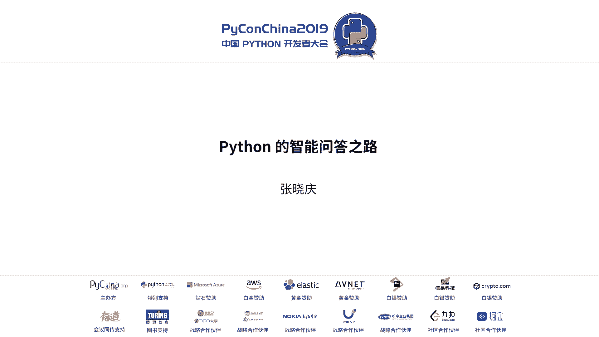
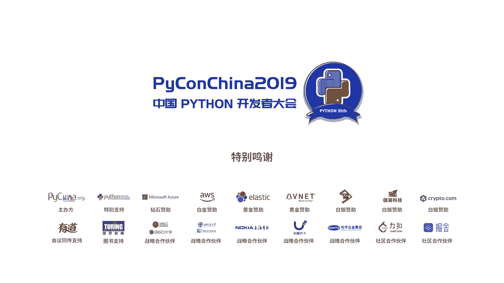

# Python智能问答之路：1：智能问答简介与分类 🧠

在本节课中，我们将要学习什么是智能问答，以及业界如何对智能问答领域进行分类。

智能问答是人工智能的一个重要应用方向，旨在让机器能够理解人类用自然语言提出的问题，并给出准确的答案。根据知识组织形式和任务目标的不同，智能问答可以分为多个子领域。

以下是几种主要的智能问答类型：

*   **基于知识图谱的问答**：知识以**（实体，关系，实体）** 三元组的形式组织。例如，当用户提问“姚明的妻子是谁？”时，系统能定位到三元组 **（姚明，妻子，叶莉）** 并返回答案“叶莉”。
*   **基于表格的问答**：知识以结构化表格形式存储在数据库中。系统将用户问题转化为SQL查询语句，从表中检索答案。例如，查询“30元流量套餐包含多少流量？”。
*   **阅读理解式问答**：给定一篇文档，系统定位并抽取文档中能回答用户问题的片段。例如，在文章中找到“某事件发生的时间”。
*   **基于社区知识的问答**：这是本节课的重点。它处理的是从论坛、社区等场景中沉淀下来的问答对。例如，在母婴论坛中，“宝宝发烧怎么办？”和“要吃药吗？”这类问题及其回答，可以被组织成可复用的知识。

我们选择基于社区知识的问答作为切入点，因为它易于维护，能显著减少人工维护答案的工作量，并且积累的多样化问法（相似问）是宝贵的训练数据。

---

## Python智能问答之路：2：业务场景与工具选择 🛠️

上一节我们介绍了智能问答的基本概念，本节中我们来看看智能问答具体应用在哪些业务场景，以及为什么选择Python作为开发工具。

智能问答机器人已广泛应用于多个领域，主要分为两大类：

以下是两种核心的业务场景：

*   **营销场景机器人**：这类机器人不仅是答疑工具，更是商机捕捉助手。例如，用户在公众号咨询课程详情时，机器人不仅能回答问题，还能引导用户留下联系方式，帮助商家转化潜在客户。它是商务团队的好帮手，可以实现跨平台服务，以较少的人力投入获取更多有效线索。
*   **客服场景机器人**：这是更通用的应用。机器人可以7x24小时在线，快速、准确地回答关于产品、业务或技术经验的问题。对于重复性或基础性问题，它能极大解放人力。这类机器人易于复制到不同企业的相似领域（如HR问答），实现规模化应用。

明确了业务价值后，我们需要选择合适的开发工具。选择依据主要有两点：**迭代速度**和**生态完备性**。

以下是几种语言的特性对比与选择理由：

*   **C++**：性能高，但开发迭代慢，机器学习库生态相对较弱。
*   **Java**：工程化能力强，但在快速实验和模型迭代方面不够灵活。
*   **Python**：语法简洁，拥有极其丰富且成熟的机器学习/深度学习库（如scikit-learn, TensorFlow, PyTorch），能极大加速实验和原型开发。

因此，为了快速搭建并持续优化问答机器人，我们选择**Python**作为主要开发语言。

---

## Python智能问答之路：3：从零搭建问答机器人 🚀

上一节我们确定了业务场景和开发语言，本节中我们来看看如何从零开始，一步步搭建一个可用的问答机器人。

我们的目标是：在已有“知识库”（即一系列问答对）的前提下，当用户提出问题时，系统能快速找到最相关的答案。整个流程可以拆解为检索和匹配两个核心步骤。

以下是首次建模的简单流程：

1.  **检索**：将知识库中的每个“知识点”（包含多个相似问和一个答案）作为一个文档存入Elasticsearch。用户提问时，ES返回最相关的若干个文档，得到候选答案集合。
2.  **匹配**：计算用户问题与ES返回的每个“相似问”之间的语义相关性。首次尝试使用了**WMD**算法。最终，选择相关性最高的答案返回。

通过 **Elasticsearch + WMD** 的组合，我们快速实现了一个基础版的问答模型。虽然效果粗糙（相似意图区分能力弱），但验证了流程的可行性，开发效率非常高。

---

## Python智能问答之路：4：模型迭代与优化 📈

上一节我们完成了一个简单的问答模型，本节中我们来看看如何通过多次迭代来持续提升它的效果。

第一次建模的效果并不理想，核心问题是匹配特征单一（仅WMD）。因此，我们开始引入更丰富的特征和复杂的模型进行迭代优化。

以下是四次关键的模型迭代过程：

*   **第二次迭代 - 引入排序模型**：在检索结果的基础上，引入多种人工设计的**统计特征**（如Jaccard相似度、编辑距离、词频等）和**词向量特征**（Word2Vec），训练一个**逻辑回归**排序模型，对候选答案进行更精细的排序。
*   **第三次迭代 - 利用知识库数据**：使用知识库内的问答对数据训练一个**FastText**文本分类模型，并提取其词向量。新增FastText分类概率和词向量相似度作为新特征。
*   **第四次迭代 - 引入深度学习模型**：训练一个**ESIM**深度学习模型来更好地捕捉句子间的交互信息，并改进其词嵌入层。新增ESIM模型的匹配分数作为特征。

在整个迭代过程中，Python的数据处理（如网络抓取、文本清洗）和特征计算（利用scikit-learn、gensim、FastText等库）提供了极大的便利。通过分析每次迭代产生的错误案例，我们能够有针对性地设计新特征或引入新模型。

最终，在同样的测试集上，系统的准确率从最初的0.8提升到了0.932。

---

## Python智能问答之路：5：效果评估与服务上线 ✅

上一节我们通过迭代优化了模型效果，本节中我们来看看如何科学地评估效果，以及如何将服务部署上线。

模型优化不能只凭感觉，需要有量化的评估指标。我们采用了标准的分类评估方法。

我们的评估策略是：选取6个不同领域，每个领域采样50个知识点，每个知识点用12个相似问做训练，3个做测试。观察每次迭代后模型在测试集上的**准确率、召回率和F1值**的变化。结果显示，准确率从0.8稳步提升至0.932。

为了追求极致效果，我们尝试引入更先进的预训练模型。例如，使用**BERT**微调后，准确率进一步提升到了0.968，获得了显著的性能增益。

效果达标后，下一步是上线。在架构设计上，我们采用了微服务模式。

以下是两种架构的对比与我们的选择：

*   **单体服务**：将所有特征计算和匹配逻辑放在一个服务中。优点是简单，但资源利用不灵活，难以监控和扩容。
*   **微服务架构**：将不同的特征计算模块拆分为独立的微服务。我们选择了这种架构，因为它能降低单个服务资源占用、方便扩容、易于监控，并且通过**gRPC**进行服务间通信，减少了连接开销。

最终上线的问答服务，平均响应时间能控制在150毫秒以内，满足线上实时交互的需求。

---

## Python智能问答之路：6：Python的利与弊 ⚖️

上一节我们完成了服务的上线，本节中我们一起来总结在整个开发过程中，Python展现出的优势与面临的挑战。

Python让我们能够快速搭建和迭代智能问答系统，这主要得益于它的核心优势。

以下是Python带来的主要好处：

*   **开发迭代速度快**：语法简洁，库丰富，能快速实现想法并验证。
*   **强大的第三方库生态**：从数据处理到模型训练，都有成熟工具包支持。
*   **胶水语言特性**：可以方便地调用C/C++或Java代码，弥补自身性能短板。

然而，在高性能、高并发的生产环境中，Python的一些固有缺点也会暴露出来。

以下是实践中遇到的三个典型问题及解决方案：

1.  **内存占用高**：加载大词典（如TF-IDF）时，Python字典内存开销巨大。**解决方案**：使用C++编写高效的数据结构（如Key-Value存储），编译成SO文件供Python调用，内存消耗降至1/5。
2.  **序列化缓慢**：微服务间传输大量数据时，Python原生序列化（如pickle）效率低。**解决方案**：使用支持C++插件的序列化库，性能可提升10倍以上。
3.  **并发能力有限**：由于GIL锁，多线程无法实现计算并行。多进程开销大，协程对计算密集型任务效果不佳。**解决方案**：通过微服务拆分，将计算密集型特征分散到独立服务中，利用协程进行IO并发调用，提升整体吞吐量。

---

## Python智能问答之路：7：总结与展望 🌟

本节课中我们一起学习了使用Python搭建智能问答机器人的完整路径。

我们来回顾一下核心要点：首先，要对问题（基于社区知识的问答）进行合适的建模。其次，选择Python作为开发语言，快速实现第一个可运行版本。然后，遵循由浅入深的原则，建立“数据->模型->反馈”的闭环，持续迭代优化。最后，保持学习，拥抱新技术（如BERT）来提升效果。同时，要认识到Python的优缺点，在必要时用其他语言进行性能补充。

对于未来，我们有两小点期望：一是希望Python自身的性能能得到持续优化；二是希望其原生支持更好的高并发计算模型。

---

**总结**：使用Python开发智能问答系统是一个“快速原型、持续迭代、生态互补”的过程。它让我们能专注于算法和业务逻辑，高效地将想法转化为现实，是入门和实践AI应用的优秀选择。