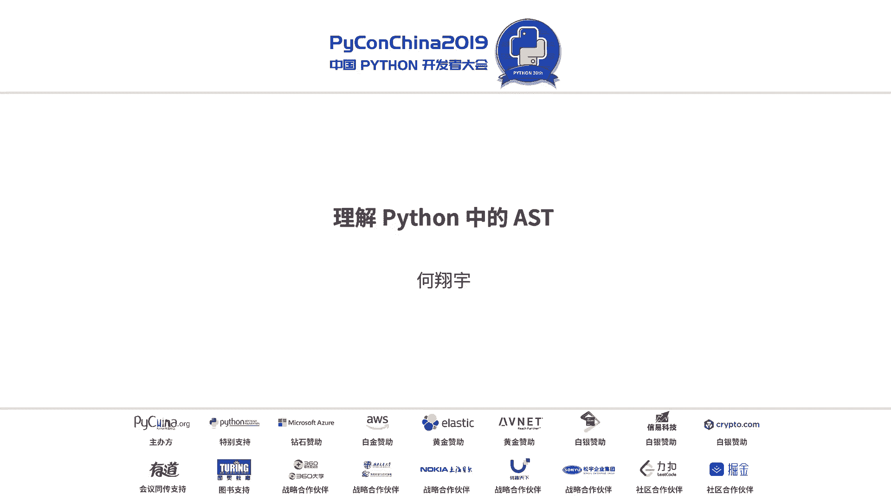

# Python AST 教程：P7：理解 Python AST




在本教程中，我们将学习 Python 抽象语法树（AST）的核心概念、相关库以及如何利用 AST 解决实际问题。我们将从 Python 代码的编译过程开始，逐步深入到 AST 的操作与应用。

## 概述：Python 代码的编译过程

上一节我们介绍了教程的整体结构，本节中我们来看看 Python 代码是如何从文本变成可执行字节码的。这个过程称为编译（compile），它包含多个步骤。

Python 的编译过程大致如下：
1.  **源码（Source Code）**：即我们编写的 `.py` 文件中的文本。
2.  **解析树（Parse Tree）**：解析器（Parser）将源码转换成一棵保留了所有语法细节（如空格、换行）的树。
3.  **抽象语法树（AST）**：解析树被进一步抽象，只保留程序的结构和逻辑，忽略格式细节。这是我们本节课的重点。
4.  **控制流图（CFG）**：AST 被转换为控制流图，用于描述程序执行的路径。
5.  **字节码（Bytecode）**：最后，控制流图被转换为 Python 解释器可以直接执行的字节码（即 `.pyc` 文件中的内容）。

整个过程可以简化为：`源码 -> 解析树 -> AST -> CFG -> 字节码`。

## 深入解析与 AST 生成

上一节我们了解了编译的宏观流程，本节中我们来看看 `解析树` 到 `AST` 转换的具体步骤。

这个过程主要由 Python 内部的 C 代码实现，非常复杂。我们可以将其简化为以下几步：
1.  **读取解析树**：从解析树中提取信息。
2.  **应用转换规则**：根据 Python 的语法定义（位于 `Python.asdl` 文件中），将解析树节点映射为 AST 节点。
3.  **生成 AST 节点**：创建代表不同语法结构的 AST 节点（如 `FunctionDef`, `ClassDef`, `Assign` 等）。
4.  **后续处理**：生成的 AST 会进一步被处理成控制流图（CFG），最终用于生成字节码。

## Python AST 核心库介绍

了解了 AST 的生成过程后，我们需要工具来处理它。Python 标准库提供了 `ast` 模块。

`ast` 模块是 Python 自带的库，用于处理抽象语法树。它的官方文档非常简洁，主要说明了以下几点：
*   AST 可用于分析和修改 Python 的语法树。
*   AST 节点可以被 Python 内置的 `compile()` 函数直接编译，这意味着我们可以通过修改 AST 来改变程序的行为（但会绕过一些检查）。
*   模块提供了 `ast.NodeVisitor` 等类来遍历 AST。

由于官方文档信息有限，社区有一个更详细的指南 `Green Tree Snakes - the missing Python AST docs`，它补充了更多关于节点类型和用法的示例。

以下是对初学者最重要的两个概念：
*   **遍历 AST**：通过继承 `ast.NodeVisitor` 类并实现 `visit_节点类型()` 方法（例如 `visit_FunctionDef`），可以方便地遍历和访问特定类型的 AST 节点。
*   **修改 AST**：在访问器方法中，可以修改或替换节点。如果想删除一个节点，只需在该方法中返回 `None`。

然而，`ast` 模块有一个明显的不足：它只能将代码解析为 AST，却不能将 AST 美观地转换回源代码。为此，我们需要第三方库。

## 强大的第三方库：`astor`

上一节提到 `ast` 模块无法将 AST 转回代码，本节中我们来看看一个解决此问题的强大工具：`astor`。

`astor` 库弥补了 `ast` 模块的不足，主要功能包括：
*   **将 AST 反编译为源代码**：通过 `astor.to_source()` 函数，可以将 AST 对象转换回格式良好的 Python 代码字符串。
*   **美化打印 AST**：`astor.dump_tree()` 可以输出结构清晰、易于阅读的 AST 树形表示，便于调试。
*   **提供非递归的 AST 遍历工具**。

它的使用非常简单：
```python
import ast
import astor

code = “print(‘hello’)”
tree = ast.parse(code) # 将代码解析为 AST
source = astor.to_source(tree) # 将 AST 转换回代码
print(source) # 输出：print(‘hello’)
```

## 实战案例一：安全替换所有 `print` 语句

学习了基础工具后，我们来看一个实际应用场景。假设项目中有大量用于调试的 `print` 语句，我们想将它们全部替换为更规范的日志调用（例如 `logging.info`），但又担心手动替换出错或漏掉。

使用正则表达式替换 `print` 是危险的，因为它可能错误地修改了函数名、字符串内容等。AST 可以精确地定位函数调用节点。

**解决思路是“找不同”：**
1.  分别将 `print(‘debug’)` 和 `logging.info(‘debug’)` 解析成 AST。
2.  对比两个 AST 的结构差异。
3.  编写一个 `NodeTransformer` 子类，在遍历 AST 时，将匹配的 `print` 调用节点替换为 `logging.info` 调用节点。
4.  利用 `astor.to_source()` 生成替换后的新代码。

关键步骤的代码逻辑如下：
```python
import ast
import astor

class PrintToLogTransformer(ast.NodeTransformer):
    def visit_Call(self, node):
        # 检查是否是 print 函数调用
        if isinstance(node.func, ast.Name) and node.func.id == ‘print’:
            # 构建新的 logging.info 调用节点
            new_node = ast.Call(
                func=ast.Attribute(value=ast.Name(id=‘logging’, ctx=ast.Load()),
                                   attr=‘info’,
                                   ctx=ast.Load()),
                args=node.args,
                keywords=[]
            )
            return new_node
        return node

# 使用转换器
code = “print(‘hello’)”
tree = ast.parse(code)
transformer = PrintToLogTransformer()
new_tree = transformer.visit(tree)
new_code = astor.to_source(new_tree)
print(new_code) # 输出：logging.info(‘hello’)
```
**注意**：实际应用中还需处理 `import logging` 语句的添加。

## 实战案例二：智能合并生成的代码

现在来看一个更复杂的真实场景。假设我们通过模板自动生成 RPC 客户端代码。某天需要在某个生成的方法里添加一个默认参数。如果直接修改生成的代码，下次重新生成时修改会被覆盖。如果修改模板，则所有方法都会受到影响。

我们希望：**重新生成代码时，只添加新方法，并保留对旧方法的手动修改。**

AST 可以完美解决这个问题：
1.  **分析现有代码**：解析已存在的客户端代码 AST，遍历并收集所有已有的方法名。
2.  **对比差异**：与最新的接口定义（IDL）进行比较，找出新增的方法。
3.  **生成并合并**：只为新方法生成代码 AST 节点，并将其插入到现有代码 AST 的类定义体中。
4.  **输出最终代码**：将合并后的 AST 写回源文件。

以下是核心逻辑的简化示例：
```python
import ast

class CodeMerger(ast.NodeVisitor):
    def __init__(self, new_methods):
        self.existing_methods = []
        self.new_methods_nodes = new_methods # 新增方法对应的 AST 节点列表

    def visit_ClassDef(self, node):
        # 收集现有方法名
        for item in node.body:
            if isinstance(item, ast.FunctionDef):
                self.existing_methods.append(item.name)
        # 将新增的方法节点添加到类体中
        node.body.extend(self.new_methods_nodes)
        return node

# 假设 old_tree 是旧代码的 AST，new_methods_nodes 是新方法 AST 节点列表
merger = CodeMerger(new_methods_nodes)
updated_tree = merger.visit(old_tree)
# 然后用 astor.to_source 写回文件
```
通过这种方式，我们实现了非侵入式的代码更新，既保留了手工修改，又增加了新功能。

## 总结与最佳实践

本节课中我们一起学习了 Python AST 的方方面面。我们来总结一下关键点和最佳实践。

**核心要点总结：**
1.  **AST 是什么**：AST 是源代码抽象语法结构的树状表示，它忽略了代码的格式细节，只关注逻辑结构。
2.  **核心工具**：`ast` 模块用于解析和操作 AST，`astor` 库用于将 AST 转换回可读的源代码。
3.  **核心操作**：通过继承 `ast.NodeVisitor`（遍历）或 `ast.NodeTransformer`（修改）来访问和操作 AST 节点。
4.  **解决问题**：AST 擅长解决需要**精确语法分析**的问题，例如安全地重构代码、分析代码结构、智能合并等。

**给初学者的建议：**
*   **正则表达式 vs AST**：当需要处理**具有语法结构的文本**（如 Python 代码）时，AST 比正则表达式更精确、更安全。正则表达式处理的是纯文本，容易误匹配。
*   **AST 操作三步法**：当需要修改代码时，可以遵循“**找不同 -> 写遍历/转换器 -> 复制粘贴节点**”的模式。先用 `astor.to_source` 和对比工具观察差异，再编写转换逻辑。
*   **谨慎编译**：虽然可以直接编译修改后的 AST，但这绕过了 Python 的某些前端检查。应确保生成的 AST 结构正确，最好通过 `astor.to_source` 输出代码进行验证。
*   **举一反三**：AST 并非 Python 独有，大多数编程语言都有类似的概念和工具。理解 AST 有助于你深入理解程序编译和静态分析。

希望本教程能帮助你理解并开始使用 Python AST 这个强大的工具。


