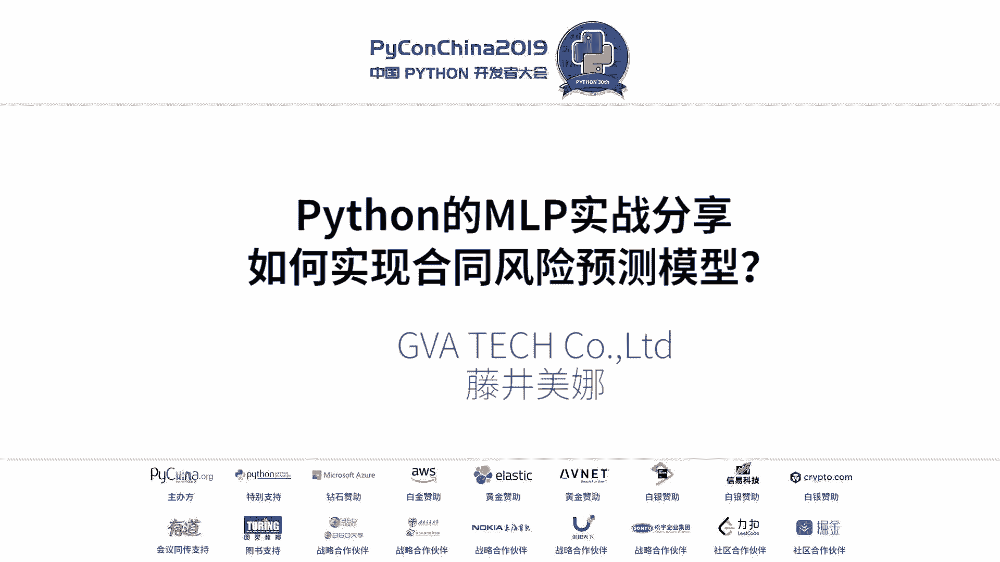
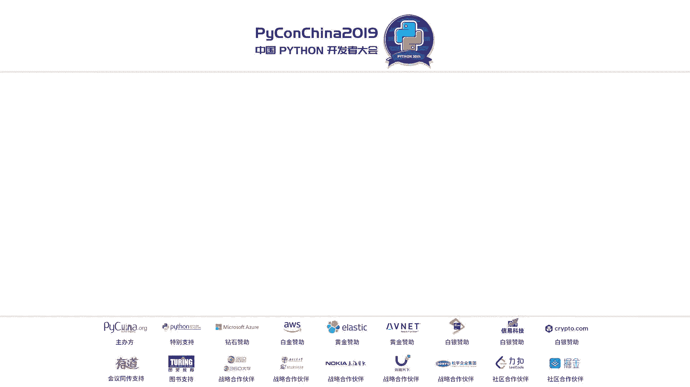
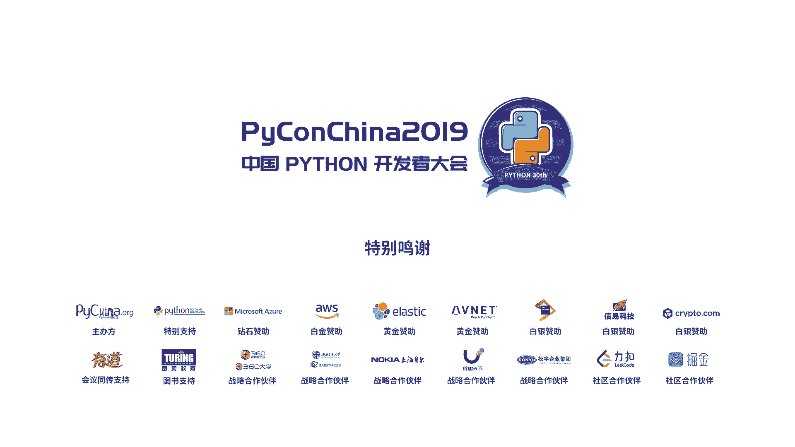

# Python自然语言处理实战：合同风险预测模型构建教程 🚀

## 概述
在本教程中，我们将学习如何利用Python进行自然语言处理，并构建一个用于预测合同风险的模型。我们将从NLP的基础流程开始，探讨多语言处理的差异，最终深入到合同风险预测模型的实战构建思路。

---

## 第一节：NLP基础流程与探索性数据分析 📊

上一节我们概述了课程内容，本节中我们来看看自然语言处理的基础流程以及一种重要的数据分析方法。

自然语言处理通常从语料开始。语料来源可以是网络爬虫、公司或大学已有的语言数据，或是公开的语料库。获取语料后，需要进行前处理，例如删除特殊符号等无用信息。处理完成后，即可进行分词，并在此基础上进行语义解释分析。

自然语言处理的核心是将文字转化为机器可读的数字。因此，分词后通常需要进行向量化，将词语转换为向量或张量，以便输入模型进行学习。有时，语义分析的结果也会作为特征输入机器学习模型，使模型能学习到语义知识。

分词后还可以进行一项重要工作：探索性数据分析。EDA是一种分析数据的方法，旨在探索数据的内在结构和特征。在NLP中，不同领域的语言有其独特的特征和倾向。如果不了解手中数据的特性就盲目处理，很容易中途迷失方向。

以下是使用语料库进行词类分析的一种方法：
1.  收集目标领域的语料（例如10万条合同文章）。
2.  从基准语料库（如日语BCCWJ语料库）中提取其他领域（如图书、新闻、杂志）的语料作为对比基准。
3.  使用相同的分词方法处理所有语料。
4.  统计各领域语料中不同词类（如名词、动词、形容词）的出现频次，并制作分布表。
5.  将高频部分用颜色高亮显示，形成可视化图表。

通过对比合同文章与法律文章、图书、杂志等领域的颜色分布图，可以发现合同文章与法律文章在词类分布上较为相似，而与其他领域差异较大。这种可视化分析能帮助我们把握数据的领域特征，从而在选择模型（例如，对于语义转折较多的合同文本，传统的词袋模型可能效果不佳）和解释结果时更有把握。

总结一下，使用语料库进行EDA的目的是掌握数据的特征，这能提高后续工作的处理效率，帮助我们有把握地选择模型，并能更好地理解模型的输出结果。

---

## 第二节：多语言NLP处理攻略 🌍

上一节我们介绍了NLP基础流程和EDA，本节中我们来看看处理不同语言时的差异和工具。

英语、汉语和日语在分词处理上有所不同。英语单词通常由空格分隔，分词相对简单。汉语需要进行分词，将连续的汉字序列切分成有意义的词语。日语则更为复杂，除了分词，还需要进行“同一词形归一化”处理。

“同一词形归一化”是指将词语的不同变化形式统一为标准形式。例如，日语的动词有活用变形，名词可能有汉字、平假名、缩写等多种写法，都需要统一。虽然很多工具可以自动处理，但某些情况仍需人工干预。

以下是各语言常用的分词工具：
*   **英语**：推荐NLTK，它简单易用，适合入门。
*   **汉语**：推荐`jieba`分词。
*   **日语**：有以下几种选择：
    *   **MeCab**：最著名的分词工具，基于马尔可夫模型，需搭配词典使用。`neologd`词典适合处理新词，`unidic`词典更适合数据分析。
    *   **Juman**：分词精度高，但处理速度较慢。
    *   **GiNZA**：2019年发布的新工具，集成分词和语义分析功能，较为方便。

此外，日中语义分析也有不同。汉语分词后，需要额外标注主谓宾等语法角色。日语则借助格助词来标识，例如“が”常提示主语，“を”常提示宾语。在合同分析中，准确区分甲方（动作发出者）和乙方（动作接受者）至关重要，因此必须处理好语义角色。

---

## 第三节：合同风险预测模型实战分享 ⚖️

上一节我们探讨了多语言处理的差异，本节我们将进入实战，学习构建合同风险预测模型的思路。

合同审查通常关注两点：一是合同是否遗漏了必备条款；二是合同内容是否对己方不利。因此，我们的模型目标也有两个：目的1是检查合同条款的相似性（查找缺失条款）；目的2是识别合同中的不利条款。

使用Python实现合同风险预测的思路如下：
*   **实现目的1（条款相似性）**：计算所有条款之间的相似度，设定阈值`threshold`来判断内容是否一致。这可以使用无监督学习方法。
*   **实现目的2（不利条款识别）**：判断条款对甲方有利、乙方有利还是平等。这需要使用监督学习方法，构建分类模型。

我们尝试了四种方法来预测合同风险：
1.  **Word2Vec**：词嵌入方法。
2.  **Doc2Vec**：文档嵌入方法，较新。
3.  **神经网络**：深度学习模型。
4.  **TF-IDF**：传统的词频-逆文档频率方法。

在我们的数据上，`Word2Vec`效果优于`Doc2Vec`。具体操作是，将句子中的每个词向量取出后求平均，以此代表句子向量，再进行相似度计算。

**实战示例**：查找与合同中“第五条”最相似的条款。
使用四种方法比较后，`Word2Vec`能准确找到同为“违约责任”的条款，且相似度数值区分度好（该高的高，该低的低）。`Doc2Vec`容易将不相关条款相似度归零，`TF-IDF`则容易产生大量0或1的极端值，都需要较多调优。

但需注意，`Word2Vec`可能计算出“甲方”和“乙方”向量相似度高，这在通用领域可行，但在合同中，双方利益对立，这种相似性不可接受。

**解决方案**：
1.  **使用考虑上下文关系的模型**：如`BERT`等预训练模型。但合同数据敏感，获取大量标注数据困难。
2.  **采用监督学习分类模型**：利用公司律师进行数据标注。我们采用了两层分类器：
    *   **第一层**：预测条款的种类（多分类问题）。因为不同种类条款的“有利性”判断标准不同。
    *   **第二层**：在确定条款种类后，再预测该条款对甲方有利、乙方有利还是平等（多分类问题）。

**模型效果**：目前日语版本的模型，预测一致条款的正确度达85%，条款种类分类正确度达91%，有利方判断正确度达90%。我们正在尝试使用深度学习模型进一步提升精度，但同时也致力于开发可解释性强的机器学习模型，这是当前的重要目标。

---

## 总结与建议 💡

本节课中，我们一起学习了NLP的基础流程、多语言处理差异以及构建合同风险预测模型的完整思路。

最后想强调的是：在开始任何NLP项目前，首先要明确你想要解决的具体问题。将业务问题转化为明确的统计或机器学习问题。如果不知从何下手，可以先进行探索性数据分析来把握数据特征。了解数据特征后，就能更轻松地选择合适的模型。解决方案有很多，从简单的浅层模型到复杂的深度学习模型，可以根据可用的时间、计算资源来权衡选择。目标明确、模型选好后，剩下的就是动手实践。

**核心要点回顾**：
*   **EDA是关键**：`可视化分析`能揭示数据领域特征，指导模型选择。
*   **工具选择**：英语用`NLTK`，中文用`jieba`，日语可选`MeCab`、`Juman`或`GiNZA`。
*   **合同模型思路**：结合`无监督学习`（相似度计算）和`监督学习`（两层分类）来分别实现条款查漏和风险识别。
*   **实践路径**：`明确问题` -> `EDA分析数据` -> `选择合适的模型` -> `实现与优化`。