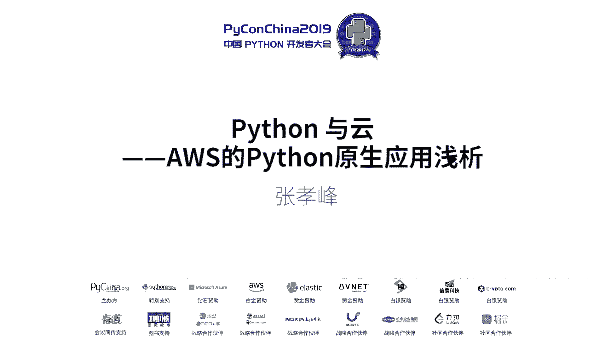
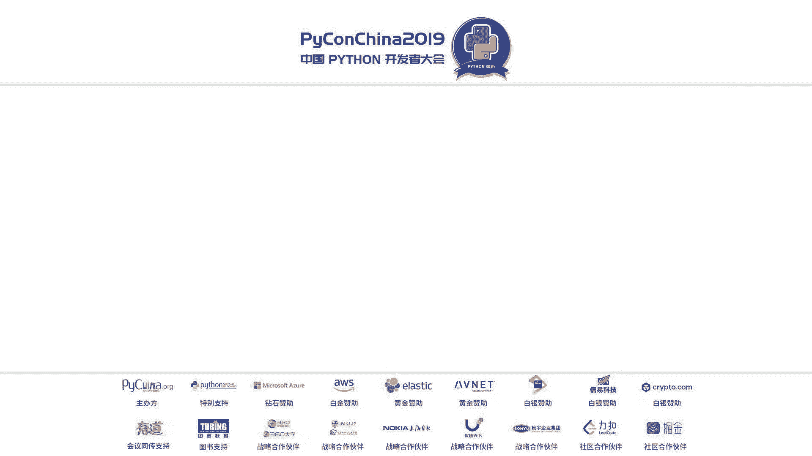
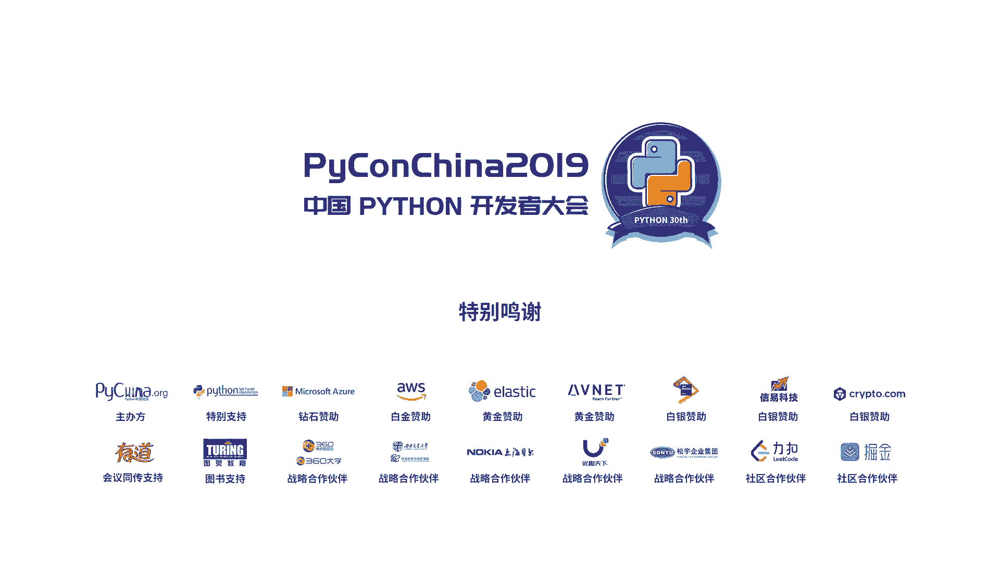

# Python与云：AWS的Python原生应用浅析





## 概述
在本节课中，我们将一起探讨Python语言与云计算平台AWS的结合应用。我们将了解Python如何作为“胶水语言”，高效地连接和利用AWS提供的丰富云服务，从而让开发者能够更专注于业务逻辑的实现，而非底层基础设施的管理。

---

## Python与AWS的发展历程

上一节我们介绍了课程的整体内容，本节中我们来看看Python和AWS各自的发展背景。

Python诞生于1989年，至今已有30多年的历史。它从1.0、2.0版本发展到如今的3.8版本，经历了互联网和IT行业迅猛发展的时代。许多开发者从Python 2.6版本开始接触，尽管现在主流已转向Python 3.5及更高版本。

云计算的发展历史则相对较短。亚马逊AWS起源于公司内部解决大规模系统开发效率的需求。2000年左右，亚马逊开始构建微服务架构，并在2006年将内部使用的通用微服务对外开放，正式推出了AWS。如今，AWS已遍布全球22个地理区域，提供超过165项服务。

## AWS与Python SDK：Boto3

了解了发展背景后，我们来看看Python开发者如何与AWS服务交互。这主要通过一个名为Boto3的官方Python SDK实现。

AWS的所有服务都提供标准的API接口，总计涉及数千个API。为了简化调用过程（如处理签名、认证等），AWS将这些API封装成了各种语言的SDK。Boto3就是官方的Python SDK。

以下是使用Boto3启动一个EC2实例的简化代码示例：
```python
import boto3
ec2 = boto3.resource('ec2')
instance = ec2.create_instances(ImageId='ami-12345678', MinCount=1, MaxCount=1)
```
这段代码的核心是创建一个EC2资源对象并调用`create_instances`方法。Boto3库本身已经处理了底层的复杂逻辑，使得代码非常简洁。AWS命令行工具（AWSCLI）也是基于Boto3开发的，这体现了Python作为“胶水语言”的特性。

## 基础设施即代码（IaC）与AWS CDK

上一节我们介绍了如何使用SDK调用单个服务，但在实际项目中，我们通常需要管理由多个服务组成的完整架构。本节中我们来看看如何用代码定义和管理这些基础设施。

传统的做法是使用AWS CloudFormation服务，通过JSON或YAML模板来描述基础设施。例如，一个包含VPC、负载均衡器和容器集群的三层架构模板可能超过500行。虽然这实现了“基础设施即代码”，但模板编写复杂，且不易复用。

为此，AWS推出了Cloud Development Kit（CDK）。它允许开发者使用Python、TypeScript等通用编程语言，以面向对象的方式来定义基础设施。

以下是一段使用AWS CDK（Python）定义VPC的简化代码：
```python
from aws_cdk import core
from aws_cdk import aws_ec2 as ec2

class MyVpcStack(core.Stack):
    def __init__(self, scope: core.Construct, id: str, **kwargs) -> None:
        super().__init__(scope, id, **kwargs)
        vpc = ec2.Vpc(self, "MyVpc", max_azs=2)
```
使用CDK，开发者可以像写普通代码一样，利用继承、组合等特性来构建基础设施，大大提升了可读性和可复用性。依赖关系也通过对象传递来管理，更加符合程序员的思维习惯。

## 无服务器计算与AWS Lambda

在实现了基础设施的代码化管理后，我们的目标更进一步：能否只关注业务逻辑本身，而完全不用管理服务器？这就是无服务器架构的核心理念。

AWS Lambda便是这样的服务。你只需上传代码，Lambda会负责运行和扩展，你只需为代码执行的时间付费。

以下是一个最简单的Python Lambda函数，它响应HTTP请求并返回“Hello World”：
```python
def lambda_handler(event, context):
    return {
        'statusCode': 200,
        'body': 'Hello from Lambda!'
    }
```
这个函数由`event`事件触发。事件可以来自API Gateway的HTTP请求、S3的文件上传等。当并发请求激增时，Lambda会自动扩展，并行运行多个函数实例，开发者无需进行任何容量规划。

一个更实际的例子是，当用户上传图片到S3时，自动触发Lambda函数进行缩略图处理：
```python
import boto3
from PIL import Image
import io

s3 = boto3.client('s3')

def lambda_handler(event, context):
    bucket = event['Records'][0]['s3']['bucket']['name']
    key = event['Records'][0]['s3']['object']['key']
    
    # 从S3下载图片
    file_byte_string = s3.get_object(Bucket=bucket, Key=key)['Body'].read()
    image = Image.open(io.BytesIO(file_byte_string))
    
    # 处理图片（例如调整大小）
    image.thumbnail((100, 100))
    
    # 保存回S3
    buffer = io.BytesIO()
    image.save(buffer, 'JPEG')
    buffer.seek(0)
    
    new_key = f"resized/{key}"
    s3.put_object(Bucket=bucket, Key=new_key, Body=buffer)
    
    return f'Image {key} was resized and saved as {new_key}'
```
这段代码纯粹是业务逻辑：下载、处理、上传。开发者完全不需要关心代码运行在什么操作系统、需要多少内存或CPU。

## 人工智能与机器学习服务

Python是人工智能和机器学习领域的主流语言。AWS为不同层次的AI/ML需求提供了相应的服务，并与Python深度集成。

**1. 基础设施层**
对于需要强大算力的模型训练，AWS提供了搭载最新GPU（如V100）的实例。通过Amazon SageMaker，你可以快速获得一个预装了TensorFlow、PyTorch等主流框架的深度学习环境。
```bash
# 在SageMaker Notebook实例中快速切换框架
import sys
!{sys.executable} -m pip install tensorflow
# 或者
!{sys.executable} -m pip install torch torchvision
```

**2. 自动化机器学习**
调参和模型选择是耗时的“人工”工作。Amazon SageMaker的自动模型调优（超参数优化）功能可以自动寻找最佳参数组合。由于云端的弹性，你可以并行发起数百次训练任务，大幅缩短优化时间。

**3. 即用型AI服务**
对于不想训练模型，只想在应用中集成AI能力的开发者，AWS提供了多种即用型AI服务（AI Services），可通过简单的API调用使用。
例如，使用Amazon Rekognition进行图像标签识别：
```python
import boto3
client = boto3.client('rekognition')
response = client.detect_labels(
    Image={'S3Object': {'Bucket': 'my-bucket', 'Name': 'photo.jpg'}}
)
for label in response['Labels']:
    print(f"Label: {label['Name']}, Confidence: {label['Confidence']:.2f}")
```
这些服务涵盖了计算机视觉、自然语言处理、预测、推荐等多个领域，让开发者能以最低门槛为应用添加智能。

## 物联网（IoT）与边缘计算

Python在资源受限的物联网领域曾经不占优势，但随着边缘设备能力的增强，Python也开始发挥作用。AWS IoT服务提供了Python SDK，方便在树莓派等网关设备上开发。

AWS IoT Greengrass允许在本地边缘设备上运行Lambda函数，实现低延迟的数据处理和响应，即使在与云端断开连接时也能工作。训练好的机器学习模型也可以部署到边缘设备上进行实时推理。

## 总结
本节课中我们一起学习了Python在AWS云平台上的各种应用模式。

我们回顾了Python与AWS的发展，认识了通过Boto3 SDK调用云服务的基础方法。接着，我们探讨了用AWS CDK实现“基础设施即代码”，以及通过AWS Lambda构建无服务器应用，从而让开发者只专注于业务逻辑。在AI/ML领域，我们看到了从底层算力、自动化训练到即用型AI服务的完整金字塔。最后，我们了解了Python在物联网和边缘计算中的新角色。



正如课程开篇所言，Python就像高效的“胶水”，而AWS提供了坚实、丰富的“基石”。掌握如何使用Python粘合这些云服务，能让我们更快地将创意转化为现实。希望本课程能帮助你更好地利用Python和AWS的强大能力。