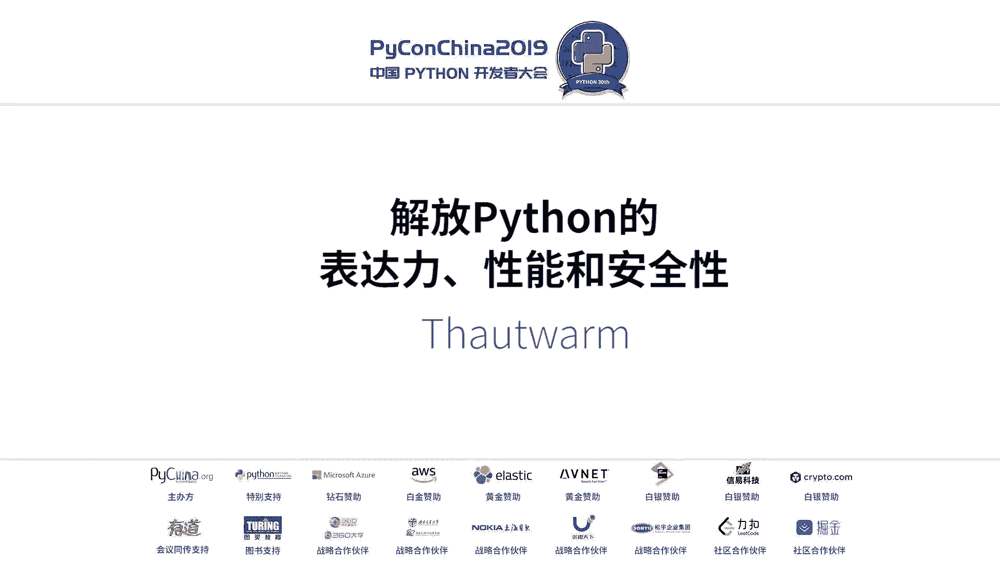
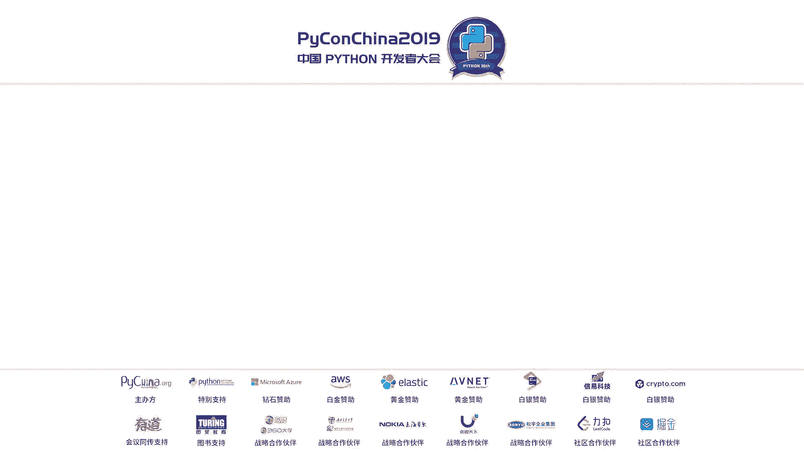
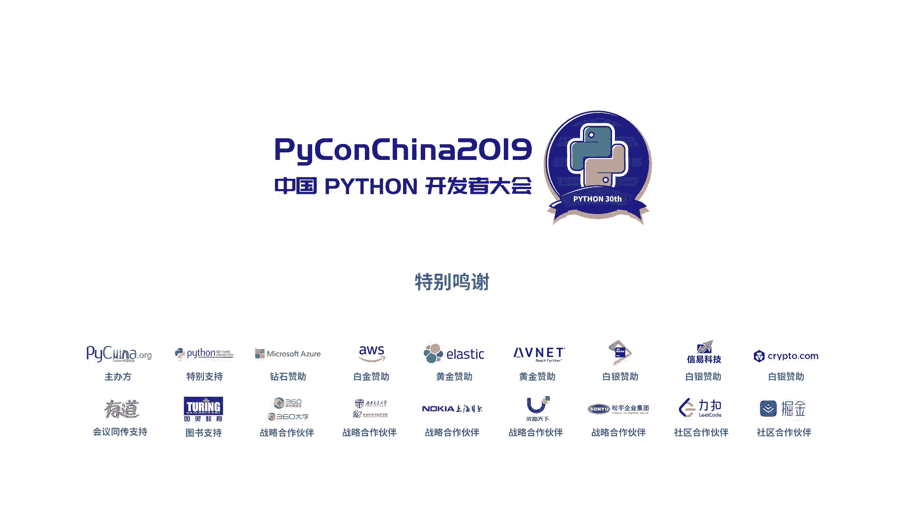

# Python 语法扩展与 JIT 编译器：P4：解放 Python 的表达力、性能和安全性

## 概述
在本节课中，我们将要学习如何通过语法扩展来增强 Python 的表达力，以及如何通过即时编译技术来提升 Python 的性能。我们将探讨语法扩展的原理、实现方式，并深入了解一个创新的 JIT 编译器架构。

## 语法和语义的扩展

上一节我们介绍了课程的整体目标，本节中我们来看看语法和语义扩展的具体内容。

语法和语义的扩展旨在扩展 Python 语言本身。在之前的讨论中，我们探讨了为何需要这样的设计。今天我们将侧重于如何使用这些扩展，并提供一个教程，展示有哪些可用的语法和语义扩展。

我们将演示一部分功能，例如模式匹配。模式匹配源于逻辑编程中的高级构造，在 Haskell 等语言中非常好用。它可以降低代码冗余。另一个例子是管道运算符，它类似于 Linux 的管道操作，可以将前一个操作的结果传递给后面的函数继续运算。我们将演示这些功能。

这种表达力的扩展是如何实现的？它保留了 Python 本身的可用性。你可以在任何时候安全地开启或关闭它，并且这是一种“免费的午餐”。

首先，需要理解的是，你所使用的语言决定了你的思维模型。在解决问题时，你拥有的语言决定了你如何思考这个问题。例如，在 C++、Haskell 和 APL 中求质数，它们的实现方式和思维模型截然不同。Haskell 和 APL 可以用一行代码实现，而 C++ 则需要更多代码。这表明语言从根本上改变了解决问题的思维方式。

在实际业务中，模式匹配非常有用。例如，根据运输工具的数据计算用户需要支付的价格。使用模式匹配可以直接给出直观的结果。代码清晰地表达了匹配规则：如果是一辆特定品牌和乘客数量的汽车，则输出对应的价格。这种对应关系比使用大量的 `if-else` 语句更加明确和直观。

在 Python 中，要实现同样的逻辑，你需要编写许多 `if-else` 语句，这并不直观。虽然代码作者可能觉得清楚，但其他人第一眼看到时无法立刻理解其意图。

语言中的语法问题决定了其真实的表达力。如果在一个语言中实现某个功能需要编写大量繁琐的代码，我们会下意识地抗拒这种写法，转而选择更简单的方法。因此，我们希望 Python 能够更加完善，能够容纳所有高级语法结构，以扩展我们的思维。

## 扩展系统设计

上一节我们了解了语法扩展的价值，本节中我们来看看扩展系统的具体设计。

我设计的系统使用 `pragma` 作为标志。例如，在文件开头写入 `# pragma` 可以开启语法扩展。但仅仅写入 `# pragma` 并不会启用任何扩展，你必须在开启扩展后，使用 `#?` 加扩展名来指定使用哪个扩展。

例如，开启管道运算符扩展后，`map(_*2, range(10))` 中的下划线 `_` 表示一个函数，`map` 的第一个参数是 `_*2`，它本身是一个函数。管道运算符原本在 Python 中不存在，但通过添加扩展，`range(10) | _*2` 就变成了函数调用。底下的代码也是语法扩展。

这可能看起来很神奇，但其实现是非常“卫生”的。它与现有框架的不同之处在于，有些框架会使用 `inspect` 模块来查找源代码位置，然后重新读取函数所在的原始代码。这种操作非常不可靠。例如，如果源文件不存在，Python 文件就无法运行。很多时候，我们希望将 Python 打包成 `pyc` 文件发布，这就需要一种与 Python 完全兼容的机制。

这个系统的第六个特点是，在任何情况下，如果你不使用 Python 原本就有的功能，在使用这个系统后，这些功能仍然保留。它只是一个附加的扩展。

## 工作原理：导入机制

上一节我们介绍了扩展系统的设计理念，本节中我们深入探讨其工作原理，即 Python 的导入机制。

它的实现依赖于 Python 的 `import` 机制。Python 的导入过程是：首先从 `sys.meta_path` 中查找许多查找器，然后根据你的 `import` 语句找到对应的加载器。这个加载器是内置的或用户实现的。加载器决定了如何加载模块。

我们的做法是劫持 Python 源代码的加载器。在它读取源代码之后，我们重载 `load` 方法。例如，在加载代码前，我们先处理未开启的扩展。这样可以保证任何行为只要 Python 原本支持，我们也支持。

具体做法是：劫持加载器，读取源代码，进行处理，然后返回。简单来说，它就像一个新语言，只是将 Python 编译到 Python。它有一个用户易于扩展的编译器，并且可以编译成 Python 字节码发布，完全兼容 Python 生态。

## 语法扩展的实现基础

上一节我们了解了扩展系统如何利用导入机制工作，本节中我们来看看实现语法扩展的基础：宏和模式匹配。

首先，它的实现依赖于真正的语法宏。语法宏是一个从语法树到语法树的函数。Python 本身提供了宏机制，例如 `import ast` 后，`ast.parse` 可以生成语法树列表。虽然用起来不是很好用，但它确实存在，名为 `MacroPy`，大家可以查询一下。

接下来我们讲模式匹配。模式匹配有很多用法。我们将演示一下。

（演示部分说明：由于现场设备问题，演示未能顺利进行。理论上，代码中 `#? pattern` 表示开启模式匹配扩展。`match [1,2,3]:` 是一个标志符。在开启扩展的区域，如果出现 `match` 标志符，就意味着要将序列进行匹配。如果 `match` 多个参数，下面的 `case` 会进行对应。例如 `case [1, a]` 和 `case [2, b]` 会自动解构并打印结果。）

它的性能比纯 Python 高数量级，这里是 20 多倍。项目链接中可以查到这个数据。

## 占位符与函数式编程

上一节我们介绍了模式匹配，本节中我们来看看另一个有用的语法扩展：占位符。

`placeholder` 来自 Scala。例如，`f(_ + 1)` 中的下划线表示一个函数参数，它变成了 `lambda x: x + 1`。这样可以少写一些代码。如果是两个参数，在不同参数位上用下划线，它们代表不同的参数。可以用 `_1` 或 `_2` 来表示第一个和第二个参数。

例如，`reduce(_0 + _1, s)` 就是对列表 `s` 进行求和。还有 `this_placeholder`，它和 C++ 的 `this` 有点像。`this_placeholder` 把整个函数调用看成了一个整体，其第一个参数是 `_`。这个占位符的好处是，函数 `f` 本身也可以作为占位符。例如，交换位置后，它表示传入一个函数，然后调用这个函数 `f`。

这些东西都是可配置的。例如，你可以将下划线换成 `it`，可以自定义语法。这提供了很大的灵活性。

需要强调的是，**这不是函数式编程**。很多人看到模式匹配和 Lambda 就认为是函数式编程，认为函数式编程很慢，这些观点都是错误的。首先，函数式编程并不慢。其次，这些扩展只是 Python 的语法糖，并不是函数式编程。很多人想表示自己懂一些概念，就说这是函数式，其实并不是。

## 如何实现和扩展运算符重载

上一节我们澄清了关于函数式编程的误解，本节中我们来看看如何具体实现和扩展语法，例如运算符重载。

实现一个叫做 `scoped_operator` 的扩展，它表示可以重载开启扩展范围内的所有二元运算符。例如，可以支持列表的减法：`[1,2,3] - [1,2]` 得到 `[3]`。这种重载可以通过扩展来实现。

实现起来很简单。首先从 `extension` 导入 `Extension`，然后从 `ast_compat` 导入 `AST`（为了支持 Python 3.5 以上所有版本）。定义一个类 `ScopedOperatorExtension`。它的 `identifier` 就是 `scoped_operator`。在 `visit` 方法中，会接收到操作符字符串和函数名。然后检查该操作符是否在预定义的映射中。如果在，就将其转换为一个二元函数调用，例如把 `a + b` 变成 `my_func(a, b)`。这样就实现了运算符重载。

`visit` 方法是访问语法树并可能返回新树的过程。它根据节点类型进行分发。你只需要在访问器类中实现 `visit_BinOp` 等方法即可。重写 `ast` 就是返回一个新的语法树。

这个映射是从 Python 的 `ast` 模块中直接获取的二元运算符列表。注意，比较运算符（如 `>`、`<`）不是二元运算符，不能这样重载。

## JIT 编译器：性能优化

上一节我们探讨了语法扩展的实现，本节中我们进入今天另一个核心主题：即时编译器，这是我最自豪的工作。

这个 JIT 编译器是前所未有的。它的工作流程是：从 Python 字节码开始，经过多个编译阶段，最后变成后端代码，例如 JVM 字节码或 LLVM IR。这里面有很多难题：
1.  为什么要从字节码开始编译？
2.  Python 虚拟机是基于栈的，如何做语义优化？
3.  后端和前端有什么区别？为什么我们偏好某些后端？
4.  重点是如何将栈机语义转换到寄存器机？
5.  如何进行分析（如控制流分析、指针分析）？
6.  如何生成 Phi 节点来消除栈语义？
7.  SSA 形式的 JIT 基础架构。

这个架构要感谢我的导师，它能够实现 Python 代码的热点优化，效果非常好。

**为什么从字节码开始着手？**
因为在运行时，你拿不到源代码。如果你依赖源代码，就会违背 Python 的兼容性。例如，`inspect.getsource` 会读取文件，这依赖于源码存在。如果我们以 `.pyc` 文件的形式发布 Python 包，这个功能就不可用了。我们希望在任何时候，即使在运行时，也能无缝启用 JIT，没有任何兼容性开销和副作用。

此外，`pycodegen` 这个库非常好用，它可以把 Python 字节码变成字节码对象，这样我们就不需要自己写解析器了。

**栈机长什么样？**
例如一个函数，它的字节码是：`LOAD_CONST 0`, `STORE_FAST z`, `LOAD_FAST x`, `LOAD_CONST 2`, `COMPARE_OP`... 解释器模拟栈的操作：压入常数 0，存储到局部变量 z，加载 x 和常数 2 到栈上，进行比较... 这种基于栈的操作效率不高，所以我们要优化它。

**如何优化？首先要进行分析。**
Python 字节码有 100 多个指令，一个人很难处理这么多。我们采用核心语言的思想：一个精简的核心指令集意义重大。我们将 Python 的指令集减少到 15 个以内，这是第一步。它把 Python 的栈机指令变成一个栈机和寄存器混合的指令集。

为什么不直接翻译到寄存器机？因为太难了。考虑一个例子：有多个 `PUSH` 指令后跟一个条件跳转。在跳转的目标处，有一个 `POP` 指令。你很难确定这个 `POP` 出来的值对应之前哪个 `PUSH`，特别是当从不同地方跳转过来时，栈上可能还有剩余元素。Python 还有一个 `JUMP_IF_TRUE_OR_POP` 指令，它优化起来相当麻烦。

如果不翻译，而是在编译时手动模拟栈（例如用一个列表来代表栈），这样是可以的。但结果是无法优化这个栈的模拟，导致循环非常慢。主要问题是从不同基本块跳转时，无法确定寄存器的值，并且 `PUSH` 操作无法优化。

**后端选择**
LLVM 后端是零优化。为了兼容 Python，它在每一步都进行引用计数操作。虽然引用计数本身感觉不慢，但它阻止了 C++ 进行深度优化。编译到 C 代码最多只是去掉了解释开销，这不算真正的 JIT，甚至可能比 Python 解释器还慢，因为 Python 解释器本身有很多优化。

为了让代码更快，我们必须进行分析以消除栈语义。如果我们用 C 语言后端，可以避免写这些分析吗？实际上，C 语言后端是“洪水猛兽”，启动时间超过 10 秒，调试一次间隔 30 秒，体验很差。

我们的方法是用“三地址码”，没有 `goto`，用程序分区来实现 `goto`，把不同的基本块编译成一个 `while` 循环。这样 C++ 编译器可以进行优化。最终效果是生成了高效的本地代码。

## JIT 函数机制与性能

上一节我们分析了 JIT 编译的挑战与方案，本节中我们来看看 JIT 的具体函数机制和最终性能。

JIT 的函数机制很重要：首先创建一个 JIT 函数。它通过一个方法查找函数来查找不同的方法（基于类型的单态化）。函数参数最初没有类型。当一个调用发生时，会记录这个调用。调用记录器会累计次数，例如每 30 次就会唤醒 JIT 编译器。JIT 编译器查看调用记录，检查里面有哪些具体类型的方法，然后将其添加到函数中，编译出一个新的函数指针。接着更新所有相关的调用点，使用新生成的方法查找函数。我们不是动态派发，而是动态生成方法查找函数，这非常高效。方法查找函数会重新编译，链接到正确的具体实现上。

**性能结果**
性能比较显示，JIT 效果不错。图表左边是第一次运行（解释执行），右边是第二次运行（JIT 编译后）。第二次运行可以看到显著的性能提升。对于数值运算，可能会有几十倍的加速。这意味着 Python 的性能可以通过 JIT 获得数量级的提升。

目前的实现还缺少一些构造，如闭包，但未来都会实现。基本上所有代码都可以获得 2 倍以上的加速，数值运算则可能有几十倍的加速。

## 总结

本节课中我们一起学习了如何通过语法扩展来解放 Python 的表达力，以及如何通过创新的 JIT 编译器架构来大幅提升 Python 的性能。

我们探讨了：
*   语法和语义扩展的必要性与实现方式，包括模式匹配和管道运算符。
*   扩展系统的设计，它如何利用 Python 导入机制实现无缝集成。
*   语法扩展的具体实现基础，如宏和占位符。
*   一个高性能 JIT 编译器的设计挑战与解决方案，包括从栈机到寄存器机的转换、各种程序分析，以及最终的热点代码编译机制。

这些技术旨在让 Python 更强大、更快速，同时保持其易用性和兼容性。