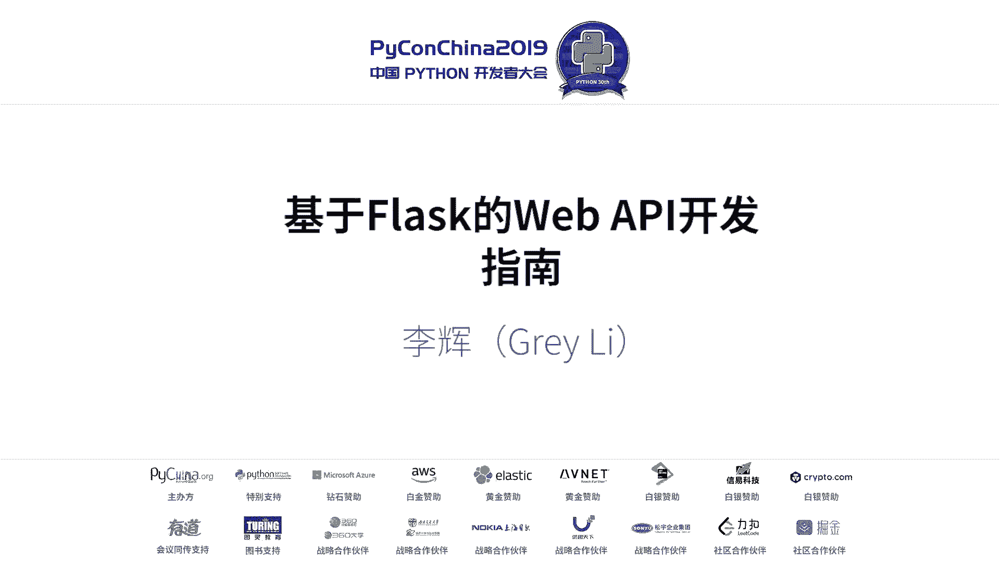
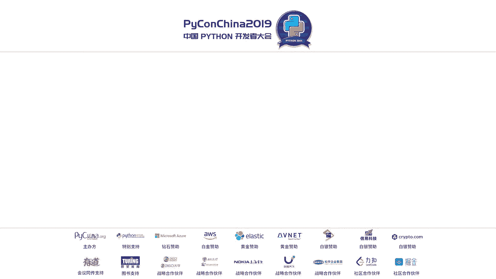
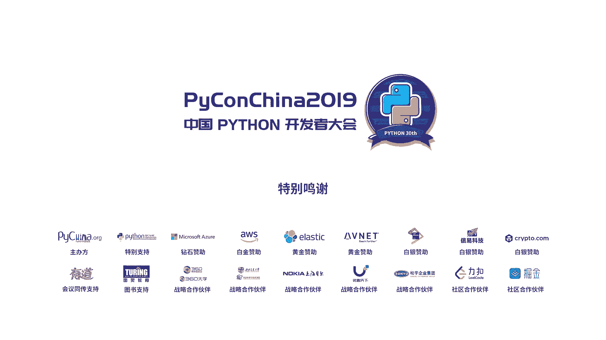

# Flask REST API 开发指南：P6：基于 Flask 的 REST API 开发实践






在本教程中，我们将学习如何使用 Flask 框架开发 REST API。我们将从基础概念讲起，逐步深入到设计原则、工具选择以及使用原生 Flask 实现 API 的实践。本教程旨在为初学者提供一个清晰、实用的学习路径。

## 概述

本节课我们将要学习 Flask 框架在 REST API 开发中的应用。内容涵盖 Flask 简介、REST API 基础概念、相关术语梳理、设计原则探讨，以及如何利用 Flask 原生功能搭配工具链来构建 API。

## 第一部分：基础概念速览

如果你对 Flask 和 Web API 还不熟悉，这部分内容将为你提供一个快速的入门。

### Flask 简介

Flask 是一个使用 Python 编写的轻量级 Web 应用框架。它的核心哲学是“微”，意味着它是一个可以从小开始，按需扩展的框架。你不需要一开始就引入所有功能，而是根据项目需求逐步添加。这种灵活性使其非常适合快速开发原型或构建 Web API。

安装 Flask 非常简单，使用 pip 命令即可：
```bash
pip install flask
```

### 入门 Flask 开发

一个最简单的 Flask 应用如下所示：
```python
from flask import Flask
app = Flask(__name__)

@app.route('/')
def hello():
    return '<h1>Hello, World!</h1>'

if __name__ == '__main__':
    app.run()
```
这段代码创建了一个 Flask 应用实例，并定义了一个处理根 URL (`/`) 的视图函数。当用户访问该地址时，函数返回的 HTML 字符串会在浏览器中显示。运行这个程序，你就创建了一个基础的 Web 应用程序。

### 什么是 Web API

Web API（Application Programming Interface）是一种允许不同软件应用相互通信的接口。与直接面向用户、返回丰富交互界面（HTML）的 Web 程序不同，Web API 面向机器或其他程序，通常只返回结构化的数据（如 JSON）。这些数据被客户端（如 Web 前端、移动应用）获取后，再加工成用户界面。

### 入门 Web API 开发

使用 Flask 实现一个最简单的 Web API 与上面的 Web 程序非常相似，主要区别在于返回的数据格式：
```python
from flask import Flask, jsonify
app = Flask(__name__)

@app.route('/api/hello')
def hello_api():
    return jsonify(message='Hello, API!')

if __name__ == '__main__':
    app.run()
```
这里，视图函数返回一个由 `jsonify()` 处理过的字典，其响应内容类型（Content-Type）自动设置为 `application/json`，表明这是一个 JSON 格式的响应。

以上是对基础内容的介绍。接下来，我们将进入更深入的主题。

## 第二部分：术语梳理与设计思考

清晰的概念是理解复杂主题的基础。在深入实践之前，我们先对一些关键术语进行梳理。

### 关键术语辨析

在 Web API 开发领域，许多术语容易混淆。进行术语梳理有助于降低理解负担，避免定义混乱。

以下是几个需要厘清的术语及其常见用法：

*   **API / 接口**：广义上指软件组件间的交互契约。在 Web 开发上下文中，通常特指 **Web API**。应避免与软件库的“接口”混淆。
*   **REST API / RESTful API**：指遵循 REST 架构风格的 API。在实践中，该术语的外延已被扩大，许多使用 HTTP 传输 JSON/XML 的 API 都被称为 REST API，尽管它们可能并未完全遵循 REST 的所有约束。
*   **Web 服务**：一个非常宽泛的术语，可以指任何通过网络为机器提供数据的服务（包括 Web API）。也存在一个由 W3C 制定的狭义“Web 服务”标准，容易造成混淆。
*   **资源 (Resource)**：在 REST 语境下，指 API 暴露的数据实体（如用户、文章）。
*   **端点 (Endpoint)**：通常可与 **URL** 或 **URI** 互换使用，指访问特定资源的地址。
*   **请求/响应处理**：包含序列化（将数据转换为传输格式，如 JSON）、反序列化（将接收到的格式转换回数据）、验证、格式化等多个过程。

### REST 架构风格探讨

REST 是一种软件架构风格，提出了许多优秀的设计约束。然而，它并非一个严格的标准。在现实中，完全符合 REST 所有约束的 API 非常少。

我们应该参考 REST 的优秀实践，但不必教条式地遵守。设计的核心应从 API 自身的特点和需求出发，追求易于理解和维护，而非刻板符合某个风格。

例如：
*   **资源命名**：REST 建议使用名词（如 `/users`），但像 `/search`（动词）这样的端点因其直观性而被广泛接受。
*   **版本管理**：REST 建议通过 HTTP 头（如 `Accept`）管理版本。但在实践中，将版本号嵌入 URL（如 `/api/v1/users`）更为直观和流行。

**核心思想是：一个 60% 符合 REST 但易于理解的 API，优于一个 100% 符合 REST 但难以使用的 API。**

## 第三部分：Flask 生态与工具选择

上一节我们探讨了设计原则，本节中我们来看看在 Flask 生态中有什么工具可供选择。

目前流行的 Flask REST API 扩展情况各异，有的已不推荐使用，有的维护状态不佳。因此，直接推荐某个“大而全”的扩展存在风险。

这恰恰回归了选择 Flask 的初衷：**用灵活性换取控制权**。既然没有完美的“一站式”解决方案，我们可以选择自己搭配一套由多个优秀、专注的轻量级工具组成的工具链。

对于资源、端点、错误处理等基础功能，可以尝试直接用原生 Flask 实现。只在处理验证、序列化等复杂环节时，才引入专门的库。

## 第四部分：使用原生 Flask 实现 API 的实践

下面，我们将简要介绍如何使用 Flask 的原生功能来构建一个 API。请注意，这里的代码示例旨在展示思路和路径，而非需要记忆的模板。

### 1. 定义数据与响应

假设我们要开放一个“问候语”API。首先，模拟一些数据并创建响应辅助函数：
```python
greetings = {
    'en': 'Hello',
    'es': 'Hola',
    'fr': 'Bonjour'
}

from flask import jsonify

def json_response(data):
    """将字典数据转换为JSON响应"""
    response = jsonify(data)
    response.headers['Content-Type'] = 'application/json'
    return response
```
从 Flask 1.1 开始，视图函数直接返回字典也会被自动转换为 JSON 响应。

### 2. 实现资源端点

可以使用普通的视图函数，也可以使用 Flask 的 `MethodView` 类来以类为单位组织资源：
```python
from flask.views import MethodView

class GreetingAPI(MethodView):
    def get(self, lang_code):
        greeting = greetings.get(lang_code)
        if greeting is None:
            return json_response({'error': 'Language not found'}), 404
        return json_response({'language': lang_code, 'greeting': greeting})

    def post(self):
        # 处理创建新问候语的逻辑
        pass

# 注册路由
app.add_url_rule('/api/greeting/<lang_code>', view_func=GreetingAPI.as_view('greeting_api'))
```
`MethodView` 允许你将不同的 HTTP 方法（GET, POST 等）映射到类的不同方法上。

### 3. 使用蓝本管理 API 版本

使用 Flask 的蓝本（Blueprint）可以很好地组织代码并定义 API 版本前缀：
```python
from flask import Blueprint

api_v1 = Blueprint('api_v1', __name__, url_prefix='/api/v1')

@api_v1.route('/greeting/<lang_code>')
def get_greeting_v1(lang_code):
    # ... v1版本的逻辑
    pass

app.register_blueprint(api_v1)
```

### 4. 错误处理

可以自定义错误处理器来返回结构化的错误响应：
```python
from flask import jsonify

@app.errorhandler(404)
def api_not_found(error):
    return jsonify({'error': 'Not found', 'message': 'The requested resource was not found.'}), 404

@app.errorhandler(500)
def internal_server_error(error):
    return jsonify({'error': 'Internal Server Error', 'message': 'An unexpected error occurred.'}), 500
```

### 5. 数据模式与序列化

对于复杂的数据输出，可以定义模式函数来控制返回哪些字段，并添加描述性字段（如指向自身的链接 `self_link`）：
```python
def greeting_schema(greeting_dict, lang_code):
    """定义问候语资源的输出模式"""
    return {
        'self_link': f'/api/greeting/{lang_code}',
        'kind': 'Greeting',
        'language': lang_code,
        'greeting': greeting_dict.get(lang_code),
        'etag': 'some_hash_here' # 示例字段
    }
```

### 6. 请求验证与认证

对于请求数据验证，手动处理比较繁琐，通常会引入像 `marshmallow` 或 `pydantic` 这样的库。对于身份认证，OAuth 2.0 是常用标准。根据 API 的开放程度（内部使用或公开），选择合适的认证模式（如密码模式或授权码模式）。

一个使用原生 Flask 实现简单令牌认证的装饰器示例如下：
```python
from functools import wraps
from flask import request, jsonify

def token_required(f):
    @wraps(f)
    def decorated_function(*args, **kwargs):
        token = None
        # 从 Authorization 请求头获取令牌
        if 'Authorization' in request.headers:
            auth_header = request.headers['Authorization']
            try:
                token_type, token = auth_header.split()
            except ValueError:
                return jsonify({'error': 'Invalid authorization header'}), 401
        if not token:
            return jsonify({'error': 'Token is missing'}), 401
        # 这里应添加验证 token 有效性的逻辑
        if token != 'valid_token_example':
            return jsonify({'error': 'Token is invalid'}), 401
        return f(*args, **kwargs)
    return decorated_function

@app.route('/api/protected')
@token_required
def protected_resource():
    return jsonify({'data': 'This is protected data'})
```

**记住，代码本身并不最重要，重要的是学习路径：先理解 Web API 的设计原则，尝试用 Flask 原生功能实现，遇到瓶颈时再寻找合适的工具。**

## 第五部分：其他选择与总结

除了使用 Flask，构建 Python Web API 还有很多其他优秀的框架选择，例如 FastAPI、Django REST framework、Falcon 等。如果你对性能或开发便利性有更高要求，可以探索这些框架。

本节课中，我们一起学习了：
1.  Flask 和 Web API 的基本概念。
2.  对 Web API 开发中易混淆的术语进行了梳理。
3.  探讨了 REST 架构风格，并强调设计应服务于理解和需求。
4.  分析了 Flask 生态中 REST 扩展的现状，提出了“自组工具链”的思路。
5.  通过示例了解了使用原生 Flask 实现 API 核心功能的实践路径。

希望本教程能为你使用 Flask 进行 API 开发提供一个良好的起点。



