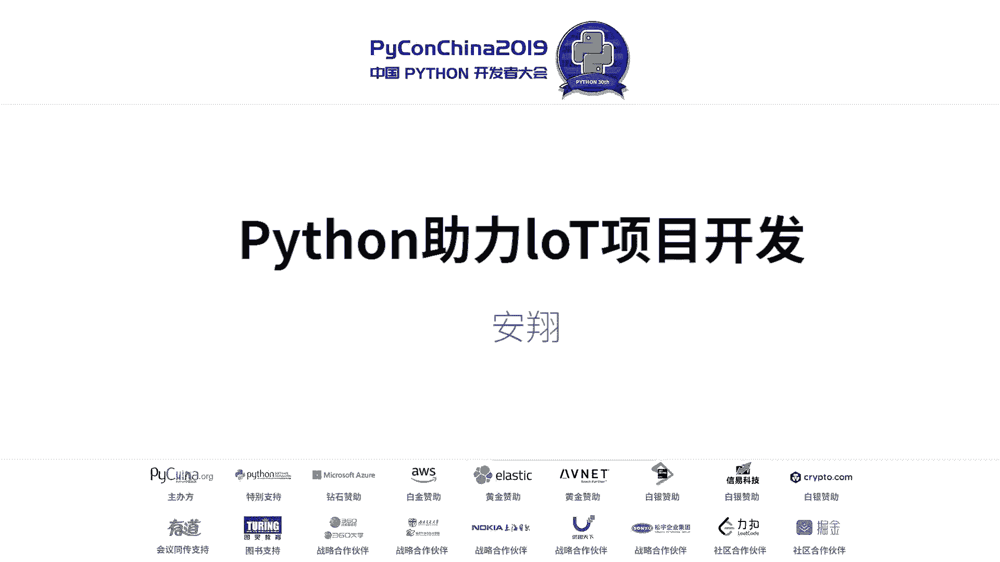
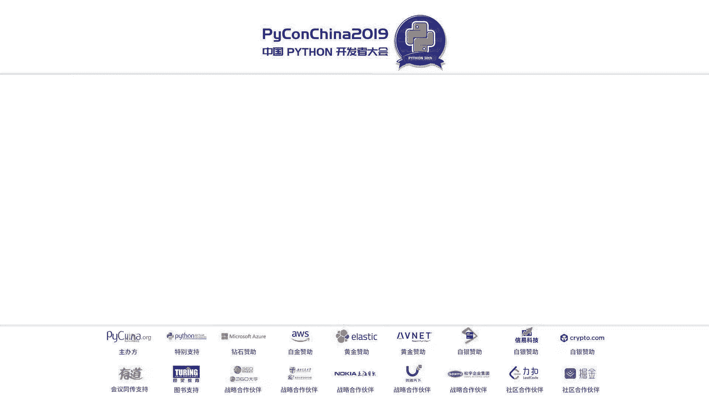
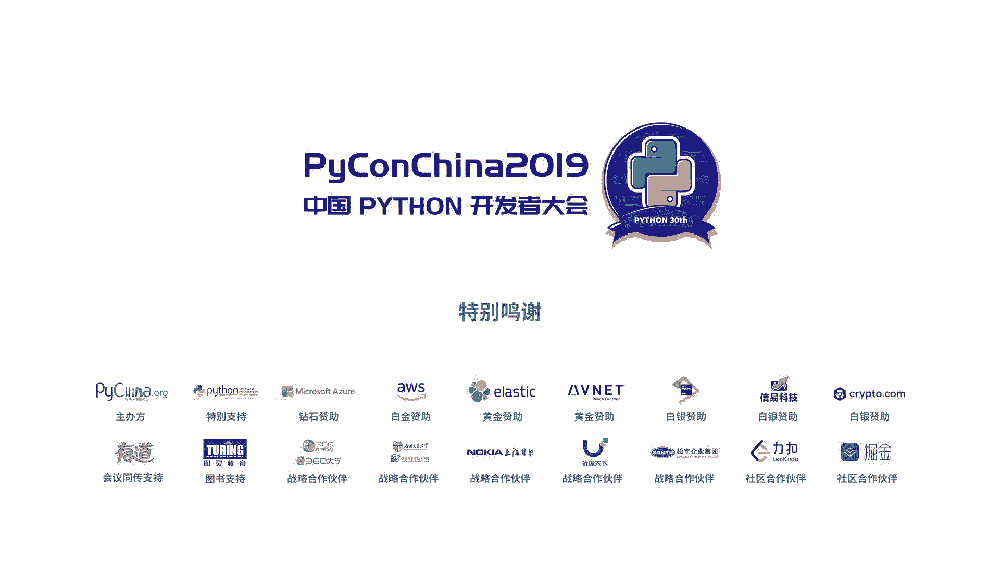

# Python助力IoT项目开发：P8：Python在物联网开发中的应用





## 概述
在本节课中，我们将学习Python如何应用于物联网项目开发。我们将从物联网项目的整体架构入手，分析典型项目的技术栈，并探讨Python如何简化并加速物联网终端、网关及云端的开发流程。

---

## 物联网项目架构概述

一个完整的物联网项目通常包含三个核心层面：**云端**、**管道**和**终端设备**。

**云端**是服务端程序，负责数据处理、存储和业务逻辑。**管道**是通信网络，负责数据传输。**终端设备**是与物理世界交互的硬件，负责数据采集和指令执行。

物联网的交互不仅限于人与物，还包括物与物之间的自动交互。终端设备依赖于各种硬件，如处理器、传感器、执行器（如智能锁）和人机交互接口（如屏幕）。

---

## 典型物联网项目剖析

以下是两种典型的物联网项目网络拓扑结构及其技术栈。

### 共享单车系统
共享单车系统采用**单层网络拓扑**。终端设备（单车）通过2G/4G或NB-IoT网络直接连接云端，中间没有其他网络节点。

从软件开发角度看，其技术栈主要包括：
*   **终端设备开发**：涉及单片机程序，用于控制车锁、采集GPS数据等。
*   **服务端开发**：处理用户请求、计费、车辆调度等业务逻辑。
*   （手机App作为用户交互前端，通常不在此技术栈核心讨论范围内。）

### 智能家居系统
智能家居系统采用**双层网络拓扑**。它包含一个**局域网**（如Zigbee、蓝牙）和一个**外网**。

*   **局域网**：由**网关**和多个**终端设备**（如传感器、智能灯泡）组成。终端设备只与网关通信。
*   **外网**：网关通过Wi-Fi、2G/4G等网络连接至云端。

因此，其技术栈更为复杂，包含三个层面：
*   **终端开发**：通常是单片机程序，用于驱动传感器、控制继电器等硬件。
*   **网关开发**：通常是嵌入式Linux应用程序，负责组建局域网、处理本地策略、与云端通信。
*   **云端开发**：服务端程序，提供数据存储、分析和用户界面。

上一节我们介绍了物联网项目的两种典型结构，接下来我们深入看看每个层面的具体技术挑战。

---

## Python如何破解物联网开发难题

Python可以从以下三个层面助力物联网开发，提升效率。

### 1. Python与终端开发：MicroPython
MicroPython是运行在微控制器上的Python 3实现，极大简化了终端设备开发。

*   **开发便捷性**：无需专用烧写器和复杂的IDE。通过USB连接，可直接在文件系统中编程或使用REPL交互环境。
*   **硬件接口支持**：对GPIO、I2C、SPI、UART、PWM等常用硬件接口提供了良好支持。
*   **生态丰富**：支持数十种主流单片机，降低了硬件选型依赖。
*   **降低对芯片厂商的依赖**：代码在不同硬件平台间移植性更好，减少因更换芯片供应商导致的重复工作。

### 2. Python与网关开发
物联网网关的软件开发本质上是应用程序开发。Python作为高级语言，在此领域优势明显。

*   **环境支持**：许多嵌入式Linux系统的BSP已包含Python。若无，自行移植的成本也相对较低。
*   **硬件驱动**：Python生态（如`RPi.GPIO`、`spidev`）已包含常见硬件接口驱动。如需特殊驱动，可用Python或C编写模块供调用。
*   **本地数据处理**：Python对SQLite等轻型数据库支持完善，适合网关本地数据存储。
*   **网络通信**：丰富的库支持HTTP（如`requests`）、MQTT（如`paho-mqtt`）等物联网常用协议。
*   **性能优化**：对性能敏感的核心模块可用C/C++编写，再封装为Python库调用，兼顾开发效率与运行效率。

### 3. Python与云端开发
Python在物联网云端开发中扮演着核心角色。

*   **快速对接云平台**：AWS IoT、阿里云IoT、OneNET等主流物联网云平台均提供Python SDK，可快速集成。
*   **快速自建服务**：使用Django、Flask等框架能迅速搭建Web服务端。
*   **强大的数据可视化**：Matplotlib、Plotly等库能轻松将物联网数据转化为直观图表。
*   **与AI/大数据融合**：物联网产生海量数据。Python是机器学习（TensorFlow, PyTorch）和大数据处理（Pandas）的主流语言，便于开发智能物联网应用。

**综上所述，使用Python几乎可以打通物联网“云-管-端”全栈开发。**

---

## 实战案例：Python驱动的智慧农业系统

本节我们将通过一个智慧农业系统的实战案例，具体看Python如何应用于一个相对复杂的物联网项目。

该项目网络拓扑包含终端、网关和云端三层，实现了环境监测、自动灌溉、安防预警等功能。

### 系统架构与功能
*   **终端设备**：基于ESP32单片机（运行MicroPython），连接土壤湿度、光照等多种传感器，以及水泵、灯光等控制器，并通过LoRa模块与网关通信。
*   **网关**：基于树莓派3B+（运行Python），负责接收终端数据，通过2G模块与云端通信，并可本地存储数据、触发电话报警。
*   **云端**：基于Django框架开发，提供设备管理、数据可视化、智能策略（如自动灌溉规则）制定等功能。

### 各层Python实现要点
以下是该系统中Python技术栈的关键应用：

*   **终端 (MicroPython)**:
    ```python
    # 示例：读取土壤湿度传感器（通过ADC）
    import machine
    adc = machine.ADC(machine.Pin(34)) # 假设传感器接在GPIO34
    moisture_value = adc.read()
    # 将数据通过LoRa发送
    # ... lora.send(data) ...
    ```

*   **网关 (Python on Raspberry Pi)**:
    ```python
    # 示例：通过串口读取LoRa数据，并通过MQTT上报云端
    import serial
    import paho.mqtt.client as mqtt
    ser = serial.Serial('/dev/ttyS0', 9600) # 连接LoRa模块
    mqtt_client = mqtt.Client()
    mqtt_client.connect("cloud.server.com", 1883)
    while True:
        data = ser.readline()
        mqtt_client.publish("sensor/data", data)
    ```

*   **云端 (Django)**:
    ```python
    # 示例：Django视图处理设备心跳，更新在线状态
    from django.http import JsonResponse
    from .models import Device
    def device_heartbeat(request, device_id):
        try:
            device = Device.objects.get(id=device_id)
            device.is_online = True
            device.last_seen = timezone.now()
            device.save()
            return JsonResponse({"status": "ok"})
        except Device.DoesNotExist:
            return JsonResponse({"error": "Device not found"}, status=404)
    ```

### 设备健康管理
针对硬件设备可能离线的问题，系统通过**心跳机制**实现设备健康监控：
1.  终端定期向云端发送心跳包，包含设备ID、电量等信息。
2.  云端记录设备最后在线时间。
3.  管理界面展示设备在线/离线状态，长时间离线的设备会触发告警，以便运维人员及时处理。

---



## 总结
本节课我们一起学习了Python在物联网开发中的强大助力。我们从物联网的“云-管-端”架构出发，分析了共享单车和智能家居两种典型项目的技术栈。随后，我们深入探讨了Python通过MicroPython简化终端开发、作为高级语言高效开发网关应用、以及快速构建云端服务和对接AI能力的具体方式。最后，通过一个智慧农业系统的实战案例，我们看到了Python如何贯穿一个完整物联网项目的开发，实现高效、智能的解决方案。希望本课程能为你打开使用Python进行物联网开发的大门。