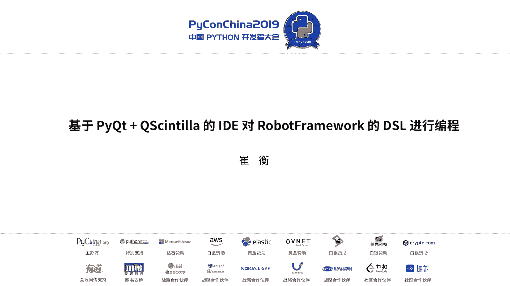
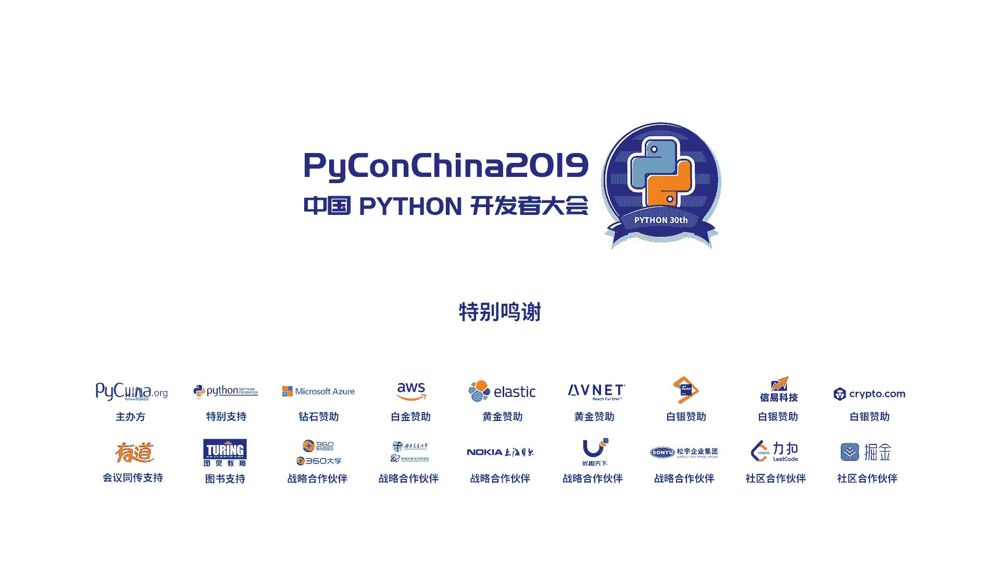

# 001：1. 基于 PyQt + QScintilla 的 IDE 对 RobotFramework 的 DSL 进行编程 🛠️



## 概述

在本节课中，我们将学习如何使用 Python 的 PyQt 和 QScintilla 库，为 RobotFramework 的领域特定语言（DSL）构建一个自定义的代码编辑器。我们将探讨 RobotFramework 的基本概念、现有工具的局限性，并逐步讲解如何实现语法高亮、代码补全等现代 IDE 功能。

---

## 背景知识介绍

在开始构建编辑器之前，我们需要了解几个核心概念。

### 领域特定语言（DSL）

DSL 是 Domain Specific Language 的缩写。与 C++、Java、Python 等通用编程语言不同，DSL 是为解决特定领域问题而设计的语言。例如，在数学建模领域，可能只需要运行模型，而不需要复杂的编程语法。

### RobotFramework

RobotFramework 是一个基于 Python 编写的自动化测试框架。它采用关键字驱动（Keyword Driven）模式，主要用于验收测试驱动开发（ATDD）。该框架通过插件支持 Web 端、移动端等多平台测试。

### Qt 与 PyQt

Qt 是一个优秀的跨平台 C++ 应用程序框架，支持桌面、服务器和移动端开发。例如，Linux 的 KDE 桌面环境就是基于 Qt 开发的。PyQt 是 Qt 的 Python 绑定，常用于开发图形界面应用和数据可视化工具。著名的 Python IDE `Eric` 就是基于 PyQt 开发的。

### QScintilla

QScintilla 是 Scintilla 编辑器组件在 Qt 上的实现。Scintilla 是一个开源的源代码编辑组件。大家熟知的文本编辑器 Notepad++ 就使用了 Scintilla。

### PyParsing

PyParsing 是一个轻量级的、纯 Python 编写的语法解析器。在构建 DSL 编辑器时，我们需要进行词法分析和语法分析。与传统的 Lex/Yacc 等重型工具相比，PyParsing 更加简单易用。

---

## RobotFramework 快速介绍

上一节我们介绍了相关背景知识，本节中我们来看看 RobotFramework 的具体情况。

RobotFramework 由诺基亚在 2008 年发起，是一个开源的自动化测试框架。其最新稳定版本是 3.1.2（通常缩写为 RF）。它采用 ATDD 模式，强调在开发过程中同步编写验收测试用例，以持续验证功能。

以下是官方对 RobotFramework 架构的说明：
*   **底层**：被测系统（System Under Test）。
*   **中间层**：测试工具（Test Tools）。
*   **上层**：
    *   **测试库（Test Library）**：由开发工程师编写，包含具体的测试逻辑。
    *   **RobotFramework 核心**：负责将测试数据与测试库关联并执行。

这样讲可能有些抽象，接下来我们结合一个例子来理解。

### 一个简单的例子：SSH 客户端

假设我们有一个用 Python 3.5+ 编写的 SSH 客户端测试库。它使用了 `type hint` 特性来增强代码可读性。

```python
# 文件名: ssh_client.py
# 这是一个 Test Library
import paramiko

class SSHClient:
    def __init__(self, host: str, port: int, username: str, password: str):
        self.client = paramiko.SSHClient()
        self.client.set_missing_host_key_policy(paramiko.AutoAddPolicy())
        self.client.connect(host, port, username, password)

    def execute_command(self, command: str) -> str:
        stdin, stdout, stderr = self.client.exec_command(command)
        return stdout.read().decode()
```

接下来是 RobotFramework 的测试脚本（Test Data），由 QA 工程师编写。

```robotframework
# 文件名: test_ssh.robot
*** Settings ***
Library    ssh_client.py    WITH NAME    ssh

*** Variables ***
${HOST}     192.168.1.100
${PORT}     22
${USER}     admin
${PASS}     secret

*** Test Cases ***
Check Disk Space
    ${output}=    ssh.Execute Command    df -h
    Log    ${output}
```

在这个脚本中：
*   `*** Settings ***` 部分用于配置，例如加载测试库。
*   `*** Variables ***` 部分定义变量。
*   `*** Test Cases ***` 部分编写具体的测试用例。

运行这个测试用例非常简单，使用以下命令：

```bash
robot --outputdir reports --pythonpath . test_ssh.robot
```

如果一切顺利，你会得到一个绿色的测试报告，表明用例通过。点击报告可以查看详细的执行日志和变量值。

---

## 遇到的问题与改进思路

RobotFramework 虽然改进了开发测试流程，但也存在一些可以改进的空间。

以下是使用 RobotFramework 时可能遇到的问题：
1.  **制表符与空格混淆**：RobotFramework 基于表格进行语义分割，混合使用制表符（Tab）和空格可能导致用例运行失败。
2.  **全角/半角字符问题**：不小心输入全角字符（如全角空格）也会导致问题。
3.  **资源文件路径问题**：测试脚本中引用的资源文件路径可能是绝对路径或临时路径，当环境迁移时（如从开发机到生产环境），用例可能因找不到文件而失败。
4.  **现有工具体验**：虽然有专门的编辑器（如 RIDE），但其界面和用户体验仍有提升空间。

因此，我们决定构建一个更酷、更强大的自定义编辑器来改善这些问题。

---

## 构建自定义 DSL 编辑器

上一节我们分析了现有工具的不足，本节中我们来看看如何利用 PyQt 和 QScintilla 构建一个更好的编辑器。

我们称这个工具为 RDT（Robot Development Tool）。其架构如下：
*   **底层**：PyQt5, Python, QScintilla。
*   **核心功能层**：
    *   词法/语法分析（Lexer/Parser）
    *   抽象语法树（AST）
    *   代码补全（Auto-completion）
    *   语法标记（Token）
*   **上层**：用户界面（UI）系统。

在 QScintilla 中，任何在语法中有意义的元素（如注释、关键字、变量名、函数名）都可以定义为一个 **Token**。QScintilla 原生支持 40 多种语言的语法高亮，但不包括 RobotFramework。幸运的是，它提供了接口供用户自定义语法。

### 使用 PyParsing 进行语法分析

对于语法解析，我们使用轻量级的 PyParsing 库。它无需编写复杂的 BNF 范式，可以快速高效地实现词法解析。

例如，解析一个简单的 “Hello; World!” 规则：

```python
from pyparsing import Word, alphas, Literal

# 定义规则：一个单词 + 分号 + 另一个单词 + 感叹号
word = Word(alphas)
parser = word + Literal(';') + word + Literal('!')

# 解析字符串
result = parser.parseString("Hello; World!")
print(result)  # 输出: ['Hello', ';', 'World', '!']
```

对于 RobotFramework，我们可以用类似的规则定义其语法，提取出单词、值等基本元素。

### 实现编辑器功能

接下来，我们讲解如何实现编辑器的核心功能。

#### 1. 定义 Token 与语法高亮

我们需要继承 QScintilla 的相关类来实现自定义的词法分析和高亮规则。

```python
from PyQt5.Qsci import QsciLexerCustom

class RobotFrameworkLexer(QsciLexerCustom):
    def __init__(self, parent=None):
        super().__init__(parent)
        # 定义不同 Token 的样式（颜色、字体等）
        self.setColor(QColor("blue"), 0)  # 样式0：蓝色，用于关键字
        self.setColor(QColor("green"), 1) # 样式1：绿色，用于注释

    def language(self):
        return "RobotFramework"

    def styleText(self, start, end):
        # 核心方法：框架调用此方法来请求对指定文本范围进行样式设置
        # 在这里，我们使用 PyParsing 分析文本，并为不同部分分配样式编号
        editor_text = self.editor().text()[start:end]
        # ... 使用 PyParsing 分析 editor_text ...
        # ... 根据分析结果，调用 self.setStyling(length, style_id) 设置样式 ...
```

关键方法说明：
*   `styleText(start, end)`: 当编辑器内容需要更新时，框架会调用此方法，并告知需要渲染的文本起始 (`start`) 和结束 (`end`) 位置。我们需要在此方法内实现词法分析并为文本分配样式。

#### 2. 实现代码补全

代码补全分为有上下文和无上下文两种。
*   **无上下文补全**：例如通用的关键字列表。我们可以通过 QScintilla 的 API 直接提供这些单词列表。
*   **有上下文补全**：例如某个对象的方法列表。这需要更复杂的 AST 分析来获取上下文信息。

#### 3. 设置编辑器属性

我们可以通过 QScintilla 的设置命令来配置编辑器的其他特性，如编码、缩进、括号匹配高亮、代码折叠等。

```python
editor = QsciScintilla()
# 设置使用 UTF-8 编码
editor.setUtf8(True)
# 设置使用制表符缩进
editor.setIndentationsUseTabs(True)
# 启用括号匹配高亮
editor.setBraceMatching(QsciScintilla.SloppyBraceMatch)
```

---

## 性能优化：解决 UI 阻塞问题

在实现过程中，我们遇到了一个关键问题：**UI 线程阻塞**。

当处理大型 RobotFramework 脚本（如 7000-8000 行）时，在主线程（UI 线程）进行实时的词法/语法分析会导致界面卡顿、滚动不流畅。

**解决方案**：将耗时的词法/语法分析工作放到后台线程执行。
1.  当 `styleText` 方法被调用时，我们不立即进行分析，而是记录需要分析的文本范围。
2.  将这个分析任务提交到一个后台线程（Worker Thread）中执行。
3.  后台线程完成分析后，通过 PyQt 的 **信号与槽（Signal & Slot）** 机制，将分析结果（样式信息）发送回主线程。
4.  主线程（UI 线程）接收到结果后，再进行实际的界面渲染。

这种方式确保了 UI 线程始终保持响应，即使分析工作尚未完成，用户也可以流畅地滚动编辑区，分析结果会稍后“追赶”上来并更新高亮显示。这类似于在 Word 中拖动一个大型文档，内容会逐步加载渲染的效果。

---

## 总结与展望

本节课中我们一起学习了以下内容：
1.  **RobotFramework 介绍**：我们了解了 RobotFramework 的语法、用途及其在 ATDD 中的应用，并分析了现有编辑工具的不足，这构成了我们“造轮子”的动机。
2.  **自定义编辑器构建**：我们深入探讨了如何使用 QScintilla 的 API 来定义自定义的语法标记（Token）、实现代码补全和语法高亮功能。
3.  **架构与性能优化**：我们介绍了如何利用 PyQt 的信号与槽机制，将 UI 渲染与后台分析解耦，从而解决处理大文件时的界面卡顿问题。

本项目仍在持续开发中，未来计划进行更全面的测试，并与持续集成/持续部署（CI/CD）工作流进行更深度的集成。

---

## 联系方式

欢迎通过微信与我进一步交流讨论。



