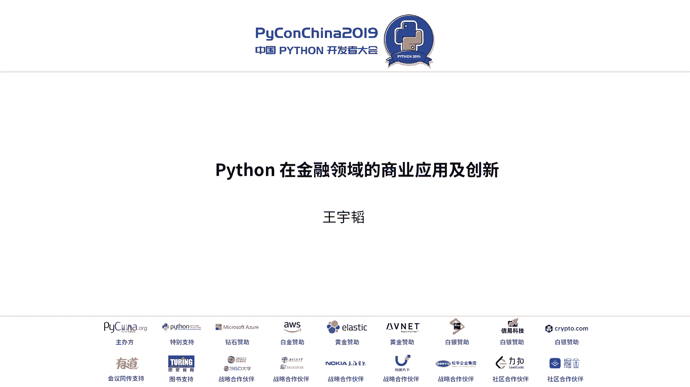
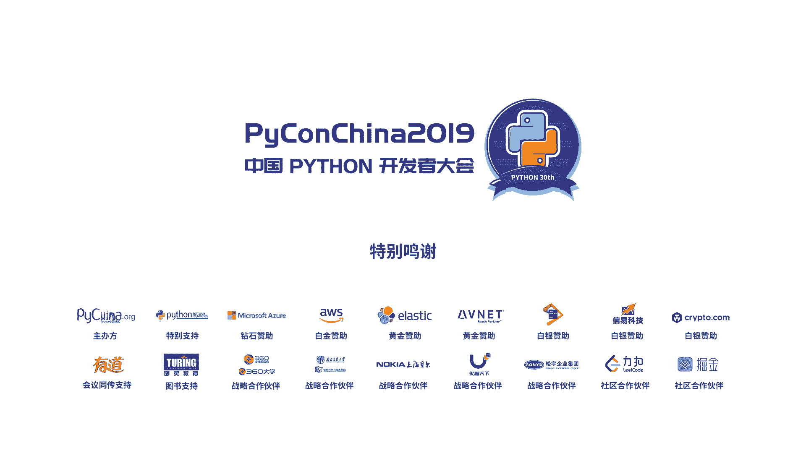

# 002：舆情监控系统开发全流程 🐍



在本节课中，我们将学习如何利用Python构建一个实用的金融舆情监控系统。我们将从核心概念入手，逐步拆解系统的各个模块，并展示关键代码的实现方式，让初学者也能理解其工作原理。

## 公司及个人背景介绍

上一节我们概述了课程内容，本节中我们先了解一下项目背景。华能信托是华能集团旗下的金融子公司，主要从事信托业务，核心是进行资金的整合与匹配。演讲者王宇涛并非科班出身的程序员，而是在工作中自学Python，并创立了公司的金融科技小组。

将IT技术与金融、教育、医疗等行业结合，能产生巨大的“比较优势”。在这些领域，掌握基础的编程技能就能解决许多实际问题，创造显著价值。

## 舆情监控系统的核心价值 💡

在金融行业，核心工作可概括为“找钱”和“找项目”。投资一个项目（如阿里巴巴、万科）前，必须持续关注该公司是否出现负面舆情。手动监控上百家公司的工作量极大，因此自动化舆情监控系统显得至关重要。

对于一个百亿规模的项目，一天的潜在损失可能高达数百万。因此，及时的风险预警对金融公司管理数千亿资产而言，是必不可少的环节。

## 系统架构与核心模块

以下是舆情监控系统的主要构成模块，我们将逐一进行解析：
1.  **信息爬取**：从互联网抓取目标公司的相关新闻。
2.  **数据清洗**：对爬取的原始信息进行整理和优化。
3.  **持续监控**：实现24小时不间断的自动化爬取。
4.  **舆情评分**：对新闻进行正面或负面判断，并量化评分。
5.  **风险预警**：当评分低于阈值时，自动触发预警机制。
6.  **反爬策略**：应对目标网站的反爬虫措施。

## 模块一：基础网页爬取

爬虫的第一步是获取网页源代码。对于大多数网站，使用Python的`requests`库可以轻松实现。

**获取Python官网首页的示例代码：**
```python
import requests
url = ‘https://www.python.org‘
response = requests.get(url)
print(response.text)
```

**爬取百度新闻的示例代码（添加请求头模拟浏览器）：**
```python
import requests
url = ‘https://news.baidu.com‘
headers = {‘User-Agent‘: ‘Mozilla/5.0‘}
response = requests.get(url， headers=headers)
print(response.text)
```
通过以上代码，即可获得网页的HTML源代码，为后续的信息提取打下基础。

## 模块二：信息提取与数据清洗

获取网页源码后，需要从中提取出有用的信息，如新闻标题、链接、来源和日期。正则表达式是完成这项任务的通用且强大的工具。

**使用正则表达式提取新闻信息的示例代码：**
```python
import re
# 假设 html_text 是爬取到的百度新闻页面源代码
pattern = r‘<a href=“(.*?)“.∗?>(.∗?)</a>‘
results = re.findall(pattern， html_text， re.S)
for link， title in results:
    print(f“标题: {title.strip()}， 链接: {link}“)
```
提取后的文本可能包含多余空格或无效字符，需要进行清洗。

**数据清洗的示例代码：**
```python
def clean_text(text):
    # 去除首尾空格及换行符
    text = text.strip()
    text = text.replace(‘\n‘， ‘‘).replace(‘\r‘， ‘‘)
    # 更多清洗规则...
    return text
```

## 模块三：实现24小时持续监控

实现不间断爬取的核心是让程序持续运行。最简单的方法是使用`while`循环。

**使用while循环实现持续爬取的示例代码：**
```python
import time
while True:
    # 执行爬取任务
    crawl_news()
    # 休息一段时间，例如1小时
    time.sleep(3600)
```
为了更智能地调度任务，也可以使用`schedule`库来定时执行。

## 模块四：舆情评分系统

舆情评分是系统的核心。一个简单有效的方法是构建一个负面关键词库，检查新闻标题或正文中是否包含这些词。

**基于负面关键词列表的评分示例代码：**
```python
negative_words = [‘违约‘， ‘诉讼‘， ‘亏损‘， ‘下跌‘， ‘造假‘]
def score_news(title， content):
    score = 100  # 初始分数
    for word in negative_words:
        if word in title:
            score -= 5  # 标题中出现负面词，扣分
        if word in content:
            score -= 3  # 正文中出现负面词，扣分
    return max(score， 0)  # 确保分数不为负
```
更高级的方法可以引入机器学习模型进行语义分析，但对于许多实际场景，关键词匹配方法已经足够有效且高效。

## 模块五：自动预警邮件发送

当监控到负面舆情（如评分低于80）时，系统需要自动发送预警邮件。Python的`smtplib`库让这个过程变得非常简单。

**使用smtplib发送邮件的示例代码：**
```python
import smtplib
from email.mime.text import MIMEText
def send_alert_email(subject， content， to_addr):
    from_addr = ‘your_email@163.com‘
    password = ‘your_authorization_code‘  # 注意是授权码，非登录密码
    msg = MIMEText(content， ‘plain‘， ‘utf-8‘)
    msg[‘From‘] = from_addr
    msg[‘To‘] = to_addr
    msg[‘Subject‘] = subject
    try:
        server = smtplib.SMTP_SSL(‘smtp.163.com‘， 465)
        server.login(from_addr， password)
        server.sendmail(from_addr， [to_addr]， msg.as_string())
        server.quit()
        print(‘邮件发送成功‘)
    except Exception as e:
        print(f‘邮件发送失败: {e}‘)
```

## 模块六：应对反爬虫策略

部分网站（如微信搜狗）设有反爬机制。常见的应对方法包括使用IP代理和模拟浏览器。

**使用IP代理的示例代码：**
```python
import requests
proxy = {‘http‘: ‘http://12.34.56.78:8080‘， ‘https‘: ‘https://12.34.56.78:8080‘}
url = ‘https://weixin.sogou.com‘
try:
    response = requests.get(url， proxies=proxy， timeout=5)
    print(response.text)
except:
    print(‘代理请求失败‘)
```
对于动态渲染的网页（大量使用JavaScript），`requests`库无法直接获取内容，此时可以使用`selenium`库模拟真实浏览器操作。

**使用selenium的示例思路：**
```python
from selenium import webdriver
# 启动浏览器，手动登录一次后，可维持登录状态进行爬取
driver = webdriver.Chrome()
driver.get(‘需要登录的网站‘)
# … 人工完成登录操作 …
# 此后即可通过driver.page_source获取渲染后的页面源码
```

## 拓展应用：Python在金融科技的其他场景

除了舆情监控，Python在金融科技领域还有广泛的应用前景：
*   **面试宝**：与人力资源结合，开发微信小程序进行远程视频面试。
*   **资金雷达**：利用爬虫和RPA技术，寻找资金需求方与供给方。
*   **大数据风控**：应用逻辑回归、决策树等机器学习模型进行信用风险评估。
*   **RPA流程自动化**：自动化重复的办公流程，如数据对账、报表生成。
*   **智能问答机器人**：通过预设问答对或自然语言处理技术，提供自动客服。

## 总结与展望

本节课中我们一起学习了如何用Python构建一个完整的金融舆情监控系统。我们从**爬取**、**清洗**、**评分**到**预警**，逐步拆解了每个模块的实现原理和关键代码。这套系统体现了Python在解决特定行业痛点时的强大能力与高效率。

技术的价值在于应用。将编程技能与金融、人力等领域的知识结合，能发现巨大的市场机会，创造“降维打击”式的竞争优势。未来，我们还可以将此系统产品化（SaaS服务），或探索智能投顾、量化交易等更多金融科技方向。



> 所有示例代码已分享在Mo平台（`https://momodel.cn`）的“华小智Python金融”项目中，可供参考与实践。