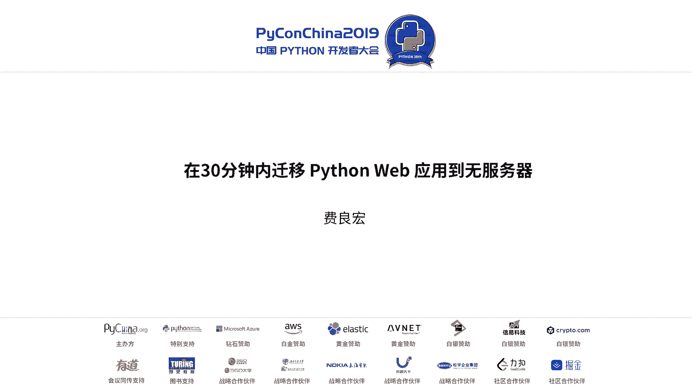
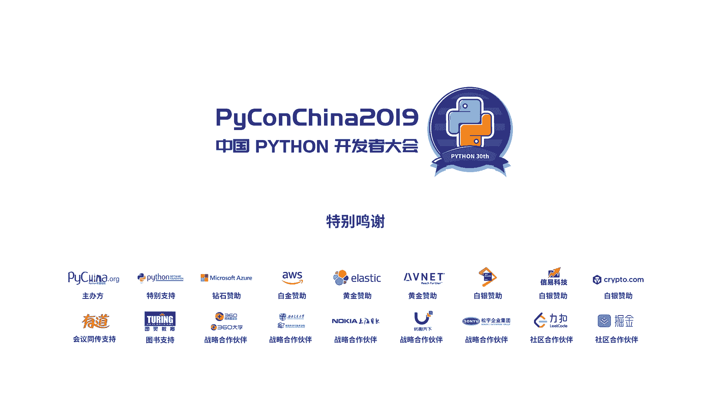

# 004：在30分钟内迁移Python Web应用到无服务器 🚀



## 概述

在本节课中，我们将学习无服务器计算的核心概念，特别是以AWS Lambda为例，探讨如何将传统的Python Web应用迁移到无服务器架构。我们将了解无服务器为何出现、它的优势与局限，并通过具体案例和代码演示，展示如何快速上手开发无服务器函数。

---

## 无服务器计算的出现背景 🤔

上一节我们概述了课程内容，本节中我们来看看无服务器计算为何会出现。

在传统的应用开发中，与业务逻辑直接相关的代码通常不超过40%。开发者需要花费大量时间处理平台、系统集成等非核心功能，这降低了生产效率。随着应用日益复杂、需求变更和发布速度要求加快，这一矛盾愈发突出。

因此，业界期望能有一个平台，它能自动化管理基础设施资源，让开发者专注于业务逻辑。这个平台应具备按使用付费、自动弹性伸缩、高可用性和内置安全等特性。这种需求催生了无服务器计算的概念。

无服务器并非没有服务器，而是服务器细节对开发者透明，由平台负责管理。最初，无服务器主要针对计算平台，但如今其概念已扩展到存储、应用集成等多个领域。

---

## 无服务器的发展历程 📈

上一节我们探讨了无服务器出现的动因，本节中我们来看看它的发展历程。

无服务器的发展大致如下：
*   2014年11月，AWS在re:Invent大会上发布Lambda。
*   2015年，业界提出了“Serverless”的名称和概念。
*   2016年初，Google Cloud Functions发布。
*   2016年2月，开源项目OpenWhisk出现。
*   2016年3月，Microsoft Azure Functions发布。
*   2017年2月，开源项目OpenFaaS出现。
*   2017年10月，Google Cloud Functions正式发布。
*   2017年12月，Apache OpenWhisk成为Apache顶级项目。

如今，无服务器产品家族已发展成一个庞大体系，主要分为两大路线：以AWS、Google、Azure为代表的商业化云平台，以及以Kubernetes生态为基础的开源项目体系。

---

## 无服务器的优势：一个并行化案例 ⚡

上一节我们回顾了无服务器的发展，本节中我们通过一个案例来具体感受它的优势。

当我们开发分布式应用时，使用复杂框架（如Ray）可能“杀鸡用牛刀”。无服务器提供了一种更简单的并行任务开发模型。

以下是OpenFaaS的一个案例，该项目需要处理用户注册、管理、通知和数据验证等任务，数据量庞大。

传统串行方式效率低，而构建并行架构又太复杂。OpenFaaS使用约12个守护函数、24个函数、12个API接口和7个数据库，构建了一个并行的服务架构。

实现这个架构的开发量其实很小，因为它是基于“搭积木”的方式，用少量代码将各个服务像胶水一样连接起来。这使并行化实现变得非常简单。

---

## AWS Lambda 与 Python 的关系 🐍

上一节我们看到了无服务器如何简化并行任务，本节我们聚焦到具体的服务——AWS Lambda，及其与Python的紧密联系。

Lambda是计算环境的高度抽象，本质上是一个函数开发环境，也称为 **FaaS**。

函数主要通过事件驱动的方式被调用。事件源非常丰富，包括AWS各种服务的事件，例如对象存储（S3）中文件的上传或删除。

Lambda的常见应用场景包括：
1.  **Web应用**：静态网站、博客、图片处理、网页渲染。
2.  **后端处理**：任务调度、系统集成、流程处理。
3.  **数据处理**：构建数据处理管道（Pipeline）。
4.  **聊天机器人**：例如亚马逊Alexa的技能（Skill）后端。
5.  **运维自动化**：日志监控告警、自动响应事件。
6.  **AI推理**：例如训练模型生成诗歌。

Lambda就像一个“胶水”或调度器，将各种服务串联在一起。亚马逊Echo智能音箱的所有语音交互都运行在Lambda之上。

---

## 如何编写一个 Lambda 函数 ✍️

上一节我们了解了Lambda的用途，本节中我们来看看如何编写一个Lambda函数。

一个基本的Lambda函数结构如下（以Python为例）：

```python
def lambda_handler(event, context):
    # 你的业务逻辑
    return result
```

*   **`event` 参数**：包含触发函数的事件信息，通常是一个字典。
*   **`context` 参数**：提供函数运行时的上下文信息。
*   **返回值**：可选，返回函数处理结果。

这是一个真实的例子：

```python
def my_handler(event, context):
    name = event.get('name', 'World')
    greeting = f'Hello, {name}!'
    return {'message': greeting}
```

编写过程很简单，可以在AWS控制台从零开始写，或基于蓝图（blueprint）模板开发。

---

## Lambda 的局限性 ⚠️

上一节我们学会了编写简单的Lambda函数，本节中我们必须了解它当前的局限性。

1.  **不支持长时间运行**：函数最大运行时间为**15分钟**。
2.  **冷启动延迟**：函数首次调用或一段时间未被调用后，需要时间初始化容器和代码环境。
3.  **资源限制**：内存、临时存储、包大小、并发数等均有上限。
4.  **工具链变化**：需要适应新的IDE、部署、监控和调试工具。
5.  **运行环境单一**：目前主要为通用CPU环境，不支持GPU等特定硬件。
6.  **供应商锁定**：不同平台标准不一，迁移成本较高。

在冷启动方面，不同语言性能差异显著。一个简单的“Hello World”测试显示，Python的启动性能约为Java的400倍，这得益于解释型语言更小的运行时开销。因此，Python是与无服务器结合的理想语言。

---

## Lambda 的具体技术限制与调试 🔧

上一节我们讨论了Lambda的宏观局限，本节我们深入其具体的技术限制和调试方法。

**技术规格限制：**
*   **内存与CPU**：128 MB 到 3 GB，按64 MB递增，CPU和网络资源随之分配。
*   **超时时间**：最长 **900秒** (15分钟)。
*   **环境变量**：最大 **4 KB**。
*   **层（Layers）**：用于共享代码和依赖库。
*   **并发执行**：初始限制500-3000，可申请提升。
*   **部署包大小**：压缩后 **50 MB**，解压后 **250 MB**。
*   **临时存储（/tmp）**：**512 MB**。

**调试工具：**
使用`print`调试效率低。推荐使用 **AWS X-Ray** 进行分布式跟踪。在代码中引入X-Ray SDK，对函数或代码片段进行标注，即可获得详细的性能剖析数据。

```python
from aws_xray_sdk.core import xray_recorder
from aws_xray_sdk.core import patch_all
patch_all() # 自动检测AWS SDK调用

@xray_recorder.capture('my_function_segment')
def lambda_handler(event, context):
    # 业务逻辑
    result = do_something()
    return result
```

---

## 开发与部署工具 🛠️

上一节我们介绍了调试方法，本节我们来看看有哪些高效的开发和部署工具。

**开发工具：**
主流IDE（如PyCharm, VS Code）都提供了优秀的无服务器开发插件。特别推荐 **AWS Toolkit for VS Code**，它提供了完整的Lambda函数创建、本地调试、部署和测试支持。

**部署工具：**
手动编写CloudFormation模板（JSON/YAML）较为繁琐。推荐使用 **Serverless Application Model (SAM)** 框架及其命令行工具 `sam`。

`sam` 是一个基于SAM框架的开源CLI工具，它简化了无服务器应用的开发、测试和部署。

以下是使用 `sam` 的典型工作流：

1.  **初始化项目**：`sam init`
2.  **本地构建与测试**：`sam build` 和 `sam local invoke`
3.  **部署到云端**：`sam deploy --guided`
4.  **发布到模板仓库**：`sam publish`

通过几条命令即可完成从开发到上线的全过程，并能使用Docker在本地模拟Lambda环境进行测试。

---

## 迁移现有应用到 Lambda 🔄

上一节我们掌握了新项目的开发部署，本节我们探讨如何将现有Python应用迁移到Lambda。

有两种流行的工具可以简化迁移：

1.  **Zappa**：
    这是一个非常强大的工具，特别适合部署Flask、Django等WSGI应用。你只需对现有应用做少量修改，Zappa就能将其打包并部署为Lambda函数和API Gateway。

    ```bash
    # 安装
    pip install zappa
    # 初始化配置
    zappa init
    # 部署
    zappa deploy
    ```

2.  **Chalice**：
    这是AWS官方提供的微框架，让你能像编写普通Python Web应用一样编写代码，然后轻松部署到Lambda。它提供了类似Flask的装饰器语法。

    ```python
    from chalice import Chalice
    app = Chalice(app_name='helloworld')
    @app.route('/')
    def index():
        return {'hello': 'world'}
    ```
    使用Chalice CLI即可部署：`chalice deploy`

这些工具大大降低了从传统Web应用到无服务器架构的迁移门槛。

---

## 总结

本节课中，我们一起学习了无服务器计算的核心概念与发展历程。我们深入探讨了AWS Lambda的工作原理、优势与局限性，并了解到Python因其快速的冷启动特性，与无服务器架构是天作之合。

我们通过代码示例学习了如何编写Lambda函数，并介绍了X-Ray调试、SAM部署框架等实用工具。最后，我们探讨了使用Zappa和Chalice等工具，将现有Python Web应用快速迁移到无服务器平台的方法。



尽管当前的无服务器技术仍有诸多限制，但其发展方向明确，能显著提升开发敏捷性和资源利用率。鼓励大家积极实践，探索无服务器与Python结合带来的更多可能性。