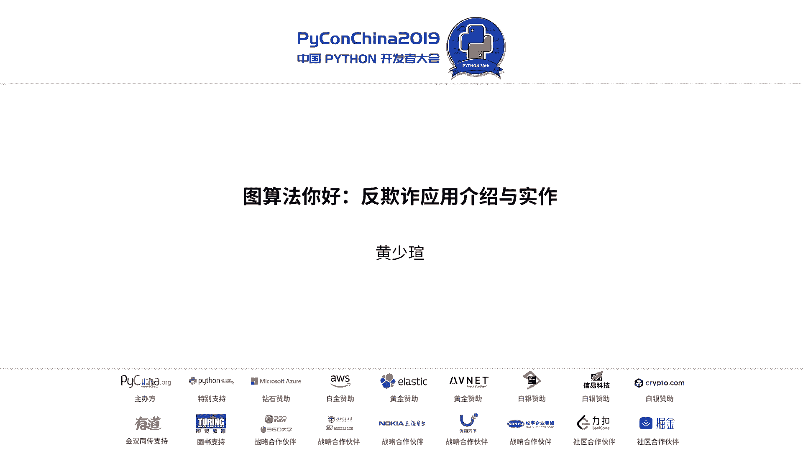
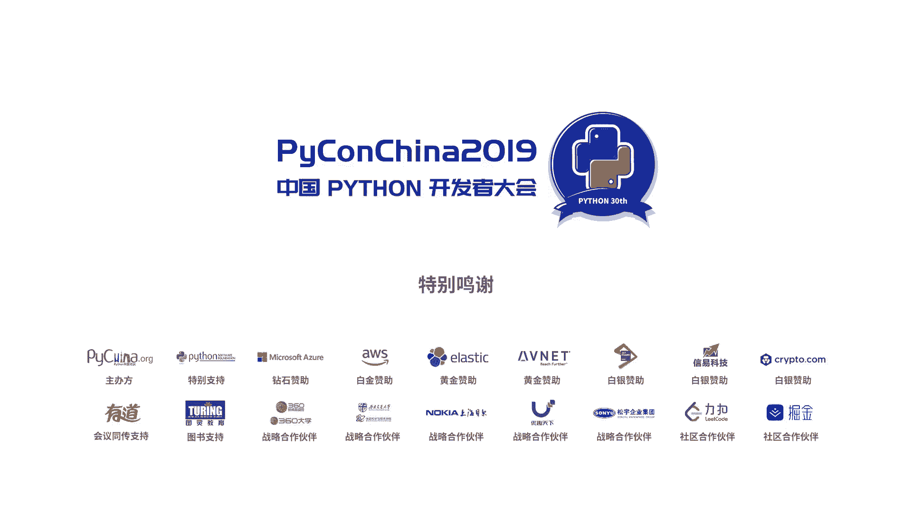

# 010：图算法在反欺诈中的应用与实现 🕵️‍♂️



在本节课中，我们将学习图算法的基本概念，并了解其在反欺诈领域的具体应用与实现方法。我们将从图数据结构的基础讲起，逐步深入到如何利用图算法识别欺诈行为，并介绍相关的工具和实践步骤。

## 什么是图数据结构？ 🧩

上一节我们介绍了课程概述，本节中我们来看看图的基本构成。图是一种数据结构，由**节点**、**边**以及**属性**构成。

*   **节点**：代表实体，例如一个人、一个账户或一个设备。
*   **边**：代表节点之间的关系或连接。
*   **属性**：描述节点或边的特征信息，例如节点的名称、边的权重。

我们可以用《还珠格格》的角色关系来理解：
*   节点“乾隆皇帝”具有“名字=皇帝”、“星座=天秤座”等属性。
*   他与节点“小燕子”之间有一条边，属性为“关系=封为格格”。
*   他与节点“令妃”之间也有一条边，属性“爱的程度”可以用权重 **`weight=8`** 来表示。

这种结构能够清晰地表达复杂的关系网络。

## 图算法在反欺诈中的意义 🎯

理解了图的基本结构后，我们来看看它在反欺诈场景中的具体意义。图算法主要能解决两类核心问题：**核实身份**和**发现欺诈团伙**。

以下是两种典型的反欺诈场景：

1.  **核实身份**
    假设金融机构存档的“皇后”信息是基于《还珠格格》版本。当一个自称“皇后”的人（实际是《如懿传》版本）来申请贷款时，系统需要有能力核查并判断其身份不符，从而进行拦截。这就是“核实身份”的应用。

2.  **团伙欺诈侦测**
    在复杂的社交或交易网络中，黑产分子往往以团伙形式作案。如果我们通过行业共享黑名单只知道一个可疑节点（例如“容嬷嬷”），图算法可以帮助我们找出与之关联紧密的整个社区（例如“皇后”及其党羽），从而实现团伙挖掘。

## 实践前的关键考量：你的图是连通的吗？ 🔗

在将图算法应用到模型之前，有一个关键误区需要避免：检查你的数据是否构成了一个**连通图**。

图算法大致分为三类：
*   **路径查找算法**：解决最短路径等问题。
*   **中心性算法**：衡量网络中节点的重要性。
*   **社区发现算法**：用于侦测团伙欺诈，找出紧密关联的群体。

一个理想的、有助于发现欺诈团伙的图应该是**充分连通**的。这意味着社区内部连接紧密，同时社区之间也存在一些连接。这样，当一个黑名单节点出现时，算法才能有效地找到其关联的整个可疑群体。

反之，如果数据构成的图像“岛屿”一样彼此孤立（例如平均连接度很低），那么社区发现算法会将图分割成大量细碎的社区。这种情况下，正常群体和欺诈群体的图谱看起来可能没有区别，算法就无法进行有效区分。

**初步检验方法**：可以通过简单的统计（如计算节点的平均出度、入度）来初步判断你的数据是否具有形成连通图的潜力。

## 如何上手：工具与实现 🛠️

上一节我们讨论了数据连通性的重要性，本节中我们来看看如何用Python工具实现图算法。经过研究，**Neo4j** 是一个非常适合入门的图数据库。

以下是几种常用的工具及其特点：

*   **Neo4j**：一个流行的图数据库，可通过Web界面进行可视化，默认支持显示约3000个节点。它使用 **Cypher** 查询语言来操作图数据。
    ```cypher
    // Cypher 示例：创建节点和关系
    CREATE (乾隆:皇帝 {name: '乾隆', 星座: '天秤座'})
    CREATE (令妃:妃子 {name: '令妃'})
    CREATE (乾隆)-[:宠爱 {weight: 8}]->(令妃)
    ```
    通常，我们用Python进行数据处理，再将结果导入Neo4j。Neo4j的扩展库（如`algo`和`apoc`）提供了丰富的图算法。

*   **NetworkX**：一个纯Python的图论与复杂网络建模工具包，适合学术研究和中小型图的计算。

*   **Gephi**：一款开源的网络分析与可视化软件，角色与Neo4j类似，但专注于可视化，能处理较大规模的图。

*   **GraphQL**：一种由Facebook开源的数据查询语言，适用于查询图结构中的数据，可以灵活地获取节点、边及其属性。

对于初学者，从Neo4j开始是一个不错的选择，其社区活跃且有丰富的中文资料。

## 与反欺诈业务场景结合 💼

第三点，也是最关键的一点，是如何将图算法与具体的反欺诈业务场景深度结合。这通常贯穿于信贷的整个风控流程：

*   **贷前与贷中**：主要用于上文提到的“核实身份”和“团伙欺诈侦测”。
*   **贷后**：可用于寻找“失联客户”。当某个账户失联时，可以通过图算法找到其潜在的关系联系人，辅助催收工作。

要实现有效的图算法风控，核心在于构建一个信息量足够丰富的**连通图**。这要求数据维度不能仅限于账户ID，还应包含手机号、IP地址、设备号等多维度信息。理想情况下，建立行业级的黑名单共享联盟，将极大增强识别跨平台、跨场景欺诈团伙的能力。

## 总结 📝

本节课中我们一起学习了图算法在反欺诈中的应用。我们从图的基本概念出发，了解了它在核实身份和发现欺诈团伙中的价值。我们强调了在应用前检查数据连通性的重要性，并介绍了Neo4j、NetworkX等实用的工具。最后，我们探讨了如何将图算法嵌入到贷前、贷中、贷后的完整风控流程中，并指出构建多维度数据联盟是提升反欺诈效果的关键。



希望本教程能帮助你开启图算法在反欺诈领域的探索之旅。