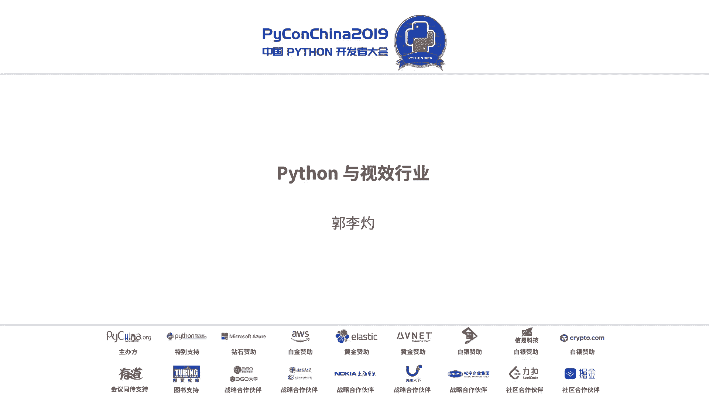
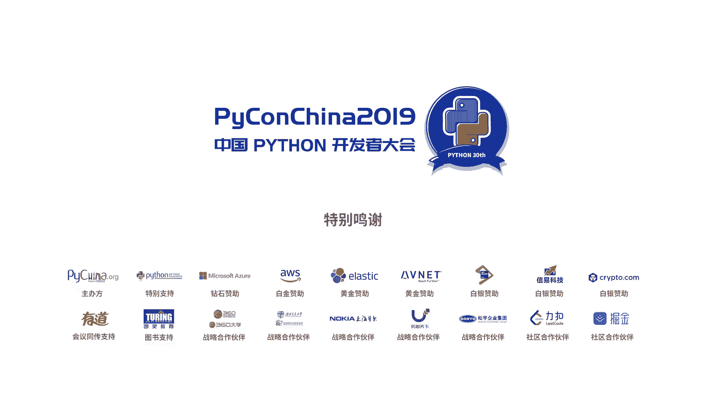

# 011：Python在视效行业的应用



## 概述
在本节课中，我们将学习Python在影视特效（VFX）行业中的应用。我们将了解视效制作的基本流程、行业现状、Python在其中扮演的角色，以及新兴技术对视效行业的影响。

## 视效制作流程简介
上一节我们概述了课程内容，本节中我们来看看视效是如何制作的。一个特效镜头通常被分解为多个环节进行制作。

以下是视效制作的主要环节：
*   **资产模型环节**：创建现实中不存在的物体或角色，例如怪兽、飞船等数字资产。
*   **动画环节**：为创建好的数字资产添加动作，使其动起来。
*   **合成环节**：将实拍的绿幕画面、CG资产、动画等所有元素结合，处理画面不干净的部分，最终合成一个完整的镜头。

一部拥有上千个特效镜头的电影，其制作团队可能超过2000人。因此，视效行业可以被理解为一个劳动密集型行业。

## 视效行业中的软件与Python
了解了基本流程后，我们来看看行业中使用的主流工具。在视效行业，主流的专业制作软件包括Maya、Houdini和Nuke等。许多大型电影的背后制作都依赖于这些软件。

国外的大型公司，如迪士尼、工业光魔（ILM）和维塔数码（Weta Digital），通常拥有自己的开发团队，为其制作流程开发专用工具。这是目前国内视效公司相对欠缺的领域。

Python与这些软件和操作系统有良好的接口。例如，在Maya中可以直接调用其Python库进行编程，实现自动化任务和流程化应用。核心的调用方式通常如下：

```python
# 示例：在Maya中通过Python创建一个立方体
import maya.cmds as cmds
cmds.polyCube()
```

## 国内视效现状与挑战
上一节我们介绍了行业工具，本节我们来关注国内视效行业的现状。国内视效常被观众戏称为“五毛特效”。这种现象主要由两方面原因造成。

以下是两个主要原因：
1.  **制作周期与预算**：优秀的视效项目需要相对充足的制作时间和预算支持。
2.  **人才短缺**：视效，尤其是计算机图形学，是艺术与技术的结合。艺术家离不开计算机技术的支持。目前国内既懂艺术又懂技术的人才较为稀缺。

因此，本次分享也希望能让更多Python开发者关注并了解视效行业，为提升国内视效质量贡献力量。

## 新技术在视效中的应用
传统制作方式面临挑战，而新技术带来了新的可能。深度学习与人工智能等技术已开始在视效行业应用。

以下是几个应用方向：
*   **画面修复与擦除**：自动识别并移除画面中不需要的物体（如穿帮的威亚、标记点），替换为背景。这个过程常被称为“擦威亚”或“Roto”。
*   **图像风格迁移**：改变场景的时间段或整体风格，例如将白天场景变为夜晚。
*   **数字换脸**：在影视制作中，可用于处理危险镜头的替身演员面部替换，或演员档期冲突等问题。通过AI技术可以大幅提升处理效率。
*   **动作捕捉**：实时捕捉演员的动作，并驱动数字角色模型。这在《猩球崛起》等电影中已有成熟应用。

通过编程和AI技术节约艺术家重复性劳动的时间，对于提升整体视效质量和行业效率有巨大帮助。

## Python在视效行业中的角色
最后，我们来总结一下Python开发者在视效行业中可以扮演的具体角色。视效行业与IT行业有相似之处，如工作强度大、经常加班。同时，它是一个技术与艺术结合的领域，经验随着年限积累会越来越有价值。

Python在视效团队中的职能主要可分为以下几类：
*   **工具开发（产品经理）**：规划和开发视效制作流程中所需的通用工具或插件，以提升制作效率。
*   **流程管道开发（Pipeline TD）**：负责构建和梳理不同制作环节（如模型、动画、合成）之间的衔接流程。确保上一个环节的输出能自动兼容下一个环节的输入，并实现任务自动流转。
*   **专业技术指导（Technical Director）**：针对特定环节（如模型、特效模拟）提供技术支持。例如，制作爆炸、水流等物理特效需要运用物理规律和数学原理（如线性代数）。公式 `F = m * a`（牛顿第二定律）是模拟许多物理现象的基础。
*   **图形图像研发**：这是最核心的技术岗位，专注于计算机图形学底层算法的研究与实现，直接处理图形图像相关的技术难题。



## 总结
本节课中，我们一起学习了Python在影视特效行业的广泛应用。我们从视效制作的基本流程入手，了解了行业现状与“五毛特效”背后的挑战，探讨了AI等新技术如何赋能视效制作，并最终明确了Python开发者在该行业中可以承担的工具开发、流程构建、技术支持和图形研发等关键角色。希望本次分享能为大家打开一扇通往技术与艺术结合领域的新大门。