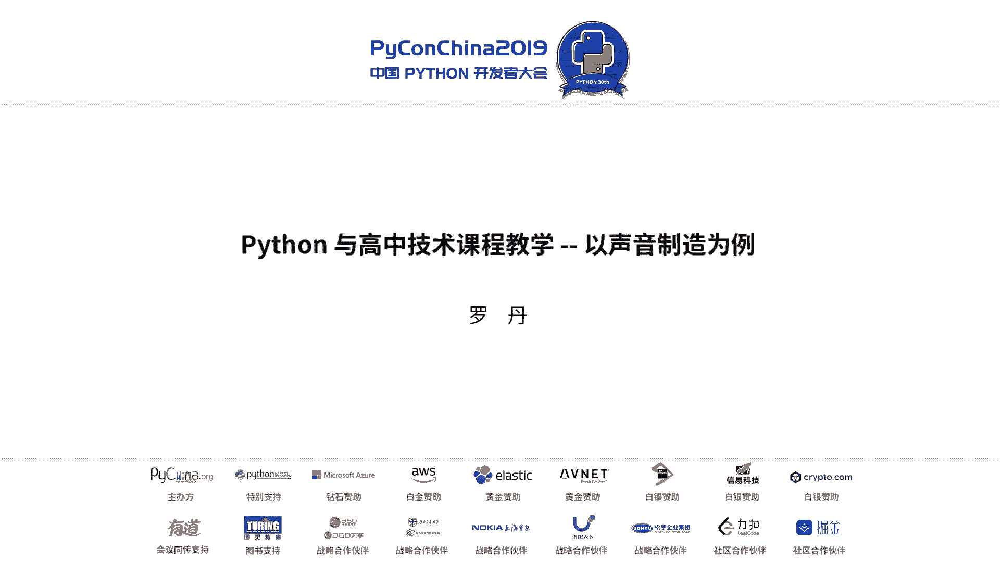
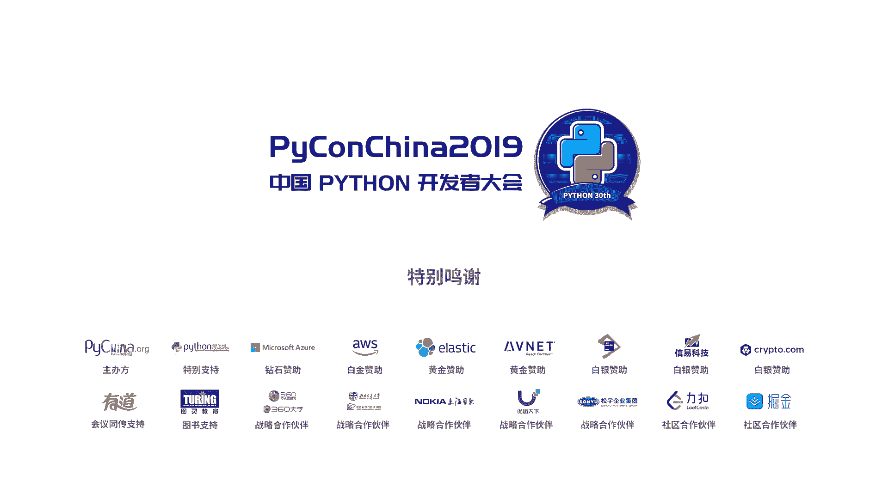

# 012：以声音制造为例 🎵



在本教程中，我们将学习如何将Python编程融入高中技术课程，并以“声音制造”项目为例，展示如何通过编程连接数学、物理等学科知识，引导学生进行创造性的学习与实践。

---

## 课程背景与设计思路 🧭

上一节我们介绍了课程的整体框架，本节中我们来看看课程设计的具体背景与核心思路。

我们学校的课程设置不区分独立的信息技术与通用技术，而是将两者融合。课程采用项目制，学生跨年级选课，教师拥有较大的课程设计自主权。

课程设计的核心思路有以下几点：
*   **融合主干学科知识**：课程内容不仅限于技术，还融合了数学、物理、化学等学科的知识。
*   **明确研究对象**：以“声音制造”作为具体的研究对象，为学生提供明确的学习目标。
*   **培养研究能力**：在有限的空间内，引导学生应用现有工具解决实际问题，培养研究性学习能力。
*   **衔接大学知识**：尝试平滑中学知识与大学专业知识之间的过渡。

## 项目概述：声音制造 🔊

上一节我们了解了课程的设计思路，本节中我们将聚焦于“声音制造”这个核心项目。

学生需要完成的任务是动手制作一款可以演奏的电子乐器。为了实现这个目标，他们需要研究以下五个主要板块：
1.  了解声音是什么。
2.  分析声音。
3.  制造声音。
4.  处理声音。
5.  传播声音。

在这个过程中，学生需要融合运用他们在各主干学科中学到的知识。

## Python在课程中的核心角色 🐍

上一节我们明确了项目目标，本节中我们来看看Python编程如何作为核心工具贯穿整个学习过程。

课程开始时，学生会先复习相关的数学（三角函数）和物理（振动）知识。同时，他们会认识到计算机作为工具的两个基本限制：**有限的空间**和**有限的计算次数**。

Python的角色由此介入。以下是Python在项目中的具体功能与应用步骤：

### 1. 生成与可视化声波

首先，学生需要理解声音信号可以用最简单的正弦波表示。利用Python和`matplotlib`库，他们可以将公式转化为可视化的波形图，从而直观理解计算机处理的是**离散数据**而非连续信号。

**核心公式与代码示例：**
生成一个正弦波的公式为：
`y = A * sin(2 * π * f * t)`
其中，`A`是振幅，`f`是频率，`t`是时间。

使用Python绘制正弦波的简化代码如下：
```python
import numpy as np
import matplotlib.pyplot as plt

# 设置参数
A = 1  # 振幅
f = 440  # 频率 (Hz)，例如标准音A
t = np.linspace(0, 0.01, 500) # 时间数组

# 生成正弦波数据
y = A * np.sin(2 * np.pi * f * t)

# 绘图
plt.plot(t, y)
plt.title('正弦波')
plt.xlabel('时间 (s)')
plt.ylabel('振幅')
plt.show()
```

### 2. 合成复杂波形与信号处理

在能够生成单一正弦波后，学生需要尝试生成不同频率的正弦波并将其叠加，合成更复杂的声音。接着，他们会接触到如矩形波等其他波形公式，并尝试生成。

一个常见的实践问题是：生成的声音在开始和结束时，音响可能出现“过载”的爆音。引导学生观察波形图，他们发现信号的电平上升/下降过程过于陡峭。

**解决方案：**
这个问题可以引导学生运用**高一数学的分段函数**概念来构建数学模型，使信号的起始和结束变得平滑。例如，在信号开始阶段（Attack）和结束阶段（Release）加入线性或指数的渐变过程。

这个过程实际上模拟了音频处理中的经典**ADSR包络**（Attack, Decay, Sustain, Release），是电子乐器中常见的功能。

### 3. 构建交互系统与硬件联动

学生接下来会设计简单的图形界面，并利用网络通信（如UDP协议）或串口通信，将电脑（负责繁重的音频处理）与树莓派（Raspberry Pi）或Arduino等智能硬件（负责触发控制）协同工作。

**核心思考：**
这自然会引发对计算机网络核心概念的探讨。例如，制作实时电子乐器时，使用**TCP**还是**UDP**协议更合适？这促使学生思考不同协议的特性（可靠性 vs. 实时性）。

通信的数据格式可以采用简单的**JSON**结构，例如：`{"command": "play", "note": "C4", "duration": 0.5}`。

## 对中学STEM/STEAM教育的思考 💡

上一节我们详细探讨了Python的技术实现，本节中我们来分享一些关于课程设计背后的教育理念。

我认同MIT媒体实验室倡导的**技术与艺术融合**的方向。对于中学的STEM/STEAM教学，我认为：

以下是几条核心的教育思考：
*   **内容优于形式**：教育的核心应从主干学科的教育大纲出发，找到技术与知识的自然结合点，而非追逐热门的编程或机器人套件。
*   **平行深入，交叉融合**：将中学生正在学习的各主干学科知识与技术并行连接，在连接过程中必然找到交叉点，从而帮助学生构建网状的知识体系，而非线性的学科隔离。
*   **促进教师间深度合作**：技术教师应与数学、物理、美术等学科老师深度合作，将他们的教学想法通过技术手段实现。
*   **清晰展现学科联系**：在教学过程中，明确展示如何用数学知识（如分段函数）解决信号处理问题，强化知识间的关联。
*   **引导模块化知识管理**：引导学生像程序员一样，对他们所学的知识和技能进行模块化归类与管理，这有助于提升学习和工作效率。

---

## 总结 📚



本节课中我们一起学习了如何将Python作为核心工具，设计一个名为“声音制造”的高中技术课程项目。我们从课程背景与融合学科的设计思路出发，详细探讨了如何通过Python生成、处理声波，并连接智能硬件制作电子乐器。最后，我们分享了以内容为核心、促进学科深度交叉融合的STEM教育理念。希望这个案例能展示出编程不仅是技术工具，更是连接不同学科、激发学生创造性思维的桥梁。