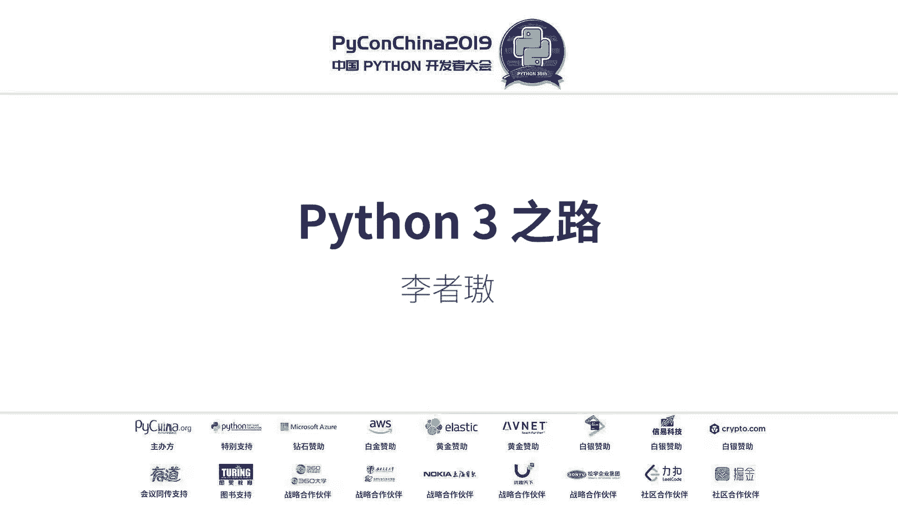
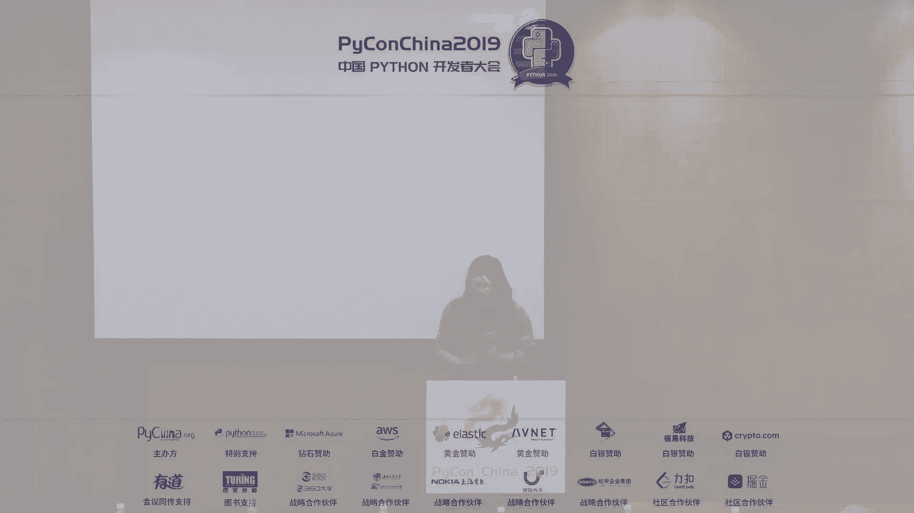
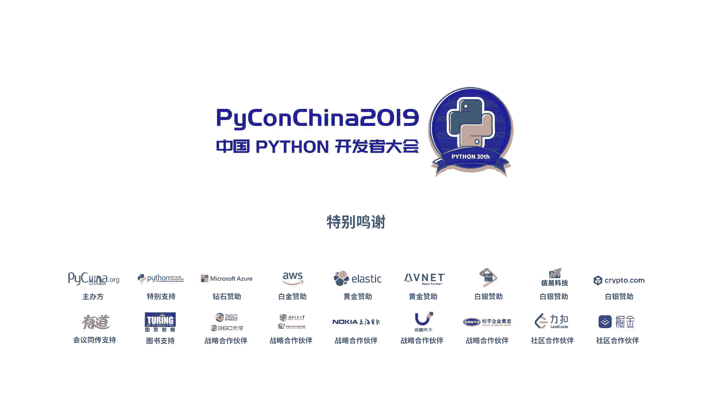

# 001：Python3之路 🐍





在本节课中，我们将回顾Python的发展历程，重点探讨Python2的缺陷、Python3带来的重要改进，以及这门语言未来面临的挑战。我们将以简单直白的方式，梳理Python从过去到现在的关键变化。

---

## Python2的历史回顾

上一节我们介绍了课程概述，本节中我们来看看Python2的发展历程。

Python 2.0 发布于2000年。
Python 2.2 和 2.3 分别发布于2001年和2004年，引入了诸如上下文管理器、迭代器和生成器等重要语法。
PEP 3000 这个重要的提案发布于2006年，它决议将开发不向下兼容的Python3。
Python 2.7 发布于2010年，这是Python2系列中使用最广泛的版本。
Python 2 将于2020年1月正式结束维护。

---

## Python2的主要缺陷

了解了Python2的历史后，本节我们来看看它存在哪些主要问题。

Python2的缺陷主要包括：编码支持不足、语义存在分歧、内建系统设计不合理。

以下是关于编码问题的具体说明：
在Python2中，字符串 `‘ABCD’` 的含义是模糊的。它可能代表一个包含四个字符的文本字符串，也可能代表四个十六进制数的字节数据。这是因为Python2没有严格区分文本数据和二进制数据。

以下是关于语义分歧的具体说明：
例如，`range` 和 `xrange` 的功能相似但返回类型不同，`dict.keys()` 和 `dict.iterkeys()` 也存在类似区别。这种不一致性增加了学习负担。

以下是关于内建系统设计的具体说明：
考虑以下异常处理代码：
```python
try:
    raise SimpleOneException()
except SimpleOneException:
    raise SimpleTwoException()
```
在Python2中，当处理 `SimpleOneException` 时又抛出了 `SimpleTwoException`，那么原始的 `SimpleOneException` 信息会丢失。这只是一个设计不合理的例子。

由于存在这些破坏性缺陷，Python社区最终决定进行不向下兼容的升级，即Python3。

---

## Python3带来的核心改进

上一节我们看到了Python2的诸多问题，本节中我们来看看Python3是如何解决这些问题的。

Python3为我们带来了：统一的编码处理、更严格的语义、更合理的设计，以及能提升生产效率的新特性。

**统一的编码**
Python3严格区分了文本（`str`）和二进制数据（`bytes`），字符串 `‘ABCD’` 只能是文本。同时，对Unicode提供了更好的默认支持。

**更严格的语义**
例如，`range` 统一了Python2中 `range` 和 `xrange` 的行为。许多内置模块也被重组，以提供更清晰的接口。

**更合理的设计**
对于之前提到的异常处理问题，Python3引入了 `__cause__` 属性。使用 `raise SimpleTwoException() from e` 语法，可以清晰地保留异常链，使得调试更加方便。

**提升生产效率的新特性**
Python3引入了许多提高开发效率的功能，例如类型标注、新的项目配置方式等。

---

## Python3的新特性：类型标注

上一节我们提到了新特性，本节我们深入看看其中一项：类型标注。

Python是一门动态的强类型语言。但在大型项目中，动态类型可能导致代码难以理解和维护。

考虑以下Flask代码片段，猜测参数类型：
```python
@app.route(‘/‘, methods=[‘GET’])
def index(name):
    return ‘Hello {}’.format(name)
```
很难直接看出 `name` 应该是什么类型。

**解决方案是类型标注（PEP 484）。** 它在Python 3.5中引入，为函数参数和返回值添加可选的类型提示。

使用类型标注改进上面的代码：
```python
from typing import Dict, Any
@app.route(‘/‘, methods=[‘GET’])
def index(name: str) -> str:
    return ‘Hello {}’.format(name)
```
现在，代码清晰地表明 `name` 是字符串，函数也返回字符串。这大大提升了代码的可读性和可维护性，并方便了第三方静态类型检查工具（如mypy）的使用。

---

## Python3的新特性：项目配置

除了类型标注，Python3也在项目管理和配置方面做出了改进。

传统上，Python项目使用 `setup.py` 文件来描述元数据和依赖。但这个文件通常复杂且需要编写大量样板代码。

PEP 518 引入了一种新的、更清晰的配置方式。它鼓励使用像 `pyproject.toml` 这样的结构化配置文件。

以下是一个 `pyproject.toml` 的示例片段：
```toml
[tool.poetry]
name = “my-project”
version = “0.1.0”
description = “A simple project”

[tool.poetry.dependencies]
python = “^3.7”
requests = “^2.25”

[build-system]
requires = [“poetry-core>=1.0.0”]
build-backend = “poetry.core.masonry.api”
```
相较于传统的 `setup.py`，这种格式更简洁、更易读、更专注于项目描述本身。像 `poetry` 这样的现代工具全面支持PEP 518，可以极大地简化依赖管理和项目发布流程。

---

## Python的现状与未来挑战

Python3已经取得了巨大进步，但这是否意味着Python已经完善了呢？本节我们来探讨它当前面临的挑战。

答案是否定的。Python在工程化方面仍面临挑战，主要集中在性能和代码治理两方面。

**性能挑战**
在需要处理高并发、极高QPS的场景下，Python的性能可能成为瓶颈。与Go、Java等语言相比，Python的全局解释器锁（GIL）和动态解释执行使其在纯计算性能上不占优势。在业务量巨大时，这可能直接转化为更高的服务器成本。

**框架与代码治理挑战**
Python的灵活性是一把双刃剑。考虑以下使用元类（metaclass）的代码：
```python
class DemoMeta(type):
    def __new__(mcs, name, bases, attrs):
        for key in attrs:
            if ‘abc’ in key:
                # 对方法进行包装
                pass
        return super().__new__(mcs, name, bases, attrs)
```
元类可以深度干预类的创建行为。如果团队成员未经充分评估就使用此类高级特性，可能导致代码难以理解和维护，即“动态类型一时爽，重构全家火葬场”。
大型工程需要“框架治理”，即通过规范和工具约束代码风格与可用特性。Python在这方面的原生支持较弱，更依赖于团队自建的基础设施和严格的Code Review。

尽管有这些挑战，Python因其优美、简洁和开发高效的特点，依然深受喜爱。社区也在积极改进，例如探讨移除GIL的方案。我们希望Python未来能在保持优势的同时，更好地满足大型工程的需求。

---

## 总结与问答环节

本节课中我们一起学习了Python从版本2到版本3的演进之路。我们回顾了Python2在编码、语义和设计上的缺陷，详细了解了Python3如何通过统一编码、严格语义和新特性（如类型标注、现代化项目配置）来解决这些问题。最后，我们也探讨了Python在性能和工程治理方面面临的持续挑战。

**以下是现场问答环节的精选内容：**

**问：国内开发者如何为Python社区做贡献？**
答：贡献途径多样。可以直接参与CPython或官方项目，从修复文档错别字（typo）或简单的Bug开始。也可以为你常用的第三方库（如某个RPC框架的Python客户端）贡献代码，完善功能。此外，组织或参与技术分享、像PyCon这样的会议也是宝贵的贡献。

**问：为什么有人说Python 3.6.5是对新手最友好的版本？**
答：这可能是因为Python 3.6是一个长期支持（LTS）版本，非常稳定，且包含了现代Python的核心特性（如f-string在3.6引入）。但对于初学者，任何3.5之后的版本差异都不大，建议直接学习较新的稳定版（如3.8或3.9）。

**问：Python在饿了么有哪些应用？**
答：饿了么早期核心系统用Python开发。目前，随着技术栈演进，部分核心链路转向Java。Python现在主要应用于一些中间件系统，如服务发现、注册中心等，并且团队内部仍在积极推动Python在新场景下的应用。

---



本节课到此结束。Python之路仍在继续，它的优雅与实用激励着我们不断探索和学习。