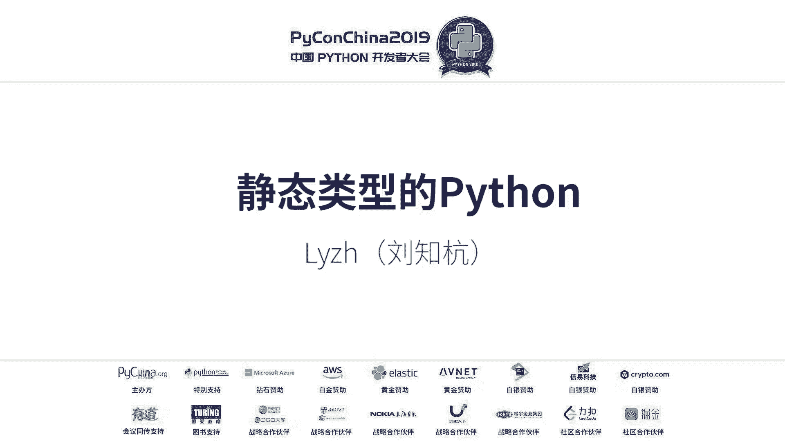
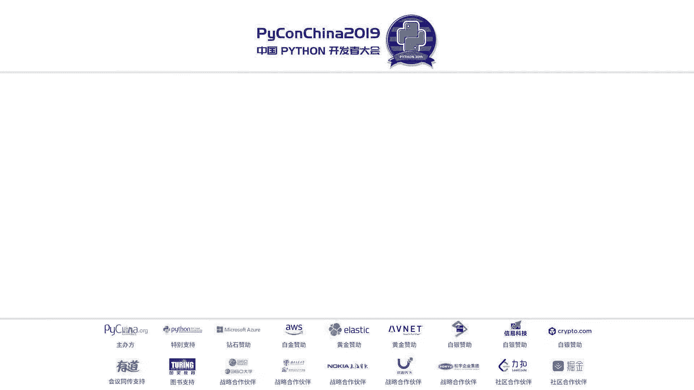
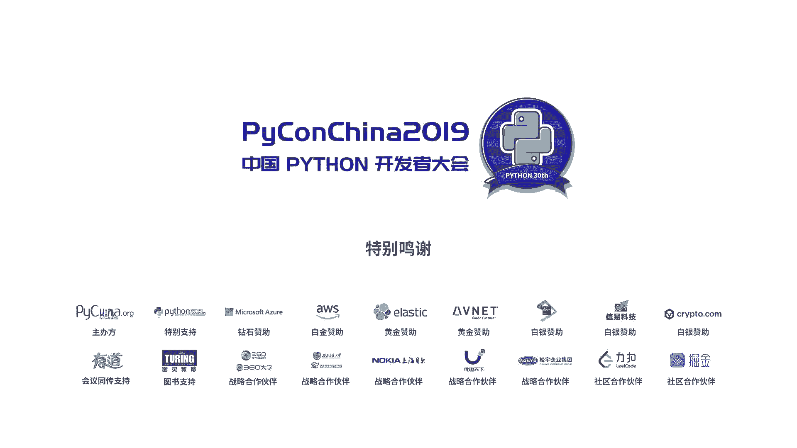

# 005：静态类型的 Python





## 概述
在本节课中，我们将学习 Python 类型系统的基本概念，了解如何为 Python 代码添加静态类型检查，并探讨其背后的理论基础。我们将从类型与类型系统的区别讲起，逐步深入到 `mypy` 工具的使用和代数数据类型的概念。

---

## 第一部分：类型系统基础概念

在开始之前，我们先分享一个案例。三天前，一个群友遇到了代码问题。我们猜测是变量类型出了问题，但排查过程很麻烦。后来发现，问题出在 `filter` 函数返回的是一个惰性的 `filter` 对象，而 `json.dumps` 不支持序列化这种对象。如果当时使用了 `mypy` 这类静态分析器，或者 Python 默认带有类型检查，这类问题就能在编码阶段被轻易发现。

### 类型与类型系统的区别
我常听人说“Python 没有类型系统”，但对方会反驳“Python 有类型”。这里需要澄清：Python 有类型，但没有类型系统。

在 CPython 中，类型是运行时的概念。每个 Python 对象在 C 结构体头部都有一个 `PyObject` 对象头，其中包含一个指向类型对象的指针。这个类型对象就是 Python 在运行时识别对象类型的依据。

然而，类型系统是一种编译期的检查规则。它通过一套规则来保证代码的安全性，其基本目的是防止程序在运行时发生执行错误。类型系统是形式化方法的一种，属于编程语言理论中发展较为完善的部分。

### 类型系统的作用
类型系统主要有三个作用：
1.  **错误检查与安全性**：最基本的作用是在代码运行前发现潜在的类型错误，提高程序的可靠性。
2.  **作为文档**：带有类型标注的代码本身就是一种文档。通过函数签名，我们可以快速理解函数的功能。例如，一个签名为 `(List[T], int) -> T` 的函数，很可能是一个索引操作。
3.  **利于编译优化**：静态类型信息可以帮助编译器或解释器进行优化。动态语言由于类型不确定，往往需要在运行时进行哈希表查找和类型检查，这会损失性能。

### 类型系统的分类
上一节我们介绍了类型系统的作用，本节我们来看看它的几种分类。

*   **渐进式类型系统**：这种系统允许静态类型和动态类型共存，非常适合像 Python 这样的动态语言进行逐步的类型化改造。开发者可以逐步为遗留代码添加类型标注，而不必一次性重写全部代码。
*   **声明式 vs 结构化类型系统**：
    *   **声明式（名义式）**：通过类型的名称来进行类型检查和推导。`mypy` 采用的就是这种方式。
    *   **结构化**：通过检查对象的“形状”（即拥有的属性和方法）来检查类型。TypeScript 的类型系统就是结构化的。这类似于 Python 的“鸭子类型”——如果一个对象看起来像鸭子，叫起来像鸭子，那么它就是鸭子。

---

## 第二部分：Python 类型标注实战

了解了基本概念后，我们进入实战环节，看看如何为 Python 代码添加类型标注并进行检查。

### Python 的标准支持
`mypy` 的实现依赖于 Python 的官方标准。

*   **PEP 3107 - 函数注解**：在 Python 2 时代，函数参数和返回值的元信息没有标准，导致工具生态混乱。PEP 3107 统一了函数注解的语法，为类型提示提供了标准的语法载体。虽然这些注解在运行时可以获取，但 Python 本身不会进行任何类型检查，以保证兼容性。静态类型检查器（如 `mypy`）或 IDE 可以利用这些注解进行分析。
*   **PEP 526 - 变量注解语法**：在 PEP 526 之前，人们通过注释（如 `# type: int`）来标注变量类型。这种方法不是官方语法，难以与普通注释区分，且解析困难。PEP 526 引入了专门的变量注解语法（如 `x: int = 5`），解决了这些问题。

### 使用 Mypy 进行类型检查
以下是使用 `mypy` 的基本步骤和常见用法。

**安装与基本使用**
通过 pip 安装 `mypy`：`pip install mypy`。安装后，使用 `mypy your_program.py` 命令即可检查代码。通过 `--python-version 2.7` 参数可以检查 Python 2 的代码。

**为函数添加类型标注**
我们从一个普通函数开始，它实现字符串重复连接的功能。

```python
def hello_name(name, repeat):
    return 'hello ' + name * repeat

print(hello_name(3, 3)) # 运行时可能出错
print(hello_name(b'test', 3)) # 运行时可能出错
```
如果传入数字或字节数组，运行时可能会报错。使用 `mypy` 可以在运行前发现这些问题。我们需要为函数添加类型标注。

```python
def hello_name(name: str, repeat: int) -> str:
    return 'hello ' + name * repeat
```
现在 `mypy` 就能检查出 `hello_name(3, 3)` 的类型错误。

**使用 `Any` 类型**
如果希望某个参数可以接受任意类型，可以使用 `Any`。这在重构遗留代码时作为临时解决方案很有用。

```python
from typing import Any
def func(param: Any) -> Any:
    return param
```
**注意**：`object` 和 `Any` 不同。标注为 `object` 的变量只能调用 `object` 类的方法；而标注为 `Any` 则完全绕过类型检查。

**默认参数**
默认参数直接放在类型注解之后即可。

```python
def greet(name: str = "World") -> str:
    return f"Hello {name}"
```

**容器类型标注**
对于列表、字典等容器，需要使用 `typing` 模块中的泛型。

```python
from typing import List, Dict, Tuple
def process_items(items: List[str]) -> None:
    for item in items:
        print(item)
def get_coordinates() -> Tuple[float, float]:
    return (1.0, 2.0)
def get_student_grades() -> Dict[str, int]:
    return {"Alice": 90, "Bob": 85}
```

**可迭代对象与泛型**
如果一个函数能接受 `List` 或 `Tuple`，使用 `List[int]` 标注会过于严格。这时可以使用更抽象的可迭代类型 `Iterable`。

```python
from typing import Iterable, List
def sum_numbers(numbers: Iterable[int]) -> int:
    total = 0
    for n in numbers:
        total += n
    return total
```

**联合类型 `Union`**
`Union` 允许一个变量是多种类型之一，这比 `Any` 的约束更强。

```python
from typing import Union
def handle_value(value: Union[int, str]) -> None:
    if isinstance(value, int):
        print(f"Got integer: {value}")
    else:
        print(f"Got string: {value}")
```

**可选类型 `Optional`**
`mypy` 默认变量不可为空（`None`）。`Optional[int]` 等价于 `Union[int, None]`，表示变量可以是 `int` 或 `None`。

```python
from typing import Optional
def find_user(user_id: int) -> Optional[str]:
    if user_id > 0:
        return "UserFound"
    else:
        return None
```

**局部类型推断**
`mypy` 能够进行局部类型推断。例如下面的函数，`mypy` 能推断出 `output` 最终是 `List[float]` 类型，并与返回值标注 `List[float]` 进行比对检查。

```python
from typing import Iterable, List
def make_list(iterable: Iterable[float]) -> List[float]:
    output: List[float] = []
    for item in iterable:
        output.append(item)
    return output
```

**返回 `None` 与 `NoReturn`**
*   `-> None`: 表示函数返回 `None` 值。
*   `-> NoReturn`: 表示函数永远不会正常返回（例如，总是抛出异常或无限循环）。`NoReturn` 类型可以被赋值给任何其他类型。

**可调用对象**
使用 `Callable` 标注函数或可调用对象。

```python
from typing import Callable
def apply_func(func: Callable[[int, int], int], x: int, y: int) -> int:
    return func(x, y)
```

**常量与类型别名**
*   `Final`: 标注一个变量为常量，不可重新赋值。
*   类型别名：通过赋值创建，使复杂类型更易读。

```python
from typing import Final, List, Tuple
MAX_SIZE: Final[int] = 100
# 类型别名
Vector = List[float]
Matrix = List[Vector]
def scale_vector(v: Vector, factor: float) -> Vector:
    return [x * factor for x in v]
```

**类成员注解**
为类的属性添加类型标注。注意，直接标注 `x: int` 表示实例属性，且该标注被视为常量值。若要标注类变量，需使用 `ClassVar`。

```python
from typing import ClassVar
class Point:
    # 实例属性
    x: int
    y: int
    # 类属性
    origin: ClassVar[Tuple[int, int]] = (0, 0)
    def __init__(self, x: int, y: int) -> None: # 注意 __init__ 返回 None
        self.x = x
        self.y = y
```

---

## 第三部分：代数数据类型——Mypy 的理论支撑

前面我们学习了如何使用 `mypy`，本节我们深入一点，看看其类型系统设计的理论基础——代数数据类型。

代数数据类型像研究代数一样研究类型之间的关系。我们可以将类型视为值的集合，类型的大小就是这个集合中元素的数量。

*   `bool` 类型只有 `True` 和 `False` 两个值，所以其大小为 2。
*   空元组 `()` 和 `None` 都只有一个值，所以大小为 1。
*   `typing` 模块中的 `NoReturn` 类型没有值，大小为 0。

**积类型**
像元组 `(bool, bool)` 这样的类型被称为积类型。它的可能取值有 `(True, True)`, `(True, False)`, `(False, True)`, `(False, False)` 四种，其大小为组件类型大小的乘积，即 2 * 2 = 4。

**和类型**
`Union[bool, int]` 这样的类型被称为和类型。它的大小是组件类型大小的和。C 语言中的 `union` 不是真正的和类型，因为它没有标签来区分当前是哪种类型。而 Python 对象头中的类型指针可以充当这个标签。

**子类型与 Top/Bottom 类型**
*   **子类型**：如果类型 A 是类型 B 的子集，那么 A 是 B 的子类型。子类型具有自反性（A 是 A 的子类型）和传递性（如果 A 是 B 的子类型，B 是 C 的子类型，则 A 是 C 的子类型）。
*   **Top 类型**：包含所有可能值的类型。在 `mypy` 中，`Any` 近似扮演这个角色，所有类型都是 `Any` 的子类型。
*   **Bottom 类型**：不包含任何值的类型。`NoReturn` 就是这样一个类型。由于它没有实例，在逻辑上它可以被提升为任何其他类型。

**None 的问题与 Optional**
在 CPython 中，所有对象都可以是 `None`，这相当于所有类型都是 `Optional[T]`。这在不需要 `None` 的地方带来了问题。因此，显式使用 `Optional[T]` 来标注可能为 `None` 的类型是更严谨的做法。

**Go 语言错误处理的类比**
Go 语言使用多返回值 `(value, error)` 进行错误处理。这本质上是将积类型 `Tuple[T, error]` 当作和类型 `Union[T, error]` 来用，被一些研究者认为是有问题的设计。

---

## 第四部分：拓展思维（非正式内容）

最后一部分是拓展思维，内容不保证完全正确，仅供开阔思路。

**更激进的类型推导**
如果想让 Python 变得更像静态语言，可以考虑全局类型推导。例如，在 ML 系语言（如 F#）中，函数 `def add(x, y): return x + y` 可以被自动推导为具有两个相同泛型参数并返回相同类型的泛型函数。但由于 Python 缺乏类似 `typeclass` 或接口的机制，很难推导出“可加”这样的约束，推导结果会非常繁琐。

---

## 总结
本节课我们一起学习了 Python 类型系统的核心知识。我们从区分**类型**与**类型系统**开始，明确了类型系统是一种编译期的安全保障机制。接着，我们探讨了 Python 通过 **PEP 3107** 和 **PEP 526** 为类型提示提供的标准支持。

在实战部分，我们详细介绍了如何使用 `mypy` 工具，包括为函数、变量、容器、类成员添加类型标注，并理解了 `Any`, `Union`, `Optional`, `Callable` 等关键概念。

最后，我们从理论层面了解了 **代数数据类型**，将类型看作集合，用积类型、和类型、子类型等概念分析了 `mypy` 类型系统的设计逻辑。



希望本教程能帮助你开始在 Python 项目中使用静态类型检查，编写出更健壮、更易维护的代码。