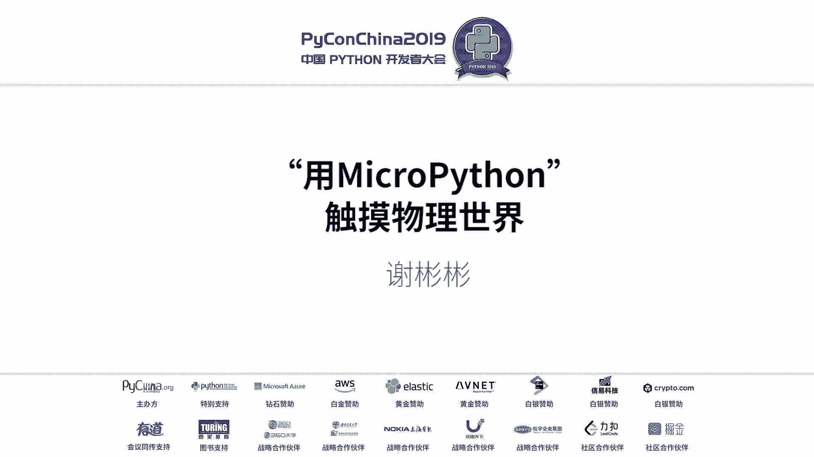
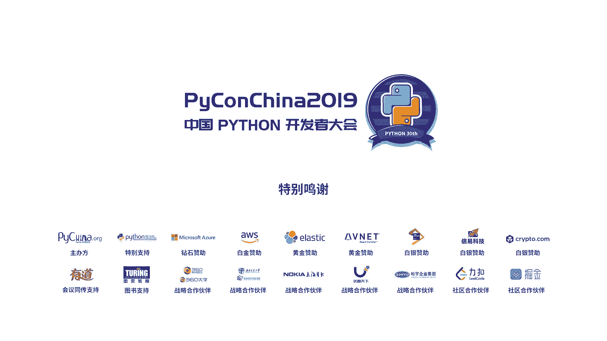

# 007：用MicroPython触摸物理世界 🚀



在本节课中，我们将学习如何使用MicroPython与物理世界进行交互。我们将从认识可编程硬件开始，了解MicroPython的优势，并探索如何利用它控制各种传感器和执行器，最终实现一个简单的心率监测项目。

## 认识可编程硬件

我们日常生活中使用的许多家电，例如空调、洗衣机，内部都包含像8051这样的单片机。这类芯片价格便宜，但对于初学者而言，其开发门槛较高，主要体现在调试手段和库支持方面。

另一种选择是STM32系列芯片的开发板。虽然性能强劲，支持也较为丰富，但作为入门玩具，其调试过程依然可能较为复杂。

在开源硬件领域，Arduino和树莓派对新手非常友好，可以快速搭建硬件平台并控制各种设备。然而，Arduino开发板相对较贵，而树莓派4B（4GB版本）全套价格可能在500元以上，对于个人爱好者而言成本较高。

## 我的选择：ESP32

我的最终选择是ESP32模组。其前代产品ESP8266价格低廉（不到10元），也能运行MicroPython，但性能不如ESP32。

ESP32原生支持Wi-Fi和蓝牙。这意味着在开发硬件时，可以直接通过HTTP API与设备交互，或者在没有互联网时通过蓝牙与手机交互。**不到10杯奶茶的价格，你就可以拥有一个自己的电子玩具。**

更重要的是，它支持丰富的生态，尤其是MicroPython固件。我选择MicroPython是为了统一开发语言，方便在不同项目中应用。

## 什么是MicroPython？

MicroPython是基于Python 3语法优化的一个子集，能够运行在32位微处理器上。它可以运行一些简单的嵌入式操作系统。

## 支持的开发板

以下是几种支持MicroPython的常见开发板：

*   **Pyboard**：基于STM32F4芯片，社区支持良好。使用简单，只需将Python脚本按规则放入SD卡即可开机执行。
*   **WiPy**：使用乐鑫ESP32芯片，具备Wi-Fi和蓝牙能力。其开发工具对初学者可能稍显复杂。
*   **ESP32**：与WiPy使用相同的芯片模组。支持I2C、串口、GPIO等标准接口，同样具备Wi-Fi和蓝牙功能，便于与外界交互。

## 外围硬件与交互

仅有开发板无法直接感知物理世界。我们需要外围硬件的支持。以下是一些常用的模块：

*   **传感器**：如DHT系列温湿度传感器（通过I2C接口通信）、陀螺仪、心率传感器（如MAX30102）。
*   **显示设备**：如OLED屏幕，用于实时显示数据。
*   **执行器**：如继电器，可用于控制家中的各种开关设备。

这些模块通常通过**I2C总线**或**GPIO口**与ESP32等开发板通信。只要硬件支持相应协议，MicroPython就可以控制它们。

## 实践案例：心率监测

上一节我们介绍了基础硬件，本节我们来看看一个具体的实践项目：制作一个心率监测器。

该项目需要以下设备：
1.  ESP32开发板
2.  MAX30102心率血氧传感器模块
3.  OLED显示屏

**工作原理**：MAX30102通过光电传感器读取血液的血氧浓度和心率数据，并通过I2C总线将数据发送给ESP32。ESP32处理数据后，再通过I2C总线将实时心率显示在OLED屏幕上。

**核心通信代码结构示意**：
```python
import machine
import max30102
import ssd1306

# 初始化I2C总线
i2c = machine.I2C(scl=machine.Pin(22), sda=machine.Pin(21))

# 初始化传感器和显示屏
sensor = max30102.MAX30102(i2c)
display = ssd1306.SSD1306_I2C(128, 64, i2c)

while True:
    heart_rate = sensor.get_heart_rate() # 获取心率数据
    display.fill(0)
    display.text('HR: ' + str(heart_rate), 0, 0)
    display.show()
```

## 另一个想法：智能门禁

这个想法来源于一位同事的需求。他住在老小区，希望做一个能联网控制楼下门禁的装置。

所需硬件非常简单：
1.  ESP32开发板
2.  继电器模块

**实现思路**：将继电器连接到门禁系统的开门按钮线上。通过MicroPython编写一个简单的Web服务器运行在ESP32上。当用户通过手机访问该Web服务器时，ESP32控制继电器短接模拟按钮按下，从而实现远程开门。

**公式化描述**：`手机APP/网页 -> HTTP请求 -> ESP32 Web服务器 -> GPIO输出高电平 -> 继电器闭合 -> 门禁电路导通`

## 总结与展望

本节课中，我们一起学习了如何利用MicroPython和ESP32等硬件触摸物理世界。我们从硬件选型讲起，了解了MicroPython的特性，认识了常用的传感器和执行器，并探讨了心率监测和智能门禁两个实践案例。

MicroPython降低了嵌入式开发的门槛，让软件开发者也能轻松入门硬件编程。其低成本和高灵活性，使得它在个人项目、原型开发乃至青少年编程教育领域都有很大的应用潜力。希望本次分享能为你打开一扇新的大门，享受创造与交互的乐趣。

> 提示：所有项目均需注意用电安全，特别是在连接220V市电时。建议从低电压（如5V、12V）的直流设备开始实践。



（注：文中提到的具体价格可能随时间变化，请以实际市场为准。）