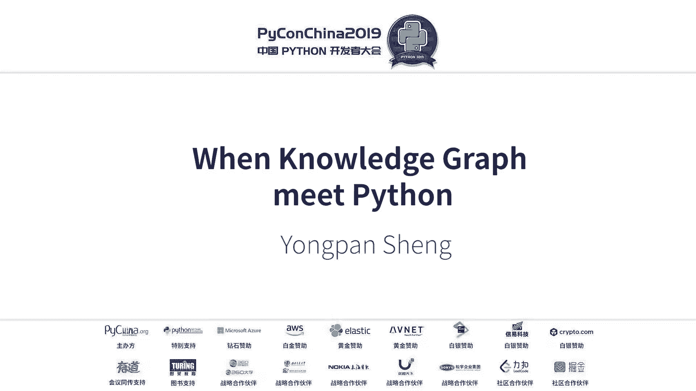
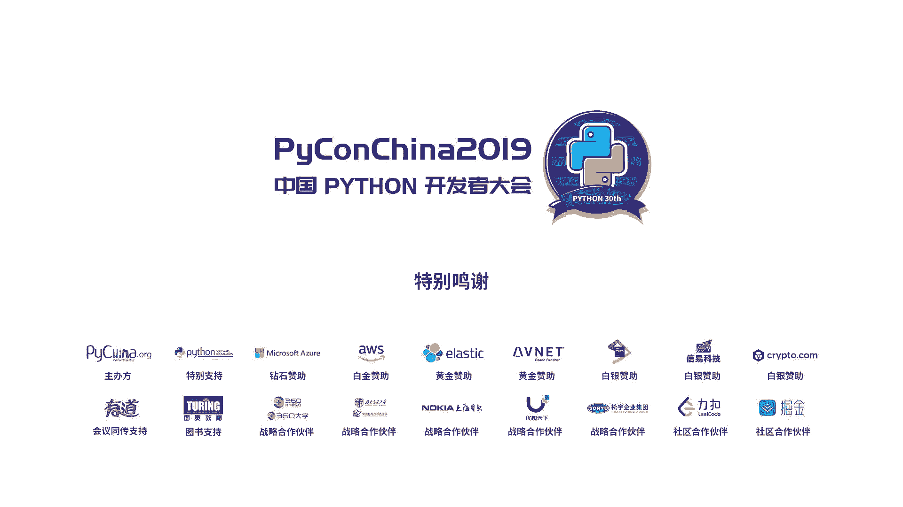

# 009：当知识图谱遇见Python

在本节课中，我们将学习知识图谱的基本概念、构建流程，并了解如何利用Python生态中的工具来构建一个新闻概念知识图谱。我们将从知识图谱出现的背景讲起，逐步深入到具体的构建技术和实践案例。

## 1. 前沿：知识图谱的历史必然性

上一节我们介绍了课程概述，本节中我们来看看知识图谱为何在当今时代应运而生。

我们现在身处一个AI时代。有一种观点认为，一个智能的AI系统等于**知识**加**推理**。

举个例子，如果我们问机器“1MB等于多少KB”，机器能直接给出答案“1024”。机器的潜台词是它已经储备了这个知识。如果我们问机器“Donald Trump的出生地在哪里”，机器可能需要先解析问题，将其转化为结构化的查询（如`(Donald Trump, 出生地, ?)`），然后基于后台的知识库进行检索和推理，最后得到答案“纽约市”。机器的潜台词是它会推理。

从知识工程的角度，我们希望一个智能的系统（Smart Machine）能够**感知数据的分布**，并能从**认知层面理解数据的意义**。这与符号主义的认知是一致的：认知即计算，知识是形式化的，是智能的基础。智能的核心在于知识的表示、推理和运用能力。

然而，传统的知识工程领域严重依赖专家和用户干预来定义规则和逻辑（专家系统），这存在几个问题：
1.  **知识获取困难**：许多领域知识和常识是隐性的、过程性的，难以定义和表示。
2.  **知识应用困难**：在开放场景中，知识的边界难以确定，且需要常识支撑。
3.  **难以处理异常**：定义的规则可能无法覆盖所有特例（例如，“鸟会飞”的规则不适用于鸵鸟和企鹅）。

大数据、强大的机器学习模型和计算能力的兴起，为新时代的知识工程奠定了基础：
*   **大数据**为大规模知识获取提供了支撑。
*   **机器学习算法**使我们能够从数据中自动化地学习高质量知识。
*   **强大算力**使得处理海量数据成为可能。

知识获取的方式从传统的“自上而下”（先有领域模型，再填充实例）转变为“自下而上”（从大数据中学习知识）。**知识图谱**正是在此背景下应运而生，它突破了传统知识库在规模和质量上的瓶颈。

## 2. 知识图谱构建技术栈

上一节我们探讨了知识图谱出现的必然性，本节中我们来看看如何通过自动化、数据驱动的方式来构建知识图谱。

知识图谱本质上是一种**大规模语义网络**。其节点可以是实体、概念、属性甚至事件，边则表示它们之间的关系。

知识图谱的应用场景广泛：
1.  **智能搜索**：从返回网页链接到直接给出精准答案（如“刘德华的妻子是谁”）。
2.  **精准推荐**：在电商等场景中，结合用户行为和领域知识进行个性化推荐。
3.  **智能问答**：支持多轮、多模态的对话系统。

知识图谱的构建主要有两种方式：
*   **手动构建**：如Cyc、WordNet。质量高但规模小，依赖专家。
*   **自动化构建**：如Google Knowledge Vault、Microsoft Concept Graph。规模大，是当前趋势，但可能包含更多噪声。

一个完整的自动化知识图谱构建流程通常包括以下阶段：

### 知识抽取
目标是从各种数据源中提取出结构化知识（通常以`(实体，关系，实体)`三元组形式）。数据源分为：
*   **结构化数据**（如数据库表格）
*   **半结构化数据**（如HTML表格）
*   **非结构化数据**（如纯文本）

工业界常用前两者，学术界则更关注从**非结构化文本**中抽取知识，这更依赖NLP技术。

知识抽取主要分为两个学派：
*   **限定域关系抽取**：关系的类型（Schema）是预先定义好的有限集合。任务通常被建模为一个分类问题，即判断句子中两个实体属于预定义关系中的哪一种。
*   **开放域关系抽取**：关系的类型不是固定的，而是从句子上下文中动态抽取出的词语或短语来描述。例如，从句子“姚明出生于上海”中抽取出关系“出生于”。

以下是主流方法简介：
*   **基于模板的方法**：使用预定义的模式（如`X was acquired by Y`）在文本中匹配。
*   **基于机器学习的方法**：从早期的特征工程、核方法，发展到如今的深度学习方法。
*   **基于弱监督的方法（如远程监督）**：假设如果两个实体在知识库中存在某种关系，那么所有包含这两个实体的句子都可能表达了这种关系。
*   **开放信息抽取**：如华盛顿大学开发的OpenIE系统，专门从文本中抽取开放域的三元组。

### 知识融合
将从不同来源抽取的知识进行整合，消除冲突和冗余。分为：
*   **垂直融合**：高层本体（模式层）与底层实例数据的融合。
*   **水平融合**：不同知识库之间对齐等价格实体（如百度百科的“刘德华”和维基百科的“刘德华”指向同一实体），合并关系等。

关键技术包括实体对齐、关系合并、冲突检测等。

### 知识加工
对融合后的知识进行进一步处理，包括：
*   **知识推理**：发现隐含的知识。
    *   符号推理：基于逻辑规则演算。
    *   数值推理：基于表示学习（如TransE、张量分解）。
    *   融合推理：结合符号与数值方法。
*   **质量评估**：对知识的可信度进行量化，过滤低质量知识，保证知识库整体质量。

### 知识更新
知识图谱需要与时俱进，反映世界的变化。更新方式包括：
*   **数据层更新** vs **模式层更新**
*   **全局更新** vs **增量更新**

## 3. Python生态中的图谱工具

上一节我们梳理了知识图谱构建的整体框架，本节中我们来看看Python生态中有哪些工具可以助力这一过程。

### 自然语言处理：Stanford CoreNLP
这是一个功能强大的NLP工具包，提供Python接口。它能完成：
*   **命名实体识别**：识别文本中的人名、地名、机构名等。
*   **共指消解**：确定代词（如“他”、“它”）或别名所指代的真实实体。
*   **依存句法分析**：分析句子中词语间的语法依赖关系。

这些功能是进行知识抽取（尤其是从文本中）的基础。

### 开放信息抽取：OpenIE
华盛顿大学开发的开放信息抽取系统，可以从句子中直接抽取`(主语，关系，宾语)`三元组。虽然核心是Java编写，但可以通过Python组件（如`openie`）调用其接口。

示例：对于句子“The US President gave a speech in the White House”，OpenIE可能抽取出`(The US President, gave, a speech)`和`(a speech, in, the White House)`，并为每个三元组提供置信度分数。

### 图数据管理与分析
*   **NetworkX**：一个用于创建、操作和研究复杂网络结构的Python库。可以用于计算最短路径、分析网络特性等。
*   **Gephi**：一款开源的可视化与探索软件，虽然非纯Python工具，但常与Python结合使用。它支持复杂网络分析，并能将CSV或JSON文件导入生成可视化图谱。

## 4. 实战案例：新闻概念知识图谱构建

上一节我们介绍了Python中的相关工具，本节中我们将通过一个具体案例，把这些工具和流程串联起来，展示如何构建一个新闻概念知识图谱。

**动机**：当人们阅读大量同一主题的文档（如10篇关于美国大选的新闻）时，很难手动记住并组织所有关键实体和关系。我们希望通过自动化方式，从文档集合中抽取出核心概念和关系，并以图谱形式直观展示，帮助用户快速把握主题核心。

**任务分解**：
1.  **候选事实抽取**：从非结构化文本中抽取出大量三元组。
2.  **知识过滤**：筛选出与主题真正相关的、高质量的三元组。
3.  **概念知识图谱构建**：将过滤后的三元组进行融合、链接，形成图谱。

### 步骤一：知识抽取
1.  **文档排序**：从文档集合中筛选出与主题最相关的文档。
2.  **共指消解**：将文档中的代词（如“他”、“该国”）替换为具体的实体名称，提升后续抽取的准确性。
3.  **句子排序**：在文档内挑选出信息量丰富的句子。
4.  **开放信息抽取**：使用OpenIE系统对处理后的句子进行三元组抽取，并得到每个三元组的置信度。

### 步骤二：知识过滤
目标是从海量抽取的三元组中，保留与领域主题紧密相关的部分。我们将此问题形式化为一个**整数规划问题**，通过优化算法进行求解，以最大化保留三元组与主题的相关性。

### 步骤三：图谱构建
1.  **合并等价概念**：基于字符串特征或搜索引擎（如维基百科链接），将指代同一实体的不同表述（如“特朗普”、“Donald Trump”、“川普”）进行合并。
2.  **链接命名实体**：利用已有知识库（如维基百科）的实体链接信息，将实体规范化。
3.  **人工校验与标签**：引入专家知识对部分结果进行校验，并为实体和关系添加类型标签。
4.  **图谱生成与可视化**：将处理后的三元组构建成图结构，并利用可视化工具进行展示。

**结果示例**：输入多篇美国大选新闻，最终生成的知识图谱可能显示：“特朗普”与“希拉里”之间存在“竞争”关系；“希拉里”与“邮件门”事件相关联；“邮件门”事件“影响”“选民支持率”等。通过图谱，用户可以一目了然地把握事件全貌。

**实验验证**：通过句子级别的抽取评估和用户调研，验证了该方法的有效性（如F1值达到0.58），并对生成图谱的概念覆盖率、置信度等质量指标进行了分析。

## 总结

本节课中我们一起学习了知识图谱的核心概念与构建方法。我们从知识图谱出现的AI时代背景讲起，理解了其“知识+推理”的核心思想。随后，我们系统性地介绍了自动化构建知识图谱的全流程技术栈，包括**知识抽取**、**知识融合**、**知识加工**和**知识更新**。接着，我们探索了Python生态中支持图谱构建的关键工具，如**Stanford CoreNLP**、**OpenIE**、**NetworkX**等。最后，通过一个**新闻概念知识图谱构建**的实战案例，我们将理论、工具和流程串联起来，展示了从非结构化文本到直观概念图谱的完整实现路径。希望本教程能帮助你入门知识图谱这一充满魅力的领域。