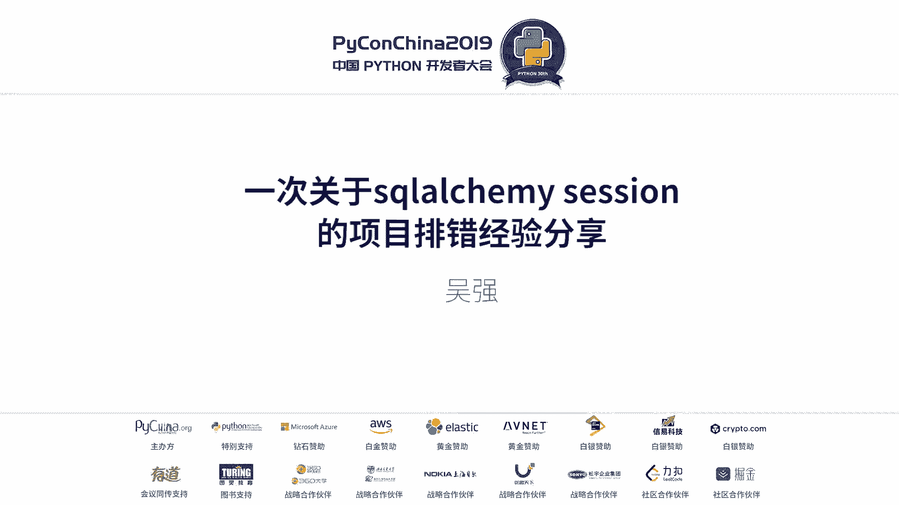
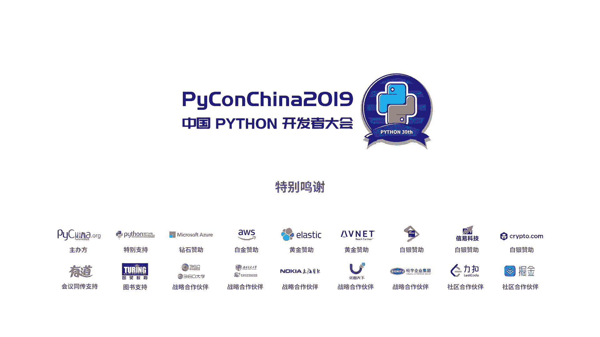

# 011：一次关于 SQLAlchemy Session 的项目排错经验分享 🐛



在本节课中，我们将学习一个在 Flask 项目中使用 SQLAlchemy 时遇到的真实并发问题。我们将通过一个案例，理解 Session 管理不当如何导致数据更新丢失，并学习如何避免此类问题。

## 项目背景与问题描述

我们的项目使用 Flask 框架，并集成了 SQLAlchemy 作为 ORM 工具，数据库选用 MySQL。由于预计用户量较大，我们采用了分库分表的设计。

具体问题是：在后台大批量修改用户数据时，发现部分用户的修改会失败。经过排查，我们定位到两个用于修改用户数据的接口（仅修改字段不同）。当并发请求这两个接口时，总有一个接口会修改失败；但串行请求时则没有问题。

## 问题复现与分析

当同事描述这个 Bug 时，我首先想到，串行修改成功说明接口本身逻辑基本正确，问题可能出在数据库或两个接口的关联环节。

以下是 Bug 的详细描述：
*   数据库中存在一个用户记录，包含 `name` 和 `age` 字段。
*   接口一：将 `name` 从“张三”改为“李四”。
*   接口二：将 `age` 从 18 改为 20。
*   并发调用这两个接口后，发现数据库中只有一个字段被更新，另一个接口的修改似乎失败了。

我最初根据描述模拟了代码，但并未复现问题。这让我感到困惑，于是重新梳理了项目情况：Flask + SQLAlchemy + 分库分表。考虑到分库分表可能导致每次操作都新建 Session，我怀疑问题出在 Session 的管理上。

查看代码后，果然发现了问题所在。由于分库分表，每次进行数据库操作时都需要获取一个新的 Session。在我们的业务代码中，**获取用户对象时创建了一个 Session，保存用户对象时又创建了另一个 Session**。在并发场景下，这两个 Session 的创建和保存操作存在时间差，导致了数据冲突。

## 问题根源与模型推演

为了更清晰地理解，我建立了以下问题模型：

1.  数据库初始状态：`name='张三'`, `age=18`。
2.  进程一（修改名字）和进程二（修改年龄）**各自获取了一个独立的 Session**，并且都从数据库读到了同一份原始数据。
3.  进程二先将 `age` 改为 20 并提交（Session 二保存），此时数据库变为 `name='张三'`, `age=20`。
4.  紧接着，进程一将其 Session 一中持有的旧数据（`age` 仍为 18）的 `name` 改为“李四”并提交。这会导致数据库状态被覆盖为 `name='李四'`, `age=18`。

**结果**：进程二对 `age` 的修改被进程一无意中“回滚”了，造成了数据更新丢失。

## 解决方案与验证

问题的核心在于 **Session 的不当复用和隔离**。在业务代码中，两次操作使用了不同的 Session，导致它们持有数据的不同副本，无法感知彼此的更改。

以下是模拟问题复现的关键代码片段（方框内为第二次获取 Session 的调用）：
```python
# 伪代码示意：错误的方式（每个操作独立获取Session）
def update_name(user_id):
    session1 = get_new_session()  # 第一次获取Session
    user = session1.query(User).get(user_id)
    user.name = "李四"
    session2 = get_new_session()  # 第二次获取Session（错误！）
    session2.merge(user)  # 或 session2.add(user)
    session2.commit()

def update_age(user_id):
    session1 = get_new_session()
    user = session1.query(User).get(user_id)
    user.age = 20
    session2 = get_new_session()  # 同样的问题
    session2.merge(user)
    session2.commit()
```
当并发执行上述函数时，就会触发所述的数据覆盖问题。

修复方案是**确保在同一业务操作单元内使用同一个 Session**。我们修改了代码，使获取对象和保存对象在同一个 Session 上下文中完成。修改后，并发测试显示两个字段都能被正确更新，问题得以解决。

## 经验总结与启示

本节课中，我们一起学习了一个由 SQLAlchemy Session 隔离引发的并发数据更新丢失案例。通过这次排错，我们得到了以下几点重要启示：

1.  **敬畏数据**：生产环境的数据至关重要，修复此类问题耗时耗力，应尽力在测试阶段杜绝。
2.  **敬畏测试**：我们虽然有单元测试，但并未覆盖接口并发场景。这次问题是在后台大规模操作时才暴露的，提醒我们需要加强并发和集成测试。
3.  **敬畏代码**：尤其是框架和基础组件的使用方式。对于 SQLAlchemy，**必须清晰地理解 Session 的生命周期、隔离级别以及“同一性（Identity Map）”模式**。在涉及数据修改的场景中，确保操作在正确的 Session 上下文中进行至关重要。



希望这个实际案例能帮助你理解 SQLAlchemy Session 的核心概念，并在未来开发中避免类似的陷阱。