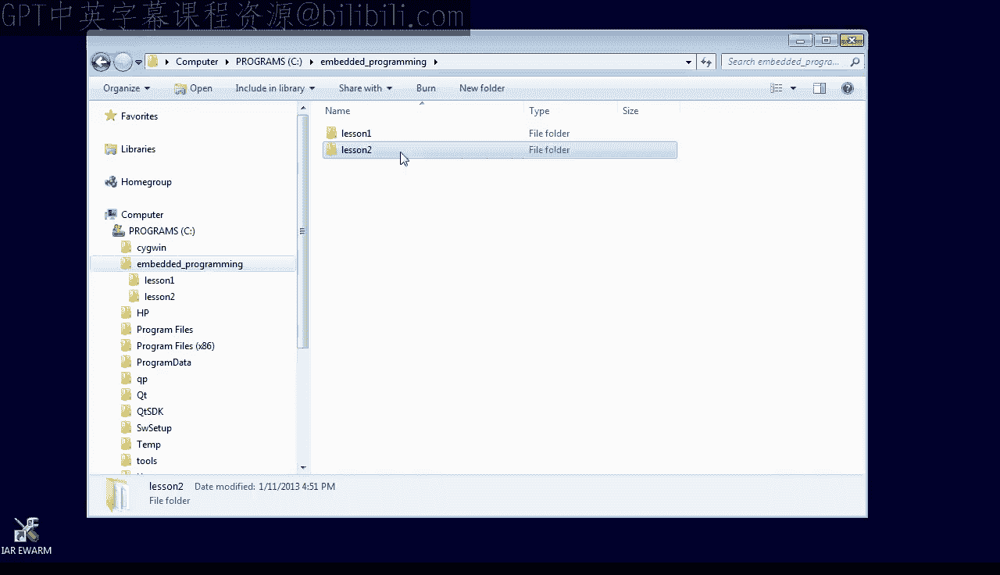
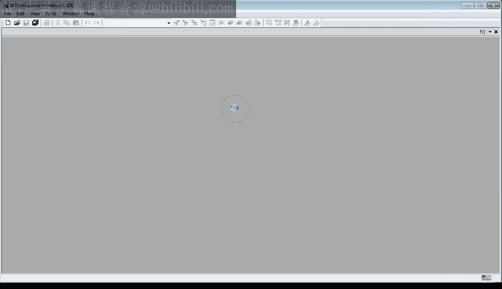
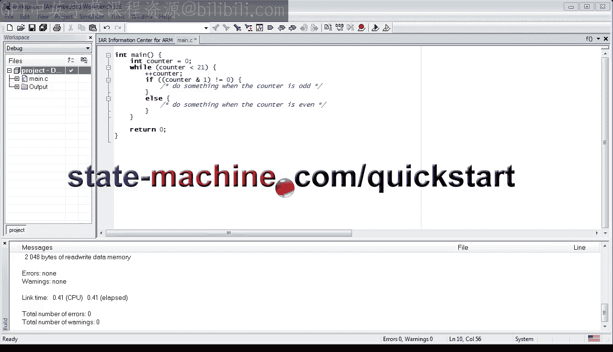

# Quantum Leaps《现代嵌入式系统编程Modern Embedded Systems Programming》中英字幕 p03 -03-#2 How to change the flow of control through your code.zh_en -BV1fRt2efEms_p3-

🎼Welcome to the embedded systems programming course。 My name is Miro Samak， and in this lesson。

 I am going to show you how to change the flow of control through your code。

Let's start with making a copy of the previous lesson1 project and renaming it to lesson 2。

 If you don't have the lesson1 project， you can get it online from statemachine。 com slash Quickstar。

Making frequent backup copies of a working project is something I highly recommend。

 The golden rule of software development is to keep the software working at all times by making only small。

 incremental changes to it。So if you get something working， save it。

 You will sure be glad you did when you mess up a step。 Typically。

 it's much easier to back up to the working version than to try to fix broken code。

Get inside the lesson 2 directory and double click on the workspace file to open the IR toolet。

 If you don't have the IR tool set， go back to lesson 0。

So here's the C program we've created in lesson 1。As every C program。

 this one starts execution at the main function。Inside main。

 you have a very simple linear code in which the control flows from top to bottom。

Let's have a quick look in the debugger to see how our will processor handle this simplest flow of control。

Make sure that the debugger。Is set to the simulator。And click on the download and debug button。

 Let me quickly remind you what you see in the debug mode。

That this assembly window shows the machine instructions。

The register view shows the state of the arm cortex and registers。

The most interesting for you today is the program counter PC register。

 which contains the address of the current instruction。

 which is the one highlighted into the disassembly view。Single step to the code。

 one machine instruction at a time and watch how the PC changes at each step。

Please note that you are only executing instructions to increment the R1 register。

 but there are no any specific instructions for incrementing the PC。Rather。

 every instruction increments the PC as a side effect。So here you have it。

 the simplest linear control flow through the code from top to bottom is hardwired in the instructions themselves。

In this lesson， you will learn how to change this hardwired flow of control so that the program can loop or conditionally skip over parts of the code。

Such changes in the flow of control will allow you to avoid repetitions and make decisions at run time。

So now let's exit the bugger and modify the code to use a loop。

 The simplest loop in C is the while loop。 You count it by adding the while keyword。

Followed by a condition in parentheses。Followed by the body of the loop。

This code starts with checking the condition， and if it is true。

 it executes the body of the loop and goes back to checking the condition。

The loop exits only when the condition is false。In this particular case。

 we happened to have 21 increments of the counter variable。

 so to execute the same number of increments， the condition is counter less than 21。Let's compile。

And ran this code in the simulator。The first instruction moves 0 to the R 0 register。

 which is now used to hold the counter variable。The next B instruction is the very interesting branch instruction because it modifies the PC。

 so it skips over a few instructions。The next CP instruction compares the R0 to the number 21 that you can actually see encoded as hex15 in the instruction itself。

 The CP instruction has a very interesting side effect of modifying the APSR register。

 which stands for application program status register。

 specifically the CP instruction sets the end bit negative in the APSR because the comparison is performed as a difference R0 minus-21。

 which turns out negative。The B， L T instruction is a variant of the branch instruction you already saw。

 but this one is conditional，Specifically， the B L T instruction modifies the PC only when the endbit in the APSR is set。

 Otherwise， the B L T instruction simply falls through to the next instruction。At this point。

 a good question is this。 How does the branch instruction know where to jump。Well。

 it turns out that this information is encoded in the instruction。

Here is a page from the arm architectureect reference manual。

 which explains the encodings of all the B instruction variants。 Our instruction starts with Hex D。

 which means that it uses the encoding T1。 The next nibble in the instruction denotes the condition。

 and the hex B means the L T condition。Finally， the byte F encodes by how much the PC should be changed。

 which is called the offset。Now， the offset is a signedine quantity， and from lesson1。

 you should remember that signed numbers use the tooth complement representation。 Therefore。

 the byte hex Fc represents negative 4。 So now you can calculate the new value of the PC。

 You take the current PC Hex 7 E and subtract 4， which gives 7 a。

This is what we expect the jump to go to。Let's verify this by executing the BL T instruction。 Hey。

 what do you know， You are correct。 The PC jumps backwards， so you have a loop。

 which you can verify by stepping through the code。Please don't worry。

 I won't spend any more time on drilling into instructions。

 but I think that dissecting the BLT instruction has been really educational because it gave you a glimpse into the inner workings of the arm cortex and processor。

So now let's go back to the flow of control。 I hope you have noticed that the disassembled code implements a different flow of control from what I have described for the while loop。

 The original code was supposed to test the condition first and then jump over the loop body。

 If the condition wasn't true。 The compiled code starts with an unconditional branch and reverses the order of the loop body and the testing of the condition。

When you think about it， though， these two flows of control are equivalent。

 except the generated one is faster because it has only one conditional branch at the bottom of the loop。

This example demonstrates two important points。 First。

 a single C statement such as while can generate multiple machine instructions。

 which don't even have to be grouped together。Second。

 the compiler is pretty darn smart and knows the processor better than you。

The nonlinear flow of control has also a significant effect on how fast the processor can execute your code。

And as an embedded systems programmer， you need to be aware of it。First。

 there is the loop overhead because you now execute additional tests and jumps just to handle the loop。

But weight it gets worse。 The jumps at additional execution delays due to the pipeline stalls。

Let me explain。All modern processors， including arm cortex M。

 use an instruction pipeline to increase the throughput。

Pipeline is like an assembly line in which the processor works on multiple instructions at various stages of completion。

This increases the number of instructions that can be processed in a given time。

Each instruction is is split into a sequence of independent steps， such as fetch from memory， decode。

 and execute。Whereas each of these steps takes one clock cycle to complete。

The pipeline works at full capacity when the instructions are executed in order。

But when this ordering is disrupted by a branch instruction。

 the pipeline needs to discard the partly processed instructions and restart at a new instruction。

This means that the pipeline stalls for a few cycles。

Please note that I am not saying that you should avoid loops in your programs。

 The effects Ive just discussed are really important only in time critical code。

 such as interrupt processing and are irrelevant for most of the other cases。However。

 when you really need to speed things up， you now know what to do。

 You can unroll some loops either entirely or by as much as you need。 For example。

 you can modify the while loop as follows。You increase the number of counter increments per single pass through the loop and adjust the loop counter。

Now， when you execute the code， you can see that the testing and branching happens less frequently。

 yet you execute the same number of 21 increments。Finally， for this lesson。

 I'd like to show you how to use the flow of control to make decisions at runtime。Assume。

 for example， that you want to do something special every time the value of the counter variable becomes odd。

Let's revert to the previous version by typing control Z a few times and start coding the if statement。

You start with the if keyword， followed by the condition in parentheses。Followed。

By the code to execute when the condition is true。The condition expression used to test whether the country is odd needs some explanation。

The MPpersent stands for the Biwise end operator， which performs the end operation between every bit of the counter and the second apparent1。

As you can see in the few examples， the second up of one tests the least significant bit of the counter。

 which is 0 when the counter is even and one when the counter is odd。

The exclamation point equals operator， means not equal。

You can also add an optional else branch to the if。

 which is executed only when the condition is false。

I hope that you notice by now that the control flow statements in seek and nest。

 so you can have an if within a while and so on。🎼This concludes this lesson about flow of control In the next lesson you'll learn a bit more about variables and pointers。

🎼If you like this channel， please subscribe to stay tuned you can also visit statemachine。

com/quistart for the class notes and project file downloads。

