# 现代嵌入式系统编程：第3课：变量与指针

在本节课中，我们将学习C语言中的变量和指针。我们将探讨变量在内存中的存储位置，以及如何使用指针来访问和操作这些内存地址。通过实际操作和调试，你将理解指针的基本概念及其在嵌入式编程中的重要性。

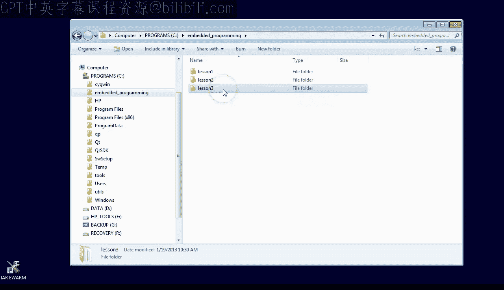

## 准备工作

首先，我们需要复制上一课（第2课）的项目，并将其重命名为“第3课”。如果你没有第2课的项目，可以从 `statemachine.com/Quickstart` 在线获取。

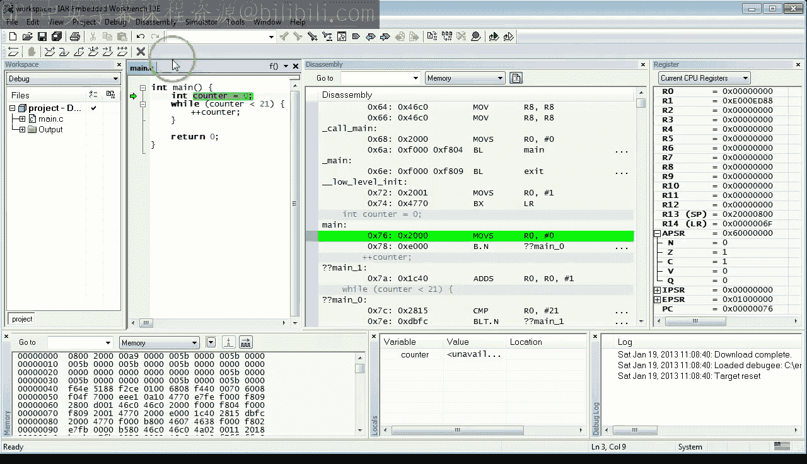

进入新的“第3课”目录，双击工作区文件以打开IAR工具集。如果你没有IAR工具集，请返回第0课进行设置。

这是你在第2课中创建的C程序。我们先清理一下代码，然后在调试器中快速查看 `counter` 变量的存储位置和访问方式。

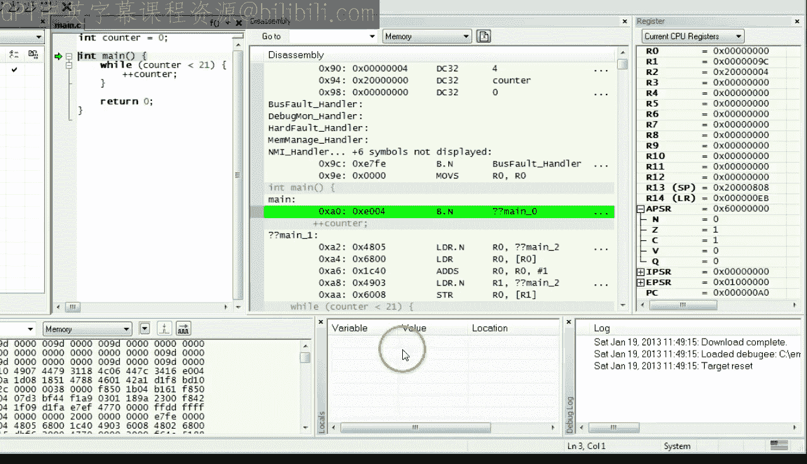

## 局部变量与全局变量

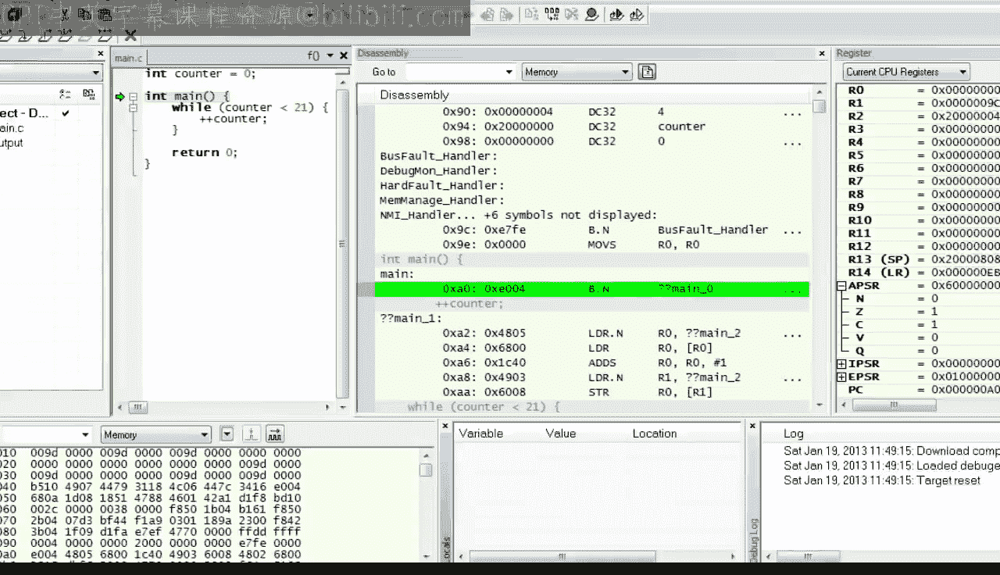

上一节我们介绍了如何查看局部变量。现在，让我们将变量定义移到 `main` 函数之外，重新编译，并回到调试器。

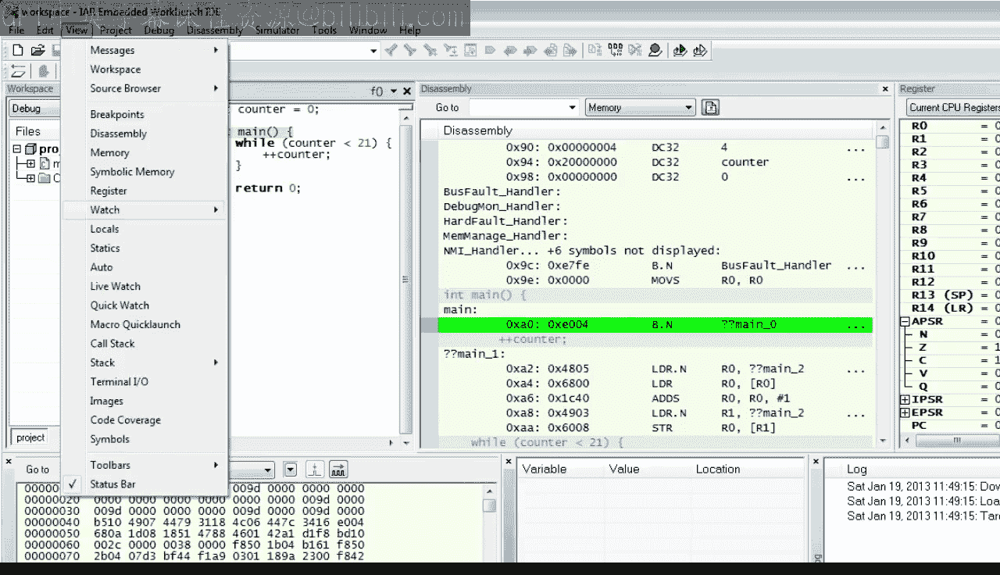

有趣的是，`counter` 变量不再显示在“Locals”窗口中。这是因为它不再是局部变量。要查看现在的 `counter` 变量，我们需要使用不同的视图。

选择“View”菜单，点击“Watch1”视图。当“Watch”窗口打开后，点击第一行并输入变量名 `counter`。

如你所见，`counter` 变量的位置现在是一个以十六进制2开头的大数字。这个地址是此特定ARM Cortex-M微控制器中RAM内存的起始地址。因此，`counter` 变量现在存储在RAM中。

如果确实如此，那么该变量也应该直接在“Memory”窗口中可见。为了验证这一点，将内存视图设置为 `0x20000000`，并将内存设置更改为“4字节单位”，以便方便地查看4字节整数。

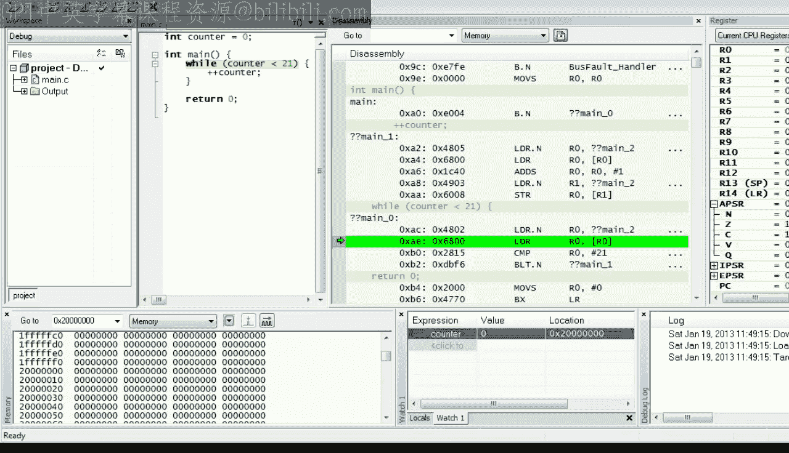

现在，让我们单步执行代码，并观察各个调试器视图。

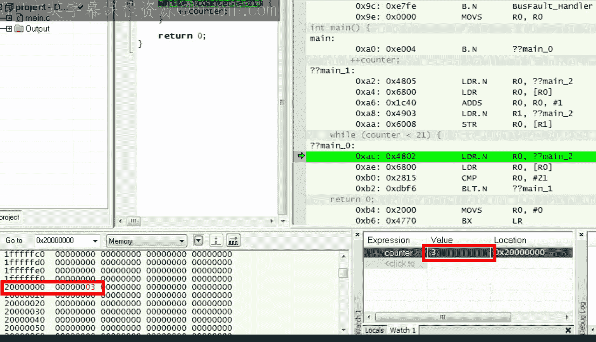

请注意，`STR` 指令导致“Watch1”视图和“Memory”视图中的值从0变为1。现在，值变为2，然后是3，依此类推。

## 理解机器指令

让我们尝试理解编译器生成的用于访问内存中 `counter` 变量的机器指令。

第一个有趣的指令是 `LDR.N`，它代表从内存加载到寄存器。`LDR.N` 指令从标签 `??main?2` 加载内容到 `R0` 寄存器。你可以向下滚动到此标签，查看正在加载的内容。

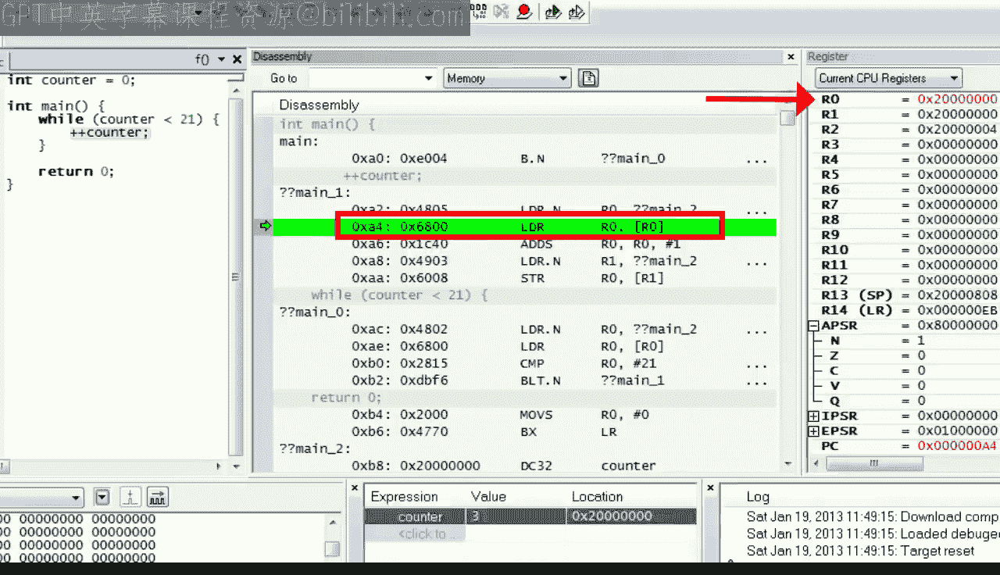

这看起来很熟悉。加载到 `R0` 的值是 `counter` 变量的地址。

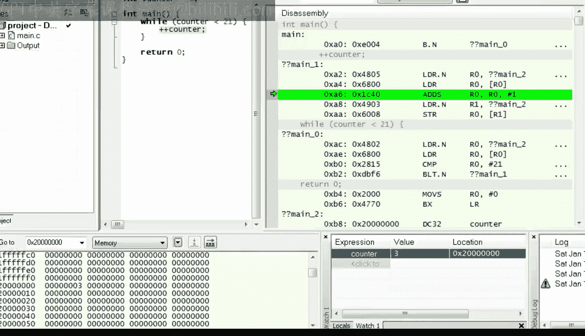

执行 `LDR.N` 指令并观察 `R0`。下一条 `LDR` 指令再次加载 `R0`，但这次的值来自 `R0` 当前持有的地址，也就是 `counter` 变量的地址。

单步执行并验证 `R0` 现在的值为3。

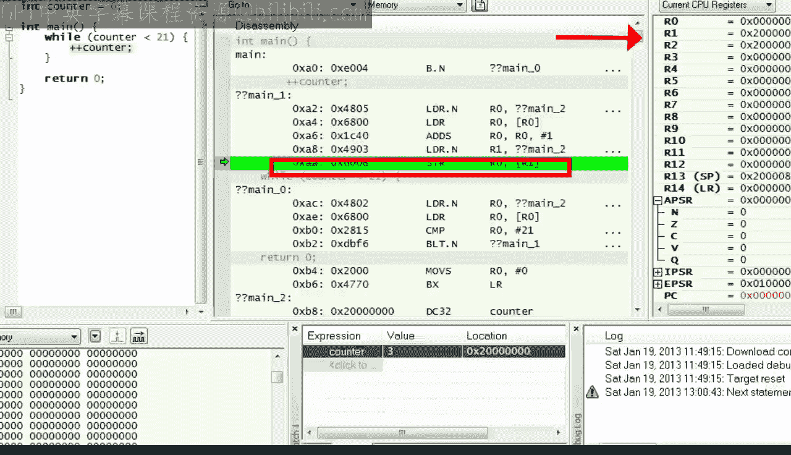

`ADD` 指令执行实际工作，将 `R0` 加1，因此 `R0` 变为4。

下一条 `LDR` 指令将 `counter` 变量的地址加载到 `R1`。

最后，`STR` 指令将 `R0` 寄存器的值存储到由 `R1` 寄存器指向的内存中。

请注意，指令执行后，“Watch1”和“Memory”视图如何变化。

## 内存访问模式与指针

至此，我希望你开始看到ARM处理器中访问内存的一般模式。ARM是所谓的精简指令集计算机架构的一个例子。在这种架构中，内存只能通过特殊的加载指令读取，然后所有数据操作必须在寄存器中进行，最后修改后的寄存器值可以通过特殊的存储指令存回内存。

这与复杂指令集计算机架构形成对比，例如个人计算机中古老的x86架构，其中一些复杂操作的操作数可以仍在内存中，而不需要在寄存器中。

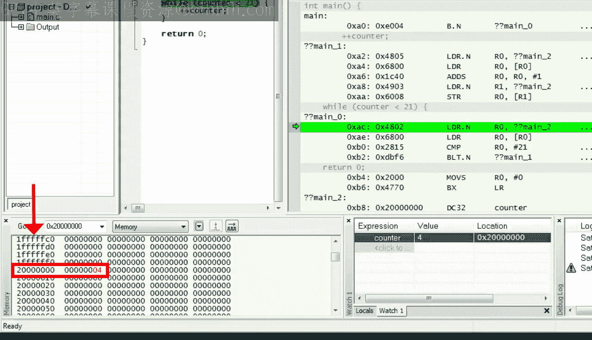

但无论处理器架构如何，我希望你开始认识到内存地址的作用，因为每次访问内存都必须知道要从中加载数据或向其存储数据的地址。

这引出了一个有趣的问题：如果这些内存地址对CPU如此基本，它们是否可以在C语言层面以某种方式表示？答案是肯定的。在C语言中，地址可以存储在称为指针的变量中。

以下是一个C语言中指针变量的例子。像大多数C声明一样，解释它的最好方法是反向阅读。所以 `p_int` 是一个指针，这是类型后面的星号所表示的含义。换句话说，`p_int` 是一个可以保存整数变量地址的变量。

如果是这样，那么 `p_int` 应该能够保存，除其他外，整数 `counter` 变量的地址。确实，这在C语言中可以非常容易地实现。`&` 运算符给出 `counter` 变量的地址，这个地址可以合法地赋值给 `p_int`。

最后，从指针获取给定地址存储的值也非常有用，这称为解引用指针。C语言中用于此操作的运算符是星号 `*`。

`*p_int` 表示当前存储在 `p_int` 指针中的地址处的值，也就是 `counter` 变量的值。由于这种等价性，你可以用 `*p_int` 替换 `counter`，程序应该和以前一样工作。

让我们看看编译器是否接受这个程序。现在，让我们进入调试器并准备视图。这次，我们需要“Watch1”视图来查看 `counter` 变量，以及“Locals”视图来观察 `p_int` 指针。

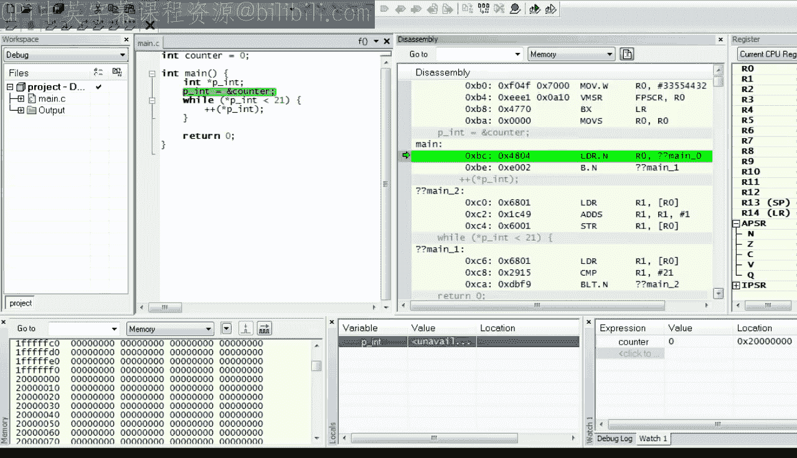

在单步执行代码之前，让我们看一下反汇编视图，并将其与引入 `p_int` 指针之前的代码进行并排比较。

如你所见，将 `counter` 变量地址加载到 `R0` 寄存器的 `LDR` 指令已被移到顶部。并且另一条相同的指令副本已被完全移除。换句话说，引入 `p_int` 指针简化了机器代码并提高了其效率。

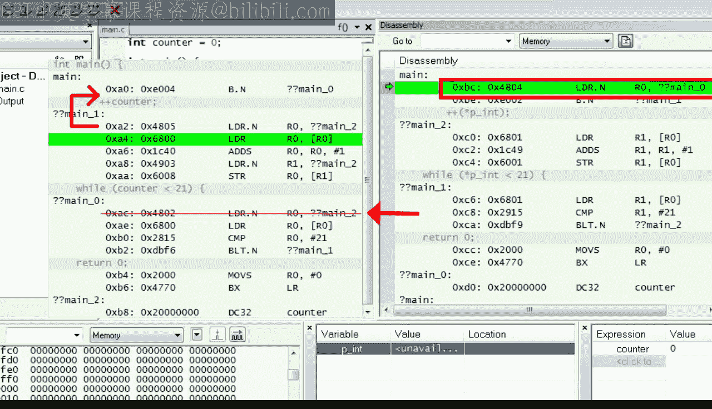

现在，你可以单步执行代码，并观察 `counter` 变量在“Watch1”视图和“Memory”视图中递增，与之前完全相同。这证实了指针确实是 `counter` 变量的别名。

最后，如果你想执行循环到结束，但对单步执行代码感到厌倦，可以在循环后设置一个断点，然后点击“Go”按钮以全速执行程序。在断点处停止后，你可以验证最终的 `counter` 值为21，符合预期。

## 指针的强大与危险

在本课的最后一步，我想演示指针的惊人力量。在这一点上，这将只是一个可怕的技巧，但它将向你展示在嵌入式编程中实际经常使用的一种技术。

如前所述，像 `p_int` 这样的指针变量保存一个整数的地址。但这可以是几乎任何地址，而不仅仅是 `counter` 变量的地址。如果是这样，那么让我们尝试将一个虚构的地址赋值给 `p_int`。

在你的第一次尝试中，你可能会尝试使用一个十六进制数字表示的地址，就像你在调试器中看到的那样。但当你按F7编译时，编译器拒绝了代码。

在你的下一次尝试中，你可能会尝试通过在数字前加上 `0x` 前缀来使用无符号数字。但编译器也不喜欢这样。

在这一点上，你与编译器的协商真的破裂了。但C语言有一种通过使用类型转换来强制类型的机制。你通过在强制转换表达式前放置类型名称（在括号中）来执行这种类型转换。

现在编译器别无选择，只能接受它。现在，让我们解引用指针，并向其中写入一个容易识别的整数值，嵌入式程序员似乎喜欢用 `0xDEADBEEF` 来达到这个目的。

显然，这个技巧需要测试，但为了预先阻止你认为模拟器可以接受任何东西的反对意见，我想在Stellaris LaunchPad开发板上运行这段代码。所以，如果你有这块板子，请将其插入PC的USB接口。

接下来，将调试器设置为TI Stellaris接口。并且，别忘了在“Download”选项卡下勾选“Use flash loader”选项。如果你没有这块板子，只需跳过此步骤，在模拟器中跟随操作即可。

无论哪种方式，点击“Download and Debug”按钮进入调试器。

确保你在指针重新赋值处有一个断点，并使“Watch”视图可见，以便可以看到 `counter` 变量。

按下“Go”按钮运行到断点，然后在反汇编窗口中点击以一次单步执行一条机器指令。

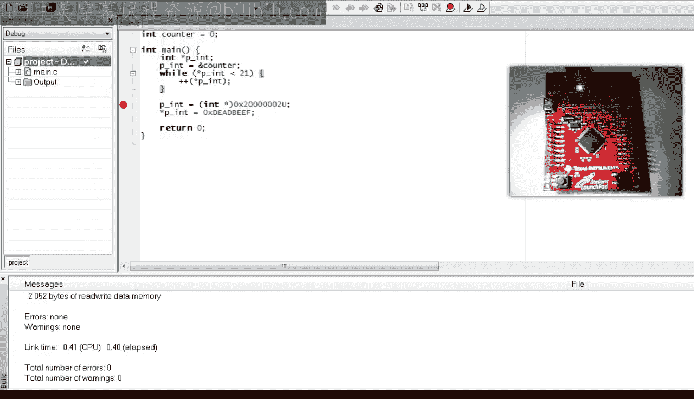

执行 `LDR` 指令，它将虚构的地址加载到 `R0` 寄存器，并验证此地址出现在“Locals”视图的 `p_int` 变量中，以及“Register”视图的 `R0` 中。

执行下一条 `LDR` 指令，它将值 `0xDEADBEEF` 加载到 `R1`。

最后，执行 `STR` 指令，它将 `0xDEADBEEF` 存储到 `p_int` 地址指向的内存中。

由于故意错位的虚构地址，其效果有点可怕。十六进制值 `0xDEADBEEF` 被部分写入 `counter` 变量，部分写入内存中的下一个字。Cortex-M4处理器接受了这个未对齐的地址，但Cortex-M0处理器会有问题。

所以现在你看到了指针作为一种强大的机制，如果使用不当，也可能很危险。

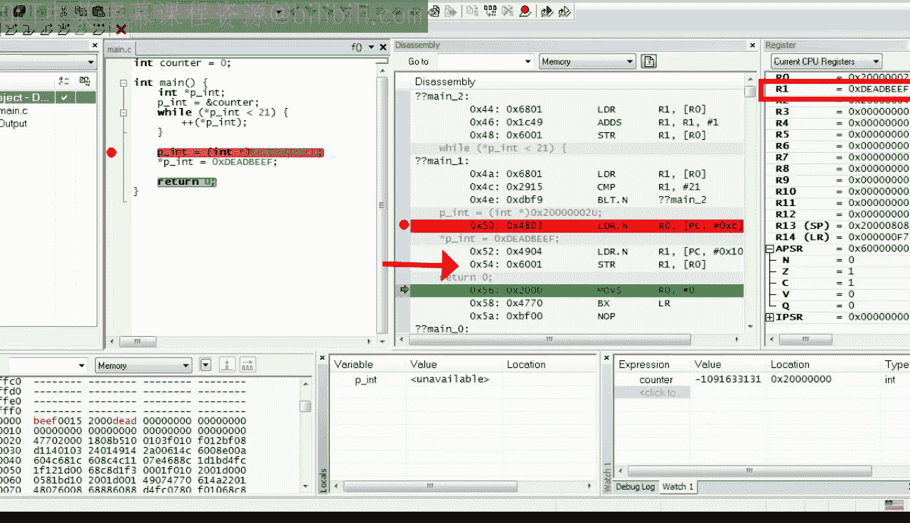

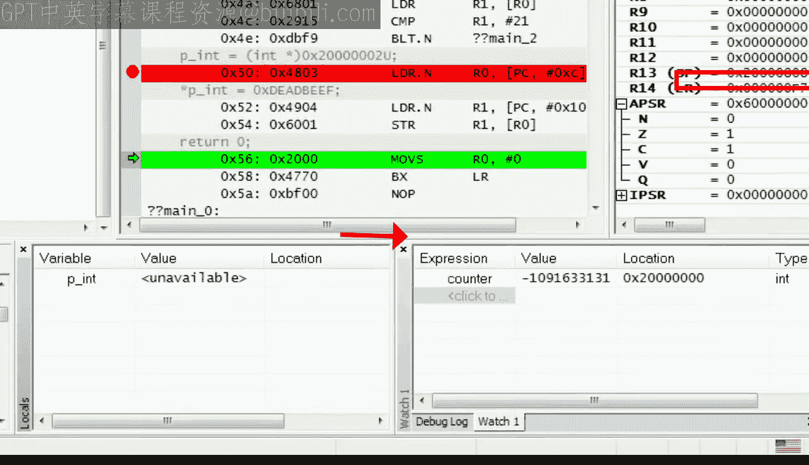

## 总结

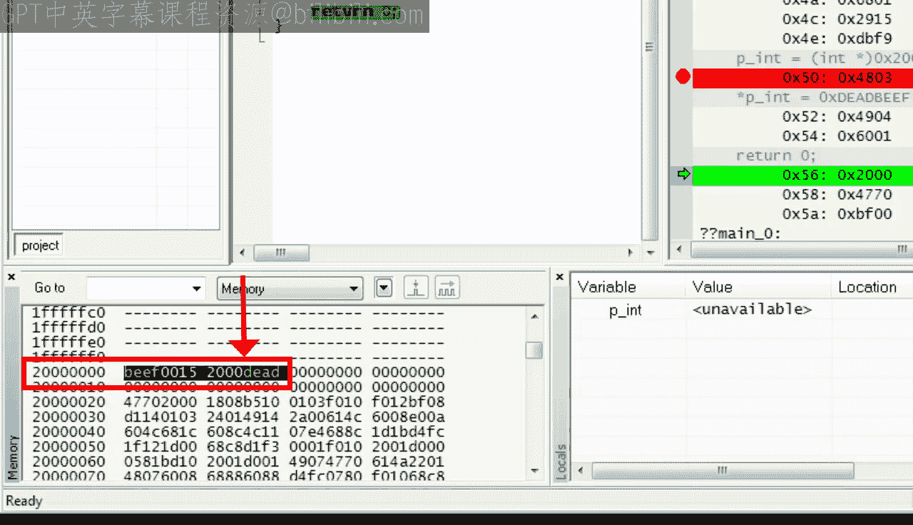

本节课中，我们一起学习了变量在内存中的存储方式，以及指针的基本概念和操作。我们通过调试器观察了局部变量和全局变量的存储差异，理解了ARM架构下内存访问的加载-操作-存储模式。我们学习了如何声明指针、获取变量地址以及解引用指针。最后，我们通过一个示例看到了指针的强大功能和潜在危险，为下一课使用指针控制LED打下了基础。

在下一课中，你将运用这些知识来闪烁Stellaris LaunchPad开发板上的LED。

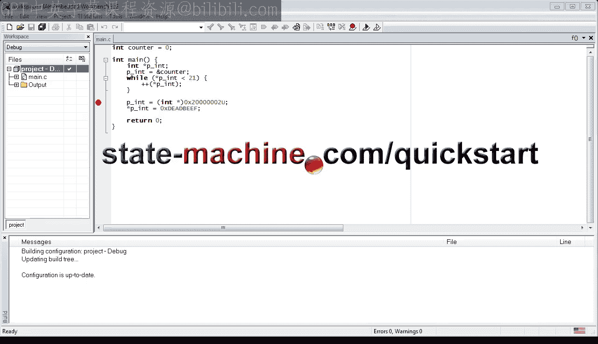

如果你喜欢这个频道，请订阅以保持关注。你也可以访问 `statemachine.com/quickstart` 获取课堂笔记和项目文件下载。