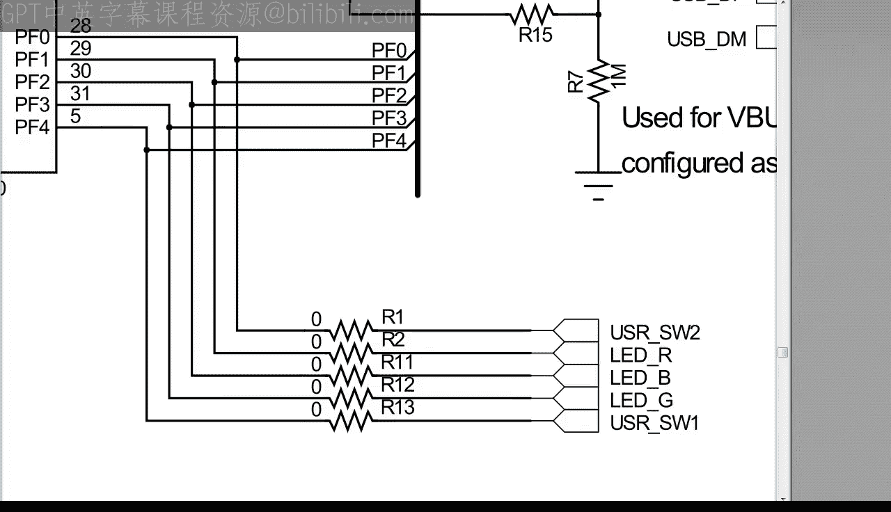
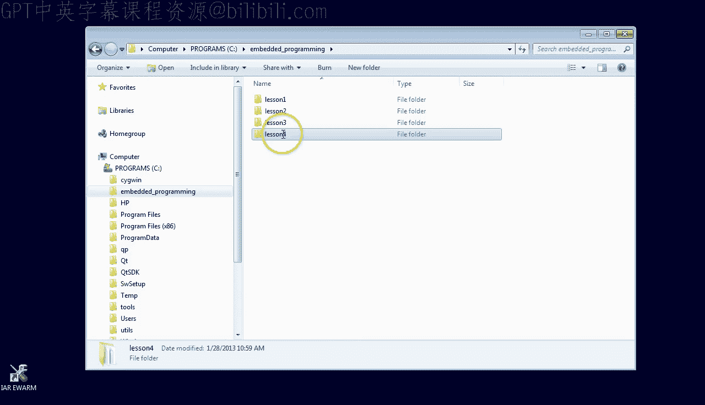
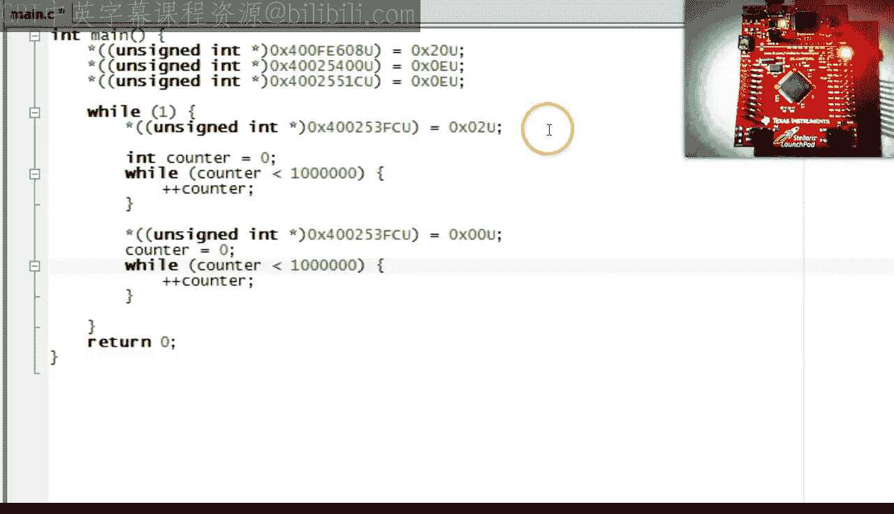

# Quantum Leaps《现代嵌入式系统编程Modern Embedded Systems Programming》中英字幕 p05 -05-#4 How to control the world outside_.zh_en -BV1fRt2efEms_p5-

🎼Welcome to the embeddedded Systems programming course My name is Mirosak and in this lesson I'm going to show you how to blink the LED on the Stlaris Launchpad board。

For this lesson， I highly recommend that you download the user manual of the board from the link I provided in the class notes for this video。

If you don't have the board， you can still follow along in the simulator。

 but your debugger views will be slightly different， and of course， you won't see the LED blink。

 The manual describes how to connect the board to your computer via the provided USB cable。For today。

 you are mostly interested in the very nice red， green。

 blue user LED located at the right edge of the board。

The manual explains how the components on the board are connected to the microcontroller。

 Among others， you can see that the user LED is connected to GIO。

 which means general purpose input output At the end of the manual。

 you can find the schematics of the board。On the first page of the schematics。

 you can see that the R， G and B components of the user LED are powered by transistors。

 which are controlled by outputs LEDR， LEDG and LEDB respectively。You can see these outputs。

 again higher up in the schematics， where they connect to the microcontroller pins labeled P F1。

Pin F 2 and P F 3， the letter F in this case stands for GI O F。

 So now that you have some idea how the LED is connected。

 let's prepare the I project for this lesson。 As usual。

 let's start with making a copy of the previous lesson 3 project and renaming it to lesson 4。

 If you don't have the lesson 3 project。 you can get it online from state machine dot com slash quickstart。

 Get inside the new lesson 4 directory and double click on the workspace file to open the IA toolet。

 If you don't have the I toolset， go back to lesson 0。

If you have the launchpad board， you should connect it to your PC now and make sure that the debugger is configured for the T ice Stlaris interface and that the download tab has the use flash loader option checked。

If you don't have the board， configure the debugger for simulator and follow along。Also。

 if you are using the board， please click on the T I Stlarries menu and check the reset will do system reset option so that the board will always start from clean reset。

 Finally， please rebuild the project entirely to prevent the IAR from pulling in the main dot C file from the previous lesson than three project。

 Now， let's go to the debugger and review quickly how they process or uses various addresses。First。

 at the low addresses， starting with 0， you can see the machine instructions。

 This is the compiled code of your program， which is stored permanently inside the microcontroller。

 This means that the low addresses starting from 0 are mapped to the flash memory。

You also already know that the addresses starting from Hex2 are used for variables such as the counter variable。

That means that the address hex 2， followed by all zeros。

 marks the start of the random access memory Ram。 Indeed。

 you can see a hole in the address right before the beginning of Ramm。

 which simply means that the debugger could not read anything from these addresses。

 most likely because they are unused when you probe further at the address Hex 2，0，0，0，8，0，0，0。

 You can see that the Ram ends。😊，So it is an island extending for Hex 8，0，0，0 addresses。

 which is 32 kiloB in decimal。 This means that the microcontroller has 32 kiloB of Ram。

 This is as much as you know about the addresses at this point， However， in order to blink the LED。

 which is your goal in this lesson。 You need to learn more。 Ideally。

 you need to know the map of all the various continents and islands such as the Ram island in the address space。

The document that describes the memory map of your microcontroller and much more in excruciating detail is called the data sheet。

 I highly recommend that you download the data sheet for the specific L M4 F microcontroller on your launchpa board from the link I provide in the class notess。

 But I need to warn you right away the data sheets tend to be huge。

 This particular one is over 1200 pages long， which is still relatively short as the data sheets go。

Luckily， these documents are not intended to be red cover to cover。 In fact。

 a large part of being an embedded systems engineer consists of knowing how to find your way around the data sheet so that you can find the information you need quickly。

 I hope that you pick up these skills gradually as you participate in this course。😊，So， for example。

 to find the memory map of your microcontroller， simply search the data sheet for the string memory map。

So here it is the memory map of a typical modern arm cortex and microcontroller。

 This is a very nice and simple， Line address space without any segments or memory banks。

 If you work with other microcontrollers， especially the older 8 bits。

 I hope you appreciate the simplicity of a linear 32 B address space。

 I hope you recognize the first island on this map， called on chip flash from address 0 to 3 F F F F。

 which corresponds to 2，56 kB of flash memory， you should also recognize the familiar Ramm Island starting at  two hes followed by all zeros。

 which is named here， bit banded on chip Sram， whereas Sram stands for static Ramm。😊。

In the peripherals continent， you should note the G PI O ports。

 These islands are interesting because you are looking for G PI O port F to control your LED。

 Keep looking further down the memory map。Hey， here is GIO port F that you have been looking for。

Copy the starting address to the clipboard and go back to the IARDbuggger。

Paste the starting address of GI O F to the memory view and watch what comes up。Whoops。

 this address range of G O F advertised in the data sheet appears empty。 If this happens to you。

 don't despair。 The typical reason is that the hardware block is switched off by default to save power。

 The technique of blocking the clock signal to certain parts of the chip called clock gating is a very common practice in modern microcontrollers。

So first， you need to discover how to turn the GIOF block on。

 which means you need to go back to the data sheet。

Go back to the beginning of the document and search for the string clock gating。Oh。

 here is something interesting。 Let's go to that page。

Let's search for the string GIO in this section。Oh， here it is。

 the GIO clock Gating control register。Let's take a closer look at the register description。

 because this is a very typical format commonly used in data sheets。

 The register is shown as a block of bits， always numbered from 0。 The type of each bit is indicated。

 whereas R O means read only R W means read right and W O would mean write only。

The logically related groups of bits are documented below the registered block picture。

 starting from the most significant bit for you， the most interesting is the description of bit 5。

 because this bit enables the clock to G O port F。This confirms that this register is exactly what you have been looking for。

Copy the base address of the register to the clipboard and notice that the additional offset Hex 608 needs to be added to the base to get the complete register address。

Go back to the debuggger and open the additional memory view called symbolic memory to set bit 5 in the clock gating register while simultaneously watching the GIO F start address in the original memory view。

Paste the clock gating register base address from the data sheet to the symbolic memory view。

 And don't forget to add the 608 offset to it。Now， go to the highlighted clock gating register and edit its value to set bit 5。

 which， as you remember from lesson1 about counting is 20 hexadeciimmal。Hit enter。Hey。

 the GIOF hardware block wakes up。You are getting really close to being able to blank the LED。

 but you are not quite there yet。 As you should read in the GIO section of the data sheet。

 you still need to configure the GI O F bits 1 to and 3， which drive red。

 blue and red colors respectively as digital outputs to set the pins direction as output。

 scroll down within the G O F address block to the address Hex 4，0，0，2，5，4，0，0。

 and set the bits 1 to and3 to1， which corresponds to 1，1，1，0 in binary and E in hex。Additionally。

 to set the function of the pins as digital output。

 scroll further down within the GIO F address block to the address 4，0，0，2，5，5，1 c。 and again。

 set the bits 1，2 and 3 to1。So finally， you can try to control the LED。

 You do this through the GIOF data register located at Hx 40，0，253 F。

Scroll up to this register and first just set the bit 1 by writing hex2 to the lowest nibble。 again。

 remembering that the bits are always counted from 0。Hey， it worked。 The red LED lights up。

 You should give yourself a big pat on the back。Try to turn the LED off by writing 0。Cool。

How about setting bit 2 by writing Hex 4。Wow， the LED turned blue。 You are rocking。

How about setting bit 3 by writing Hex 8。You got it， too。

The heavy lifting is really over because coat this own up in sea will be a piece of cake。

 All there is to controlling the LED boils down to writing numbers to specific memory addresses。

 And this you already know how to do with pointers。 specifically。

 you are going to use the pointer hack that I showed you at the end of lesson 3。

 because this technique allows you to write any number to any memory address you choose。😊。

Clean the code up to leave only the pointer stuff。Actually。

 you won't even need a separate pointer variable because you can de referenceence the pointer cast。

 as you will see in a minute。In lesson 3， you used pointers to int， but arm registers are unsigned。

 so change the pointer type to unsigned int。 replace the fabricated address from lesson 3 with the address of the clock gating system register that you use to turn the G O F block on。

And close the whole pointer cast in parentheses and notice that this whole thing is a pointer to unsign end。

If so， then you should be able to de referenceence this pointer by means of the star operator。

 just as you see in the line below。Now， you can write to the pointer。

 as you recall from the experiment in the debugger， you need to set bit 5。

 That is hex 20 into this register。 The value should be unsigned。

 which you indicate by the use suffix。Get rid of the no longer used P and pointer and check if the compiler likes your code by pressing F 7。

All right， so now you can press on with the next register。

 which is the GPIOF pin direction register where you need to set bits 1 to and 3 by writing hex E。

Finally， the GPIOE configuration requires also setting bits 1 to and 3 in the digital function register。

With this done， you can turn the red color LED on and off by setting and clearing bit1 in the GIOF data register。

Actually， if you want to really blink the LED， you can't turn it on and off just once。

 but you need to keep doing this forever。To achieve this。

 you can wrap a wide loop around the code for turning the LED on and off。

 The constant one in place of the condition means that the condition is always true。

 So the loop runs forever。When you compile this code。

 you get a warning that the return statement downstream from the endless while is unreachable。

 which is true。Let's test this code on the launchpad board。

Note that setting the clock gating register wakes up the GIOF block as expected。

Here you can see that the red LED lights up， and now it goes dark again。

The endless loop also seems to be working。Well， if everything looks so good。

 let's run the code at full speed by pressing the go button。

What the heck the LED stays on all the time。Let's break into the code by pressing the break button and single step again。

This time， everything is fine。 Yet when you run at full speed， the blinking stops。

Do you know what's the problem here。Yes， you are right。

 The program just runs too fast for a human eye to notice the rapid blinking of the LED。

 We need to slow the program down。For this， you can use the counting while loop that you learned in lesson 2。

 A loop like this wastes a lot of CPU cycles， but the delay can be controlled by setting the upper limit in the condition of the while。

Note that you need a delay both after turning the LED on and after turning it off again。All right。

 So let's give it a try。Let's delete the breakpoint and run the program。Well， still seems too fast。

Okay。Go back。And increase the limit by another three orders of magnitude。

Right again。And。Hey， it appears to be just right。The LED keeps blinking。

🎼This concludes this lesson about linking an LED， even though it might not seem like much。

 this is a very significant milestone in your embedded career， so congratulations。

🎼In the next lesson， you will learn how to improve the Blinky program by using the preprocessor and the volatile keyword。

If you like this channel， please subscribe to stay tuned。You can also visit statemachine。

com/quistart for the class notess and the project file downloads。

