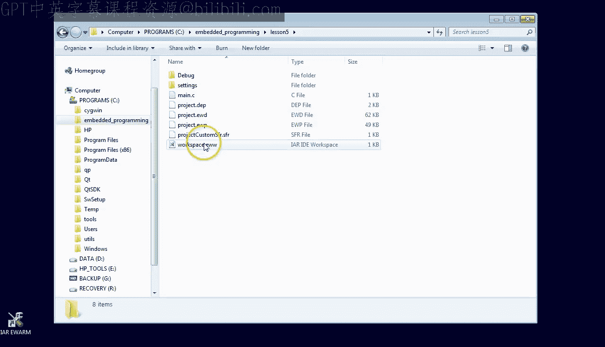
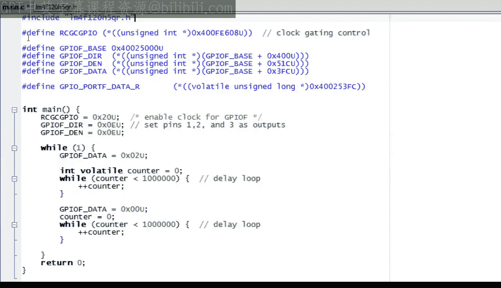
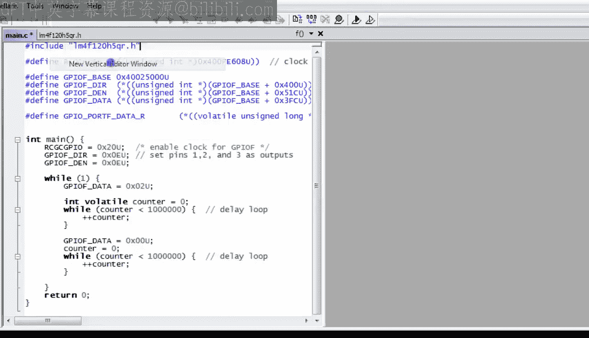

# 现代嵌入式系统编程：第5课：C语言预处理器与volatile关键字

在本节课中，我们将学习如何利用C语言的预处理器和`volatile`关键字来改进Blinky程序，使代码更易读、更健壮。

## 概述

上一节我们通过直接操作寄存器实现了LED闪烁。本节中，我们将通过引入宏定义来替换晦涩的数字，并使用`volatile`关键字来确保代码在不同编译器优化级别下都能正确运行。

## 创建新项目

首先，复制上一课（第4课）的项目，并将其重命名为“lesson5”。如果你是中途加入本课程的，可以从statemachine.com/quickstart下载之前的项目文件。

进入新的lesson5目录，双击工作区文件以打开IAR工具集。如果你还没有安装IAR工具集，请回顾第0课的内容。

## 使用预处理器定义宏

这是你在第4课创建的程序。它能够成功让Stellaris LaunchPad开发板上的红色LED闪烁，但代码可读性很差，充满了难以理解的数字，并且没有注释说明。

为了提高代码的可读性，最好使用寄存器名称来代替这些神秘的数字。

实现这一目标的一种方法是使用C预处理器，它允许你将任何一段代码定义为一个宏。

例如，让我们为你要写入的第一个寄存器定义一个宏。新行以井号`#`开始，后跟`define`关键字和宏的名称。数据手册称该寄存器为“运行模式时钟门控控制寄存器（GPIO）”，因此我们将宏命名为`RCGC_GPIO`。

在宏名称之后，你只需粘贴该宏将要替换的原始代码片段。一旦定义了宏，你就可以用它来代替原始的代码片段。

按F7检查编译器是否接受目前的代码。

C预处理器之所以这样命名，是因为在概念上，它是真正编译之前一个独立的、简单的文本替换步骤。预处理器会移除所有以井号`#`开头的行，因此编译器根本看不到它们。

例如，你可以将宏定义为任何内容。但只要它没有在代码中使用，就无关紧要，代码仍然可以编译。此外，预处理器只替换代码中实际使用的宏。因此，编译器看到的只是替换后的字符序列，而永远不会看到宏名本身。

这意味着宏不需要是C语言的任何完整元素。例如，宏`FOO`可能只是指针转换表达式的一部分。但只要在特定上下文中替换宏的文本有意义，编译器就会欣然接受，因为编译器确实无法区分。

这一切的推论是，你需要小心定义宏，以免它们的含义因替换的上下文而发生意外改变。例如，为了避免意外，最好将像`*RCGC_GPIO`这样的宏用括号括起来，这样在任何可能使用的上下文中，它都意味着指针解引用。

也可以使用其他宏来定义宏。例如，如果你按照数据手册的规定定义宏`GPIO_F_BASE`，就可以在其他宏的定义中使用它。

例如，用偏移量`0x400`定义端口方向寄存器`GPIOF_DIR`的宏。用偏移量`0x51C`定义数字使能寄存器`GPIOF_DEN`的宏。用偏移量`0x3FC`定义数据寄存器`GPIOF_DATA`的宏。

## 添加代码注释

最后，强烈建议为代码添加注释。注释仅对阅读代码的人有益，编译器会完全忽略它们。C99标准支持两种类型的注释：传统的C注释，由`/*`开始，`*/`结束；以及C++风格的注释，由`//`开始，到行尾结束。

注释可以放在任何可以合法放置空格的地方。实际上，所有注释在编译前都会被替换为一个空格。

这两种类型的注释也可以在宏定义中使用。

## 测试代码

现在，看看这段代码是否仍然能让LED闪烁会很有趣。我将使用这块Stellaris LaunchPad开发板进行测试。但如果你没有开发板，可以将调试器配置为模拟器并跟随操作。

很好，LED像以前一样闪烁。看来你所有的修改都生效了。

## 检查编译器优化

让我们详细检查编译器是如何翻译`GPIOF_DATA`宏的，以及它是否引入了任何开销。毕竟，你可能会担心现在CPU需要在运行时将基地址与偏移量相加。

但当你单步执行代码时，可以立即看到`LDR.N`指令直接将完整地址`0x400253FC`加载到寄存器r0中，没有执行任何加法运算。换句话说，代码和以前一样高效，因为编译器会在编译时折叠所有可计算的常量，避免在运行时进行不必要的计算。

最后，看看是哪一条指令实际点亮了LED，这非常有趣。结果是`STR`指令。换句话说，从CPU的角度来看，与外部世界通信从根本上来说非常简单，归结起来就是将特定值写入特定地址。

## 使用厂商提供的头文件

所以，你的程序仍然有效，并且和以前一样高效。但我不想让你留下必须自己为所有寄存器定义宏的印象。实际上，通常你不需要这样做，因为微控制器供应商（例如，Stellaris开发板的德州仪器公司）已经在一个单独的文件中为你提供了这些宏，我已将其复制到lesson5目录中。

你可以通过右键单击项目并选择“Add” -> “Add Files...”菜单选项将此文件添加到项目中。文件名是`LM4F120H5QR.h`，它正好对应你Stellaris LaunchPad开发板上的微控制器型号。文件扩展名`.h`意味着这是一个头文件，专门设计用于包含到`.c`文件（如你的`main.c`）中。

当你打开头文件时，可以看到它包含了一大堆与你自己定义的非常相似的宏。然而，头文件中使用的指针转换方式有显著不同，这需要一些解释。让我从头文件中抓取一个宏，并将其复制到`main.c`文件中进行比较。

第一个差异是指针类型。`main.c`中的宏使用`unsigned int`，而头文件使用`unsigned long`。我将在单独的课程中讨论数据类型，但现在我只想说，在像ARM处理器这样的32位机器上，`int`类型是32位宽，`long`类型也是。因此，`unsigned int`和`unsigned long`是等效的。

所以，真正的区别是`volatile`限定符。它通知编译器，指针所指向的对象可能会自发改变。当你将一个对象声明为`volatile`时，你是在告诉编译器，即使程序中没有语句似乎要改变它，该对象也可能会改变。

例如，LaunchPad板上GPIOF寄存器中的2位连接到了用户开关。当用户按下或释放开关时，这些位可以改变，这显然不是由任何程序指令引起的。因此，GPIOF寄存器（实际上大多数其他I/O寄存器）都是易失的。

这很重要，因为编译器可以通过将非易失对象的值读入CPU寄存器、使用该寄存器工作一段时间、最终将寄存器中的值写回对象来优化对非易失对象的访问。编译器不允许对易失对象进行这种优化。每次源程序要求读取或写入易失对象时，编译器都必须执行该操作。因此，很明显，`volatile`限定符对于像GPIOF这样的I/O寄存器非常有用。

## volatile关键字与优化

但它对于防止编译器可能进行的优化，对普通变量也很有用。例如，`counter`变量仅用于两个延时循环中。但从编译器的角度来看，这些循环对计算没有任何贡献，因为`counter`的最终值要么被覆盖，要么被丢弃。

在这种情况下，编译器被允许优化掉这两个延时循环。实际上，你可以通过允许更高级别的优化来轻松看到这一点：点击项目选项，选择C/C++编译器部分，点击优化选项卡，选择“High”优化级别，然后点击OK。

重新编译并在LaunchPad开发板上运行程序。正如你所见，LED点亮并一直保持亮起状态。当你单步执行代码时，可以看到打开和关闭LED的指令仍然存在，但它们之间的延时循环消失了。

但现在你知道了`volatile`关键字，也就知道了如何防止编译器优化掉延时循环。你需要将`counter`变量声明为`volatile`。

顺便说一下，`volatile`关键字可以放在类型之前（如头文件中的宏那样），也可以放在类型之后。我建议将其放在类型之后。

让我们快速测试一下`volatile`修饰的`counter`是否确实解决了问题。是的，LED闪烁了。当你单步执行代码时，也可以看到延时循环。

## 包含头文件并替换宏

现在，让我们通过实际将`.h`头文件包含到主程序中来使用它。同样，你使用预处理器来实现这一点。要包含文件，你以井号`#`开始新行，后跟`include`关键字，然后是双引号内的文件名。

让我们将头文件与主程序并排放置，以便用头文件中的宏替换你到目前为止定义的所有宏。

微控制器供应商提供的头文件使用数据手册中的寄存器名称，因此你应该不难识别感兴趣的寄存器，例如`GPIO_PORTF_DATA_R`、`GPIO_PORTF_DIR_R`和`GPIO_PORTF_DEN_R`。如果你对寄存器的正确名称有任何疑问，可以随时检查其地址以确保这是你想要的。

替换所有宏后，你可以移除自己的定义并重新编译代码。

让我们最后一次测试代码，检查LED是否仍然闪烁。

## 总结

本节课关于C预处理器和`volatile`关键字的讲解到此结束。从现在起，你将能够编写在任何优化级别下都能正确运行的程序，恭喜你！

在下一课中，你将学习如何使用按位或`|`和与`&`运算符来闪烁复合LED的其他颜色，并且还将了解GPIO寄存器更高级的功能。

如果你喜欢本频道，请订阅以保持关注。你也可以访问statemachine.com/quickstart获取课堂笔记和项目文件下载。