# Quantum Leaps《现代嵌入式系统编程Modern Embedded Systems Programming》中英字幕 p07 -07-#6 Bit-wise operators in C.zh_en -BV1fRt2efEms_p7-

🎼Welcome to the embedded System programming course。

 My name is Miro Samak and in this lesson I'll show you how to use the bitwise operators in C to bring all the colors of the composite LED on the launchpad board。

As usual， let's start with making a copy of the previous lesson 5 project and renaming it to lesson 6。

 If you are just joining the course， you can download the previous projects from statemachine do com s quickstar。

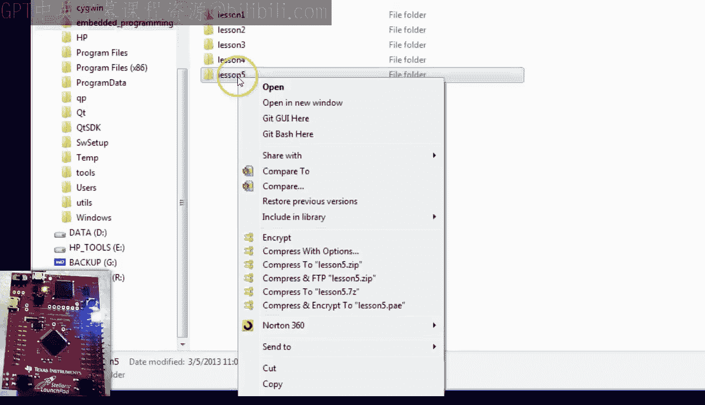

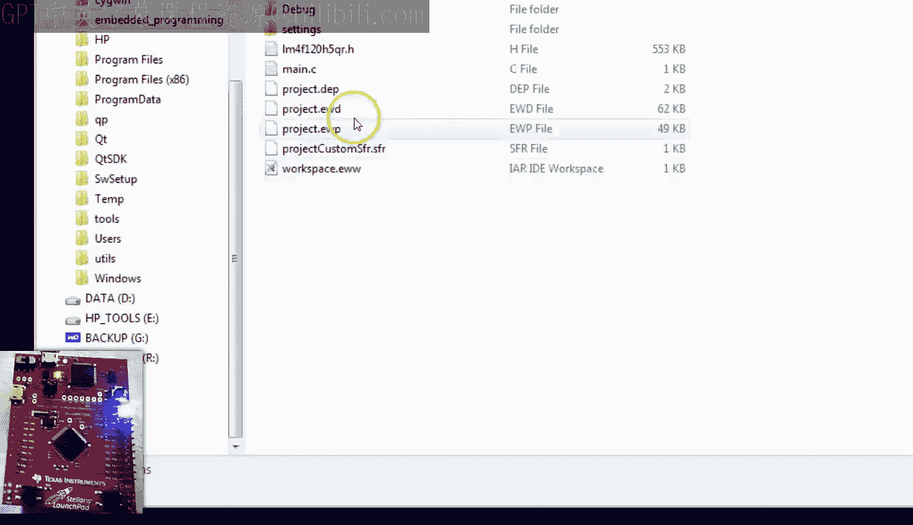

Get inside the new lessons 6 directory and double click on the workspace file to open the IAR toolet。

 If you don't have the IAR toolt， go back to lesson 0。So this is the programming created in lesson 5。

 The program starts with configuring the GP opens connected to the three color LED。

 Then it enters an endless loop in which it turns the red LED on。

 Waits a bit in a delay loop and turns the red LED off waits a bit again and loops back。

 The result is blinking the red LED。

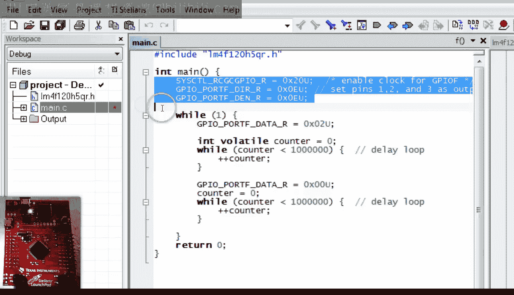

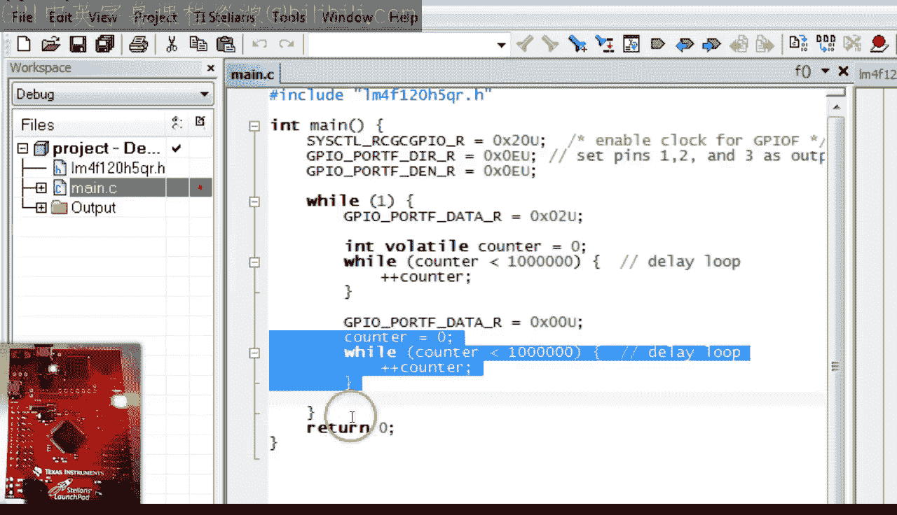

In this lesson， your objective is to use the other colors of this composite LED。

 such as the blue and green colors。Suppose that you want to turn the blue LED on and keep it on all the time while you blink the red component on and off。

 How do you do that。The first step is simple。 You need to turn the GPIOF data bit2 corresponding to the blue LED before the endless loop。

But then inside the loop， when you turn the ready lady on， you got a problem。

When you set the bit1 for the red LED， you also clear all other bits。

 including the bit 2 for the blue LED， because all the LED bits live inside a single register。

So what you really need is a method of setting and clearing the individual bits without inadvertently disturbing the other bits。

And this is where the bitYC operators come in。So let's learn about the bitwise operators in C by experimenting with them in the code。

Define a couple of unsigned integer variables with some initial values。

And the variable C for holding the results of various bitwise operations。

This is an example of bitwise or。This is Biwise and。This is Biwise， exclusive ore。

This is Biwe's bit in version， also known as one compliment。This is the right shift。And finally。

 this is the left bit shift operator。

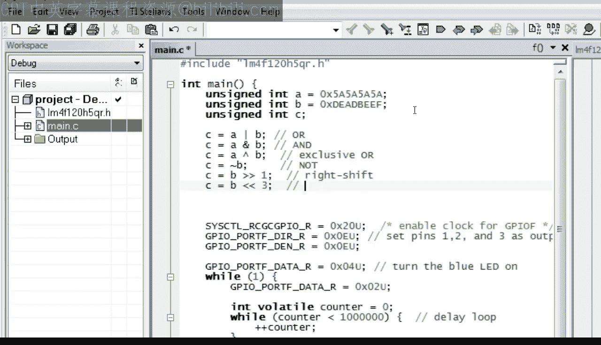

Before compiling and running the code， please change the optimization level。

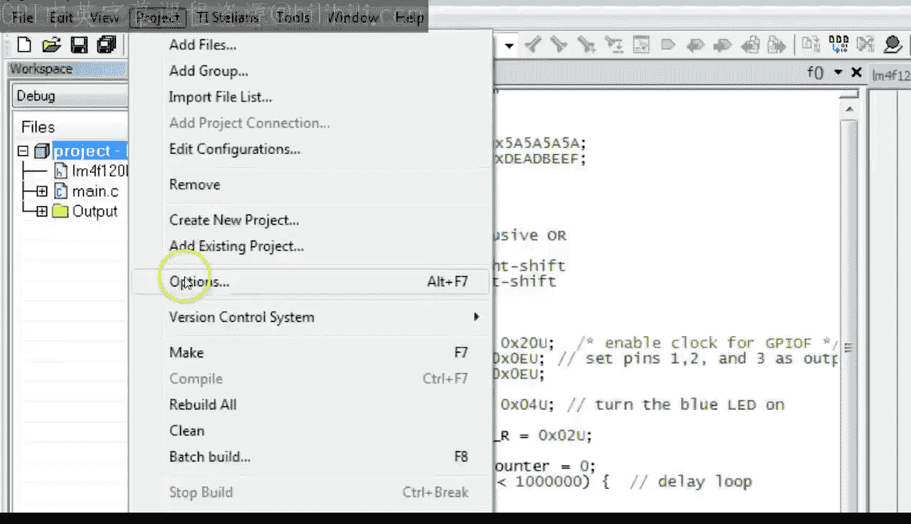

To none。And debugger。To simulator。Since you don't really need the launchpa board。

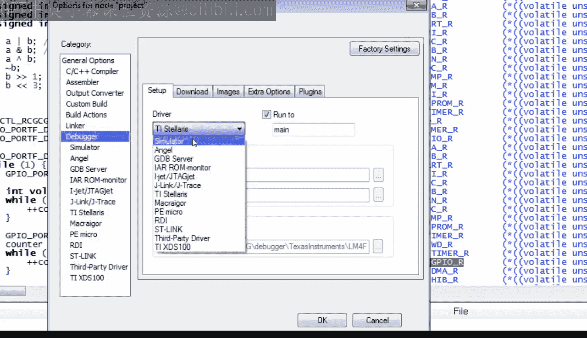

Now， compile the code by pressing F7。Let's run this code in the debugger by pressing the download and debug button。

Single step over the initialization of AB and C and go to the locals window to adjust the view。

To the binary format。Step over the bitwise ore expression and examine the result in the C variable。

As you can see， the bitwise or operator performs the logical or between each bit of A and each bit of B。

If you remember the truth tables from your elementary school。

 you can very easily verify that false corresponding here to binary 0。Or true。

 corresponding here to one is true。 That is one。1 or 0 is one。1 or one is  one。 And finally。

0 or 0 is 0。In the disassembly window， you can see that all these R operations on all 32 bits of the two opera are performed in just one machine instruction or S。

 which is very fast and efficient。The bitwise an operator performs the logical end between each bit of a and each bit of B。

 If you remember the truth table a forological end， you can very easily verify that 0 and 1 is 0。

1 and 0 is 0，1 and 1 is 1 and 0 and 0 is 0。In the disassembly window。

 you can see that the all these and operations on all 32 bits of the two opera are performed in just one machine instruction and S。

The bitwise exclusive or operator performs logical exclusive or between each bit of a and each bit of B。

 You can verify that 0 x or1 is 1，1 x or 0 is 1，1 x or1 is 0， and 0 x or 0 is 0。

In the disasse window， you can see that all these exclusive ore operations on all 32 Bs of the two opera are performed in just one machine instruction。

 E or。S。The bitwise not operator is unary， meaning that it acts on just one opera in which it turns every one bit into a 0 and 0 into a one。

In the this assembly window， you can see that bedwise not is performed by the M VN S instruction。

 which stands for Move negative。The right bit shift operation shifts all the bits in the first opera by the number of places specified in the second opera for the shift by one。

 B corresponds to integer division by 2， as you can verify with a calculator。

In the disassembly window， you can see that the right shifting is performed by the L S R S instruction。

Please note that the LSRSRS instruction shifts zeros into the most significant bit position。

The left bit shift operation shifts all the bits of the first operant to the left by the number of places specified in the second operant for the shift by 3。

 This corresponds to integer multiplication by 2 to the power 3， which is 8。

 but you need to be careful because for a large first operant， like in this case。

 some of the most significant bits might fall off the left edge。

 which simply means that the result after the shift no longer fits in the 32 Bs。

In the disassembly window， you can see that the left shifting is performed by the LSLS instruction。

Please note that the LSLS instruction shifts zeros into the least significant bit position。

So now you know how the bitwise operators work on unsigned numbers for sine numbers。

 The rightshift operator works significantly different。 However。

 let's perform an additional experiment， Def a sine integer X and initialize it with a positive value。

 Def another s integer Y and initialize it with a negative value。 Next。

 perform right shift of x by a couple of places and finally。

 perform right shift of y by the same number of places。

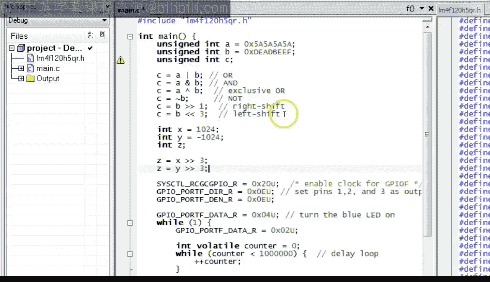

Let's compile， and test it。As you can see， the positive value has shifted right exactly as before。

 That is， zeros are shifted into the most significant bit position。

When you compare the decimal values of Z and x， you can see that the right shift by three places corresponds to division by 8。

 which is2 to the power of 3， as expected。However， the right shift of the negative value Y behaves completely differently than before。

 because now ones are shifted to the most significant bit。

So you have just found out that right shifting of a s integer shift  zeros into the most significant bit when the bit is 0 before the shift and once when the bit is1 before the shift。

 This is called sign extend of a negative value in the two complement representation。

 which you learned in lesson 1。😊，The sign extending is necessary to preserve the correspondence between right shifting and division by a power of two。

Indeed， when you convert the values to decimal， you can see that both z and y are negative and that z is still equal to y divided by 8。

 which is 2 to the power 3。This difference between right shifting of sed integers versus unsigned integers becomes very obvious when you look in this assembly。

 as you can see， the compiler generated the instructions ASRS for right shifting of signedine numbers。

 which means arithmetic right shift， whereas the compiler generates the instruction LSRS logical right shift。

 for right shifting of unsigned numbers。As an embedded systems programmer。

 you need to know the bit why C operators inside and out， and in fact。

 questions about various nuances such as logical shift versus arithmetic shift come quite often during the embedded programming job interviews。

More importantly， though， the bitwise operators are very useful。

 and you will take advantage of them right away in your plany program for starters。

 you now can define the G orbit bits that control various LED colors by means of the bit shift operators。

 For example， the red LED corresponds to bit1， blue LED to bit。2。And green LED，2 bit 3。

Please note that these bed shift expressions are compile time constants。

 So there is absolutely no overhead compared to defining LED green， as Hex 8 say。

But the advantage here is that you immediately see the bit number as the shift displacement for low order bits。

 this advantage is perhaps not that impressive， but for higher order bits， like， sayy， bit 18。

 It is not that easy at all to see that this is equivalent to hex 4，0，0，0。

 While it is obvious in the expression 1 right shifted by 18。

This way of defining bit constants has saved me a lot of time counting bits and prevented a lot of stupid bugs in my programs。

 So I highly recommend it。

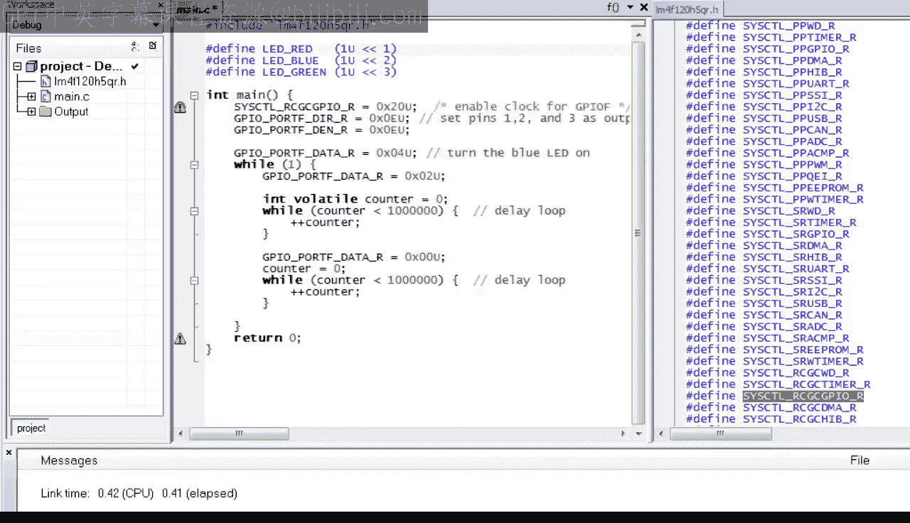

After defining the macros for the LED colors， you can replace the cryptic hex numbers。

 which greatly improves the readability of your code。 In fact。

 your code becomes self explanatory and the comment becomes redundant。

Now let's tackle the really interesting case of setting the red color bit in the GPIOF without extinguishing the blue color for this。

 you can use the bitwise or operator between the current value of the GPIOF register and the red color bit。

This works because the bitwise or between any bit in GIOF and LED red preserves the original GPIOF bit for all bits where LED red is 0 and forces bit number1 to1。

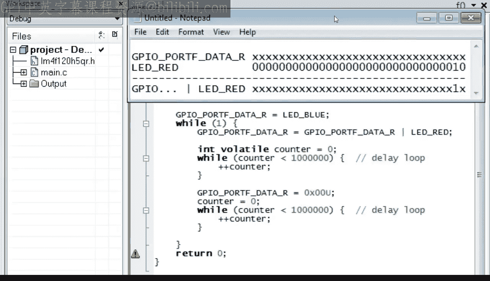

Please note that district works only if you can actually read from and write to the GIOF register。

 so you need to check in the data sheet that this register has readright permissions。

The C language provides a special abbreviation notation for assignments in which the left hand side also appears as the first argument on the right hand side。

You can use the operator equals notation， which means exactly the same as the line above。So finally。

 here is the most succinct code for setting the LED red bit in the GIOF register。

Please remember this as a coding idiom for setting a bit in C。

To clear the LED red bit in GIO F register， you need to use the bitwise and operator with the complement of the LED red bit。

This works because the bitwise end between any bit in GIOF and not LED red preserves the original GIOF bit for all bits where not LED red is1 and forces bit number 1 to 0。

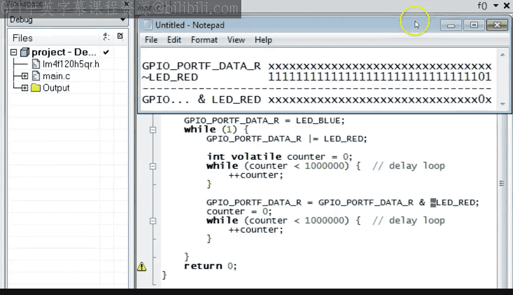

Again， you can use the operator equals notation to represent this operation more succinctly。

Please remember， this is a coating idiom for clearing a bit in sea。

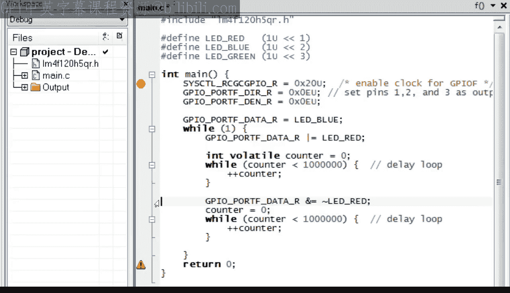

Now that you know the coding idioms， you can step back and look at your code a bit more critically。

 For example， the turning of the blue LED。Is also setting a bit in the G O F register。

 So it should be coded with the bit set idiom。Actually。

 all of the lines above also perform setting of bits in various registers， so they too。

 should be coded with the bit set idiom。Please remember， however。

 that you need to check in the data sheet that the registers have readright permissions。And finally。

 you can use the LED macros to further improve the readability of your code。Before you recompile。

 go to the project options and set the optimization level back to high。

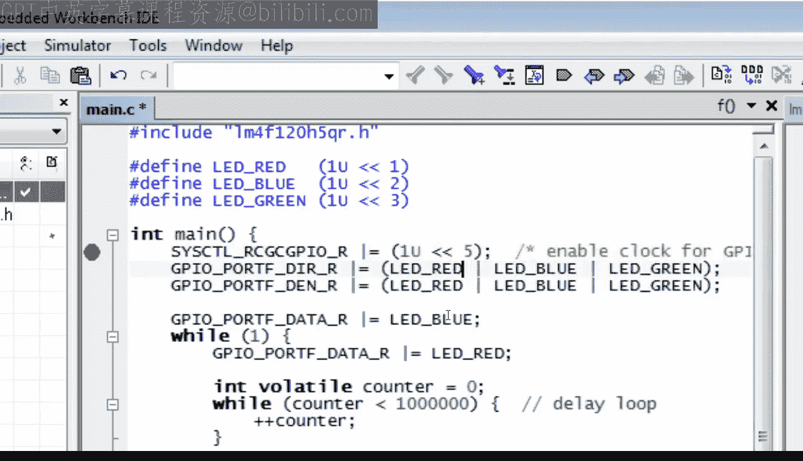

And the debugger to the ice the laris。Make sure that the reset will do system reset option is checked。

Let's load the program into the launch padd board and run it。 As you can see。

 the blue LEDs on all the time， and the fainter red LED keeps blinking。

Break into the code and set break points at setting and clearing the red LED bit。As you can see。

 setting of the red LED bit happens as a sequence of load， modify store operations。

 whereas the bitwise or machine instruction is used to modify the data。

The clearing of the red LED bit happens as another load modify store sequence。 whereas interestingly。

 the compiler generated the beautiful code of just one B I bit clear instruction for clearing the bit。

This is quite remarkable because the compiler didn't literally follow your code to perform a bit wise and with the complimented bitm。

 Instead， the compiler clearly understood your intent to clear the bit and generated an even better code for it。

I'd like you to remember this example because it shows you that by following established coding idioms like the idiom for clearing a bit。

 allows the compiler to understand your code at the higher level of your intent。

 not just the low level operations。

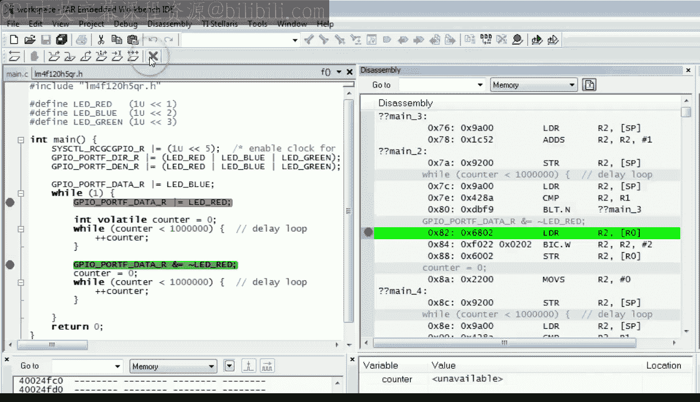

🎼This concludes this lesson about the bitwise operators in C。 Now you know how to set clear。

 toggle and shift bits in all sorts of registers。 So congratulations。🎼In the next lesson。

 I'd like to answer several questions about the GPIO data register that were asked in the comments on YouTube。

🎼This subject actually complements quite well the discussion of the Biwiseice operators。

 because the Stlarious GPIO data register demonstrates a very different hardware assisted approach to manipulating whole groups of bits。

If you like this channel， please subscribe to stay tuned。🎼You can also visit statemachine。

com/quistart for the class notess and project file downloads。

