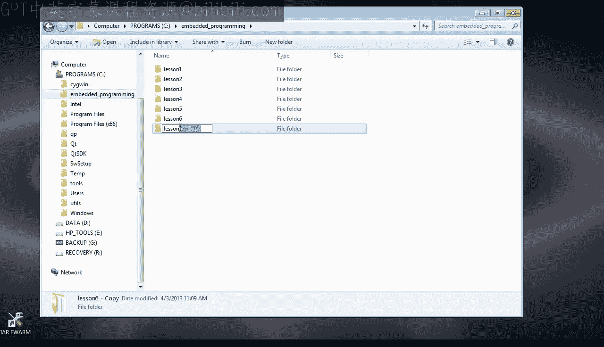
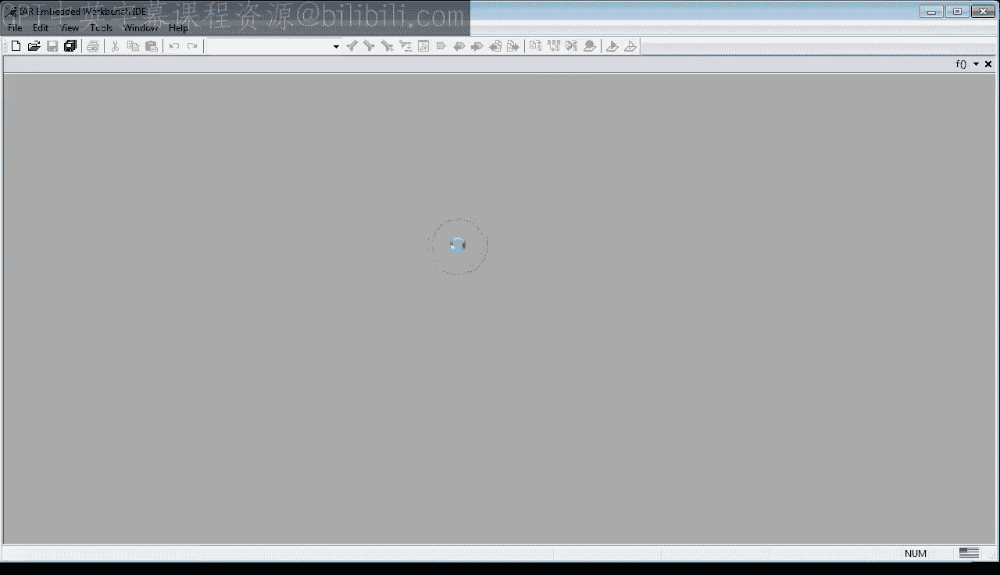
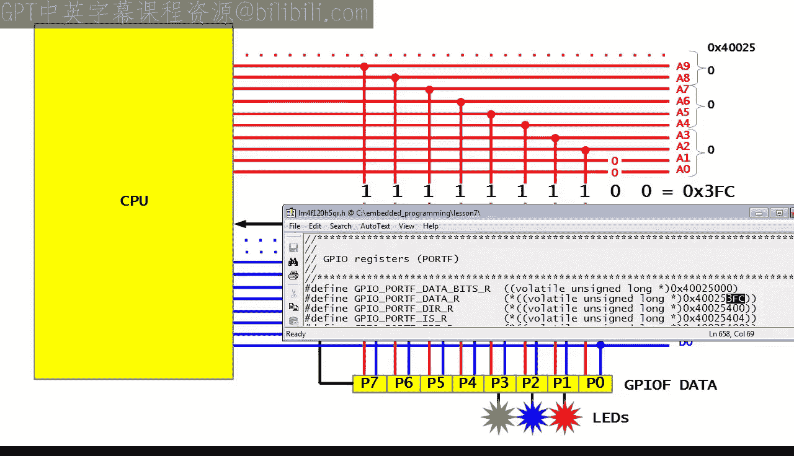
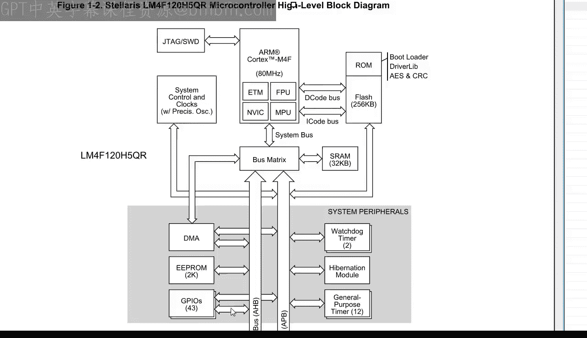
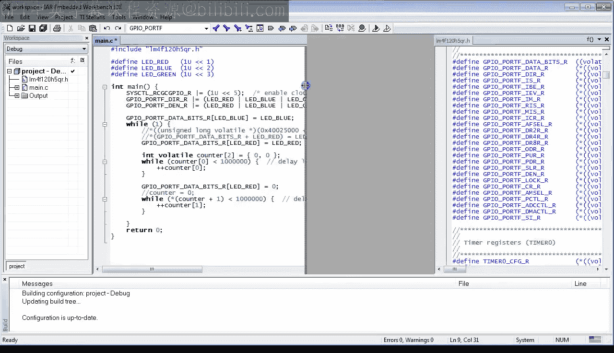

# 现代嵌入式系统编程：第7课：数组与指针运算

## 概述
在本节课中，我们将学习C语言中的数组和基本指针运算。你将学会如何应用这些概念，以利用Stellaris GPIO数据寄存器的更高级功能。这有望解答一些在YouTube视频课程评论中提出的问题。

## 准备工作
和往常一样，我们从复制上一课（第6课）的项目开始，并将其重命名为“lesson 7”。如果你刚刚加入本课程，可以从statemachine.com/quickstart下载之前的项目。

进入新的“lesson 7”目录，双击工作区文件以打开IAR工具集。如果你还没有IAR工具集，请返回第0课。

这是你在第6课创建的程序。让我们稍作清理，然后进入调试器。

## 回顾“读-修改-写”序列
如你所见，该程序使用“读-修改-写”序列来更改GPIO寄存器中单个位的值，而不影响其他位。例如，要设置控制红色LED的bit1，程序首先使用`LDR`指令读取GPIOF数据寄存器的当前值。接着，它使用按位或运算来设置bit1。最后，它使用`STR`指令将修改后的值写回。

“读-修改-写”序列是必要的，因为所有GPIO位都位于具有单个地址的单个字节中。

## 独立寻址的设想与中断问题
想象一下，如果每个位都可以通过自己唯一的地址单独访问，或者更好的是，GPIO位的每种可能组合都有自己唯一的地址。那么，向这个特定地址执行一次原子写操作，就可以改变选定的位，而不会影响任何其他GPIO位。

本节课，我将向你展示Stellaris GPIO硬件如何让你做到这一点，从而用一次原子写操作取代典型的“读-修改-写”序列。

但在解释如何做之前，我认为理解“为什么要这样做”很有趣。毕竟，“读-修改-写”序列在大多数情况下已经足够快。然而，在这种情况下，关键不在于速度，而在于让你能够真正独立于代码的任何部分（包括中断）来操作各个GPIO位。

我意识到我还没有讨论中断，我保证会讨论，因为这是一个引人入胜的主题，尤其是在嵌入式系统中。但现在，我只想说，中断是一种硬件支持的机制，允许处理器突然改变程序中的控制流。当中断发生时，处理器中的特殊硬件会改变程序计数器寄存器的值，使处理器突然开始执行另一段称为中断服务例程（ISR）的代码，该例程通常很短。当ISR结束时，处理器恢复执行原始代码，就像什么都没发生过一样。

有趣的情况是当ISR改变某些GPIO位时。如果中断恰好发生在“读-修改-写”周期的中间，即在主代码读取GPIO寄存器之后、但在它将修改后的值写回之前，那么在中断服务例程中对GPIO位所做的任何更改都将丢失。这是因为主代码仍将使用中断发生前的GPIO寄存器旧值。这是“读-修改-写”序列固有的问题。

因此，这就是Stellaris GPIO硬件设计者设计一种方法来避免“读-修改-写”序列并用单次原子写操作取而代之的主要原因。

## Stellaris GPIO的硬件设计原理
以下是它的工作原理。GPIO位通过一组称为总线的导线连接到CPU。每个位都连接到专用的数据线和专用的地址线。只有当连接的地址线为1时，该位才能被改变。否则，无论所连接数据线的值如何，该位都不会受到影响。

例如，要隔离连接到LED的三个GPIO位，你需要写入以二进制`0000 1110 00`结尾的地址。请注意，两个最低有效地址线A0和A1未被使用，因为硬件要求所有地址都能被4整除。

你写入的数据决定了引脚的状态。例如，你可以在一次写操作中点亮红色LED、熄灭蓝色LED并点亮绿色LED。我希望这已经清楚地表明，这种硬件设计需要许多具有唯一地址的寄存器，因为不仅每个GPIO位都有自己的地址（为此你只需要8个寄存器），而且在这种方案中，每种位组合都有自己的地址。为了覆盖8个GPIO位所有可能的位组合，Stellaris GPIO提供了256个32位数据寄存器，起始地址为`0x40025000`。

在之前的课程中，你只使用了这些寄存器中的最后一个，称为GPIO端口F数据R，对应于偏移量`111111`二进制，即`0x3F`十六进制。这个寄存器显然没有隔离任何位，并允许通过数据线更改所有8个GPIO位。

在本课中，我们将使用其他寄存器。

## 在C语言中访问GPIO寄存器
现在的问题是如何在C语言中访问所有这些GPIO寄存器。

一种方法是使用你在第3课中学到的“蛮力”方法直接硬编码地址。例如，要仅隔离对应于红色LED的bit1，你可以手动计算地址：从数据手册中的基地址开始，加上左移2位（以跳过两个未使用的地址位）的LED_RED位值。你需要将合成的地址强制转换为指针，然后解引用该指针。记住，这个地址只隔离一个位，你写入这个特定位的内容才重要，写入其他位的内容无关紧要。为了演示，让我们向LED_RED位写入1，向所有其他位写入0。

让我们按F7检查这个调用是否编译。现在，当然，在LaunchPad板上测试这个很有趣。如你所见，“读-修改-写”序列被简化为仅仅是对R2中地址（即GPIO基地址加偏移量8）的`STR`指令。当你单步执行代码时，你会看到红色LED亮起，其他LED保持不变，证明代码完全按照你的意图执行。

所以代码可以工作，但不是很优雅。你可以通过应用数组的概念来显著改进它。

## 数组简介
数组是一组占据连续内存位置的相同类型的变量，例如一组256个相同的GPIO数据寄存器。在C语言中，你可以通过在变量名后添加方括号内的元素数量来声明数组。例如，这是一个包含两个计数器的数组，每个都是`volatile int`类型。

你甚至可以使用数组初始化器一次性初始化整个数组，像这样。

现在，你可以通过元素的编号来引用它们，像使用普通变量一样使用数组元素。括号中的数字称为数组索引，在C语言中，数组的第一个元素始终是0，第二个元素是1，依此类推。

让我们按F7编译，看看编译器是否接受这个语法。

## 数组与指针的关系
数组与指针密切相关。C编译器将数组视为指向数组开头的指针。要获取索引为`i`的元素的指针，你只需将`i`加到数组指针上。因此，你可以写`*(counter + 1)`来代替`counter[1]`。这是一个简单指针运算的例子。

数组和指针之间的对应关系是双向的，因为每个指针也可以被视为一个数组。例如，标准的`lm4f`头文件定义了指针`GPIO_PORTF_DATA_BITS_R`。这个指针可以用来将所有256个GPIO数据寄存器当作一个数组来访问。因此，例如，要仅访问LED_RED位，你可以像这样索引到`GPIO_PORTF_DATA_BITS_R`中。

这完全等同于使用以下指针运算。

让我们进入调试器，看看这三种选项如何比较。如你所见，所有三种实现选项都写入存储在R4寄存器中的相同地址。

这个小实验表明，确实，所有三种替代方案都是等效的，并生成完全相同的机器代码。

## 地址运算与指针运算的区别
回到源代码。让我指出地址运算和指针运算之间非常重要的区别。

在第一种情况下，你首先执行地址运算，然后才将原始地址强制转换为`unsigned long`指针。在这种情况下，你必须将LED_RED值左移2位，以考虑GPIO寄存器的大小（4字节宽）。在第二种情况下，你使用指针运算，因为`GPIO_PORTF_DATA_BITS_R`是一个指向`unsigned long`的指针。在指针运算中，你不需要按元素大小缩放偏移量，因为这会自动为你完成。这必须是这样的，因为指针运算和数组索引是等价的。

在这三种选项中，我认为数组索引看起来最简洁，所以我将保留这个，并注释掉其他选项。

现在，让我们使用数组索引技术来熄灭红色LED。根据接线图，这需要向LED_RED位位置写入0。最后，我在开头也一致地使用数组索引来设置蓝色LED位。

## 最终程序与测试
这是使用快速、中断安全的GPIO位操作技术的最终程序。让我们在LaunchPad板上测试这个程序。首先，让我们全速运行并观察LED。

如你所见，程序像以前一样工作。当你中断进入代码时，你可以看到清除红色LED位只需要一条到R0中GPIO地址的`STR`指令。

所以你的程序已经近乎完美了，但事实证明，Stellaris LM4F微控制器可以做得更好。

## 切换到更快的AHB总线
正如你在数据手册中可以发现的，该微控制器不是有一个，而是有两个外设总线：高级外设总线（APB）和高级高性能总线（AHB）。GPIO端口连接到两者。APB是默认总线，这也是你到目前为止一直在使用的。但APB比AHB更旧、更慢，因此它仅为了向后兼容而保留。

所以在本课剩下的时间里，我将向你展示如何切换到更快、更好的AHB。

首先，你需要在数据手册中找到如何将GPIO从默认的APB切换到AHB。在系统控制部分，你会找到`GPIOHBCTL`寄存器，它正是做这个的。你会注意到端口F由位号5控制。

接下来，你转到`lm4f`头文件，寻找`GPIO_HBCTL`寄存器。你复制寄存器名称并在其中设置第5位。

最后，你需要将所有GPIO地址从APB地址范围（在数据手册中称为APB Aperture）更改为AHB Aperture。你再次在`lm4f`头文件中搜索`GPIO_PORTF`，你会发现一组所有带有`_AHB`后缀的寄存器。因此，你需要在程序中的所有GPIO端口F寄存器上添加此后缀。

让我们在LaunchPad板上测试这个最终版本。

## 总结
本节课关于C语言中数组和指针运算的内容到此结束。现在你是Stellaris GPIO的专家了，恭喜你。在下一课中，我将讨论C语言函数。如果你喜欢这个频道，请订阅以保持关注。你也可以访问statemachine.com/quickstart获取课堂笔记和项目文件下载。