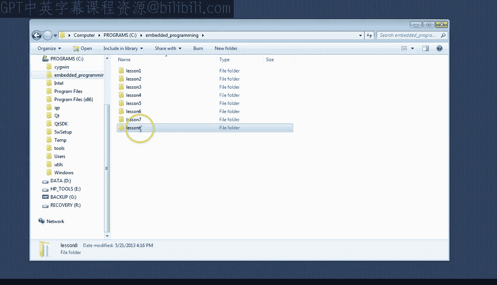
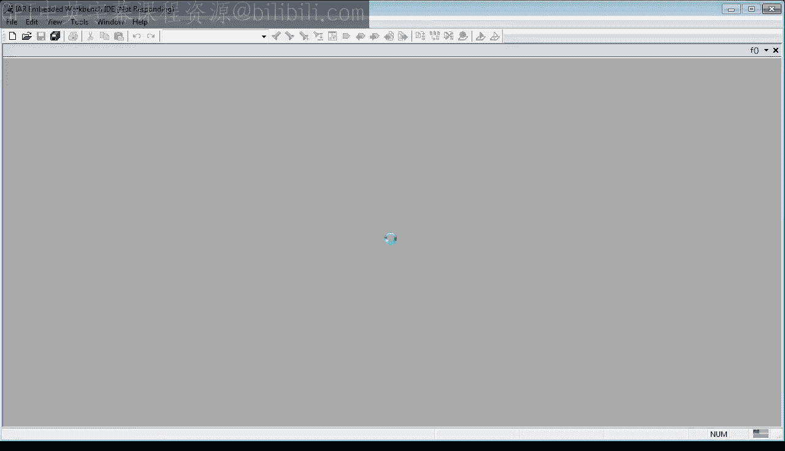
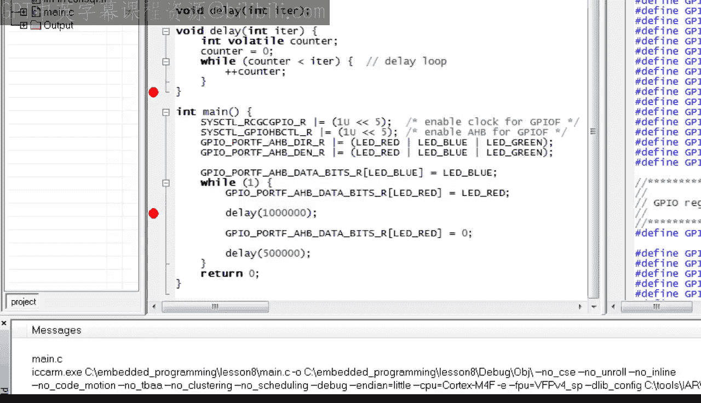

# 现代嵌入式系统编程：第8课：C语言函数与调用栈

在本节课中，我们将学习C语言中函数的基本概念以及调用栈的工作原理。理解这些底层机制是掌握函数、中断和上下文切换等高级主题的关键。

## 概述

函数是C语言中用于封装可重用代码块的核心机制。调用栈则是支持函数调用和返回的底层硬件与软件基础设施。本节将重点解释函数如何调用其他函数，以及栈在这个过程中扮演的角色。

## 准备工作

上一节我们介绍了基本的程序流程控制。本节中，我们来看看如何通过函数来优化代码结构。

首先，复制上一课的项目并重命名为“lesson 8”。如果你刚刚加入本课程，可以从 statemachine.com/quickstart 下载之前的项目文件。

进入新的 lesson 8 目录，双击工作区文件以打开 IAR 工具链。如果你还没有安装 IAR 工具链，请返回第 0 课进行设置。

在进行清理工作之前，让我快速回顾一下当前程序的功能。

程序首先设置 LM4F 微控制器内部的寄存器，以控制连接到 GPIO 引脚的 LED。接着，点亮蓝色 LED，然后进入一个无限循环。在循环中，它点亮红色 LED，在一个延迟循环中等待，熄灭红色 LED，在另一个延迟循环中再次等待，然后跳回循环开始。

观察此阶段的程序，你会发现延迟循环的重复相当不优雅。这违反了“不要重复自己”的 DRY 原则。在编程中，应努力消除重复，以确保本应相同的代码部分不会失去同步。

今天，你将学习避免重复的主要技术之一：将一段代码转换为函数，然后根据需要多次调用该函数，而不是逐字重复相同的代码。

## 什么是函数？

C语言中的函数，在其他编程语言中也称为过程、子例程或子程序，是一段可以从程序中多个不同点执行的可重用代码。

要将一段代码转换为函数，需要为其指定一个名称、一个参数列表和一个返回类型。为了简单起见，我们的延迟函数将命名为 `delay`，它不接受任何参数，也不返回任何值。这三个元素——返回类型、名称和参数列表——统称为函数的**签名**。

函数代码位于签名后面的花括号 `{}` 之间。

定义函数后，你可以根据需要轻松地多次调用它。调用函数的语法是函数名后跟括号内的参数。即使函数不接受任何参数，括号也是必需的。

调用函数意味着改变控制流，跳转到函数代码的开头，执行该代码，然后返回到调用之后的下一条指令。

让我们按 F7 检查此代码是否能编译。我相信你渴望在真实开发板上运行此代码，但在执行此操作之前，请按如下方式更改项目选项：

*   将优化级别设置为“低”。因为在高级优化下，编译器非常智能，它会通过“内联”函数来消除函数调用开销，这本质上会逆转你到目前为止所做的操作。显然，你现在不希望发生这种情况。
*   每当使用函数时，强烈建议勾选“需要原型”选项。

当你这次按 F7 尝试编译时，会得到一个错误：函数 `delay` 没有原型。函数原型是函数的签名，后面跟一个分号，而不是代码块。编译器必须在定义之前看到每个函数的原型。

顺便说一下，你的 `delay` 函数目前不接受任何参数。在 C 语言的旧标准中，你可能通过一个空的参数列表（而不是 `void` 参数列表）来编码。让我们现在尝试这样做。如你所见，代码不再编译。这是因为为了向后兼容，空的参数列表意味着参数未指定，可以是任何内容。而启用了“需要原型”选项后，编译器更加严格，不承认这种弱指定的原型。

好的，最后，你已准备好在 Stellaris 板上运行代码。首先要做的是检查你的程序是否仍像以前一样闪烁 LED。确实如此。当你停止代码时，会发现程序停在 `delay` 函数内部。这是可以预料的，因为你的程序 99.999% 的时间都在执行延迟循环。

## 函数调用机制

接下来有趣的事情是找出你的处理器实际如何调用 `delay` 函数。让我们设置一个断点并运行程序。

如你所见，对你的 `delay` 函数的调用最终归结为一条名为 `BL` 的指令。从之前关于流程控制的第 2 课中，你可能记得分支指令只是改变程序计数器 PC 的值。然而，`BL` 指令有一个额外的重要副作用：它将下一条指令的地址保存到 R14 寄存器，该寄存器也称为链接寄存器 LR。这样，LR 寄存器就记住了函数完成后要返回的代码位置。

让我们记住，`BL` 之后的下一条指令位于地址 `0x9C`。顺便说一下，请注意 `BL` 指令本身是 4 字节长，而大多数其他指令只有 2 字节长。所以你可以看到，称为 Thumb-2 的 ARM Cortex-M 处理器指令集主要由 2 字节指令组成，偶尔有 4 字节指令。

当你单步执行 `BL` 指令时，可以看到程序计数器确实跳转到了你的 `delay` 函数的开头，而 LR 更改为 `0x9C`。等等，它实际上变成了 `0x9D`。这当然很奇怪，因为所有 Thumb-2 指令必须在偶数地址对齐，而值 `0x9D` 是奇数。当我们看到函数如何返回时，我会在一分钟内解释这个奇怪的现象。

在此之前，让我指出关于函数代码的一些有趣之处。

## 栈与局部变量

函数首先调整 SP 寄存器。SP 代表栈指针，是 R13 寄存器的别名。栈是 C 调用栈机制的硬件实现，因此它是本课中要学习的最重要的寄存器。

C 栈只是 RAM 中的一个区域，只能从一端增长或缩小。这一端称为栈顶，SP 寄存器包含这个顶部地址。你可以通过将内存视图指向 SP 中存储的地址来轻松查看栈中的内容。为了查看这个栈，最好将内存视图调整为只显示一列。

在 ARM 处理器中，栈向低地址方向增长（在内存视图中向上），向高地址方向收缩（在内存视图中向下）。在其他处理器中，栈可能向相反方向增长。C 栈的一个很好的比喻是一摞盘子。你只能从栈顶添加或移除盘子。

现在你明白了，从 SP 减去 4 会使栈增长这个量，并在栈顶为局部变量 `counter` 创建空间。随后，这个变量被清零并递增一百万次。

现在，让我们在函数末尾设置一个断点，看看它如何返回。

## 函数返回

编译器在返回之前需要做的第一件事是精确地反转在函数入口处对栈执行的任何操作。在这种情况下，栈通过增加 4 字节来收缩，以释放最初为 `counter` 变量分配的空间。

如你所见，在当前的栈顶，`counter` 的最后一个值是 `0xF4240`，即十进制的 100 万，这是你的延迟循环的迭代次数。

下一条指令是实际从你的函数返回。返回是通过分支指令 `BX` 完成的，它代表“分支并交换”。该指令将程序计数器设置为指定寄存器（本例中为 LR）中的值。但是，并非 LR 中的所有位都传输到 PC。具体来说，PC 的最低有效位始终设置为 0，这是有道理的，因为返回地址必须是偶数。因此，LR 中的最低有效位不被用于寻址，而是被解释为指令集交换位。

如果此位为 1，处理器切换到 Thumb 指令集。如果此位为 0，则切换到 ARM 指令集。问题是 ARM Cortex-M 仅支持 Thumb-2 指令集，无法真正切换到 ARM。因此，在 Cortex-M 中，`BX` 指令的这种行为只是一种历史遗留。

让我们执行 `BX` 指令，看看它跳转到哪里。确实，我们最终到达地址 `0x9C`，这正是调用你的 `delay` 函数之后的下一条指令。

最后，为了看看会发生什么，让我们再次运行到 `delay` 函数的末尾，并将 LR 的最低有效位设置为 0。这应该将核心状态交换到 ARM，但 ARM 在 Cortex-M 内核上不受支持。嗯，如你所见，你最终进入了一个硬故障异常。我将在即将到来的关于中断的课程中讨论异常。但现在，我认为看看处理器如何处理不可能的条件会很有趣。

机器最终进入异常处理程序，这就像一个你可以为特定项目重新定义的函数。要退出异常处理程序，需要重置机器。

由于重置将你带回到 `main` 函数的开头，这是检查调用其他函数的函数的好机会。

## 非叶子函数

到目前为止，我希望你注意到 `main` 也是一个函数，就像你的 `delay` 函数一样。在你从 `main` 调用 `delay` 之前，`main` 是一个所谓的**叶子函数**，就像树上的叶子，因为它不调用任何其他函数。当你添加对 `delay` 的调用后，`main` 就不再是叶子函数了，它必须做一些特殊的事情来保存自己的返回地址。

正如你所记得的，返回地址保存在 LR 寄存器中，但该寄存器会被 `BL` 指令用新的返回地址覆盖。因此，任何执行 `BL` 的函数都必须以某种方式保存 LR 的先前值，以便能够返回到正确的位置。

问题当然是，保存链接寄存器的最佳位置在哪里？我希望你从代码中看到，这个地方就是**栈**。`PUSH` 操作将指定的寄存器列表保存到栈上，并自动递减栈指针以使栈增长。

让我们通过执行 `PUSH` 指令来验证这一点。

总结一下，你发现栈有两个用途。首先，它保存被调用函数的局部变量。其次，它存储返回地址。

## 函数参数

最后，在本课中，我想向你展示函数参数的用途以及如何使用它们。

函数参数允许你在调用函数时指定局部变量的初始值，而每次调用都可以使用不同的参数值集。例如，你可能希望 `delay` 函数在每次调用时执行不同次数的迭代。

为了实现这一点，你可以指定一个整数参数 `iter`，它将在函数内部用作迭代限制。一旦函数接受一些参数，它的每次调用都必须为所有这些参数提供初始值。因此，如果你现在尝试编译程序，编译器将报告对 `delay` 函数的两次调用的错误，因为它们不再与原型匹配。这就是使用原型的美妙之处，因为现在每当你在每次函数调用时忘记提供正确数量和类型的参数时，编译器都可以警告你。

好的，让我们提供参数。对于第一次调用，我使用 100 万次迭代。但对于第二次调用，我只使用 50 万次，这样红色 LED 点亮的时间将是熄灭时间的两倍。

让我们在 LaunchPad 开发板上运行此代码。首先，移除所有断点并自由运行一段时间以观察 LED。确实，红色 LED 点亮的时间看起来大约是熄灭时间的两倍。

接下来，在对 `delay` 函数的调用处设置断点，以查看参数如何传递给函数。如你所见，`BL` 指令现在前面有一条将常量值加载到 R0 的指令。对于第二次调用 `delay`，这个常量是 `0x7A120`，即十进制的 500000。对于第一次调用，加载到 R0 的值是熟悉的 `0xF4240`，即十进制的 100 万。

所以正如你所见，在这两种情况下，参数 `iter` 都是在 R0 寄存器中传递的。现在让我们单步进入 `delay` 函数，看看它如何使用 `iter` 参数。确实，如你所见，参数 `iter` 位于 R0 中，而变量 `counter` 位于栈顶，因为它的地址与 SP 寄存器的值相同。

## 总结

本节课中我们一起学习了C语言函数与调用栈的基础知识。

函数至关重要，因为当你正确设计它们时，你可以忽略一项工作是如何完成的，而只专注于正在完成什么，这要简单得多。

但我们关于函数的学习还没有结束。在下一课中，我将更多地讨论栈和函数调用其他函数，包括函数递归调用自身。你还将学习更多关于函数参数以及非 `void` 返回类型的知识。最后，在底层，我希望能够介绍 ARM 过程调用标准。

如果你喜欢这个频道，请订阅以保持关注。你也可以访问 statemachine.com/quickstart 获取课堂笔记和项目文件下载。