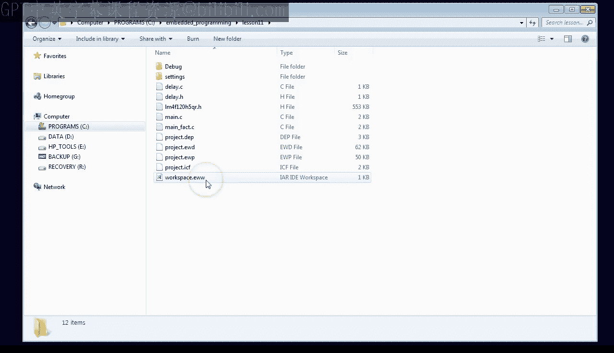
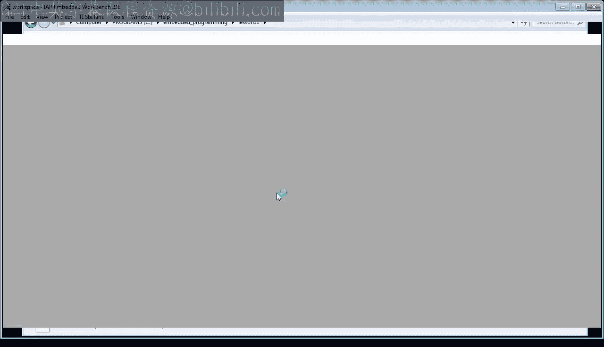
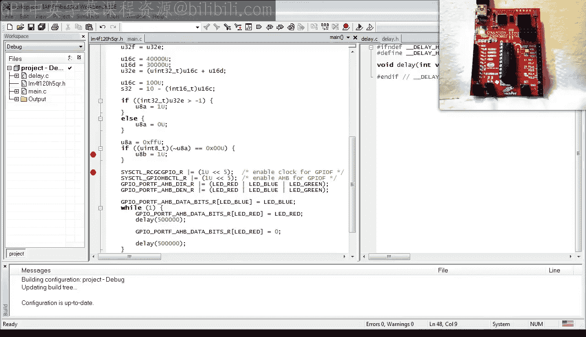

# 现代嵌入式系统编程：11：标准整数类型与类型混合



在本节课中，我们将学习C99标准引入的固定宽度整数类型（`stdint.h`），并探讨在表达式中混合不同整数类型时可能遇到的问题及其解决方案。理解这些概念对于编写可移植且健壮的嵌入式代码至关重要。



---

## 标准整数类型 (`stdint.h`)

在之前的课程中，我们一直使用C语言内置的整数类型，如 `int` 或 `unsigned`。然而，这些内置类型的大小并未被C标准严格规定，这在不同架构的处理器上可能导致问题。例如，`int` 在32位ARM处理器上可能是32位，但在16位或8位处理器（如MSP430或AVR）上可能只有16位。

为了解决这个问题，C99标准引入了 `stdint.h` 头文件，它定义了一系列具有明确宽度的整数类型。对于嵌入式程序员来说，这是C99标准最有价值的特性之一。

以下是 `stdint.h` 中定义的最重要的六种类型：
*   `int8_t`： 有符号8位整数。
*   `uint8_t`： 无符号8位整数。
*   `int16_t`： 有符号16位整数。
*   `uint16_t`： 无符号16位整数。
*   `int32_t`： 有符号32位整数。
*   `uint32_t`： 无符号32位整数。

使用这些标准类型可以确保代码在不同处理器和编译器上具有相同的行为，因为编译器供应商会负责为你的CPU提供正确的定义。

---

## 类型大小与内存布局

现在，让我们使用标准固定宽度整数类型，并观察ARM Cortex-M处理器如何处理它们。首先，我们定义一些变量并检查它们的大小。

```c
uint8_t  u8a;  // 无符号8位
int8_t   s8a;  // 有符号8位
uint16_t u16c; // 无符号16位
int32_t  s32d; // 有符号32位
```

我们可以使用 `sizeof` 运算符来验证类型的大小：

```c
size_t size_u8 = sizeof(u8a);   // 结果为 1 (字节)
size_t size_u16 = sizeof(uint16_t); // 结果为 2 (字节)
size_t size_s32 = sizeof(int32_t);  // 结果为 4 (字节)
```

通过调试器观察内存，你会发现编译器可能会改变变量在内存中的顺序，这与代码中定义的顺序不同。因此，永远不要假设变量在内存中的布局顺序。

此外，ARM处理器使用特定的指令来读写不同宽度的数据：
*   `LDRB` / `STRB`： 读写字节（8位）。
*   `LDRH` / `STRH`： 读写半字（16位）。
*   `LDR` / `STR`： 读写字（32位）。

ARM通常采用小端字节序，这意味着多字节数据（如32位整数）的最低有效字节存储在最低的内存地址。

---

## 混合整数类型与隐式转换

在编程中，你不可避免地需要在表达式和赋值中混合使用不同的整数类型。C语言通过隐式转换自动处理这些情况，但其规则复杂且反直觉，常常导致开发者困惑和难以察觉的Bug。

上一节我们介绍了标准整数类型及其内存表示，本节中我们来看看在表达式中混合它们时会发生什么。

### 整数提升与计算精度

C语言在进行任何计算之前，总是自动将任何小于 `int` 的整数类型提升为内置的 `int` 或 `unsigned int` 类型。这可能导致在较小位宽的处理器上出现溢出问题。

考虑以下示例：
```c
uint32_t u32_result = 40000 + 30000;
```
在32位ARM机器上，`int` 是32位，因此计算在32位精度下进行，结果为70000。但在16位的MSP430上，`int` 只有16位，计算会发生溢出，结果会被截断（例如得到4464），尽管最终要赋值给一个32位变量。

**解决方案**是强制至少一个操作数在计算前提升到足够的精度：
```c
uint32_t u32_result = (uint32_t)40000 + 30000; // 或对两个操作数都进行强制转换
```

### 有符号与无符号类型的混合

混合有符号和无符号类型是另一个常见的陷阱。C语言的规则是：当有符号和无符号操作数混合时，两者都会被提升为 `unsigned int`，计算结果也是无符号的。

考虑以下表达式：
```c
int32_t s32_val = 10 - u16_c; // 假设 u16_c 是 uint16_t 类型，值为100
```
在32位ARM上，结果可能是预期的-90。但在16位MSP430上，由于提升和赋值时的符号扩展规则不同，`s32_val` 可能得到一个巨大的正数（如65446）。

**最佳实践**是避免混合有符号和无符号类型。如果必须混合，应进行显式类型转换：
```c
int32_t s32_val = 10 - (int16_t)u16_c; // 显式转换为有符号类型
```

### 比较操作中的陷阱

比较操作也容易受类型混合影响。例如：
```c
uint32_t u32_var = 10;
if (u32_var > -1) { ... }
```
你可能会认为这个比较总是为真，因为无符号数的最小值是0，大于-1。但实际上，`-1` 被提升为无符号整数后变成了最大值（0xFFFFFFFF），所以比较 `(u32_var > 0xFFFFFFFF)` 总是为假。

同样，通过显式转换可以解决这个问题：
```c
if ((int32_t)u32_var > -1) { ... }
```

### 小整数上的位操作

对小整数（如 `uint8_t`）进行位操作时也需小心。考虑以下检查校验和的代码：
```c
uint8_t u8_checksum = 0xFF;
if (~u8_checksum == 0) { ... } // 检查取反后是否为0
```
你可能期望比较为真，但 `u8_checksum` 首先被提升为 `int`，取反操作作用于整个整型，结果永远不会等于0。编译器甚至可能直接优化掉整个 `if` 语句。

**解决方案**是将结果强制转换回字节类型：
```c
if ((uint8_t)(~u8_checksum) == 0) { ... }
```

---

## 总结

本节课中我们一起学习了C99标准中的固定宽度整数类型（`stdint.h`）及其重要性，它确保了代码在不同平台上的可移植性。我们还深入探讨了在表达式中混合不同整数类型（包括不同大小和有符号性）时，C语言复杂的隐式转换规则。这些规则常常导致反直觉的结果和隐蔽的Bug。

关键要点总结如下：
1.  **使用 `stdint.h`**： 始终使用 `int8_t`、`uint32_t` 等标准类型，而不是 `int`、`long` 等内置类型。
2.  **注意整数提升**： 计算精度取决于操作数类型，而非赋值目标的类型。必要时使用显式类型转换。
3.  **避免混合有符号/无符号类型**： 如果无法避免，务必进行显式转换以明确意图。
4.  **小心比较和位操作**： 在这些场景中，隐式提升规则可能导致意外行为。

理解并妥善处理类型转换是编写可靠、可移植嵌入式C代码的关键技能。在下一节课中，我们将探讨C语言的结构体和CMSIS（Cortex微控制器软件接口标准）。



如果你喜欢本课程，请订阅以持续关注。你也可以访问 [statemachine.com/quickstart](http://statemachine.com/quickstart) 获取课堂笔记和项目文件下载。